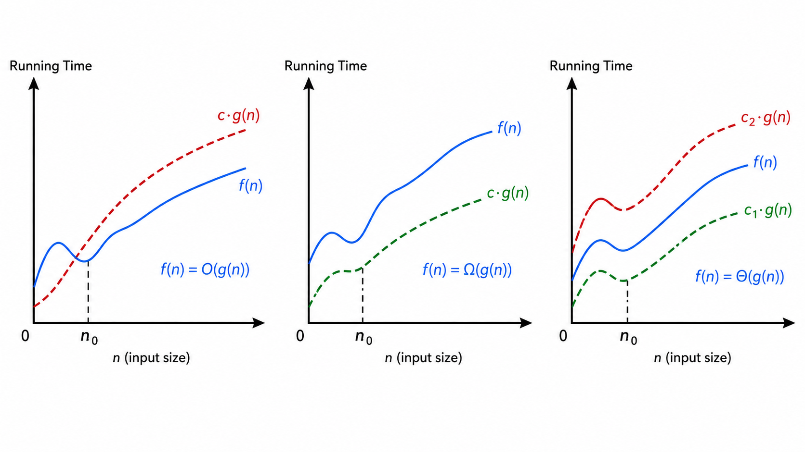
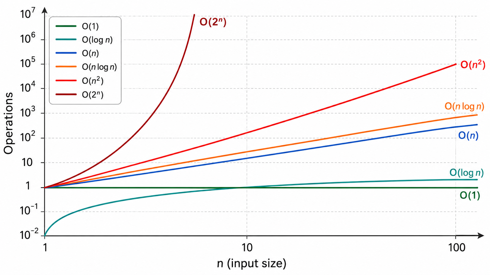
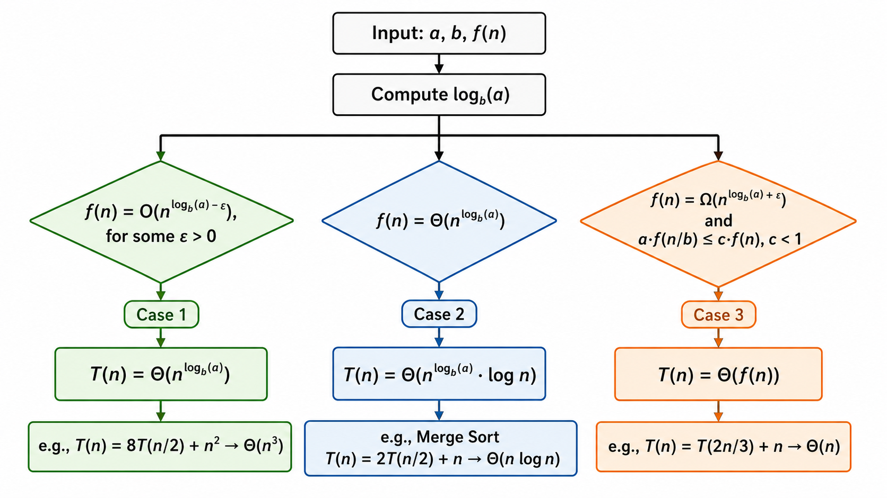
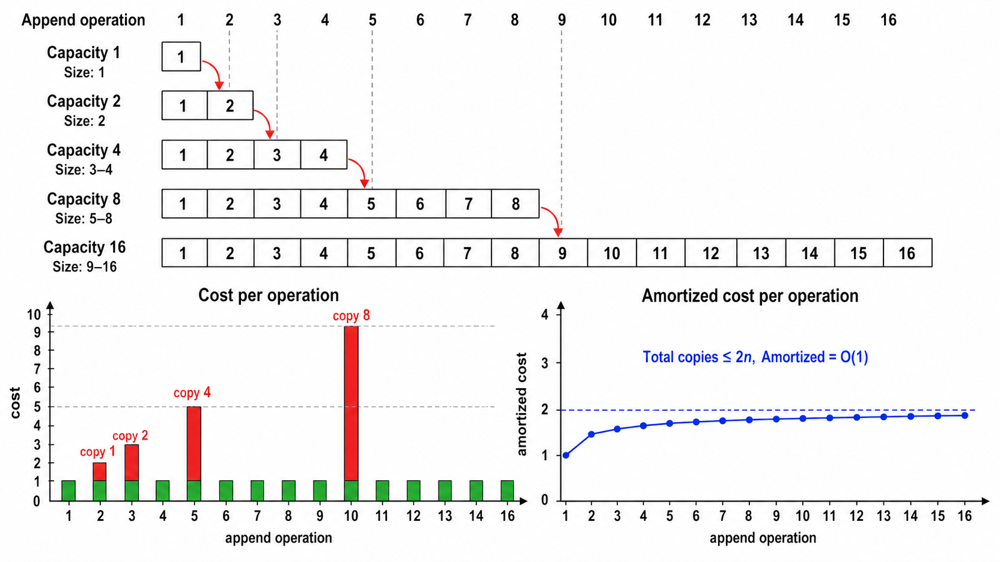

# 复杂度分析与渐进记号

> [!WARNING]
> 🧪 Beta公测版本提示：教程主体已完成，正在优化细节，欢迎大家提Issue反馈问题或建议。

## 1. 为什么需要复杂度分析？

在编写算法时，最朴素的问题就是：「这段代码运行得快不快？占多少内存？」我们可以用秒表计时，但这种方法有严重缺陷：

- **依赖硬件**：同样的代码，在 i9 和 i3 上跑的时间完全不同
- **依赖数据**：排序一个已排好序的数组 vs 一个逆序数组，时间差很多
- **不能预测**：小规模测试跑得快，不代表 100 万数据时也能跑

**复杂度分析**正是为了解决这些问题而诞生的。它不关心具体多少秒，而是关注**算法的运行时间如何随输入规模 $n$ 增长**。这是算法分析中最核心的思想。

---

## 2. 渐进记号：大 O、大 Ω、大 Θ

### 2.1 大 O 记号（上界）

**定义**：$f(n) = O(g(n))$ 当且仅当存在正常数 $c$ 和 $n_0$，使得对所有 $n \geq n_0$，有 $0 \leq f(n) \leq c \cdot g(n)$。

用人话说：$f(n)$ 的增长速度**不超过** $g(n)$ 的某个常数倍。大 O 给出了算法复杂度的**最坏情况上界**。

**例**：$3n^2 + 2n + 1 = O(n^2)$，因为当 $n$ 足够大时，$3n^2 + 2n + 1 \leq 4n^2$。

### 2.2 大 Ω 记号（下界）

**定义**：$f(n) = \Omega(g(n))$ 当且仅当存在正常数 $c$ 和 $n_0$，使得对所有 $n \geq n_0$，有 $0 \leq c \cdot g(n) \leq f(n)$。

大 Ω 给出了**最好情况**的下界。例如，比较排序算法的下界是 $\Omega(n \log n)$。

### 2.3 大 Θ 记号（紧确界）

**定义**：$f(n) = \Theta(g(n))$ 当且仅当 $f(n) = O(g(n))$ 且 $f(n) = \Omega(g(n))$。

大 Θ 是最精确的描述——它说明两个函数**增长速度相同**。例如，快速排序的平均时间复杂度是 $\Theta(n \log n)$。

### 2.4 渐进分析的实用法则

在实践中，我们通常这样分析：

1. **忽略常数因子**：$3n$ 和 $100n$ 都是 $O(n)$
2. **忽略低阶项**：$n^2 + n \log n + n$ 就是 $O(n^2)$
3. **只留增长最快的项**：$2^n + n^{100}$ 仍是 $O(2^n)$（指数压倒多项式）

---

## 3. 常见复杂度等级

按照增长速度从低到高排列（越往后越"慢"）：

| 记号 | 名称 | $n=10$ | $n=10^3$ | $n=10^6$ | $n=10^9$ | 典型算法 |
|------|------|--------|----------|----------|----------|----------|
| $O(1)$ | 常数 | 1 | 1 | 1 | 1 | 数组索引、哈希查找 |
| $O(\log n)$ | 对数 | ~3 | ~10 | ~20 | ~30 | 二分查找、平衡树查找 |
| $O(n)$ | 线性 | 10 | $10^3$ | $10^6$ | **不可行** | 线性搜索、数组遍历 |
| $O(n \log n)$ | 线性对数 | ~33 | ~$10^4$ | ~$2 \times 10^7$ | **不可行** | 归并排序、堆排序 |
| $O(n^2)$ | 平方 | 100 | $10^6$ | **不可行** | **不可行** | 冒泡排序、简单DP |
| $O(n^3)$ | 立方 | 1000 | $10^9$ | **不可行** | **不可行** | Floyd-Warshall |
| $O(2^n)$ | 指数 | 1024 | **灾难** | **灾难** | **灾难** | 暴力搜索子集 |
| $O(n!)$ | 阶乘 | $3.6\times 10^6$ | **灾难** | **灾难** | **灾难** | 暴力旅行商问题 |

**关键洞察**：当 $n=10^9$ 时，任何超过 $O(n \log n)$ 的算法在常规计算机上都不可行。这就是为什么我们需要高效算法。

---

## 4. 主定理（Master Theorem）

对于分治算法，其时间复杂度通常满足递推式：

$$
T(n) = a \cdot T\left(\frac{n}{b}\right) + f(n)
$$

其中：
- $a$：子问题的个数（$a \geq 1$）
- $b$：每次将问题规模缩小的因子（$b > 1$）
- $f(n)$：分解与合并的代价

**主定理**给出了三种情形下的解：

### 情形 1：叶节点主导

若 $f(n) = O(n^{\log_b a - \epsilon})$ 对某个 $\epsilon > 0$ 成立，则：

$$
T(n) = \Theta(n^{\log_b a})
$$

**直觉**：合并代价比子问题增长慢，复杂度由叶子节点决定。

### 情形 2：均匀分布

若 $f(n) = \Theta(n^{\log_b a})$，则：

$$
T(n) = \Theta(n^{\log_b a} \log n)
$$

**直觉**：每层的代价都差不多，乘上层数 $\log_b n$。

### 情形 3：根节点主导

若 $f(n) = \Omega(n^{\log_b a + \epsilon})$ 且 $a f(n/b) \leq c f(n)$ 对 $c < 1$ 成立，则：

$$
T(n) = \Theta(f(n))
$$

**直觉**：合并代价比子问题增长快，复杂度由根节点决定。

**经典例子**：
- 归并排序：$T(n) = 2T(n/2) + O(n)$，$a=2, b=2$，$\log_2 2 = 1$，$f(n) = \Theta(n^1)$，属于情形 2，$T(n) = \Theta(n \log n)$。
- 二分查找：$T(n) = 1 \cdot T(n/2) + O(1)$，$a=1, b=2$，$\log_2 1 = 0$，$f(n) = \Theta(1) = \Theta(n^0)$，情形 2，$T(n) = \Theta(\log n)$。
- Strassen 矩阵乘法：$T(n) = 7T(n/2) + O(n^2)$，$\log_2 7 \approx 2.81$，$f(n)=O(n^2)$，情形 1，$T(n)=\Theta(n^{2.81})$。

---

## 5. 均摊分析（Amortized Analysis）

均摊分析关注的是**一系列操作的平均代价**，而不是单次操作的最坏情况。它解释了为什么某些操作虽然偶尔很"贵"，但平均下来很便宜。

### 5.1 聚合分析（Aggregate Method）

直接计算 $n$ 次操作的总代价 $T(n)$，然后均摊到每次操作：每次操作的平均代价 = $T(n) / n$。

**经典例子——动态数组（Python 的 list.append）**：

当一个数组满时，需要分配一个更大的数组（通常是原来的 2 倍），然后将所有元素复制过去。这个操作是 $O(n)$ 的。但这 $O(n)$ 的代价只需每 $n$ 次操作才发生一次。

均摊分析：经过 $n$ 次 append，总复制代价为：

$$
1 + 2 + 4 + 8 + \cdots + 2^{\lfloor \log_2 n \rfloor} \leq 2n
$$

所以总代价为 $O(n)$，均摊每次操作 $O(1)$。

### 5.2 记账法（Accounting Method）

给每次**便宜的**操作多收一点"费用"存入银行（credit），用来支付偶尔出现的**贵**操作的代价。

**例子**：动态数组的 append。
- 每次 append 收 3 元：1 元支付本次插入，2 元存入 credit
- 当数组满了需要扩容时，已有足够 credit 支付复制操作
- 结果：每次操作的均摊代价为 $O(1)$

### 5.3 势能法（Potential Method）

定义势能函数 $\Phi(D_i)$ 表示数据结构在状态 $i$ 时的"势能"。均摊代价为：

$$
\hat{c}_i = c_i + \Phi(D_i) - \Phi(D_{i-1})
$$

对于动态数组，可以定义 $\Phi = 2 \cdot (\text{size} - \text{capacity}/2)$ 或类似函数，使得扩容时 $\Phi$ 的下降恰好抵消实际代价的上升。

---

## 6. 空间复杂度

除了时间，我们还需要考虑**空间复杂度**——算法运行中占用的额外内存（不包括输入数据本身）。

- $O(1)$ 空间：原地算法，只使用常数额外空间（如冒泡排序）
- $O(n)$ 空间：需要与输入同规模的额外空间（如归并排序的临时数组）
- $O(\log n)$ 空间：递归栈的空间（如平衡树的递归操作）

**时空权衡**：在许多算法中，时间和空间是可以互换的。例如，哈希表用 $O(n)$ 额外空间换来了 $O(1)$ 的查找时间。动态规划用 $O(n)$ 的表格空间换来了指数级时间到多项式级时间的改进。

---

## 本章总结

复杂度分析是算法设计的基石。本章我们学习了：

1. **渐进记号**：大 O（上界）、大 Ω（下界）、大 Θ（紧确界）是描述复杂度的数学语言
2. **常见复杂度等级**：从 $O(1)$ 到 $O(n!)$，理解各等级的增速差异是选择算法的前提
3. **主定理**：提供了分治算法复杂度分析的标准工具，三种情形覆盖了大多数常见递推式
4. **均摊分析**：解释了看似"贵"的操作如何通过长期平均变得"便宜"，动态数组是最经典的例子
5. **空间复杂度**：时间和空间常常需要权衡，好的设计能在这两者间找到平衡

这些工具将在后续每个章节中被反复使用——每当我们介绍一个新算法，第一件事就是分析它的复杂度。

---

## 📥 Code

| File | View | Download |
|------|------|----------|
| demo.py | [Open](./code-demo) | <a href="../code/algo01_complexity/demo.py" target="_blank" download>Download</a> |
| exercise.py | [Open](./code-exercise) | <a href="../code/algo01_complexity/exercise.py" target="_blank" download>Download</a> |

## 参考

1. Cormen, T. H., Leiserson, C. E., Rivest, R. L., & Stein, C. (2009). Introduction to Algorithms (3rd ed.). MIT Press. (CLRS 经典教材，第 3、17 章)
2. Sedgewick, R., & Wayne, K. (2011). Algorithms (4th ed.). Addison-Wesley.
3. Kleinberg, J., & Tardos, E. (2005). Algorithm Design. Pearson.

---

> **下一章**：[数组、链表与哈希表](../algo02_arrays_linkedlist_hash/)
