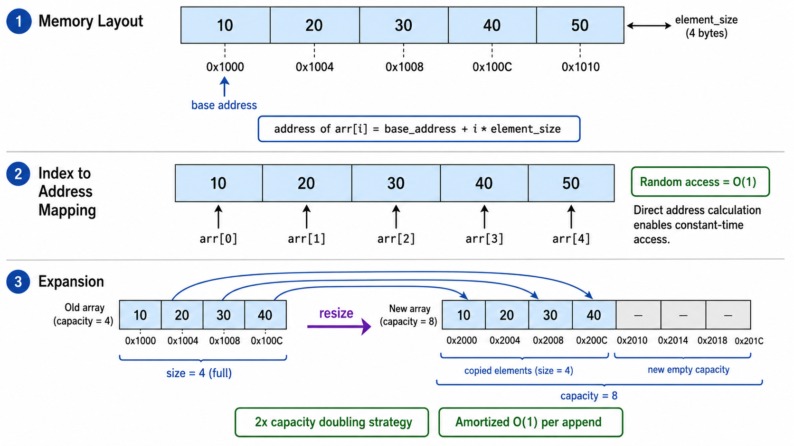
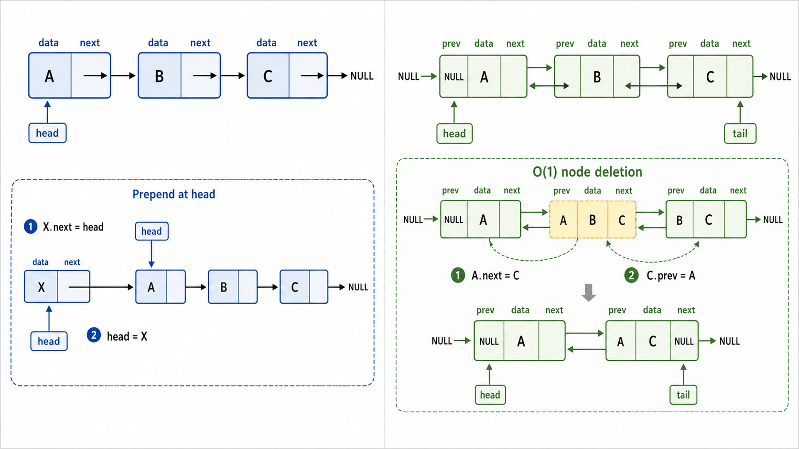
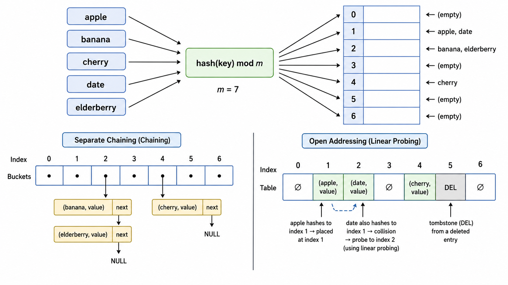
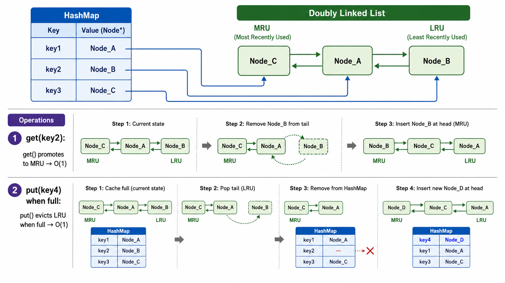

# 数组、链表与哈希表

> [!WARNING]
> 🧪 Beta公测版本提示：教程主体已完成，正在优化细节，欢迎大家提Issue反馈问题或建议。


## 1. 数据结构的选择：一切从存储开始

在计算机中，数据的组织方式决定了算法的效率。本章介绍的三种基础数据结构——**数组、链表和哈希表**——几乎出现在所有非平凡的程序中。理解它们的底层原理和性能权衡，是写出高效代码的第一步。

核心问题：数据在内存中如何存放？这直接决定了：
- 按索引访问有多快？
- 在中间插入/删除有多快？
- 搜索一个值需要多长时间？

---

## 2. 动态数组（Dynamic Array）

### 2.1 静态数组的局限

传统的 C 风格数组大小在编译时就固定了：

```
int arr[100];  // 最多只能存 100 个元素
```

这在实际编程中很不方便——你通常不知道预先需要多大空间。**动态数组**通过在底层自动扩容来解决这个问题。

### 2.2 动态数组的原理

动态数组（Python 的 `list`、C++ 的 `vector`、Java 的 `ArrayList`）的核心思想：

1. 底层维护一个比当前元素数量**更大**的定长数组
2. 当元素填满底层数组时，分配一个**更大**的数组（通常翻倍），复制所有旧元素
3. 看起来可以"无限"追加，但实际上是靠**均摊**做到的

```
class DynamicArray:
    _capacity = 1    # 底层数组的容量
    _size = 0        # 当前元素个数
    _data = [None]   # 底层定长数组
```

### 2.3 均摊 O(1) 的 append

第一章已详细分析了动态数组的均摊分析，核心结论是：虽然扩容操作是 $O(n)$ 的，但它发生得越来越稀疏，均摊后每次 append 的代价是 $O(1)$。

### 2.4 数组操作复杂度

| 操作 | 时间复杂度 | 说明 |
|------|-----------|------|
| 按索引访问 | $O(1)$ | 内存连续，直接计算地址 |
| 末尾追加 | $O(1)$ 均摊 | 扩容时才是 $O(n)$ |
| 中间插入 | $O(n)$ | 需要搬移后续元素 |
| 中间删除 | $O(n)$ | 同上 |
| 搜索 | $O(n)$ | 最坏需遍历整个数组 |

数组的优势是**随机访问 $O(1)$**，劣势是**插入/删除 $O(n)$**。



---

## 3. 链表（Linked List）

### 3.1 单链表（Singly Linked List）

链表与数组截然不同——每个元素（节点）散落在内存各处，靠**指针**串联：

```
[data|next] → [data|next] → [data|next] → None
  head
```

节点定义：

```python
class Node:
    data: int
    next: Node | None
```

单链表的核心操作：

| 操作 | 时间复杂度 | 说明 |
|------|-----------|------|
| 头部插入 | $O(1)$ | 只需修改 head 指针 |
| 尾部插入 | $O(n)$ | 需要遍历到末尾（无尾指针时） |
| 按值查找 | $O(n)$ | 必须从头遍历 |
| 删除 | $O(n)$ | 需要找到前驱节点 |

对于单链表，删除「当前」节点需要知道其前驱（除非使用"复制后继值再删除后继"的技巧）。

### 3.2 双链表（Doubly Linked List）

双链表每个节点有两个指针：

```python
class Node:
    data: int
    prev: Node | None
    next: Node | None
```

增加 `prev` 指针后，删除操作变得 $O(1)$（给定待删除节点本身即可操作，无需找前驱）。但代价是每个节点多占用一个指针的空间。

```
None ← [prev|data|next] ↔ [prev|data|next] ↔ [prev|data|next] → None
```

### 3.3 数组 vs. 链表：何时用哪个？

| 维度 | 数组 | 链表 |
|------|------|------|
| 随机访问 | $O(1)$ | $O(n)$ |
| 头部插入/删除 | $O(n)$ | $O(1)$ |
| 尾部插入/删除 | $O(1)$ 均摊 | $O(1)$ (有尾指针) |
| 中间插入/删除 | $O(n)$ | $O(1)$ (定位后) |
| 内存占用 | 紧凑（无指针开销） | 每个节点多 1-2 个指针 |
| 缓存友好 | 优秀（连续内存） | 差（跳跃访问） |
| 内存分配 | 可能浪费（预留容量） | 按需分配 |

**选择法则**：需要频繁随机访问 → 数组；频繁在中间增删 → 链表；两者都需要 → 考虑跳跃表或平衡树。



---

## 4. 哈希表（Hash Table）

### 4.1 核心思想：用空间换时间

哈希表的目标是实现 $O(1)$ 的查找、插入和删除。它的核心组件是：

1. **哈希函数**：将任意类型的键 $k$ 映射到一个整数索引 $h(k) \in [0, m-1]$
2. **数组（桶）**：大小为 $m$ 的数组，每个位置可存储一个或多个条目
3. **冲突解决机制**：当两个不同键映射到同一索引时如何处理

### 4.2 哈希函数设计

一个好的哈希函数应该是：
- **确定性**：同一个键总是产生同样的哈希值
- **均匀性**：哈希值均匀分布在 $[0, m-1]$ 范围内
- **高效**：计算速度快（$O(1)$）
- **雪崩效应**：输入微小变化导致输出剧烈变化

#### 除法哈希法

$$
h(k) = k \bmod m
$$

最简单的方法。$m$ 最好选质数且不接近 2 的幂次，以减少规律性碰撞。

#### 乘法哈希法

$$
h(k) = \lfloor m \cdot (kA \bmod 1) \rfloor
$$

其中 $A$ 是一个常数（Knuth 建议 $A \approx (\sqrt{5} - 1) / 2 \approx 0.618$）。$kA \bmod 1$ 表示取 $kA$ 的小数部分。

#### 全域哈希（Universal Hashing）

从一族哈希函数中**随机选取**一个。一族函数 $\mathcal{H}$ 称为全域的，如果对任意两个不同的键 $x \neq y$：

$$
\Pr_{h \in \mathcal{H}}[h(x) = h(y)] \leq \frac{1}{m}
$$

全域哈希可以保证**期望**性能，与输入分布无关。这在对抗性输入（攻击者故意构造碰撞）的场景中非常重要。

### 4.3 冲突解决

#### 链地址法（Separate Chaining）

每个桶是一个链表（或其他数据结构）。冲突的条目追加到链表中。

```
桶 0: [k1,v1] → [k2,v2]
桶 1: (空)
桶 2: [k3,v3]
...
```

- 查找：先计算 $h(k)$，在对应的链表中顺序搜索 → 最坏 $O(n)$（全部冲突），平均 $O(1 + \alpha)$，其中 $\alpha = n/m$ 是负载因子
- 插入：同上，通常插在链表头部 → $O(1)$

#### 开放地址法（Open Addressing）

所有条目都存储在数组本身中。当发生冲突时，探测下一个位置。

**线性探测**：$h(k, i) = (h'(k) + i) \bmod m$

优点：缓存友好（连续访问）。缺点：**一次聚集**（primary clustering）——连续被占用的槽会越来越长。

**二次探测**：$h(k, i) = (h'(k) + c_1 \cdot i + c_2 \cdot i^2) \bmod m$

减少了一次聚集，但可能导致**二次聚集**（secondary clustering）。

**双哈希**：$h(k, i) = (h_1(k) + i \cdot h_2(k)) \bmod m$

其中 $h_2(k)$ 必须与 $m$ 互质。这是开放地址法中效果最好的方案，几乎消除了聚集问题。

删除在开放地址法中需要特殊处理——不能简单地把槽置空，否则会"切断"探测链。常用方法是使用一个特殊的"已删除"标记（tombstone）。

### 4.4 负载因子与扩容

**负载因子** $\alpha = n / m$（已用槽数 / 总槽数）。

当 $\alpha$ 超过一定阈值（通常 0.75），需要扩容（rehash）：分配更大的数组，将所有条目重新哈希插入。rehash 是 $O(n)$ 操作，但与动态数组类似，均摊后仍然是 $O(1)$。



---

## 5. LRU 缓存：哈希表 + 双链表的经典组合

### 5.1 什么是 LRU？

**LRU（Least Recently Used）缓存**是一种缓存淘汰策略：当缓存满时，淘汰**最久未使用**的那个条目。

LRU 缓存需要支持两种操作，都必须在 $O(1)$ 时间内完成：

- `get(key)`：获取键对应的值，并将该条目标记为「最近使用」
- `put(key, value)`：插入或更新，若缓存满则先淘汰最久未使用的条目

### 5.2 为什么需要两种数据结构组合？

- **哈希表**提供 $O(1)$ 的键查找——给定 key，快速定位到节点
- **双链表**维护使用顺序——头部是最近使用的，尾部是最久未使用的

```
哈希表: {key1 → Node1, key2 → Node2, ...}

双链表: (MRU) Node3 ↔ Node1 ↔ Node2 (LRU)
        最近使用 → ... → 最久未使用
```

### 5.3 LRU 操作详解

**get(key)**：
1. 在哈希表中查找 key → 找到对应节点
2. 将该节点从双链表的当前位置移除
3. 将该节点插入双链表头部（标记为「最近使用」）
4. 返回节点的 value

**put(key, value)**：
1. 如果 key 已存在：更新 value，将节点移到头部
2. 如果 key 不存在：
   - 若缓存已满：删除双链表尾部的节点，从哈希表中移除
   - 创建新节点，插入双链表头部，加入哈希表

**复杂度**：每一步都是 $O(1)$——哈希表查找 $O(1)$，双链表插入/删除 $O(1)$。



---

## 本章总结

本章介绍了三种最基础也最重要的数据结构：

1. **动态数组**：随机访问 $O(1)$，末尾追加 $O(1)$ 均摊，通过 2 倍扩容策略实现
2. **链表**：插入删除 $O(1)$（定位后），但不支持随机访问。单链表节省空间，双链表删除更方便
3. **哈希表**：查找、插入、删除均 $O(1)$ 平均，通过哈希函数 + 冲突解决实现
4. **LRU 缓存**：哈希表 + 双链表的经典组合，展示了如何组合不同数据结构解决复杂问题

理解这些数据结构的底层实现，远比只会调用 API 重要——当你遇到性能瓶颈时，正是这些知识帮助你做出正确的选择。

---

## 📥 Code

| File | View | Download |
|------|------|----------|
| demo.py | [Open](./code-demo) | <a href="../code/algo02_arrays_linkedlist_hash/demo.py" target="_blank" download>Download</a> |
| exercise.py | [Open](./code-exercise) | <a href="../code/algo02_arrays_linkedlist_hash/exercise.py" target="_blank" download>Download</a> |

## 参考

1. Cormen, T. H., Leiserson, C. E., Rivest, R. L., & Stein, C. (2009). Introduction to Algorithms (3rd ed.). MIT Press. 第 10、11 章
2. Sedgewick, R., & Wayne, K. (2011). Algorithms (4th ed.). Addison-Wesley. 第 3 章
3. Knuth, D. E. (1998). The Art of Computer Programming, Vol. 3: Sorting and Searching (2nd ed.). Addison-Wesley.

---

> **上一章**：[复杂度分析与渐进记号](../algo01_complexity/)
> **下一章**：[栈与队列](../algo03_stack_queue/)
