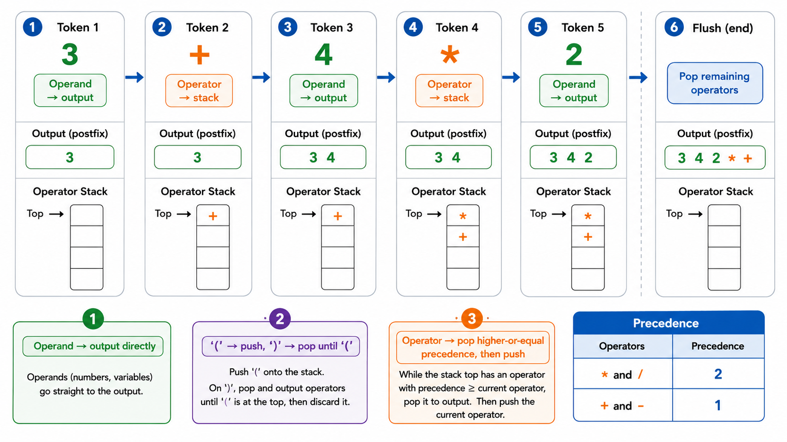
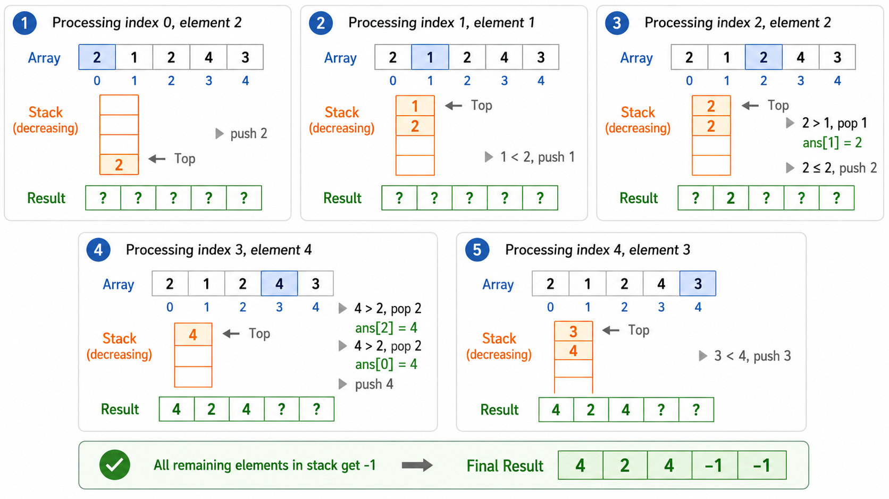
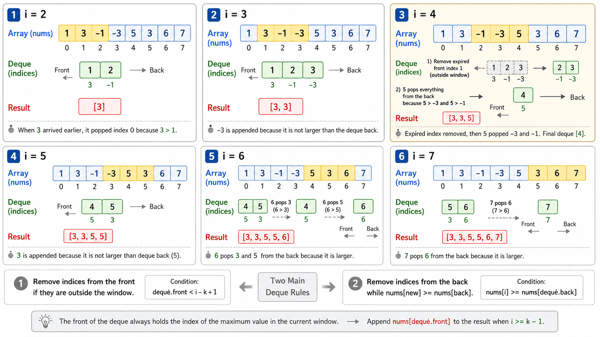
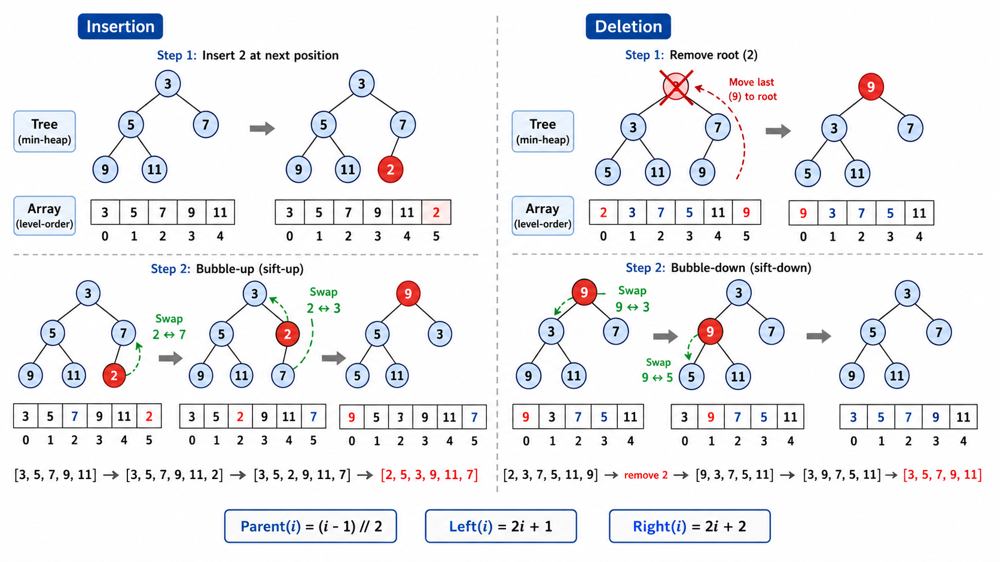

# 栈与队列

> [!WARNING]
> 🧪 Beta公测版本提示：教程主体已完成，正在优化细节，欢迎大家提Issue反馈问题或建议。


## 1. 线性数据结构的两种受限变体

数组和链表提供了通用的存取方式，但在许多场景中，我们只需要在**特定位置**进行操作。**栈**和**队列**正是为此而生——它们限制了数据的进出方式，换来了更清晰的语义和更简单的实现。

| 数据结构 | 进出规则 | 类比 |
|----------|---------|------|
| 栈 (Stack) | 后进先出 LIFO | 一叠盘子——只能从顶部取放 |
| 队列 (Queue) | 先进先出 FIFO | 排队——先来的先服务 |
| 双端队列 (Deque) | 两端都可进出 | 双向通道 |
| 优先队列 (Priority Queue) | 按优先级出队 | 急诊室——重症优先 |

虽然操作受限，但恰恰是这种限制让它们成为解决特定问题的"利器"。

---

## 2. 栈（Stack）

### 2.1 基本操作

栈只允许在一端（栈顶）进行插入和删除：

```
操作（栈顶在右端）：
push(1):  [1]
push(2):  [1, 2]
push(3):  [1, 2, 3]
pop():    [1, 2]  → 返回 3
peek():   [1, 2]  → 返回 2（不删除）
pop():    [1]     → 返回 2
```

| 操作 | 时间复杂度 | 说明 |
|------|-----------|------|
| `push(x)` | $O(1)$ | 元素入栈 |
| `pop()` | $O(1)$ | 栈顶元素出栈 |
| `peek()` | $O(1)$ | 查看栈顶元素 |
| `is_empty()` | $O(1)$ | 判断栈是否为空 |

Python 的 `list.append()` 和 `list.pop()` 天然支持栈操作。也可以用 `collections.deque`。

### 2.2 应用一：括号匹配

括号匹配是栈最经典的应用。判断一个包含 `()[]{}` 的字符串中括号是否有效匹配。

**算法**：
1. 遇左括号 → 入栈
2. 遇右括号 → 检查栈顶是否为匹配的左括号。是则弹出，否则无效
3. 遍历完后栈为空 → 有效；栈非空 → 无效

```
输入: "{[]()}"
'{' → push → stack: ['{']
'[' → push → stack: ['{', '[']
']' → pop → '[' 匹配 ']' → stack: ['{']
'(' → push → stack: ['{', '(']
')' → pop → '(' 匹配 ')' → stack: ['{']
'}' → pop → '{' 匹配 '}' → stack: []
栈为空 → 有效 ✅
```

时间复杂度 $O(n)$，空间复杂度 $O(n)$（最坏情况下所有字符都入栈）。

### 2.3 应用二：表达式求值

中缀表达式（如 `3 + 4 * 2`）是人类习惯的写法，但对计算机来说，后缀表达式（`3 4 2 * +`）更容易计算。将中缀转后缀的算法是 **Shunting-yard 算法**，由 Edsger Dijkstra 提出。

**运算符优先级**：
| 优先级 | 运算符 |
|--------|--------|
| 1（最低） | `+`, `-` |
| 2 | `*`, `/` |
| 3（最高） | `(` , `)` |

**中缀转后缀算法**：
- 操作数 → 直接输出
- `(` → 入栈
- `)` → 弹出栈中运算符直到遇到 `(`
- 运算符 → 弹出栈中优先级 $\geq$ 当前运算符的运算符，然后当前运算符入栈
- 遍历结束后 → 弹出栈中所有剩余运算符

```
输入: 3 + 4 * 2
3 → 输出: 3
+ → 栈空，入栈: [+]
4 → 输出: 3 4
* → 栈顶 '+' 优先级低，'*' 入栈: [+, *]
2 → 输出: 3 4 2
结束 → 弹出栈中所有: [+, *] → 输出: 3 4 2 * +
```

**后缀表达式求值**则更简单——遇操作数入栈，遇运算符弹出两个操作数计算后结果入栈：

```
后缀: 3 4 2 * +
3 → push → [3]
4 → push → [3, 4]
2 → push → [3, 4, 2]
* → pop 2, pop 4 → 4*2=8 → push 8 → [3, 8]
+ → pop 8, pop 3 → 3+8=11 → push 11 → [11]
结果: 11
```



---

## 3. 队列（Queue）

### 3.1 基本操作

队列在一端入队，另一端出队：

```
enqueue(1): front → [1] ← rear
enqueue(2): front → [1, 2] ← rear
enqueue(3): front → [1, 2, 3] ← rear
dequeue():  front → [2, 3] ← rear  → 返回 1
```

| 操作 | 时间复杂度 | 说明 |
|------|-----------|------|
| `enqueue(x)` | $O(1)$ | 元素入队（队尾） |
| `dequeue()` | $O(1)$ | 元素出队（队头） |
| `peek()` | $O(1)$ | 查看队头元素 |

### 3.2 循环队列

使用固定大小的数组实现队列时，如果不做特殊处理，dequeue 后队头会"留空"，最终数组前端浪费掉。**循环队列**通过将数组视为环形来解决这个问题：

```
索引:  0   1   2   3   4   5   6   7
       ↓front              ↓rear
      [ _ , _ , C , D , E , F , _ , _ ]

当 rear 到达数组末尾时 → rear = (rear + 1) % capacity → 绕回开头
```

**循环队列的三个关键变量**：
- `front`：队头索引
- `rear`：队尾索引（指向下一个空位）
- `size` 或区分「队满」和「队空」的技巧（牺牲一个位置或维护计数）

```
判空: front == rear (当使用 size 计数时用 size == 0)
判满: (rear + 1) % capacity == front (牺牲一个位置)
```

### 3.3 双端队列（Deque）

双端队列允许在两端进行插入和删除，结合了栈和队列的功能。Python 的 `collections.deque` 是基于双向链表的双端队列实现，所有操作 $O(1)$。

---

## 4. 单调栈（Monotonic Stack）

### 4.1 核心思想

单调栈是普通栈的一个变体：**栈内元素始终保持单调性**（单调递增或单调递减）。当新元素破坏单调性时，不断弹出栈顶直到恢复单调。

### 4.2 经典问题：下一个更大元素

**问题**：给定数组 `nums`，对每个元素找出它右侧第一个比它大的元素。

```
输入: [2, 1, 2, 4, 3]
输出: [4, 2, 4, -1, -1]
解释: 2 右边第一个更大的 → 4
      1 右边第一个更大的 → 2
      2 右边第一个更大的 → 4
      4 右边没有更大的 → -1
      3 右边没有更大的 → -1
```

暴力解法是 $O(n^2)$——对每个元素向右扫描。单调栈可以 $O(n)$ 解决。

**算法（维护单调递减栈）**：
1. 从左到右遍历数组
2. 当 `nums[i]` 大于栈顶元素时：`nums[i]` 就是栈顶元素的「下一个更大元素」，弹出栈顶并记录答案
3. 将 `nums[i]` 入栈（保持栈递减）
4. 遍历结束后，栈中剩余元素右侧没有更大元素

```
遍历 [2, 1, 2, 4, 3]:

i=0, num=2: 栈空，入栈 → [(0, 2)]
i=1, num=1: 1 < 栈顶2，入栈 → [(0,2), (1,1)]
i=2, num=2: 2 > 栈顶1 → 弹出1, ans[1]=2 → 栈 [(0,2)]
            2 = 栈顶2？  不，2不大于2 → 入栈 → [(0,2), (2,2)]
i=3, num=4: 4 > 栈顶2 → 弹出2, ans[2]=4 → [(0,2)]
            4 > 栈顶2 → 弹出2, ans[0]=4 → []
            栈空，入栈 → [(3,4)]
i=4, num=3: 3 < 栈顶4，入栈 → [(3,4), (4,3)]

结果: ans = [4, 2, 4, -1, -1]
```

每个元素入栈一次、出栈一次，时间复杂度 $O(n)$。



---

## 5. 单调队列（Monotonic Queue）

### 5.1 核心思想

单调队列和单调栈类似，但它从**队尾**维护单调性，从**队头**取出极值。

### 5.2 经典问题：滑动窗口最大值

**问题**：给定数组 `nums` 和窗口大小 $k$，找出每个滑动窗口中的最大值。

```
输入: nums = [1, 3, -1, -3, 5, 3, 6, 7], k = 3
输出: [3, 3, 5, 5, 6, 7]

窗口1: [1, 3, -1] → max = 3
窗口2: [3, -1, -3] → max = 3
窗口3: [-1, -3, 5] → max = 5
...
```

暴力解法 $O(nk)$，单调队列可以 $O(n)$。

**算法（维护单调递减队列，队头始终是最大值）**：

1. 处理每个元素时：
   - 从队尾弹出所有比当前元素小的元素（它们不可能再成为最大值）
   - 当前元素从队尾入队
   - 从队头弹出超出窗口范围的元素
   - 当窗口形成后，队头就是当前窗口的最大值

每个元素入队一次、出队一次，时间复杂度 $O(n)$。

```
nums = [1, 3, -1, -3, 5, 3, 6, 7], k=3

i=0, num=1: deque=[1]       窗口未形成
i=1, num=3: 1<3, 弹出1 → deque=[3]        窗口未形成
i=2, num=-1: -1<3, 保留 → deque=[3, -1]   窗口: [1,3,-1] → max=3
i=3, num=-3: -3<-1, 保留 → deque=[3, -1, -3] 窗口: [3,-1,-3] → max=3
i=4, num=5: 都<5, 全部弹出 → deque=[5]    窗口: [-1,-3,5] → max=5
...

结果: [3, 3, 5, 5, 6, 7]
```



---

## 6. 优先队列与二叉堆

### 6.1 什么是优先队列？

优先队列是一种特殊的队列：元素带有**优先级**，出队时优先级最高的元素先出来（而不是最早入队的）。

| 操作 | 时间复杂度 |
|------|-----------|
| `push(x)` 插入元素 | $O(\log n)$ |
| `pop()` 弹出最高优先级元素 | $O(\log n)$ |
| `peek()` 查看最高优先级元素 | $O(1)$ |

### 6.2 二叉堆实现

二叉堆是完全二叉树，且满足**堆序性质**：

- **最小堆**：每个节点的值 $\leq$ 其子节点的值（根最小）
- **最大堆**：每个节点的值 $\geq$ 其子节点的值（根最大）

**堆的数组表示**：对于索引 $i$ 的节点：
- 父节点：`(i-1) // 2`
- 左子节点：`2*i + 1`
- 右子节点：`2*i + 2`

**核心操作**：

**上浮（sift-up / bubble-up）**：新元素插入末尾后，如果比父节点小（最小堆），就和父节点交换，重复直到满足堆序。时间 $O(\log n)$。

**下沉（sift-down / bubble-down）**：删除堆顶后，将末尾元素放到堆顶，然后和较小的子节点交换（最小堆），重复直到满足堆序。时间 $O(\log n)$。

**建堆（heapify）**：从最后一个非叶节点开始，依次做下沉操作。虽然每次下沉 $O(\log n)$，但均摊后总时间为 $O(n)$（而非 $O(n\log n)$）。这是堆排序的基础。



---

## 本章总结

本章介绍了四种特殊的线性数据结构：

1. **栈（LIFO）**：只从一端操作。括号匹配、表达式求值、函数调用栈是其经典应用
2. **队列（FIFO）**：一端入一端出。循环队列解决了固定大小数组的空间浪费问题
3. **单调栈/单调队列**：维护元素的单调性，将暴力 $O(n^2)$ 优化到 $O(n)$，是算法竞赛的常客
4. **优先队列**：按优先级出队，二叉堆是实现它的不二之选

这些受限结构恰恰因为其"受限"而更加高效和语义清晰——在合适的场景选择合适的结构，是算法设计的核心思维。

---

## 📥 Code

| File | View | Download |
|------|------|----------|
| demo.py | [Open](./code-demo) | <a href="../code/algo03_stack_queue/demo.py" target="_blank" download>Download</a> |
| exercise.py | [Open](./code-exercise) | <a href="../code/algo03_stack_queue/exercise.py" target="_blank" download>Download</a> |

## 参考

1. Cormen, T. H., et al. (2009). Introduction to Algorithms (3rd ed.). MIT Press. 第 10 章
2. Dijkstra, E. W. (1961). Algol 60 translation: Shunting-yard algorithm.
3. Sedgewick, R., & Wayne, K. (2011). Algorithms (4th ed.). Addison-Wesley. 第 1.3 章

---

> **上一章**：[数组、链表与哈希表](../algo02_arrays_linkedlist_hash/)
> **下一章**：[树与二叉树](../algo04_tree_binarytree/)
