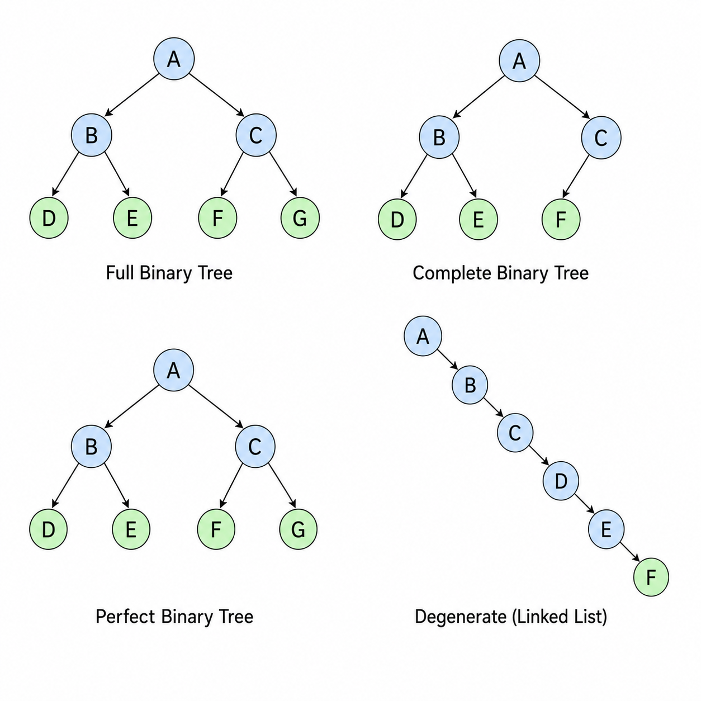
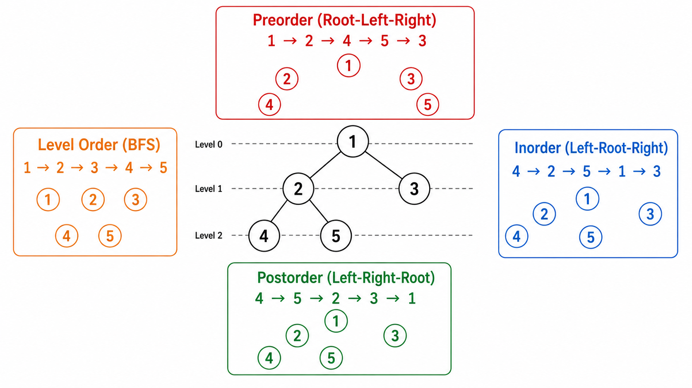
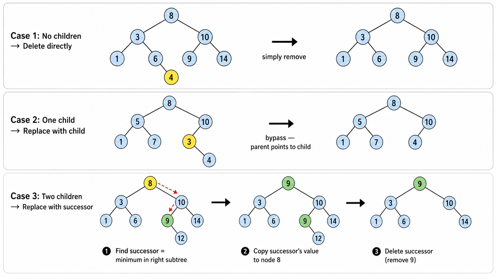
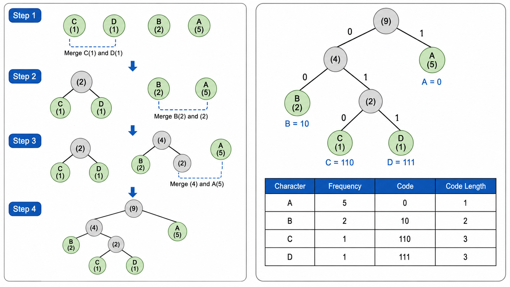

# 树与二叉树

## 1. 从线性到层次——为什么需要树？

数组和链表是**线性**结构：每个元素最多有一个前驱和一个后继。但现实世界中的很多关系是**层次化**的：
- 文件系统（文件夹里套文件夹）
- 公司组织架构
- HTML DOM 树
- 编译器中的抽象语法树（AST）

**树（Tree）**是描述层次关系的自然模型，也是计算机科学中最重要的数据结构之一。

---

## 2. 树的基本术语

```
          A          ← 根节点 (root)
        /   \
       B     C       ← B 和 C 是 A 的子节点 (child)
      / \     \
     D   E     F     ← D、E、F 是叶节点 (leaf)
    / \
   G   H             ← G 和 H 是 D 的子节点
```

| 术语 | 定义 |
|------|------|
| 节点 (Node) | 树的基本单元，包含数据和指向子节点的引用 |
| 根 (Root) | 树的最顶层节点，没有父节点 |
| 叶节点 (Leaf) | 没有子节点的节点 |
| 深度 (Depth) | 从根到该节点的边数（根的深度为 0） |
| 高度 (Height) | 从该节点到最远叶节点的边数 |
| 度 (Degree) | 节点的子节点数量 |
| 子树 (Subtree) | 以某个节点为根的树 |

---

## 3. 二叉树（Binary Tree）

二叉树是每个节点**最多有两个**子节点（左子节点和右子节点）的树。

### 3.1 二叉树的分类

| 类型 | 定义 |
|------|------|
| 满二叉树 (Full) | 每个节点有 0 或 2 个子节点 |
| 完全二叉树 (Complete) | 除最后一层外每层都填满，最后一层从左到右填充 |
| 完美二叉树 (Perfect) | 所有内部节点都有两个子节点，所有叶节点在同一层 |
| 平衡二叉树 (Balanced) | 左右子树高度差不超过 1 |

### 3.2 二叉树的性质

- 第 $i$ 层最多有 $2^i$ 个节点（根层 $i=0$）
- 高度为 $h$ 的二叉树最多有 $2^{h+1} - 1$ 个节点
- 对于任意二叉树，若叶节点数为 $n_0$，度为 2 的节点数为 $n_2$，则 $n_0 = n_2 + 1$



---

## 4. 二叉树的遍历

遍历是按某种顺序访问树中所有节点。对于二叉树，有三种深度优先遍历和一种广度优先遍历。

### 4.1 深度优先遍历（DFS）

以根节点的访问顺序命名：

```
        1
      /   \
     2     3
    / \
   4   5

先序 (Preorder):  1 → 2 → 4 → 5 → 3   (根→左→右)
中序 (Inorder):   4 → 2 → 5 → 1 → 3   (左→根→右)
后序 (Postorder): 4 → 5 → 2 → 3 → 1   (左→右→根)
```

**递归实现**：三种遍历的递归版本非常简洁，区别仅在于访问根节点的时机。

```python
def preorder(node):
    if not node: return
    visit(node)              # 先访问根
    preorder(node.left)
    preorder(node.right)

def inorder(node):
    if not node: return
    inorder(node.left)
    visit(node)              # 中间访问根
    inorder(node.right)

def postorder(node):
    if not node: return
    postorder(node.left)
    postorder(node.right)
    visit(node)              # 最后访问根
```

**迭代实现**：使用栈模拟递归。以中序为例——一路向左入栈，到头后弹出访问，然后转向右子树。

**复杂度**：时间复杂度 $O(n)$（每个节点访问一次），空间复杂度 $O(h)$（递归栈深度为树高，最坏 $O(n)$，平衡时 $O(\log n)$）。

### 4.2 层序遍历（BFS / Level Order）

逐层从左到右访问节点，使用队列：

```
        1
      /   \
     2     3
    / \
   4   5

层序: 1 → 2 → 3 → 4 → 5
```

```python
def level_order(root):
    if not root: return
    from collections import deque
    q = deque([root])
    while q:
        node = q.popleft()
        visit(node)
        if node.left: q.append(node.left)
        if node.right: q.append(node.right)
```

时间 $O(n)$，空间 $O(w)$（$w$ 是树的最大宽度）。

### 4.3 Morris 遍历（$O(1)$ 空间中序遍历）

Morris 遍历通过利用空闲指针（叶子节点的右指针）建立临时链接，实现了**常数空间**的中序遍历。

**核心思想**：对于当前节点 `cur`：
- 若 `cur` 无左子树 → 访问 `cur`，向右走
- 若 `cur` 有左子树 → 找到左子树的最右节点（前驱），将其右指针指向 `cur`，然后 `cur` 向左走。下次通过这个链接回到 `cur` 时，恢复原状并访问 `cur`。

时间复杂度 $O(n)$（虽然每个节点可能被访问两次），空间复杂度 $O(1)$。



---

## 5. 二叉搜索树（Binary Search Tree, BST）

### 5.1 BST 的性质

对任意节点 $x$：
- 左子树所有节点的值 $<$ $x$ 的值
- 右子树所有节点的值 $>$ $x$ 的值
- 左右子树也分别是 BST

```
        8
      /   \
     3    10
    / \     \
   1   6    14
      / \
     4   7
```

### 5.2 核心操作

**查找（Search）**：从根出发，若目标值小于当前节点则走左，大于则走右。类似二分查找。时间 $O(h)$，平衡时 $O(\log n)$，退化时 $O(n)$。

**插入（Insert）**：同查找一样找到「该去但没去成」的位置，然后将新节点挂上去。时间 $O(h)$。

**删除（Delete）**：三种情况：
1. 叶节点 → 直接删除
2. 只有一个子节点 → 用子节点替代
3. 有两个子节点 → 用**后继**（右子树的最小值）或**前驱**（左子树的最大值）替换，然后删除后继/前驱

**后继/前驱**：
- 后继（Successor）：比当前节点大的最小节点 → 右子树一路向左
- 前驱（Predecessor）：比当前节点小的最大节点 → 左子树一路向右

### 5.3 BST 的弱点

BST 在插入序列有序时会**退化**成链表（$O(n)$ 高度）。解决方法是**自平衡**机制（见第 6 节）。



---

## 6. 平衡二叉搜索树

### 6.1 AVL 树

AVL 树是历史上第一个自平衡二叉搜索树（1962 年，由 Adelson-Velsky 和 Landis 提出）。

**平衡因子**：节点的左子树高度减去右子树高度。AVL 树要求每个节点的平衡因子 $\in \{-1, 0, 1\}$。

当插入或删除导致不平衡时，通过**旋转**恢复平衡：

| 失衡类型 | 场景 | 修复方式 |
|----------|------|----------|
| LL（左左） | 左子树的左子树插入导致失衡 | 右旋（R） |
| RR（右右） | 右子树的右子树插入导致失衡 | 左旋（L） |
| LR（左右） | 左子树的右子树插入导致失衡 | 左旋后右旋（LR） |
| RL（右左） | 右子树的左子树插入导致失衡 | 右旋后左旋（RL） |

```
LL - 右旋:
    z              y
   / \            / \
  y   T4   →    x     z
 / \           / \   / \
x   T3        T1 T2 T3 T4
|
新插入

LR - 先左旋后右旋:
    z              z              x
   / \            / \           /   \
  y   T4   →    x   T4   →    y     z
 / \           / \           / \   / \
T1  x         y  T3         T1 T2 T3 T4
    |        / \
   新插入   T1 T2
```

**复杂度**：查找/插入/删除均为 $O(\log n)$，因为 AVL 树的高度最多为 $1.44 \log_2 n$。

### 6.2 红黑树（直觉理解）

红黑树采用另一种平衡策略——用颜色标记节点并遵循五条规则：

1. 每个节点是红色或黑色
2. 根节点是黑色
3. 叶节点（NIL）是黑色
4. 红色节点的两个子节点必须是黑色（不能出现连续红色）
5. 从任意节点到其所有后代叶节点的路径上，黑色节点数量相同

红黑树通过**颜色翻转**和**旋转**来维护平衡，插入删除的旋转次数比 AVL 树少。实际工程中（如 C++ STL `map`、Java `TreeMap`）常使用红黑树。

---

## 7. 哈夫曼编码树

### 7.1 数据压缩问题

在文件压缩中，我们希望用更少的比特表示更频繁出现的字符。哈夫曼编码（Huffman Coding，1952 年）是一种最优前缀编码——没有任何字符的编码是另一个字符编码的前缀。

### 7.2 构建哈夫曼树（贪心算法）

1. 统计每个字符的频率
2. 将所有字符视为单节点树，放入优先队列（按频率升序）
3. 每次取出频率最小的两棵树，合并为一棵新树（频率为两者之和）
4. 重复直到只剩一棵树
5. 左分支标记为 0，右分支标记为 1，从根到每个字符的路径就是其编码

```
示例: A(5), B(2), C(1), D(1)

步骤:
  取出 C(1), D(1) → 合并为 (2)，放回
  取出 B(2), (2)   → 合并为 (4)，放回
  取出 A(5), (4)   → 合并为 (9)（根）

编码: A = 0, B = 10, C = 110, D = 111
```

频率越高的字符路径越短（编码越短），频率越低的字符路径越长。



---

## 本章总结

树结构将数据组织从线性扩展到了层次，二叉树是最基本也最重要的树形结构：

1. **二叉树遍历**：前中后序（DFS）和层序（BFS）是树操作的基础。Morris 遍历以 $O(1)$ 空间实现中序遍历，展示了巧妙利用空指针的技巧
2. **二叉搜索树**：中序遍历得到有序序列，查找/插入/删除 $O(h)$。AVL 树通过旋转维持 $h = O(\log n)$，红黑树提供了另一种平衡策略
3. **哈夫曼树**：基于频率的最优前缀编码，是贪心算法的经典案例

树结构在后续章节中会反复出现——堆是完全二叉树，BFS 是图的遍历基础，决策树是机器学习的重要模型。

---

## 📥 Code

| File | View | Download |
|------|------|----------|
| demo.py | [Open](./code-demo) | <a href="../code/algo04_tree_binarytree/demo.py" target="_blank" download>Download</a> |
| exercise.py | [Open](./code-exercise) | <a href="../code/algo04_tree_binarytree/exercise.py" target="_blank" download>Download</a> |

## 参考

1. Cormen, T. H., et al. (2009). Introduction to Algorithms (3rd ed.). MIT Press. 第 12、13 章
2. Knuth, D. E. (1997). The Art of Computer Programming, Vol. 1: Fundamental Algorithms (3rd ed.). Addison-Wesley.
3. Adelson-Velsky, G. M., & Landis, E. M. (1962). An algorithm for the organization of information.

---

> **上一章**：[栈与队列](../algo03_stack_queue/)
> **下一章**：[堆、并查集与跳跃表](../algo05_heap_unionfind_skiplist/)
