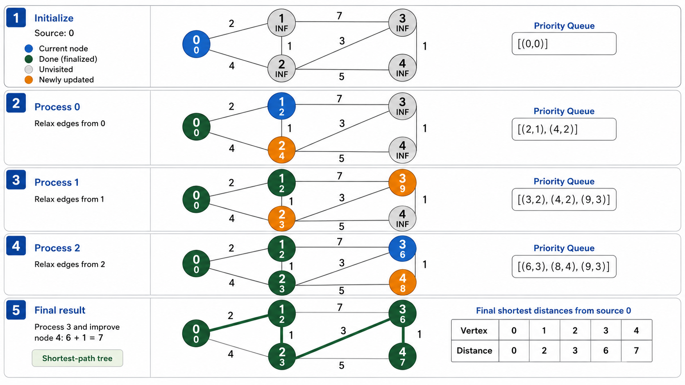
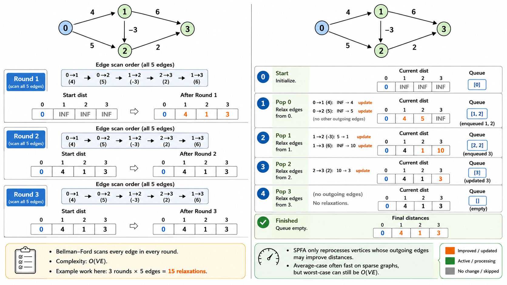
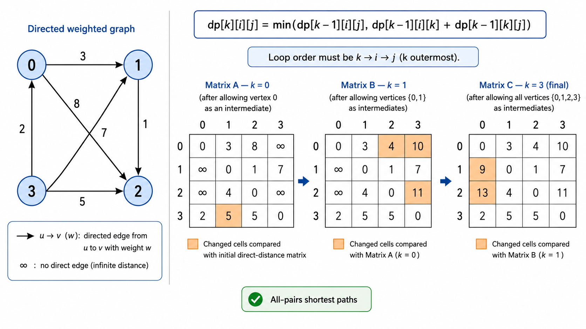
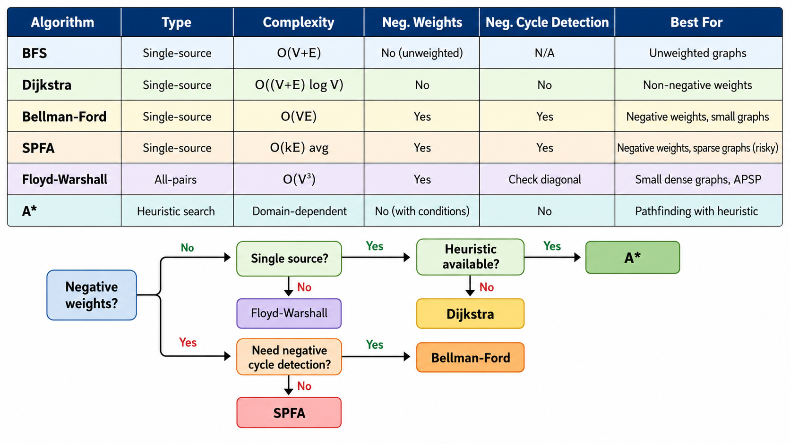

# 最短路径

> [!WARNING]
> 🧪 Beta公测版本提示：教程主体已完成，正在优化细节，欢迎大家提Issue反馈问题或建议。


## 1. 从导航到网络路由——最短路问题的普适性

给定一个带权图，求两顶点之间总权重最小的路径——这是计算机科学中最基本也最实用的问题之一。

- **GPS 导航**：Dijkstra 算法在道路网络中计算最短路线
- **网络路由**：OSPF 协议使用 Dijkstra 计算最短路径树
- **拼写纠错**：编辑距离可以建模为网格图上的最短路径
- **运筹优化**：物流配送、航班调度都可以转化为最短路问题

---

## 2. Dijkstra 算法

### 2.1 核心思想（贪心）

Dijkstra 算法解决**非负权图**上的单源最短路径问题。核心思想是**贪心扩展**——每次从未确定最短距离的顶点中选出距离最小的，并尝试用它的边松弛邻居。

### 2.2 松弛操作

**松弛（Relaxation）**是核心概念：对边 $(u, v, w)$，如果经过 $u$ 到达 $v$ 的距离比已知的 $v$ 的距离更短，就更新它：

```
if dist[u] + w < dist[v]:
    dist[v] = dist[u] + w
```

### 2.3 算法步骤

1. 初始化 `dist[start] = 0`，其他顶点 `dist = INF`
2. 维护一个优先队列（最小堆），将所有顶点按 dist 值排序
3. 每次弹出 `dist` 最小的顶点 $u$
4. 对 $u$ 的每条出边 $(u, v, w)$ 进行松弛操作
5. 重复步骤 3-4 直到优先队列为空

### 2.4 复杂度分析

- 朴素实现（用数组扫描找最小值）：$O(V^2)$，适合**稠密图**
- 堆优化（用优先队列）：$O((V+E) \log V)$，适合**稀疏图**

### 2.5 正确性直觉

Dijkstra 算法为什么正确？关键在于**所有边的权重都是非负的**。当我们从优先队列中弹出顶点 $u$ 时，它的 $dist[u]$ 已经是最终的最短距离——因为任何通过其他未确定顶点的路径都至少和（较小的）$dist[u]$ 加上非负权重一样长，不可能更短。

### 2.6 局限性

Dijkstra 算法**不能处理负权边**。如果图中存在负权边，已经"确定"的最短距离可能被后续更短的负权路径推翻。



---

## 3. Bellman-Ford 算法

### 3.1 为什么需要 Bellman-Ford？

Dijkstra 遇到负权边就失效了。Bellman-Ford 算法可以处理**任意带权图**（只要没有负环），并且能够**检测负环**。

### 3.2 算法原理（动态规划视角）

Bellman-Ford 重复执行**对所有边的松弛操作**。第 $k$ 轮松弛后，`dist[v]` 的值就是从起点到 $v$ 经过**最多 $k$ 条边**的最短路径距离。

最多需要 $V-1$ 轮（因为简单路径最多包含 $V-1$ 条边）。

### 3.3 算法步骤

1. 初始化 `dist[start] = 0`，其他 `dist = INF`
2. 重复 $V-1$ 次：遍历所有边，对每条边进行松弛
3. 额外做一轮松弛：如果还能更新任何 `dist`，说明存在**负环**

### 3.4 复杂度

时间复杂度 $O(VE)$，比 Dijkstra 慢，但更灵活（允许负权）。

### 3.5 检测负环

```
第 V 轮：如果还能松弛任何边 → 存在负权环
```

为什么？因为经过 $V-1$ 条边后，所有非负环下的最短路径都已被找到。额外的松弛只能来源于负环上不断绕圈带来的距离减小。

---

## 4. SPFA 算法

### 4.1 队列优化的 Bellman-Ford

SPFA（Shortest Path Faster Algorithm）是 Bellman-Ford 的一个队列优化版本。观察到：只有上一轮被松弛了的顶点，其出边才可能在下一轮导致其他顶点的松弛。

### 4.2 算法步骤

1. 初始化 `dist[start] = 0`，其他 `dist = INF`
2. 维护一个队列，初始只有 `start`
3. 每次从队列中取出顶点 $u$
4. 对 $u$ 的每条出边 $(u, v, w)$ 进行松弛：若 $dist[u] + w < dist[v]$，更新 $dist[v]$ 并将 $v$ 入队（若 $v$ 不在队中）
5. 重复直到队列为空

### 4.3 SPFA 什么时候会退化？

SPFA 在绝大多数随机图上的表现优于 Bellman-Ford（接近 $O(E)$），但在最坏情况下仍会退化到 $O(VE)$。某些刻意构造的图可以让 SPFA 表现得非常差。因此在实际竞赛和工程中：
- Dijkstra 是非负权图的首选
- Bellman-Ford / SPFA 用于有负权边的场景
- 对于包含负环检测需求的场景，直接用 Bellman-Ford 更安全



---

## 5. Floyd-Warshall 算法

### 5.1 全源最短路径（All-Pairs Shortest Path）

前面三个算法都解决**单源**最短路径。如果需要所有顶点对之间的最短距离，朴素方法是对每个顶点都跑一遍 Dijkstra（$O(V \cdot (V+E) \log V)$），而 Floyd-Warshall 以简洁的 $O(V^3)$ 优雅地解决这个问题。

### 5.2 动态规划公式

F-W 算法的核心是考虑：对于任意两点 $i$ 和 $j$，他们之间的最短路径是否经过顶点 $k$？

$$
dp[k][i][j] = \min\left(dp[k-1][i][j],\;\; dp[k-1][i][k] + dp[k-1][k][j]\right)
$$

其中 $dp[k][i][j]$ 表示「只允许经过前 $k$ 个顶点时，$i$ 到 $j$ 的最短距离」。

通过滚动数组优化，可以压缩到二维：

```python
for k in range(V):
    for i in range(V):
        for j in range(V):
            dist[i][j] = min(dist[i][j], dist[i][k] + dist[k][j])
```

### 5.3 三重循环的顺序为什么是 k-i-j？

`k` 必须在最外层！这保证了我们使用的是「只允许经过前 $k-1$ 个顶点」的状态进行转移。如果把 `i` 或 `j` 放在最外层，会错误地使用「允许经过前 $k$ 个顶点」的状态来更新其他状态。

---

## 6. 其他最短路径算法一览

| 算法 | 单源/全源 | 权重要求 | 复杂度 | 特点 |
|------|----------|----------|--------|------|
| BFS | 单源 | 无权（权重=1） | $O(V+E)$ | 最简单 |
| Dijkstra | 单源 | 非负 | $O((V+E)\log V)$ | 贪心，最常用 |
| Bellman-Ford | 单源 | 任意（可检测负环） | $O(VE)$ | DP 思想 |
| SPFA | 单源 | 任意 | $O(kE)$ 平均 | B-F 的队列优化 |
| Floyd-Warshall | 全源 | 任意 | $O(V^3)$ | DP，简洁优雅 |
| Johnson | 全源 | 任意 | $O(VE + V^2\log V)$ | 结合 B-F + Dijkstra |
| A* | 单源到单目标 | 非负 | 启发式 | 有启发函数时最有效 |

### 6.1 Johnson 算法（直觉）

Johnson 算法使用**重赋权（reweighting）**技术，让有负权边的图变成非负权图，然后对每个顶点跑 Dijkstra。核心技巧是用 Bellman-Ford 计算一个势函数 $h(v)$，然后将每条边的权重调整为 $w'(u,v) = w(u,v) + h(u) - h(v) \geq 0$。重赋权后所有最短路径保持不变。

### 6.2 A* 搜索

A* 在 Dijkstra 的基础上引入了**启发式函数** $h(v)$（估算 $v$ 到目标的最小代价）。优先队列的排序键从 $dist[v]$ 变为 $f(v) = dist[v] + h(v)$。

- 若 $h(v)=0$，A* 退化为 Dijkstra
- 若 $h(v)$ **可采纳**（$\leq$ 真实最小代价），A* 保证找到最优解
- 若 $h(v)$ **一致**（满足三角不等式 $h(u) \leq w(u,v) + h(v)$），A* 不会重复处理节点

A* 在游戏 AI 寻路、机器人路径规划中广泛应用。



---

## 7. 算法选择决策树

```
图中是否有负权边？
├── 否 → 是否单源？
│   ├── 是 → Dijkstra（堆优化） O((V+E)log V)
│   └── 否 → Floyd-Warshall V<500? → O(V³)；否则 V*Dijkstra
└── 是 → 是否需要检测负环？
    ├── 是 → Bellman-Ford O(VE)
    └── 否 → SPFA（平均快但可能退化）
```



---

## 本章总结

最短路径是图论中最核心的问题之一，五种经典算法各有适用场景：

1. **Dijkstra**：非负权图的首选，堆优化后 $O((V+E)\log V)$
2. **Bellman-Ford**：支持负权边并检测负环，$O(VE)$
3. **SPFA**：B-F 的队列优化，平均 $O(E)$ 但可能退化
4. **Floyd-Warshall**：全源最短路径，$O(V^3)$，DP 公式极简
5. **A***：引入启发式，在有信息的搜索空间中远超 Dijkstra

---

## 📥 Code

| File | View | Download |
|------|------|----------|
| demo.py | [Open](./code-demo) | <a href="../code/algo07_shortest_path/demo.py" target="_blank" download>Download</a> |
| exercise.py | [Open](./code-exercise) | <a href="../code/algo07_shortest_path/exercise.py" target="_blank" download>Download</a> |

## 参考

1. Dijkstra, E. W. (1959). A note on two problems in connexion with graphs. Numerische Mathematik.
2. Bellman, R. (1958). On a routing problem. Quarterly of Applied Mathematics.
3. Floyd, R. W. (1962). Algorithm 97: Shortest path. CACM.
4. Hart, P. E., Nilsson, N. J., & Raphael, B. (1968). A formal basis for the heuristic determination of minimum cost paths.

---

> **上一章**：[图论基础](../algo06_graph_basics/)
> **下一章**：[最小生成树与网络流](../algo08_mst_networkflow/)
