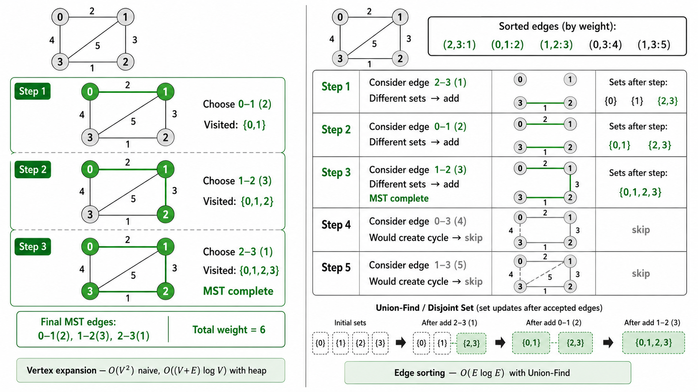
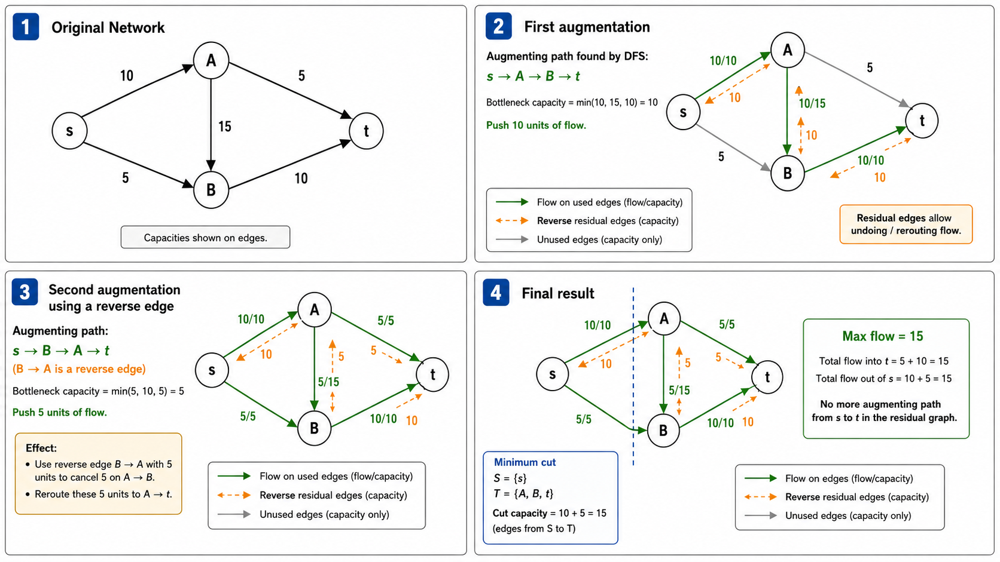

# 最小生成树与网络流

> [!WARNING]
> 🧪 Beta公测版本提示：教程主体已完成，正在优化细节，欢迎大家提Issue反馈问题或建议。


## 1. 两个经典图论问题

本章介绍两个看似不同但都极为重要的图论问题：

- **最小生成树（MST）**：用最少的边连接所有顶点（如铺设最便宜的光纤网络）
- **最大流（Max Flow）**：在容量有限的网络中传送尽可能多的流量（如交通网络、数据网络）

---

## 2. 最小生成树（Minimum Spanning Tree）

### 2.1 定义

给定一个连通带权无向图 $G = (V, E)$，**生成树**是包含所有 $|V|$ 个顶点且无环的连通子图（恰好 $|V|-1$ 条边）。**最小生成树（MST）**是所有生成树中边权和最小的。

### 2.2 核心性质

**割性质（Cut Property）**：对于任意一个割（将顶点分为两个集合），连接两个集合的边中权重最小的那条一定属于某个 MST。

**环性质（Cycle Property）**：对于图中的任意一个环，环上权重最大的边一定不属于任何 MST。

这两个性质是 Prim 和 Kruskal 算法正确性的理论基础。

---

## 3. Prim 算法

### 3.1 贪心扩展

Prim 算法从任意顶点开始，每次选择连接「已选顶点集合」和「未选顶点集合」的**权重最小**的边，将对应顶点加入集合。重复直到所有顶点都被选中。

```
初始: 已选 = {A}
步骤1: 从 A 出发的最小权边 A-B(2) → 已选 = {A, B}
步骤2: 连接已选与未选的最小边 B-C(3) → 已选 = {A, B, C}
步骤3: 连接已选与未选的最小边 C-D(1) → 已选 = {A, B, C, D}
完成！
```

### 3.2 实现

Prim 算法与 Dijkstra 算法高度相似——只是优先队列的排序键不同：
- Dijkstra：`dist[v] = min(dist[v], dist[u] + w)`
- Prim：`dist[v] = min(dist[v], w)`（只关心连接边权重，不累加路径）

### 3.3 复杂度

- 朴素实现（数组扫描）：$O(V^2)$，适合**稠密图**
- 堆优化：$O((V+E) \log V)$，适合**稀疏图**

### 3.4 Prim vs Dijkstra 的直观区别

| 算法 | 排序键 | 含义 |
|------|--------|------|
| Dijkstra | 从起点的累积距离 | 找到起点的最短路径树 |
| Prim | 连接已选集的最小边权 | 找到全图的最小生成树 |

---

## 4. Kruskal 算法

### 4.1 贪心加边

Kruskal 算法将所有边按权重升序排序，然后依次考虑每条边：如果加入这条边不会形成环（用并查集判断），就将其加入 MST。

```
边排序: (C,D:1), (A,B:2), (B,C:3), (A,D:4), (B,D:5)

C-D(1): C 和 D 不在同一集合 → 加入
A-B(2): A 和 B 不在同一集合 → 加入
B-C(3): B 和 C 不在同一集合 → 加入  (现在 {A,B,C,D} 全连通)
A-D(4): A 和 D 已在同一集合 → 跳过（会形成环！）
B-D(5): B 和 D 已在同一集合 → 跳过
MST 完成: 总权重 = 1+2+3 = 6
```

### 4.2 并查集的作用

Kruskal 中的「判断是否形成环」正是并查集的经典用途。加入边 $(u, v)$ 前，检查 `find(u) == find(v)`。若已经在同一集合，加入这条边就会形成环。

### 4.3 复杂度

- 边排序：$O(E \log E)$
- 并查集操作：$O(E \cdot \alpha(V)) \approx O(E)$
- 总复杂度：$O(E \log E)$ 或 $O(E \log V)$（因为 $\log E \approx \log V^2 = 2\log V$）

### 4.4 Prim vs. Kruskal

| 维度 | Prim | Kruskal |
|------|------|---------|
| 策略 | 顶点扩展 | 边排序 + 选择 |
| 适合 | 稠密图 $E \approx V^2$ | 稀疏图 $E \approx V$ |
| 数据结构 | 优先队列 | 并查集 |
| 朴素复杂度 | $O(V^2)$ | $O(E \log E)$ |
| 堆优化复杂度 | $O((V+E)\log V)$ | $O(E \log E)$ |

**选择法则**：稠密图用 Prim（朴素 $O(V^2)$），稀疏图用 Kruskal（$O(E \log E)$）。



---

## 5. 最大流（Maximum Flow）

### 5.1 问题定义

给定一个有向图（**流网络**），每条边 $(u, v)$ 有容量 $c(u,v)$。两个特殊顶点：**源点** $s$ 和**汇点** $t$。求从 $s$ 到 $t$ 的最大流量，满足：
- **容量约束**：$0 \leq f(u,v) \leq c(u,v)$
- **流量守恒**：对每个非源汇顶点，流入 = 流出

### 5.2 残量网络（Residual Network）

**残量容量** $c_f(u,v) = c(u,v) - f(u,v)$ 表示还可以增加的流量。

每条边 $(u, v)$ 同时有一个**反向边** $(v, u)$，残量容量等于正向边的流量 $f(u,v)$——这表示可以"撤销"已发送的流量（推送反向流）。

### 5.3 Ford-Fulkerson 方法

Ford-Fulkerson 不是一个具体算法，而是一个**方法论**：

1. 从零流开始
2. 在残量网络中找一条从 $s$ 到 $t$ 的**增广路径（Augmenting Path）**
3. 沿该路径推送尽可能多的流量（瓶颈容量）
4. 重复直到找不到增广路径

关键问题：**如何找增广路径？** 不同的查找方法产生不同的算法。

### 5.4 Edmonds-Karp 算法

E-K 使用 **BFS** 在残量网络中找**最短**的增广路径（按边数最少）。每个 E-K 增广是 $O(E)$，最多需要 $O(VE)$ 次增广。

总复杂度：$O(VE^2)$。

### 5.5 Dinic 算法

Dinic 算法通过两个关键概念进一步优化：

**层图（Level Graph）**：用 BFS 给每个顶点赋予层号（从 $s$ 出发的最短距离）。只保留从第 $i$ 层到第 $i+1$ 层的边。

**阻塞流（Blocking Flow）**：在层图中找到一条"阻塞流"——即在每条 $s \to t$ 的路径上至少有一条边饱和。Dinic 使用 DFS 找到阻塞流。

每轮 BFS 构建层图，DFS 找阻塞流。最多 $V-1$ 轮 BFS。

总复杂度：$O(V^2 E)$，在二分图匹配等场景下表现极佳（实际中远快于上界）。

### 5.6 最大流最小割定理

**最小割**是将图分为包含 $s$ 和 $t$ 的两个集合的最少容量切割。最大流最小割定理说：

> **最大流的值 = 最小割的容量**

这是网络流理论中最深刻的结论，也是线性规划强对偶定理在流网络上的体现。

---

## 6. 最大流应用于二分图匹配

二分图**最大匹配**问题可以转化为最大流问题：

1. 添加源点 $s$，连向所有左侧顶点（容量 1）
2. 添加汇点 $t$，从所有右侧顶点连入（容量 1）
3. 原图中的每条边保持原样（容量 1）
4. 从 $s$ 到 $t$ 的最大流的值 = 最大匹配的大小

Dinic 算法在二分图匹配上的复杂度为 $O(E \sqrt{V})$，远优于一般图。



---

## 7. 流网络中的关键概念

### 7.1 增广路径

在残量网络中找到的从 $s$ 到 $t$ 的路径。沿该路径可以推送的流量 = 路径上残量容量的最小值（瓶颈）。

### 7.2 反向边的作用

反向边是理解网络流的关键。它们允许"撤销"之前的决策：

```
边缘: A → B (容量 10)
推送 5 单位: 正向残量 = 5, 反向残量(可撤销) = 5
撤回 3 单位: 从 B 沿着反向边推 3 到 A
→ 等效于原本只推送了 2
```

### 7.3 多源多汇

如果图有多个源点或多个汇点，可以添加**超级源点**和**超级汇点**，连接到所有原始源/汇（容量设为 $\infty$），转化为标准单源单汇问题。

---

## 8. 算法复杂度总览

| 算法 | 问题 | 复杂度 | 关键数据结构 |
|------|------|--------|-------------|
| Prim | MST | $O((V+E)\log V)$ | 优先队列 |
| Kruskal | MST | $O(E \log E)$ | 并查集 |
| Ford-Fulkerson | 最大流 | $O(E \cdot \text{max\_flow})$ | DFS |
| Edmonds-Karp | 最大流 | $O(VE^2)$ | BFS |
| Dinic | 最大流 | $O(V^2 E)$ | BFS + DFS |
| Dinic (二分图) | 最大匹配 | $O(E\sqrt{V})$ | BFS + DFS |

---

## 本章总结

1. **最小生成树**：Prim（顶点扩展，稠密图）和 Kruskal（边排序，稀疏图）都是基于割性质和环性质的贪心算法
2. **最大流**：核心概念是残量网络和增广路径。Ford-Fulkerson 是方法框架，Edmonds-Karp（BFS）和 Dinic（层图+阻塞流）是具体实现
3. **最大流最小割定理**：流网络理论中最深刻的结论，揭示了"瓶颈"的物理意义
4. **二分图匹配**：通过构建超级源汇可以转化为最大流问题

---

## 📥 Code

| File | View | Download |
|------|------|----------|
| demo.py | [Open](./code-demo) | <a href="../code/algo08_mst_networkflow/demo.py" target="_blank" download>Download</a> |
| exercise.py | [Open](./code-exercise) | <a href="../code/algo08_mst_networkflow/exercise.py" target="_blank" download>Download</a> |

## 参考

1. Prim, R. C. (1957). Shortest connection networks and some generalizations. Bell System Technical Journal.
2. Kruskal, J. B. (1956). On the shortest spanning subtree of a graph. Proceedings of the AMS.
3. Ford, L. R., & Fulkerson, D. R. (1956). Maximal flow through a network. Canadian Journal of Mathematics.
4. Dinic, E. A. (1970). Algorithm for solution of a problem of maximum flow in networks with power estimation. Soviet Mathematics Doklady.

---

> **上一章**：[最短路径](../algo07_shortest_path/)
> **（全书附录完毕）**
