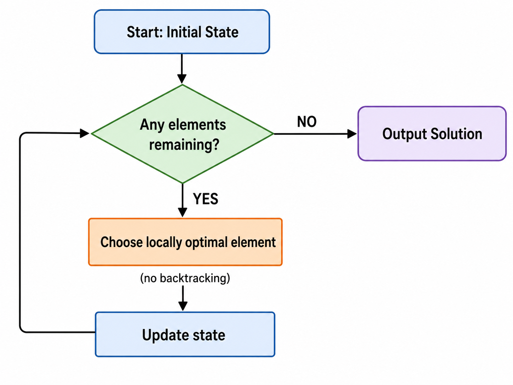
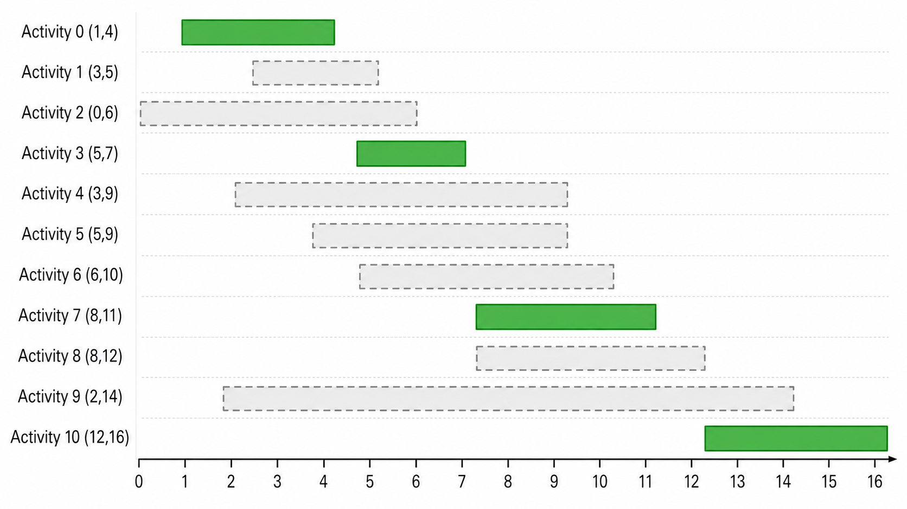
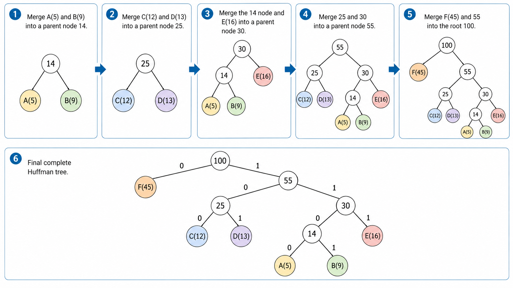
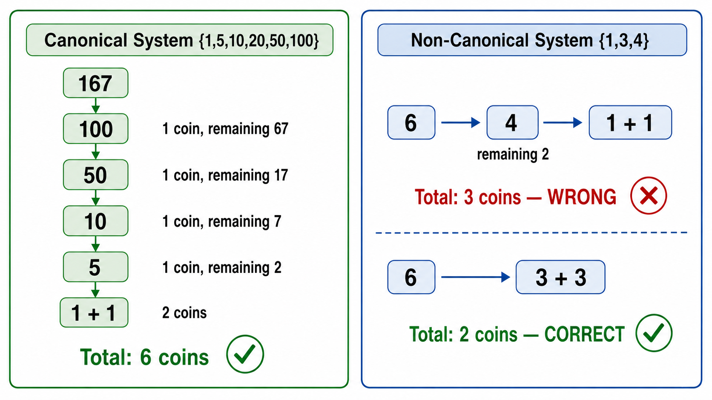

# algo09 贪心算法

> [!WARNING]
> 🧪 Beta公测版本提示：教程主体已完成，正在优化细节，欢迎大家提Issue反馈问题或建议。


> 局部最优是否能通向全局最优？—— 贪心选择性质、Huffman 编码、找零问题与正确性证明方法

---

## 一、什么是贪心算法？

### 1.1 核心思想

**贪心算法（Greedy Algorithm）** 的核心思想极为朴素：**每一步都做出当前看起来最好的选择，希望最终得到全局最优解**。

$$
\text{每一步} \rightarrow \arg\min_{\text{当前可选}} \{\text{局部成本}\} \quad\text{或}\quad \arg\max_{\text{当前可选}} \{\text{局部收益}\}
$$

与动态规划不同，贪心算法**不回溯、不试探**——它一旦做出选择，就不会回头修改。这使得贪心算法通常非常快（往往是 $O(n \log n)$ 或 $O(n)$），但代价是**不能保证全局最优**。

> **直觉类比**：贪心算法就像一个登山者，他在浓雾中只看得见脚下几步。他的策略是：每一步都只往地势更高的方向走。如果山只有一座山顶（单峰函数），他最终会到达顶峰。但如果山峦叠嶂，他可能被困在某个小山丘上（局部最优），永远找不到真正的最高峰。

### 1.2 贪心算法的适用条件

一个优化问题能用贪心算法正确求解，需要满足两个关键性质：

**性质一：贪心选择性质（Greedy Choice Property）**
：全局最优解可以通过一系列**局部最优选择**来获得。换言之，第一个局部最优选择不会排除全局最优解的可能性。

**性质二：最优子结构（Optimal Substructure）**
：问题的最优解包含了子问题的最优解。这正是动态规划也需要的性质。

同时满足这两个性质时，贪心算法就是完全正确的。

### 1.3 贪心 vs. 动态规划 vs. 分治

| 范式 | 决策方式 | 是否回溯 | 子问题关系 | 典型复杂度 |
|------|---------|---------|-----------|-----------|
| **贪心** | 每步选局部最优 | 不回溯 | 缩减为单个子问题 | $O(n \log n)$ |
| **动态规划** | 枚举所有可能 | 通过状态转移回溯 | 多个重叠子问题 | $O(n^2)$ ~ $O(n^3)$ |
| **分治** | 分解为独立子问题 | 合并子问题解 | 互不相交的子问题 | $T(n) = aT(n/b) + f(n)$ |



---

## 二、经典贪心问题

### 2.1 活动选择问题（Activity Selection）

**问题描述**：给定 $n$ 个活动，每个活动 $i$ 有一个开始时间 $s_i$ 和结束时间 $f_i$。同一时间只能进行一个活动。问最多能选出多少个互不重叠的活动？

**贪心策略**：**每次选择结束时间最早的活动**（或者每次选择开始时间最晚的——对称视角）。

**为什么选最早结束的？**
- 如果选结束最早的活动 $a$，那么留给剩余活动的时间窗口最大。
- 如果一个最优解没有包含 $a$，可以把最优解中第一个活动替换为 $a$，因为 $a$ 的结束时间 $\leq$ 那个活动的结束时间，替换后不增加冲突。

**算法实现思路**：
1. 将所有活动按结束时间升序排列。
2. 选择第一个活动（结束最早），记录其结束时间为 `last_end`。
3. 遍历剩余活动，若其开始时间 $\geq$ `last_end`，则选择它，并更新 `last_end`。

$$
\text{贪心选择规则：} \quad \text{若 } s_i \geq \text{last\_end},\ \text{则选择活动 } i,\ \text{更新 last\_end} = f_i
$$

**复杂度**：排序 $O(n \log n)$ + 遍历 $O(n)$，总复杂度 $O(n \log n)$。



### 2.2 区间调度（Interval Scheduling）

区间调度是活动选择问题的等价形式：给定 $n$ 个区间 $[l_i, r_i]$，选择最多的互不重叠的区间。策略完全一致——按右端点排序，贪心选取。

### 2.3 分数背包问题（Fractional Knapsack）

**问题描述**：有 $n$ 件物品，每件物品 $i$ 有重量 $w_i$ 和价值 $v_i$。背包容量为 $W$。**物品可以分割**（可以只取一部分）。问背包能装入的最大总价值是多少？

**贪心策略**：按**单位重量的价值**（性价比）降序排列，依次装入，直到背包装满。最后一物品可能只装一部分。

$$
\text{按性价比排序：} \quad \frac{v_1}{w_1} \geq \frac{v_2}{w_2} \geq \cdots \geq \frac{v_n}{w_n}
$$

$$
\text{总价值} = \sum_{i=1}^{k-1} v_i + \frac{W - \sum_{i=1}^{k-1} w_i}{w_k} \cdot v_k
$$

**复杂度**：排序 $O(n \log n)$，装包 $O(n)$。

> **关键对比**：0-1 背包问题（物品不能分割）**不能用贪心**。反例：$W=50$，物品 A $(w=50, v=100)$，物品 B $(w=30, v=60)$，物品 C $(w=20, v=50)$。贪心按性价比会先选 C 和 B（总重50，价值110），但最优解是只选 A（价值100？No，算一下：A: 2/单位，B: 2/单位，C: 2.5/单位，贪心选C+20/30的B=50+40=90，最优选B+C=60+50=110，或者A=100...这里B+C=110确实更好）。实际上正确的反例更清晰：但核心要点是——分数背包贪心正确，0-1 背包贪心可能失败。

---

## 三、Huffman 编码：贪心构建最优前缀码

### 3.1 问题背景

在数据压缩中，我们希望用最短的二进制编码表示文本中的每个字符。**Huffman 编码**是一种贪心算法，它构建一棵最优前缀编码树，使得加权路径长度（编码总长度）最小。

**前缀码**：任何字符的编码都不是另一个字符编码的前缀。这保证了编码的唯一可解码性。

### 3.2 Huffman 树的构建过程

**输入**：$n$ 个字符及其频率 $\{ (c_1, f_1), (c_2, f_2), \dots, (c_n, f_n) \}$。

**贪心策略**：**每次合并频率最小的两个节点**，直到只剩一棵树。

**过程**：
1. 将每个字符作为一棵单节点树，放入最小堆（按频率排序）。
2. 从堆中取出频率最小的两棵树 $T_1$ 和 $T_2$。
3. 创建一个新节点，频率为 $f_1 + f_2$，左右子树分别为 $T_1$ 和 $T_2$。
4. 将新树放回堆中。
5. 重复步骤 2-4，直到堆中只剩一棵树。

```
示例: 字符 A:5, B:9, C:12, D:13, E:16, F:45

Step 1: 取 A(5) 和 B(9) → 新节点(14)
Step 2: 取 C(12) 和 D(13) → 新节点(25)
Step 3: 取 (14) 和 E(16) → 新节点(30)
Step 4: 取 (25) 和 (30) → 新节点(55)
Step 5: 取 (45) 和 (55) → 根节点(100)

总带权路径长度 WPL = Σ f_i × depth(i)
```

最终的 Huffman 树从根到叶路径上的左/右分支分别代表 0/1。



### 3.3 正确性证明（直觉）

Huffman 编码的正确性基于：
1. **贪心选择性质**：在最优前缀码中，频率最小的两个字符一定在树的最深层，且互为兄弟节点。
2. **最优子结构**：合并两个最小频率字符后，原问题归结为一个 $n-1$ 个字符的更小子问题，其最优树是原最优树的子树。

**复杂度**：使用最小堆，$O(n \log n)$。

---

## 四、找零问题：贪心什么时候有效？

### 4.1 问题描述

给定面额集合 $\{c_1, c_2, \dots, c_k\}$ 和目标金额 $N$，用最少的硬币凑出 $N$（每种硬币无限量）。

### 4.2 贪心策略

每次选择面额最大且不超过剩余金额的硬币。

**示例**（人民币面额 $\{1, 5, 10, 20, 50, 100\}$）：$N = 167$。
- 选 100 → 剩 67
- 选 50 → 剩 17
- 选 10 → 剩 7
- 选 5 → 剩 2
- 选 1 × 2 → 剩 0
- 共 6 枚硬币，确实是全局最优解。

### 4.3 贪心失败的情况

某些面额系统下，贪心不是最优的：

- 面额 $\{1, 3, 4\}$，$N = 6$
  - 贪心：选 4 + 1 + 1 = 3 枚
  - 最优：3 + 3 = 2 枚

**贪心找零成功的充要条件**：面额系统满足"规范性"（canonical coin system）。对于规范性面额系统（如大多数国家货币），贪心就是正确的；对于非规范性系统，需要用动态规划。



---

## 五、贪心正确性证明方法

### 5.1 交换论证法（Exchange Argument）

**核心思想**：假设存在一个最优解，如果它与贪心解不同，我们通过一系列"交换"操作，将最优解逐步转换为贪心解，且每次交换不降低解的质量。最终证明贪心解也是最优的。

**适用场景**：活动选择、区间调度、最小生成树（Kruskal / Prim）。

### 5.2 归纳法（Induction）

**核心思想**：证明贪心算法的第一步选择一定包含在某个最优解中（归纳基础），然后证明在做出这个选择后，余下的问题保持贪心选择性质（归纳步骤）。

**适用场景**：Huffman 编码、分数背包。

### 5.3 拟阵理论（Matroid Theory）——直觉理解

**拟阵（Matroid）** 是一种抽象组合结构，它刻画了"独立性"的概念。向量空间中的线性无关、图中的无环边集都是拟阵的例子。

**核心定理**：对于拟阵上的最优化问题，贪心算法总是能得到最优解。

可以将拟阵理解为一个数学框架：只要问题的可行解集合满足**遗传性**（子集的子集仍是可行解）和**交换性**（大小不等的可行解可以互相"交换"元素），那么贪心算法就是正确的。

---

## 六、其他常见贪心问题

| 问题 | 贪心策略 | 复杂度 |
|------|---------|--------|
| **最小生成树 Kruskal** | 每次选最小权边 | $O(E \log E)$ |
| **最小生成树 Prim** | 每次扩展最近节点 | $O(E \log V)$ |
| **Dijkstra 最短路** | 每次选距离最小的未访问节点 | $O((V+E) \log V)$ |
| **哈夫曼编码** | 每次合并最小频率 | $O(n \log n)$ |
| **会场安排** | 按结束时间排序，维护优先队列 | $O(n \log n)$ |
| **最优合并** | 每次合并最小两个 | $O(n \log n)$ |

---

## 本章总结

| 概念 | 一句话 |
|------|--------|
| 贪心核心思想 | 每步选局部最优，不回溯 |
| 贪心选择性质 | 局部最优选择包含在全局最优解中 |
| 最优子结构 | 最优解包含子问题的最优解 |
| 活动选择 | 按结束时间最早贪心选 |
| 分数背包 | 按性价比降序装入，贪心正确 |
| 0-1 背包 | 贪心通常失败，需用 DP |
| Huffman 编码 | 每次合并最小频率节点，构建最优前缀树 |
| 找零问题 | 规范面额系统下贪心正确，否则需 DP |
| 交换论证法 | 将最优解逐步转换为贪心解 |
| 拟阵理论 | 数学框架：满足遗传/交换性则贪心最优 |

> 贪心算法是算法设计中最优雅的范式之一——它简单、高效、直觉友好。但它的"阿喀琉斯之踵"是：**必须证明正确性**。一个看起来合理的贪心策略可能在实际测试中失败。学会证明贪心正确性，才是真正掌握了贪心算法。

---

## 📥 Code

| File | View | Download |
|------|------|----------|
| demo.py | [Open](./code-demo) | <a href="../code/algo09_greedy/demo.py" target="_blank" download>Download</a> |
| exercise.py | [Open](./code-exercise) | <a href="../code/algo09_greedy/exercise.py" target="_blank" download>Download</a> |

## 参考

1. Cormen, T. H., Leiserson, C. E., Rivest, R. L., & Stein, C. (2009). *Introduction to Algorithms* (3rd ed.). MIT Press. Chapter 16: Greedy Algorithms.
2. Huffman, D. A. (1952). A Method for the Construction of Minimum-Redundancy Codes. *Proceedings of the IRE*, 40(9), 1098-1101. [[doi:10.1109/JRPROC.1952.273898](https://doi.org/10.1109/JRPROC.1952.273898)]
3. Edmonds, J. (1971). Matroids and the greedy algorithm. *Mathematical Programming*, 1(1), 127-136.
4. Gale, D. & Shapley, L. S. (1962). College Admissions and the Stability of Marriage. *The American Mathematical Monthly*, 69(1), 9-15. (稳定匹配问题中的贪心)
