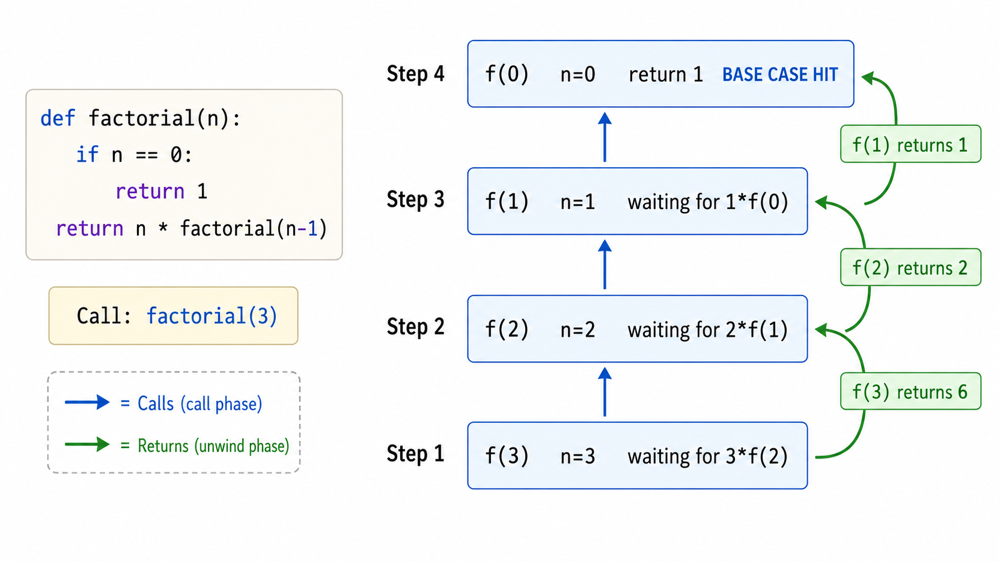
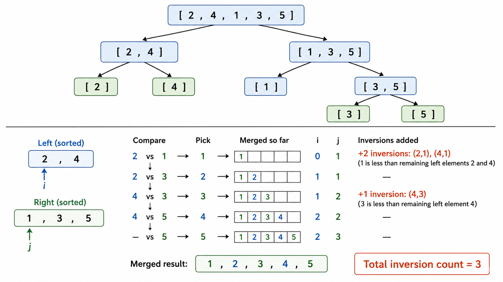
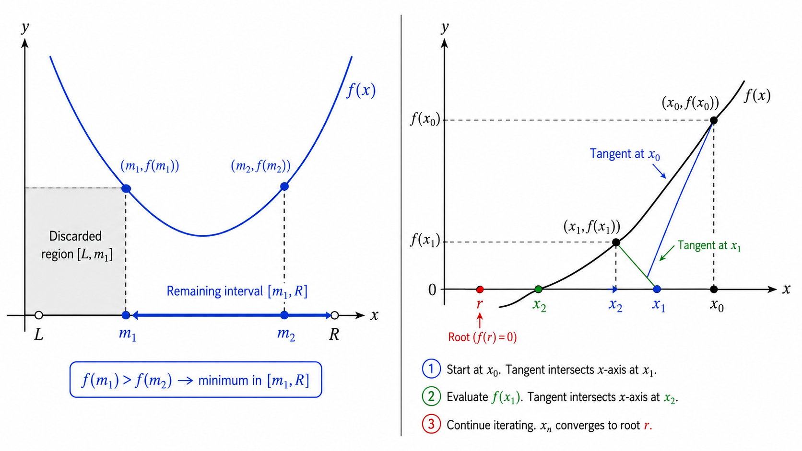

# algo10 递归、分治与二分

> [!WARNING]
> 🧪 Beta公测版本提示：教程主体已完成，正在优化细节，欢迎大家提Issue反馈问题或建议。


> "分而治之"——将复杂问题分解为同类子问题，再合并结果

---

## 一、递归：解决问题的思维方式

### 1.1 什么是递归？

**递归（Recursion）** 是一种通过**函数调用自身**来解决问题的方法。一个递归定义必须包含两个部分：

- **基线条件（Base Case）**：最简单的情况，可以直接给出答案，停止递归
- **递归条件（Recursive Case）**：将问题分解为一个或多个规模更小的同类子问题

$$
\text{递归函数} =
\begin{cases}
\text{基线条件的结果} & \text{if } n \text{ 足够小} \\
\text{基于 f(更小输入) 的计算} & \text{otherwise}
\end{cases}
$$

**经典例子**——阶乘：

$$
n! = \begin{cases} 1 & n = 0 \text{ (base case)} \\ n \times (n-1)! & n > 0 \text{ (recursive case)} \end{cases}
$$

```python
def factorial(n):
    if n == 0:          # 基线条件
        return 1
    return n * factorial(n - 1)  # 递归条件
```

### 1.2 调用栈可视化

当递归函数被调用时，每次递归调用都会在**调用栈（Call Stack）**上压入一个新的**栈帧（Stack Frame）**，栈帧中包含该次调用的局部变量和返回地址。

```
factorial(3) 调用的调用栈演变:
┌──────────┐  ┌──────────┐  ┌──────────┐  ┌──────────┐  ┌──────────┐
│ f(3)     │  │ f(2)     │  │ f(1)     │  │ f(0)     │  │          │
│ n=3      │  │ n=2      │  │ n=1      │  │ n=0      │  │          │
│ 待返回   │→ │ 待返回   │→ │ 待返回   │→ │ return 1 │→ │ 弹出栈帧  │
│ 3*f(2)  │  │ 2*f(1)   │  │ 1*f(0)   │  │          │  │          │
└──────────┘  └──────────┘  └──────────┘  └──────────┘  └──────────┘
    返回6          返回2          返回1

最终: factorial(3) = 3 × 2 × 1 × 1 = 6
```

> **关键认识**：递归的空间复杂度取决于调用栈的最大深度。`factorial(n)` 的栈深度为 $O(n)$。如果递归太深，会导致**栈溢出（Stack Overflow）**。这就是为什么很多递归算法在实际应用中会被转换为迭代形式（**尾递归优化**可以将栈空间从 $O(n)$ 优化到 $O(1)$，但 Python 不支持尾递归优化）。



---

## 二、分治法：递归的系统化框架

### 2.1 分治法的三个步骤

分治法（Divide and Conquer）将递归思想系统化为三个明确的阶段：

1. **分解（Divide）**：将原问题划分为 $k$ 个规模更小的同类子问题
2. **解决（Conquer）**：递归地求解每个子问题（直到子问题规模足够小，可以直接求解）
3. **合并（Combine）**：将子问题的解合并为原问题的解

$$
T(n) = a \cdot T\left(\frac{n}{b}\right) + f(n)
$$

其中 $a$ 是子问题的个数，$n/b$ 是每个子问题的规模，$f(n)$ 是分解和合并的开销。

### 2.2 主定理（Master Theorem）快速判断

对于 $T(n) = aT(n/b) + f(n)$，其中 $f(n) = \Theta(n^c)$：

- 若 $c < \log_b a$：$T(n) = \Theta(n^{\log_b a})$
- 若 $c = \log_b a$：$T(n) = \Theta(n^c \log n)$
- 若 $c > \log_b a$：$T(n) = \Theta(f(n))$

---

## 三、归并排序与逆序对计数

### 3.1 Merge Sort：分治法的教科书案例

归并排序是分治思想的完美体现：

1. **分解**：将数组从中间分成两半
2. **解决**：递归地对左右两半分别排序
3. **合并**：将两个有序子数组合并为一个有序数组

$$
T(n) = 2T\left(\frac{n}{2}\right) + O(n) \quad\Rightarrow\quad T(n) = O(n \log n)
$$

**合并（Merge）操作是核心**：用两个指针分别遍历左右两个有序子数组，每次将较小的元素放入结果数组。

**归并排序的性质**：
- 稳定排序：相等元素的相对顺序不变
- 非原地排序：需要 $O(n)$ 额外空间
- 最坏/平均/最好 时间复杂度均为 $O(n \log n)$

### 3.2 逆序对计数（Counting Inversions）

**逆序对（Inversion）**：在数组 $A$ 中，若 $i < j$ 但 $A[i] > A[j]$，则称 $(i, j)$ 是一个逆序对。逆序对的数量衡量了数组的"无序程度"。

**分治法求解**：逆序对分为三类——全在左半边、全在右半边、横跨左右。可以在归并排序的合并过程中顺便统计第三类逆序对：

$$
\text{总逆序对} = \text{左半边逆序对} + \text{右半边逆序对} + \text{横跨逆序对}
$$

合并时：当右半边的某元素被放入结果数组时，左半边剩余的所有元素都比它大，因此形成了若干个逆序对。每次放入右半边元素时，累加左半边剩余元素的数量即可。



---

## 四、快速排序

### 4.1 基本思想

快速排序也是分治，但它绝大多部分工作在**分解阶段**完成：

1. **选择基准（Pivot）**
2. **划分（Partition）**：将小于 pivot 的元素移到左边，大于 pivot 的移到右边
3. **递归**：对左右两部分分别快排

```python
def quicksort(arr, lo, hi):
    if lo >= hi:
        return
    p = partition(arr, lo, hi)  # 划分，返回 pivot 的最终位置
    quicksort(arr, lo, p - 1)
    quicksort(arr, p + 1, hi)
```

### 4.2 划分方案

- **Lomuto 方案**：以最后一个元素为 pivot，维护一个"小元素边界"指针
- **Hoare 方案**：从两端向中间扫描，交换不满足条件的元素（效率更高，但 pivot 不一定在最终位置）

### 4.3 复杂度与随机化

- **最坏情况**：每次选到最小/最大元素 → 划分极不平衡 → $O(n^2)$
- **最好/期望情况**：每次划分均匀 → $O(n \log n)$
- **随机化快排**：随机选择 pivot → 期望复杂度 $O(n \log n)$，避免对抗性输入

### 4.4 快速排序 vs 归并排序

| 特性 | 归并排序 | 快速排序 |
|------|---------|---------|
| 策略 | 先分治，再合并 | 先划分，再分治 |
| 最坏复杂度 | $O(n \log n)$ | $O(n^2)$ |
| 平均复杂度 | $O(n \log n)$ | $O(n \log n)$ |
| 空间复杂度 | $O(n)$（辅助数组） | $O(\log n)$（调用栈） |
| 稳定性 | 稳定 | 不稳定 |
| 缓存性能 | 较差 | 优秀 |

---

## 五、二分搜索：分治的最简形式

### 5.1 标准二分搜索

在**有序数组**中查找目标值，每次将搜索范围减半：

```python
def binary_search(arr, target):
    lo, hi = 0, len(arr) - 1
    while lo <= hi:
        mid = (lo + hi) // 2
        if arr[mid] == target:
            return mid
        elif arr[mid] < target:
            lo = mid + 1
        else:
            hi = mid - 1
    return -1  # 未找到
```

**复杂度**：$O(\log n)$。每次比较将搜索空间减半。

### 5.2 二分搜索的变体

| 变体 | 描述 | 应用场景 |
|------|------|---------|
| **Lower Bound** | 第一个 $\geq x$ 的位置 | 插入位置 |
| **Upper Bound** | 第一个 $> x$ 的位置 | 区间计数 |
| **Equal Range** | $x$ 的起止范围 | 统计出现次数 |

**Lower Bound 实现**：

```python
def lower_bound(arr, x):
    lo, hi = 0, len(arr)  # hi 初始化为 len(arr) 而非 len(arr)-1
    while lo < hi:
        mid = (lo + hi) // 2
        if arr[mid] < x:
            lo = mid + 1
        else:
            hi = mid
    return lo  # 第一个 >= x 的位置
```

### 5.3 二分答案（Binary Search on Answer）

当答案具有**单调性**时，可以对答案空间二分搜索：

- 例：求 $x^3 = 27$ 的解 → 在 $[0, 10]$ 上二分搜索 $x$
- 例：最大化最小值 / 最小化最大值问题

---

## 六、三分搜索与牛顿法

### 6.1 三分搜索（Ternary Search）

用于寻找**单峰函数（Unimodal Function）**的极值点。每次取两个分点 $m_1$ 和 $m_2$：

- 若 $f(m_1) < f(m_2)$，极值在 $[m_1, R]$
- 若 $f(m_1) > f(m_2)$，极值在 $[L, m_2]$
- 若 $f(m_1) = f(m_2)$，极值在 $[m_1, m_2]$

每次迭代搜索范围缩至原来的 $\frac{2}{3}$。$O(\log n)$ 次迭代即可达到高精度。

### 6.2 牛顿迭代法（Newton's Method）

用于求解方程 $f(x) = 0$ 的近似根。迭代公式：

$$
x_{n+1} = x_n - \frac{f(x_n)}{f'(x_n)}
$$

**几何直觉**：在 $(x_n, f(x_n))$ 处作切线，切线与 $x$ 轴的交点即为 $x_{n+1}$。

牛顿法具有**二次收敛速度**：每次迭代有效数字大约翻倍。但需要 $f'(x) \neq 0$ 且初始猜测足够接近真实根。



---

## 本章总结

| 概念 | 一句话 |
|------|--------|
| 递归 | 函数调用自身，必须有基线条件和递归条件 |
| 调用栈 | 栈帧层层堆叠，深度决定空间复杂度 |
| 分治三步骤 | 分解 → 解决 → 合并 |
| 主定理 | 快速判断分治递归式的时间复杂度 |
| 归并排序 | 分治排序典范，$O(n \log n)$ 且稳定 |
| 逆序对计数 | 在归并过程中顺便统计，$O(n \log n)$ |
| 快速排序 | 先划分再递归，随机化保证期望 $O(n \log n)$ |
| 二分搜索 | 在有序数组中 $O(\log n)$ 查找 |
| 二分答案 | 对答案空间二分，需单调性 |
| 三分搜索 | 单峰函数极值搜索 |
| 牛顿法 | 切线迭代求根，二次收敛 |

> 分治法的本质是**结构化递归**。当你面对一个问题时，问自己：能否将输入分成两半？子问题的解能否合并？如果都是肯定的，分治法很可能就是答案。归并排序、快速排序、二分搜索、逆序对计数——它们共同的内核都是"分而治之"。

---

## 📥 Code

| File | View | Download |
|------|------|----------|
| demo.py | [Open](./code-demo) | <a href="../code/algo10_divide_conquer/demo.py" target="_blank" download>Download</a> |
| exercise.py | [Open](./code-exercise) | <a href="../code/algo10_divide_conquer/exercise.py" target="_blank" download>Download</a> |

## 参考

1. Cormen, T. H. et al. (2009). *Introduction to Algorithms* (3rd ed.). MIT Press. Chapters 2, 4, 7.
2. Hoare, C. A. R. (1962). Quicksort. *The Computer Journal*, 5(1), 10-16.
3. Knuth, D. E. (1998). *The Art of Computer Programming, Vol. 3: Sorting and Searching* (2nd ed.). Addison-Wesley.
