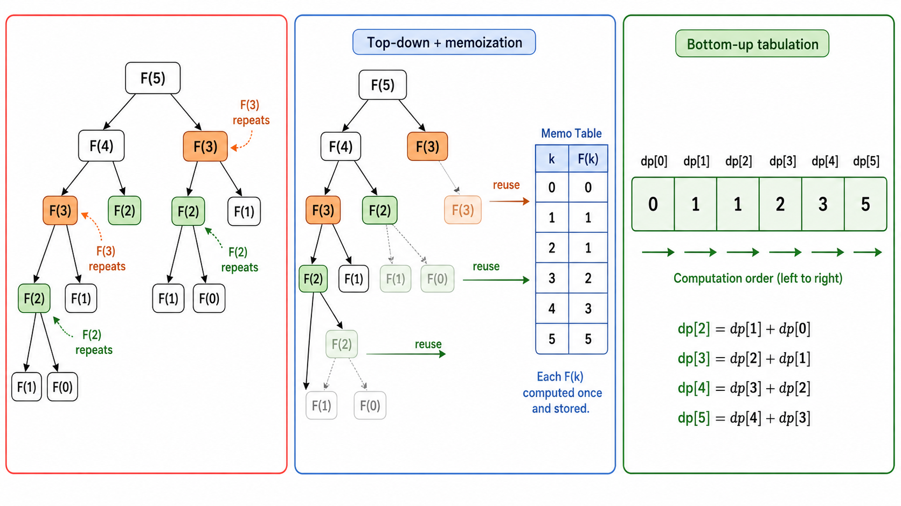

# algo11 动态规划（上）

> 把大问题拆成小问题，记住每一步的答案——重叠子问题与最优子结构的力量

---

## 一、动态规划的核心思想

### 1.1 什么是动态规划？

**动态规划（Dynamic Programming, DP）** 是一种通过将问题分解为**重叠的子问题**并存储子问题的解来避免重复计算的方法。它适用于具有**最优子结构**的优化问题。

DP 的"动态"一词并非指程序运行时动态分配内存，而是来源于 Richard Bellman 在 1950 年代的命名——"dynamic"强调问题的时间阶段性，"programming"是"规划"之意（非编程）。

### 1.2 两个核心性质

**性质一：最优子结构（Optimal Substructure）**
：问题的最优解包含了其子问题的最优解。换言之，可以由子问题的最优解"组合"出原问题的最优解。

**性质二：重叠子问题（Overlapping Subproblems）**
：问题的递归求解过程中，同一个子问题会被多次重复计算。DP 通过**记忆化（Memoization）**或**制表（Tabulation）**来避免这种重复。

> **贪心 vs 分治 vs DP**：贪心每次只做一个选择并缩减为一个子问题；分治将问题分解为**互不相交**的子问题；DP 处理的子问题是**高度重叠**的——这正是 DP 相对于分治的优势场景。



### 1.3 两种实现方式

| 方式 | 方向 | 数据结构 | 实现方式 |
|------|------|---------|---------|
| **Top-Down (Memoization)** | 从大到小 | 递归 + HashMap/数组 | 先查表，未计算则递归并存储 |
| **Bottom-Up (Tabulation)** | 从小到大 | 迭代 + 数组/矩阵 | 按依赖顺序填充 DP 表 |

**Top-Down 示例**（斐波那契数列）：
```python
memo = {}
def fib(n):
    if n <= 1: return n          # 基线条件
    if n not in memo:            # 查备忘录
        memo[n] = fib(n-1) + fib(n-2)  # 计算并存储
    return memo[n]
```

**Bottom-Up 示例**：
```python
def fib(n):
    if n <= 1: return n
    dp = [0] * (n + 1)
    dp[1] = 1
    for i in range(2, n + 1):
        dp[i] = dp[i-1] + dp[i-2]  # 按依赖顺序迭代
    return dp[n]
```

---

## 二、DP 设计方法论

### 2.1 五步法设计 DP

1. **定义状态**：明确 `dp[i]` 或 `dp[i][j]` 表示什么
2. **建立状态转移方程**：当前状态如何由更小的状态推导
3. **确定初始条件（Base Case）**：最小的子问题直接给出答案
4. **确定计算顺序**：保证计算 dp[i] 时依赖的子问题已计算完毕
5. **提取最终答案**：`dp[n]` 或 `max(dp[i])` 等

### 2.2 状态定义的常见模式

| 问题类型 | 状态定义 | 举例 |
|---------|---------|------|
| 一维 DP | `dp[i]`：前 i 个元素的最优解 | LIS, Coin Change |
| 二维 DP | `dp[i][j]`：考虑前 i 个元素，容量/限制为 j | 0-1 背包, Edit Distance |
| 二维串 DP | `dp[i][j]`：第一个串前 i 个字符与第二个串前 j 个字符 | LCS, Edit Distance |

---

## 三、0-1 背包问题

### 3.1 问题定义

有 $n$ 件物品，物品 $i$ 重量为 $w_i$，价值为 $v_i$。背包容量为 $W$。每件物品只能选或不选（不能分割）。求最大总价值。

### 3.2 DP 推导

**状态定义**：$dp[i][j]$ = 考虑前 $i$ 件物品，背包容量为 $j$ 时的最大价值。

**转移方程**：
$$
dp[i][j] = \max\begin{cases}
dp[i-1][j] & \text{不选第 i 件} \\
dp[i-1][j-w_i] + v_i & \text{选第 i 件（需 } j \geq w_i\text{）}
\end{cases}
$$

**初始条件**：$dp[0][j] = 0$（0 件物品，价值为 0），$dp[i][0] = 0$（容量为 0，价值为 0）。

**复杂度**：$O(nW)$ 时间，$O(nW)$ 空间（可优化至 $O(W)$ 用滚动数组）。

### 3.3 空间优化

由于 $dp[i][j]$ 只依赖 $dp[i-1][\cdot]$，我们可以将二维数组压缩为一维：

```python
dp = [0] * (W + 1)
for i in range(1, n + 1):
    for j in range(W, w[i-1] - 1, -1):  # 注意：必须从大到小遍历！
        dp[j] = max(dp[j], dp[j - w[i-1]] + v[i-1])
```

**为什么 j 要逆序？** 因为 $dp[j-w_i]$ 必须来自上一行（$dp[i-1]$）。如果正序，$dp[j-w_i]$ 可能已被当前行更新过（相当于物品被多次选取），就退化为完全背包了。

### 3.4 0-1 背包的变体

| 变体 | 问题 | DP 调整 |
|------|------|--------|
| **子集和（Subset Sum）** | 能否选出一些数使其和为 target？ | $dp[i][j]$ = 前 i 个能否凑出 j（bool） |
| **等分划（Partition）** | 能否将数组分成和相等的两半？ | target = sum/2，调用子集和 |
| **目标和（Target Sum）** | 给每个数赋 ± 号，使表达式值为 target | 转换为子集和：sum(P) = (target+sum)/2 |

![0-1背包DP表可视化：一个(n+1)×(W+1)的表格，横轴为容量0到W，纵轴为物品0到n。每个单元格标注dp[i][j]的值，用红色箭头标注当前格是如何由dp[i-1][j]和dp[i-1][j-w_i]+v_i推导的。从(0,0)到(n,W)的最优路径用高亮标出。](./images/algo11-02-knapsack-dp-table.png)

---

## 四、最长公共子序列（LCS）

### 4.1 问题定义

给定两个序列 $A$ 和 $B$，求它们的最长公共子序列（LCS）。子序列不要求连续，但要求保持原顺序。

例：$A = \text{"ABCDAB"}$，$B = \text{"BDCABA"}$，LCS = "BDAB" 或 "BCAB"（长度 4）。

### 4.2 DP 推导

**状态定义**：$dp[i][j]$ = $A[0..i-1]$ 和 $B[0..j-1]$ 的 LCS 长度。

**转移方程**：
$$
dp[i][j] = \begin{cases}
dp[i-1][j-1] + 1 & \text{if } A[i-1] = B[j-1] \\
\max(dp[i-1][j], dp[i][j-1]) & \text{otherwise}
\end{cases}
$$

**复杂度**：$O(mn)$。

**回溯 LCS 字符串**：从 $dp[m][n]$ 出发，若 $A[i-1] = B[j-1]$ 则该字符属于 LCS，向上左移动；否则向 dp 值较大的一方移动。

---

## 五、最长递增子序列（LIS）

### 5.1 问题与两种解法

**问题**：在数组 $A$ 中找出最长的严格递增（不一定连续）的子序列。

**DP 解法（$O(n^2)$）**：
- 状态：$dp[i]$ = 以 $A[i]$ 结尾的最长递增子序列长度
- 转移：$dp[i] = \max_{j < i, A[j] < A[i]}\{dp[j] + 1\}$
- 初始：$dp[i] = 1$（每个元素自身构成长度为 1 的 LIS）

**贪心 + 二分解法（$O(n \log n)$）**（Patience Sorting）：
维护一个数组 `tails`，`tails[k]` 表示长度为 $k+1$ 的递增子序列的最小末尾值。对每个 $A[i]$，二分查找到 tails 中第一个 $\geq A[i]$ 的位置并替换。最终 tails 的长度即为 LIS 长度。

```
示例: A = [10, 9, 2, 5, 3, 7, 101, 18]
tails 演变:
[10] → [9] → [2] → [2,5] → [2,3] → [2,3,7] → [2,3,7,101] → [2,3,7,18]
LIS 长度 = 4，序列为 [2, 3, 7, 101]（或 [2, 3, 7, 18]）
```

---

## 六、编辑距离（Levenshtein Distance）

### 6.1 问题定义

给定两个字符串 $S$ 和 $T$，求将 $S$ 变为 $T$ 所需的最少编辑操作次数。允许的操作：**插入、删除、替换**。

### 6.2 DP 推导

**状态定义**：$dp[i][j]$ = 将 $S[0..i-1]$ 转换为 $T[0..j-1]$ 的最少操作数。

**转移方程**：
$$
dp[i][j] = \begin{cases}
dp[i-1][j-1] & \text{if } S[i-1] = T[j-1] \text{ (字符相同，无需操作)} \\
1 + \min\begin{cases}
dp[i-1][j] & \text{删除 S[i-1]} \\
dp[i][j-1] & \text{插入 T[j-1]} \\
dp[i-1][j-1] & \text{替换 S[i-1] → T[j-1]}
\end{cases}
\end{cases}
$$

**初始条件**：$dp[i][0] = i$（删除所有 S 字符），$dp[0][j] = j$（插入所有 T 字符）。

**示例**：S = "horse"，T = "ros"。

|   |   | r | o | s |
|---|---|---|---|---|
|   | 0 | 1 | 2 | 3 |
| h | 1 | 1 | 2 | 3 |
| o | 2 | 2 | 1 | 2 |
| r | 3 | 2 | 2 | 2 |
| s | 4 | 3 | 3 | 2 |
| e | 5 | 4 | 4 | 3 |

编辑距离 = $dp[5][3] = 3$（操作：h→r替换，删除r，e→s替换）。

---

## 七、找零问题（最少硬币数）

### 7.1 问题与 DP 解法

给定面额集合 $C$ 和目标金额 $A$，求最少硬币数（每种硬币无限量）。

**状态定义**：$dp[i]$ = 凑出金额 $i$ 所需的最少硬币数。

**转移方程**：
$$
dp[i] = \min_{c \in C, i \geq c} \{ dp[i - c] + 1 \}
$$

**初始**：$dp[0] = 0$，$dp[i] = \infty$（初始化为不可达）。

**复杂度**：$O(A \cdot |C|)$。

---

## 本章总结

| 概念 | 一句话 |
|------|--------|
| DP 核心 | 分解为重叠子问题，存储子问题解避免重复计算 |
| 最优子结构 | 最优解由子问题的最优解构成 |
| 重叠子问题 | 同一子问题被多次计算 |
| Top-Down | 递归 + 记忆化，从大问题往下分解 |
| Bottom-Up | 迭代 + 制表，从小问题往上构建 |
| 0-1 背包 | dp[i][j] = max(不选, 选)，空间优化需逆序 |
| LCS | 两串匹配则斜对角 +1，否则取两边最大值 |
| LIS | dp[i] 以 A[i] 结尾，O(n log n) 用 Patience Sorting |
| 编辑距离 | 插入/删除/替换三种操作取 min |
| 找零 (DP) | dp[i] = min(dp[i-c] + 1)，任意面额系统正确 |

> DP 是算法竞赛中最重要、变体最多的类别之一。掌握五步设计法——定义状态、建立转移、确定初始、确定顺序、提取答案——你就可以应对绝大多数 DP 问题。下一节我们将进入更高级的 DP 主题：区间 DP、树形 DP、状态压缩 DP。

---

## 📥 Code

| File | View | Download |
|------|------|----------|
| demo.py | [Open](./code-demo) | <a href="../code/algo11_dp_1/demo.py" target="_blank" download>Download</a> |
| exercise.py | [Open](./code-exercise) | <a href="../code/algo11_dp_1/exercise.py" target="_blank" download>Download</a> |

## 参考

1. Bellman, R. (1957). *Dynamic Programming*. Princeton University Press.
2. Cormen, T. H. et al. (2009). *Introduction to Algorithms* (3rd ed.). MIT Press. Chapter 15: Dynamic Programming.
3. Levenshtein, V. I. (1966). Binary codes capable of correcting deletions, insertions, and reversals. *Soviet Physics Doklady*, 10(8), 707-710.
