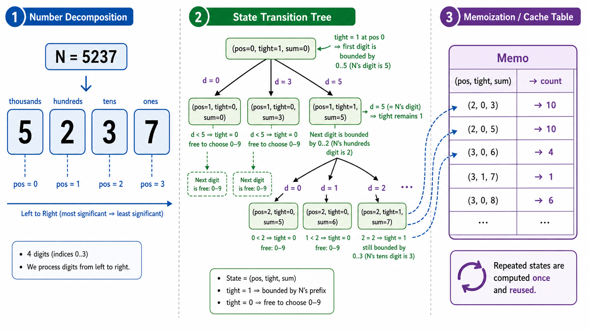

# algo12 动态规划（下）

> 进阶 DP 专题——区间 DP、树形 DP、状态压缩 DP、数位 DP 与优化入门

---

## 一、区间 DP

### 1.1 核心思想

**区间 DP** 处理的是定义在区间 $[l, r]$ 上的最优子结构问题。其典型特征是：大区间的最优解由小区间的最优解合并而来。

$$
dp[l][r] = \text{某个合并规则}\left(\bigcup_{\substack{k: l \leq k < r}} \text{由 dp[l][k] 和 dp[k+1][r] 合并}\right)
$$

**通用模板**：
```python
# 按区间长度递增枚举
for length in range(2, n + 1):         # 枚举区间长度
    for l in range(0, n - length + 1): # 枚举左端点
        r = l + length - 1              # 计算右端点
        for k in range(l, r):           # 枚举分割点
            dp[l][r] = merge(dp[l][k], dp[k+1][r])
```

### 1.2 矩阵链乘法（Matrix Chain Multiplication）

**问题**：给定 $n$ 个矩阵的维度序列 $p_0, p_1, \dots, p_n$（矩阵 $A_i$ 的维度为 $p_{i-1} \times p_i$），求最少标量乘法次数。

**状态**：$dp[i][j]$ = 计算 $A_i A_{i+1} \dots A_j$ 的最少乘法次数。

**转移**：
$$
dp[i][j] = \min_{i \leq k < j} \{ dp[i][k] + dp[k+1][j] + p_{i-1} \cdot p_k \cdot p_j \}
$$

其中 $p_{i-1} \cdot p_k \cdot p_j$ 是合并两个子结果所需的乘法次数。

**复杂度**：$O(n^3)$。

### 1.3 石子合并问题

**问题**：$n$ 堆石子排成一行，每堆有 $a_i$ 个。每次合并相邻的两堆，代价为两堆之和。求将所有石子合并为一堆的最小总代价。

**状态**：$dp[i][j]$ = 合并第 $i$ 到第 $j$ 堆的最小代价。

**转移**：
$$
dp[i][j] = \min_{i \leq k < j} \{ dp[i][k] + dp[k+1][j] \} + \sum_{t=i}^{j} a_t
$$

前缀和 $sum[j] - sum[i-1]$ 可 $O(1)$ 计算区间总和。

### 1.4 最优二叉搜索树（Optimal BST）

给定 $n$ 个有序键和它们的搜索频率（以及虚键的频率），构建一棵期望搜索代价最小的 BST。$dp[i][j]$ 表示由键 $i$ 到 $j$ 构成的最优 BST 的期望代价。这是一个经典的区间 DP 应用。

![区间DP示意图：左侧展示矩阵链乘法的括号化过程——[A1 A2 A3] 可以被拆分为 (A1)(A2 A3) 或 (A1 A2)(A3)；中间展示石子合并的区间合并过程——3堆{4,3,2}先合并{3,2}成5，再与4合并；右侧展示DP表填充顺序——对角线到右上角](./images/algo12-01-interval-dp.png)

---

## 二、树形 DP

### 2.1 树形 DP 的特点

树形 DP 将 DP 定义在**树的节点**上，利用树的后序遍历（先子节点后父节点）来保证计算顺序。通用模式：

```python
def dfs(u, parent):
    for v in adj[u]:
        if v != parent:
            dfs(v, u)  # 先计算子节点
            # 用子节点的 dp 值更新父节点的 dp 值
```

### 2.2 树的最大独立集

**问题**：在树中选出尽可能多的节点，使得任意两个选中的节点不相邻。

**状态**：
- $dp[u][0]$：不选节点 $u$ 时，以 $u$ 为根的子树能选的最大节点数
- $dp[u][1]$：选节点 $u$ 时，以 $u$ 为根的子树能选的最大节点数

**转移**：
$$
\begin{aligned}
dp[u][1] &= 1 + \sum_{v \in \text{children}(u)} dp[v][0] \quad (\text{选了 u，子节点不能选})\\
dp[u][0] &= \sum_{v \in \text{children}(u)} \max(dp[v][0], dp[v][1]) \quad (\text{不选 u，子节点可选可不选})
\end{aligned}
$$

### 2.3 树的直径

**树的直径（Diameter）**：树中任意两点间最长简单路径的长度（边数或边权和）。

**解法一（双 DFS/BFS）**：从任意点出发找到最远点 $A$，再从 $A$ 出发找到最远点 $B$，$A-B$ 即为直径。

**解法二（树形 DP）**：
- 对于节点 $u$，维护以 $u$ 为根的子树中，从 $u$ 向下延伸的最长路径 `max_depth[u]`
- 对于每个节点 $u$，以其为"最高点"的直径候选为 `depth1 + depth2`（两条最长向下路径之和）
- 全局直径 = $\max_u$（过 $u$ 的直径候选）

### 2.4 树上的背包

将 0-1 背包的思想放到树上：每个节点是一件物品，选了子节点才能选父节点（依赖关系）。DFS 遍历时，在每个节点上做一次"分组背包"合并子树的 DP 值。

![树形DP示意图：左侧为一棵树，节点标注编号；中间展示后序遍历顺序（箭头从子节点指向父节点）；右侧展示dp[u][0]和dp[u][1]的计算示例——红色节点表示"被选中"，绿色节点表示"未选中"，最大独立集大小用数字标注在根节点旁](./images/algo12-02-tree-dp.png)

---

## 三、状态压缩 DP

### 3.1 核心思想

当问题的状态空间较小（通常 $n \leq 20$），可以用**二进制位**来表示集合的选中状态。状态压缩 DP 将集合操作转化为位运算。

### 3.2 旅行商问题（TSP: Held-Karp 算法）

**问题**：给定 $n$ 个城市和它们之间的距离矩阵，从城市 0 出发，访问所有城市恰好一次后返回起点，求最短路径长度。

**状态**：$dp[mask][i]$ = 当前已访问的城市集合为 `mask`，最后访问的城市是 $i$ 时的最短路径长度。

**转移**：
$$
dp[mask][i] = \min_{j \in mask, j \neq i} \{ dp[mask \setminus \{i\}][j] + dist[j][i] \}
$$

其中 `mask \ {i}` 表示从 mask 中移除城市 $i$。

**复杂度**：$O(n^2 \cdot 2^n)$。对 $n \leq 20$ 可行（$20^2 \cdot 2^{20} \approx 4 \times 10^8$）。

### 3.3 位运算速查

| 操作 | 含义 | 代码 |
|------|------|------|
| 检查第 k 位 | i 是否在 mask 中 | `(mask >> k) & 1` |
| 设置第 k 位 | 将 i 加入 mask | `mask \| (1 << k)` |
| 清除第 k 位 | 将 i 从 mask 中移除 | `mask & ~(1 << k)` |
| 遍历所有子集 | 枚举 mask 的所有子集 | `sub = (sub - 1) & mask` |
| 集合大小 | mask 中 1 的个数 | `bin(mask).count('1')` |

---

## 四、数位 DP

### 4.1 核心思想

**数位 DP** 用于统计在区间 $[L, R]$ 内满足某些数字性质的数的个数（或和）。其核心技巧是**按位枚举数字**，并用状态记录前缀信息。

### 4.2 通用框架

统计 $[L, R]$ 内满足条件的数的个数时，通常转化为：
$$
\text{count}(R) - \text{count}(L-1)
$$

然后对单个上界 $N$，从高位到低位逐位枚举：

```python
def count_up_to(N):
    # 将 N 转为字符串，方便逐位处理
    digits = list(map(int, str(N)))
    # dp[pos][tight][...状态...]
    # pos: 当前处理到第几位
    # tight: 是否受上界 N 的约束（tight=1 表示当前前缀等于 N 的前缀）
```

### 4.3 经典问题：统计不含 4 的数字个数

统计 $[1, N]$ 中不包含数字 4 的数的个数。状态只需记录：
- `pos`：当前位
- `tight`：是否紧贴上限
- （无需额外状态，因为只检查是否出现 4）

### 4.4 经典问题：数字和

统计 $[L, R]$ 中所有数的**各位数字之和**。需要额外状态记录前 `pos` 位的数字和。



---

## 五、DP 优化入门（概念介绍）

### 5.1 凸包技巧（Convex Hull Trick, CHT）

对于形如 $dp[i] = \min_{j < i}\{ m_j \cdot x_i + c_j \}$ 的 DP 转移（其中 $m_j$ 单调），可以用维护下凸包 + 二分/双指针来将转移从 $O(n)$ 优化到 $O(\log n)$ 或 $O(1)$。

**适用范围**：斜率单调的 DP 转移（如 1D/1D DP 的分治优化）。

### 5.2 分治优化

对于转移形式 $dp[i] = \min_{j < i}\{ dp[j] + cost(j, i) \}$，如果 $cost(j, i)$ 满足**四边形不等式**（Quadrangle Inequality），则决策点 $opt[i]$ 单调——可以使用分治法在 $O(n \log n)$ 内完成。

### 5.3 四边形不等式（概念）

若成本函数 $w(a, c) + w(b, d) \leq w(a, d) + w(b, c)$（$a < b < c < d$），则区间 DP 的决策点也单调——可以将 $O(n^3)$ 的区间 DP 优化到 $O(n^2)$。

---

## 本章总结

| 概念 | 一句话 |
|------|--------|
| 区间 DP | 按区间长度递增，枚举分割点，状态 $O(n^2)$ 转移 $O(n)$ |
| 矩阵链乘法 | $dp[i][j] = \min_k(dp[i][k]+dp[k+1][j]+p_{i-1}p_k p_j)$ |
| 树形 DP | 后序遍历，子节点结果聚合成父节点 |
| 最大独立集 | $dp[u][1] = 1+\sum dp[v][0]$, $dp[u][0] = \sum \max(dp[v][0], dp[v][1])$ |
| 树直径 | 最长向下路径 + 次长向下路径 |
| 状态压缩 DP | 用二进制位表示集合，$O(n^2 2^n)$ 解决 TSP |
| 数位 DP | 逐位枚举 + 记忆化搜索，统计 $[L,R]$ 内满足性质的数 |
| CHT / 斜率优化 | 将特定形式 DP 从 $O(n^2)$ 优化到 $O(n \log n)$ |

> 区间 DP、树形 DP、状态压缩 DP 和数位 DP 各有其独特的适用场景和设计模板。掌握它们的关键是识别问题的**结构性特征**——区间合并？树的后序遍历？集合的二进制表示？数字的逐位枚举？——一旦匹配到合适的模板，剩下的就是填表的"体力活"了。

---

## 📥 Code

| File | View | Download |
|------|------|----------|
| demo.py | [Open](./code-demo) | <a href="../code/algo12_dp_2/demo.py" target="_blank" download>Download</a> |
| exercise.py | [Open](./code-exercise) | <a href="../code/algo12_dp_2/exercise.py" target="_blank" download>Download</a> |

## 参考

1. Cormen, T. H. et al. (2009). *Introduction to Algorithms* (3rd ed.). MIT Press. Chapter 15.
2. Held, M. & Karp, R. M. (1962). A dynamic programming approach to sequencing problems. *Journal of the Society for Industrial and Applied Mathematics*, 10(1), 196-210. [[doi:10.1137/0110015](https://doi.org/10.1137/0110015)]
3. Bellman, R. (1962). Dynamic programming treatment of the travelling salesman problem. *Journal of the ACM*, 9(1), 61-63.
