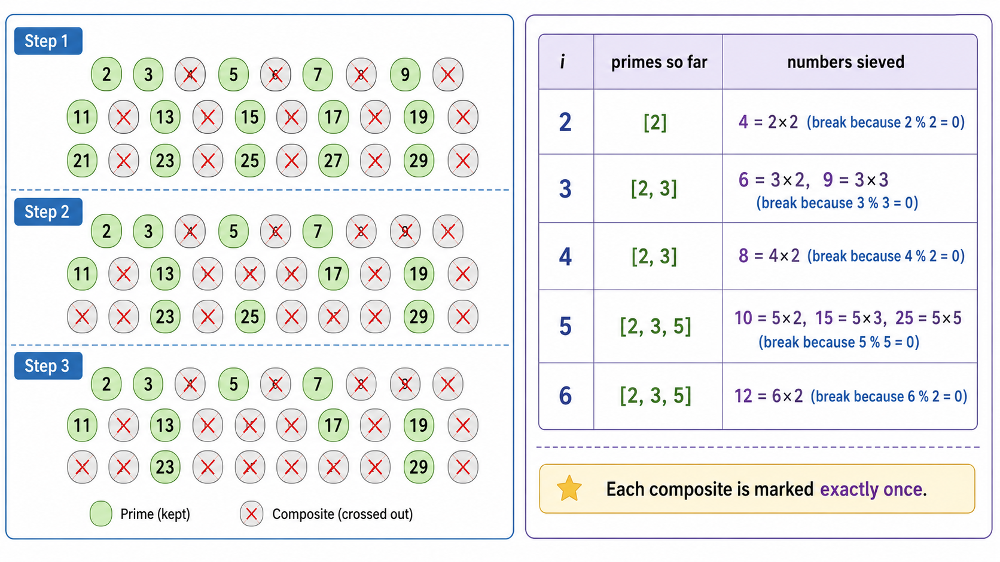

# algo15 数论与组合数学

> 模运算、素数筛、快速幂、最大公约数、组合数取模——算法竞赛中的数学工具箱

---

## 一、模运算（Modular Arithmetic）

### 1.1 基本运算

在模 $M$ 意义下，所有运算结果都取模：

$$
\begin{aligned}
(a + b) \bmod M &= ((a \bmod M) + (b \bmod M)) \bmod M \\
(a - b) \bmod M &= ((a \bmod M) - (b \bmod M) + M) \bmod M \\
(a \times b) \bmod M &= ((a \bmod M) \times (b \bmod M)) \bmod M
\end{aligned}
$$

**除法**需要特殊处理——用模逆元代替除法。

### 1.2 模逆元（Modular Inverse）

$a$ 在模 $M$ 下的**乘法逆元** $a^{-1}$ 满足 $a \cdot a^{-1} \equiv 1 \pmod{M}$。逆元存在的充要条件是 $\gcd(a, M) = 1$。

**三种求法**：

| 方法 | 条件 | 复杂度 |
|------|------|--------|
| **费马小定理** | $M$ 为质数 | $O(\log M)$ |
| **扩展欧几里得** | 任意 $M$（只要 $\gcd(a,M)=1$） | $O(\log \min(a,M))$ |
| **线性递推** | 批量求 $1$ 到 $n$ 的所有逆元 | $O(n)$ |

**费马小定理**（$M$ 为质数）：
$$
a^{-1} \equiv a^{M-2} \pmod{M}
$$

证明：$a^{M-1} \equiv 1 \pmod{M}$（费马小定理），两边同乘 $a^{-1}$。

### 1.3 中国剩余定理（CRT）

对于一组同余方程组：

$$
\begin{cases}
x \equiv a_1 \pmod{m_1} \\
x \equiv a_2 \pmod{m_2} \\
\cdots \\
x \equiv a_k \pmod{m_k}
\end{cases}
$$

其中 $m_i$ 两两互质，CRT 给出了在模 $M = \prod m_i$ 下的唯一解：

$$
x \equiv \sum_{i=1}^{k} a_i \cdot M_i \cdot M_i^{-1} \pmod{M}
$$

其中 $M_i = M / m_i$，$M_i^{-1}$ 是 $M_i$ 在模 $m_i$ 下的逆元。

---

## 二、快速幂与矩阵快速幂

### 2.1 二进制快速幂（Binary Exponentiation）

计算 $x^n \bmod M$ 可在 $O(\log n)$ 内完成：

```python
def fast_pow(x, n, mod):
    result = 1
    while n > 0:
        if n & 1:               # 当前二进制位为 1
            result = result * x % mod
        x = x * x % mod         # 平方
        n >>= 1                 # 右移一位
    return result
```

**原理**：将指数 $n$ 分解为二进制 $n = \sum b_i \cdot 2^i$，则 $x^n = \prod x^{b_i \cdot 2^i}$，而 $x^{2^i}$ 可以通过不断平方得到。

### 2.2 矩阵快速幂

快速幂的思想可以推广到矩阵。矩阵乘法的结合律使得 $A^n$ 也能在 $O(k^3 \log n)$ 内计算（$k$ 是矩阵维度）。

**经典应用**：斐波那契数列第 $n$ 项：

$$
\begin{bmatrix} F_{n} \\ F_{n-1} \end{bmatrix} =
\begin{bmatrix} 1 & 1 \\ 1 & 0 \end{bmatrix}^{n-1}
\begin{bmatrix} F_1 \\ F_0 \end{bmatrix}
$$

---

## 三、素数筛法

### 3.1 埃拉托色尼筛（Sieve of Eratosthenes）

筛选出 $1$ 到 $n$ 中的所有素数。核心思想：从 $2$ 开始，将每个素数的所有倍数标记为合数。

```python
def sieve(n):
    is_prime = [True] * (n + 1)
    is_prime[0] = is_prime[1] = False
    for i in range(2, int(n ** 0.5) + 1):
        if is_prime[i]:
            for j in range(i * i, n + 1, i):  # 从 i*i 开始，更小的已被筛过
                is_prime[j] = False
    return [i for i in range(n + 1) if is_prime[i]]
```

**复杂度**：$O(n \log \log n)$。虽然每个合数可能被多个素数标记，但总次数近似为调和级数。

### 3.2 欧拉线性筛（Euler's Linear Sieve）

保证**每个合数只被其最小质因子筛掉一次**，达到 $O(n)$：

```python
def linear_sieve(n):
    primes = []
    is_prime = [True] * (n + 1)
    for i in range(2, n + 1):
        if is_prime[i]:
            primes.append(i)
        for p in primes:
            if i * p > n: break
            is_prime[i * p] = False
            if i % p == 0: break  # 关键：保证每个合数只被最小质因子筛掉
    return primes
```

**关键行 `if i % p == 0: break`**：当 $p$ 是 $i$ 的最小质因子时，$i \cdot p$ 的最小质因子就是 $p$。继续用更大的 $p$ 筛 $i \cdot p$ 会用非最小质因子筛除——重复了。

---

## 四、最大公约数与扩展欧几里得

### 4.1 欧几里得算法（辗转相除法）

$$
\gcd(a, b) = \gcd(b, a \bmod b), \quad \gcd(a, 0) = a
$$

```python
def gcd(a, b):
    while b:
        a, b = b, a % b
    return a
```

**复杂度**：$O(\log \min(a, b))$。

### 4.2 扩展欧几里得算法

求解 $ax + by = \gcd(a, b)$ 的一组整数解 $(x, y)$：

```python
def ext_gcd(a, b):
    if b == 0:
        return a, 1, 0  # gcd, x, y
    g, x1, y1 = ext_gcd(b, a % b)
    x = y1
    y = x1 - (a // b) * y1
    return g, x, y
```

**应用**：求模逆元——解 $ax + My = 1$ 即可得 $a^{-1} \equiv x \pmod{M}$。

---

## 五、组合数学基础

### 5.1 排列与组合

- **排列** $P(n, k) = \frac{n!}{(n-k)!}$：有序选取 $k$ 个
- **组合** $C(n, k) = \binom{n}{k} = \frac{n!}{k!(n-k)!}$：无序选取 $k$ 个

### 5.2 二项式系数计算

**方法一：递推（Pascal's Triangle）**
$$
\binom{n}{k} = \binom{n-1}{k-1} + \binom{n-1}{k}
$$
适用于 $n \leq 2000$，预处理 $O(n^2)$，查询 $O(1)$。

**方法二：组合数公式 + 模逆元**
$$
\binom{n}{k} = \frac{n!}{k!(n-k)!} \bmod M
$$
预处理阶乘和逆阶乘，$O(n)$ 预处理，$O(1)$ 查询。需要 $M$ 为质数。

### 5.3 容斥原理

$$
|\bigcup_{i=1}^{n} A_i| = \sum_{i} |A_i| - \sum_{i<j} |A_i \cap A_j| + \sum_{i<j<k} |A_i \cap A_j \cap A_k| - \cdots + (-1)^{n+1} |A_1 \cap \cdots \cap A_n|
$$

**经典应用**：
- 1 到 $n$ 中与 $m$ 互质的数的个数
- 错位排列（Derangements）

### 5.4 错位排列

$n$ 个元素的排列中，没有元素出现在原位的排列数 $D_n$：

$$
D_n = n! \sum_{k=0}^{n} \frac{(-1)^k}{k!}
$$

递推：$D_1 = 0, D_2 = 1, D_n = (n-1)(D_{n-1} + D_{n-2})$。



---

## 六、概率基础

### 6.1 期望的线性性

**线性性质**：对于任意随机变量 $X_1, X_2, \dots, X_n$（即使不独立），都有：

$$
E\left[\sum_{i=1}^{n} X_i\right] = \sum_{i=1}^{n} E[X_i]
$$

这是概率论中最强大也最常用的性质之一。它允许将复杂期望分解为简单期望的和。

**经典应用**：掷 $n$ 个骰子，期望有几个 6？每个骰子出 6 的期望是 $1/6$，$n$ 个骰子期望有 $n/6$ 个 6。

---

## 本章总结

| 概念 | 公式/方法 | 复杂度 |
|------|----------|--------|
| 模运算 | 加减乘直接取模 | $O(1)$ |
| 模逆元（费马） | $a^{-1} \equiv a^{M-2}$ | $O(\log M)$ |
| 中国剩余定理 | $x \equiv \sum a_i M_i M_i^{-1}$ | $O(k \log M)$ |
| 快速幂 | 二进制分解 | $O(\log n)$ |
| 埃筛 | 标记倍数 | $O(n \log \log n)$ |
| 线性筛 | 最小质因子 | $O(n)$ |
| 欧几里得 | $\gcd(a,b)=\gcd(b,a\%b)$ | $O(\log \min(a,b))$ |
| 扩展欧几里得 | $ax+by=\gcd(a,b)$ | $O(\log \min(a,b))$ |
| 组合数 | 阶乘+逆元 或 Pascal 递推 | $O(1)$/$O(n^2)$ |
| 容斥原理 | 交集和并集转换 | 取决于项数 |
| 期望线性性 | $E[\sum X_i] = \sum E[X_i]$ | — |

---

## 📥 Code

| File | View | Download |
|------|------|----------|
| demo.py | [Open](./code-demo) | <a href="../code/algo15_number_theory/demo.py" target="_blank" download>Download</a> |
| exercise.py | [Open](./code-exercise) | <a href="../code/algo15_number_theory/exercise.py" target="_blank" download>Download</a> |

## 参考

1. Hardy, G. H. & Wright, E. M. (1979). *An Introduction to the Theory of Numbers* (5th ed.). Oxford University Press.
2. Knuth, D. E. (1997). *The Art of Computer Programming, Vol. 2: Seminumerical Algorithms* (3rd ed.). Addison-Wesley.
3. Euler, L. (1748). *Introductio in analysin infinitorum*. (线性筛以欧拉命名)
