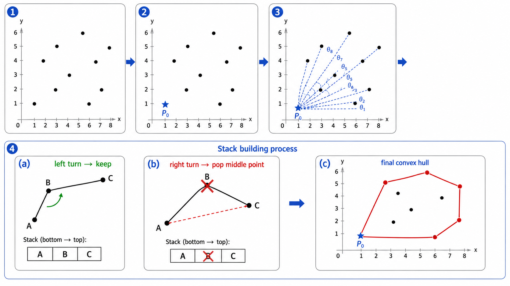
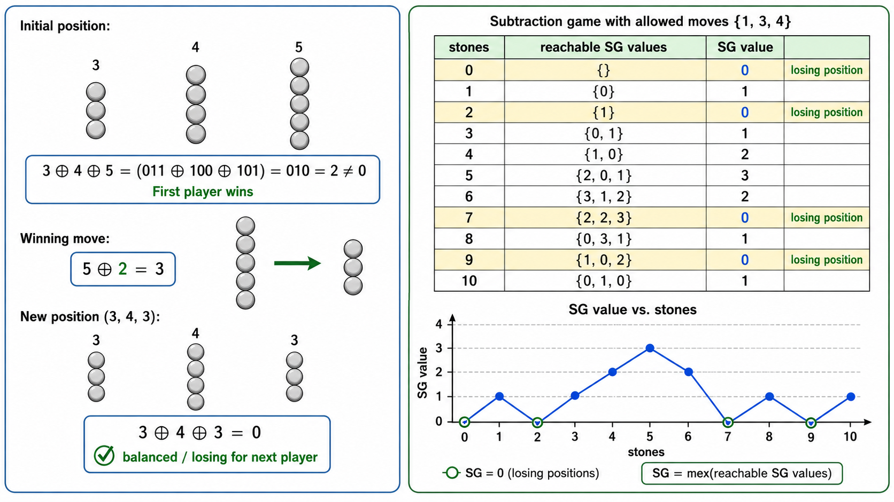

# algo16 计算几何与博弈论入门

> [!WARNING]
> 🧪 Beta公测版本提示：教程主体已完成，正在优化细节，欢迎大家提Issue反馈问题或建议。


> 向量叉积、凸包、最近点对、Nim 游戏与 SG 函数——几何直觉与博弈策略

---

## 一、计算几何基础

### 1.1 向量的叉积（Cross Product）

**叉积**是计算几何中最重要的操作。对于二维向量 $\vec{a} = (x_1, y_1)$ 和 $\vec{b} = (x_2, y_2)$：

$$
\vec{a} \times \vec{b} = x_1 y_2 - x_2 y_1
$$

**几何含义**：$|\vec{a} \times \vec{b}|$ 等于以 $\vec{a}$ 和 $\vec{b}$ 为邻边的平行四边形的**有向面积**。

**方向判断**（右手定则）：
- $\vec{a} \times \vec{b} > 0$：$\vec{b}$ 在 $\vec{a}$ 的**逆时针**方向（左转）
- $\vec{a} \times \vec{b} < 0$：$\vec{b}$ 在 $\vec{a}$ 的**顺时针**方向（右转）
- $\vec{a} \times \vec{b} = 0$：$\vec{a}$ 与 $\vec{b}$ **共线**

**用叉积判断三点朝向**：给定 $A, B, C$ 三点，向量 $\overrightarrow{AB} = (B_x - A_x, B_y - A_y)$，$\overrightarrow{AC} = (C_x - A_x, C_y - A_y)$：

$$
\text{cross}(A, B, C) = (B_x - A_x)(C_y - A_y) - (B_y - A_y)(C_x - A_x)
$$

- $> 0$：C 在 AB 的左侧（三点构成逆时针拐弯）
- $< 0$：C 在 AB 的右侧（三点构成顺时针拐弯）
- $= 0$：三点共线

### 1.2 向量的点积（Dot Product）

$$
\vec{a} \cdot \vec{b} = x_1 x_2 + y_1 y_2 = |\vec{a}| |\vec{b}| \cos\theta
$$

用于判断夹角、投影长度。

### 1.3 线段相交判断

两条线段 $P_1P_2$ 和 $Q_1Q_2$ 相交的条件：
1. **一般情况**：$P_1$ 和 $P_2$ 在 $Q_1Q_2$ 的两侧（即 `cross(Q1, Q2, P1)` 和 `cross(Q1, Q2, P2)` 符号相反）**且** $Q_1$ 和 $Q_2$ 在 $P_1P_2$ 的两侧
2. **边界情况**：共线时，还需检查投影区间是否重叠

### 1.4 点是否在多边形内（Ray Casting）

从待测点向右发射一条水平射线，统计与多边形边的交点数：
- 奇数：点在多边形内
- 偶数：点在多边形外

需特殊处理射线经过顶点的情况。

---

## 二、凸包（Convex Hull）

### 2.1 问题定义

给定平面上的 $n$ 个点，求一个**最小凸多边形**包含所有点。凸包上的点按逆时针顺序排列。

### 2.2 Graham Scan（$O(n \log n)$）

1. 找最左下角的点 $P_0$（y 最小，y 相同时 x 最小）
2. 按极角（关于 $P_0$）排序
3. 用栈维护凸包：依次加入点，若新加入的点与前两点构成"右转"（非凸），则弹出中间点

```python
def graham_scan(points):
    # 1. 找基准点（最左下）
    p0 = min(points, key=lambda p: (p[1], p[0]))
    # 2. 按极角排序
    points.sort(key=lambda p: (atan2(p[1]-p0[1], p[0]-p0[0]), dist(p, p0)))
    # 3. 栈构建凸包
    hull = [p0, points[0]]
    for p in points[1:]:
        while len(hull) >= 2 and cross(hull[-2], hull[-1], p) <= 0:
            hull.pop()  # 右转 → 弹出
        hull.append(p)
    return hull
```

### 2.3 Monotone Chain（Andrew's Algorithm）

Graham Scan 的替代方案：先按 x 坐标排序（x 相同按 y），分别构建上凸包和下凸包，然后合并。

---

## 三、最近点对（Closest Pair of Points）

### 3.1 分治法

**问题**：在平面上 $n$ 个点中找距离最近的一对点。

**分治策略**：
1. 按 x 坐标排序，从中线分为左右两半
2. 递归求左半和右半的最近距离 $d_L$ 和 $d_R$，令 $d = \min(d_L, d_R)$
3. 考虑横跨中线的点对：只检查 x 坐标距离中线 $\leq d$ 的"条带"内的点

对于条带内的点，按 y 坐标排序。对每个点，只需检查其上方至多 7 个后继点（可证明）。因此合并步骤的复杂度为 $O(n \log n)$（含排序）或 $O(n)$（通过预处理排序）。

**总复杂度**：$O(n \log^2 n)$ 或 $O(n \log n)$。



---

## 四、博弈论基础

### 4.1 公平组合游戏（Impartial Combinatorial Game）

**公平游戏**满足：双方可执行的操作集合完全相同，无隐藏信息，无随机因素。

### 4.2 Nim 游戏

**规则**：有 $n$ 堆石子，每堆有 $a_i$ 个。两人轮流取石子，每次可以从任意一堆中取走至少 1 个石子。取走最后一个石子者获胜。

**Bouton 定理（1901）**：
$$
\text{Nim 游戏先手必胜} \iff a_1 \oplus a_2 \oplus \cdots \oplus a_n \neq 0
$$

其中 $\oplus$ 表示 XOR（异或）。

**为什么 XOR？** 用归纳法证明：
- 终结状态（全 0）的 XOR 和为 0，为必败态
- 从 XOR 非 0 的状态，总能找到一步使得 XOR 变为 0
- 从 XOR 为 0 的状态，任何一步都会破坏 XOR=0 的性质

**获胜策略**：若 XOR = $k \neq 0$，找到 $a_i$ 使得 $a_i \oplus k < a_i$（这样的 $a_i$ 一定存在），将该堆减少为 $a_i \oplus k$。

### 4.3 Sprague-Grundy 定理

**mex（Minimum EXcluded）函数**：
$$
\text{mex}(S) = \min\{k \geq 0 \mid k \notin S\}
$$
即集合 $S$ 中未出现的最小非负整数。

**SG 函数（Sprague-Grundy）**：对于游戏状态 $x$，定义
$$
SG(x) = \text{mex}\{ SG(y) \mid y \text{ 是 } x \text{ 的一步可达状态} \}
$$

- $SG(x) = 0$：必败态（P-position）
- $SG(x) > 0$：必胜态（N-position）

**SG 定理（游戏的和）**：多个独立子游戏的组合状态的 SG 值等于各子游戏 SG 值的 XOR 和。

$$
SG((x_1, x_2, \dots, x_k)) = SG(x_1) \oplus SG(x_2) \oplus \cdots \oplus SG(x_k)
$$

Nim 游戏是 SG 定理的特例：每堆石子的 SG 值等于其石子数（因为可以从 $a$ 走到 $0, 1, \dots, a-1$，所以 $SG(a) = a$），游戏的和就是各堆 SG 值的 XOR。

### 4.4 Minimax 算法（确定性二人零和游戏）

对于完全信息的确定性游戏（如井字棋）：

```python
def minimax(state, depth, is_maximizing):
    if is_terminal(state):
        return evaluate(state)  # 叶节点直接评分
    if is_maximizing:
        best = -inf
        for child in get_moves(state):
            best = max(best, minimax(child, depth+1, False))
        return best
    else:
        best = +inf
        for child in get_moves(state):
            best = min(best, minimax(child, depth+1, True))
        return best
```

- **Max 层**：轮到"我"走，选择最大化得分的走法
- **Min 层**：轮到对手走，选择最小化我得分的走法（即最不利于我的走法）

**Alpha-Beta 剪枝**：在 minimax 搜索过程中剪去不可能被选中的分支，可将搜索节点的数量从 $O(b^d)$ 减少到 $O(b^{d/2})$（理想情况下）。



---

## 本章总结

| 概念 | 公式/方法 | 复杂度 |
|------|----------|--------|
| 叉积 | $x_1y_2 - x_2y_1$，有向面积 | $O(1)$ |
| 点积 | $x_1x_2 + y_1y_2$，投影 | $O(1)$ |
| 线段相交 | 两次跨越测试 | $O(1)$ |
| 点在多边形内 | Ray Casting | $O(n)$ |
| Graham Scan | 极角排序 + 栈 | $O(n \log n)$ |
| 最近点对 | 分治 + 条带扫描 | $O(n \log n)$ |
| Nim 必胜判定 | $a_1 \oplus \cdots \oplus a_n \neq 0$ | $O(n)$ |
| SG 函数 | mex + 递归 | 取决于游戏 |
| Minimax | 递归搜索博弈树 | $O(b^d)$ |

> 计算几何的核心工具是叉积和点积——几乎所有几何判断都可以归结为这两种基本操作。博弈论方面，Nim 游戏的 XOR 判定和 SG 定理是解决公平组合游戏的通用框架。掌握这些，你就有了处理几何和博弈问题的数学武器库。

---

## 📥 Code

| File | View | Download |
|------|------|----------|
| demo.py | [Open](./code-demo) | <a href="../code/algo16_geometry_game/demo.py" target="_blank" download>Download</a> |
| exercise.py | [Open](./code-exercise) | <a href="../code/algo16_geometry_game/exercise.py" target="_blank" download>Download</a> |

## 参考

1. Graham, R. L. (1972). An efficient algorithm for determining the convex hull of a finite planar set. *Information Processing Letters*, 1(4), 132-133.
2. Shamos, M. I. & Hoey, D. (1975). Closest-point problems. *16th Annual Symposium on Foundations of Computer Science (FOCS)*, 151-162. [[doi:10.1109/SFCS.1975.8](https://doi.org/10.1109/SFCS.1975.8)]
3. Bouton, C. L. (1901). Nim, a game with a complete mathematical theory. *Annals of Mathematics*, 3(1/4), 35-39.
4. Sprague, R. (1935) & Grundy, P. M. (1939). Mathematics and games. (SG 函数以两人命名)
