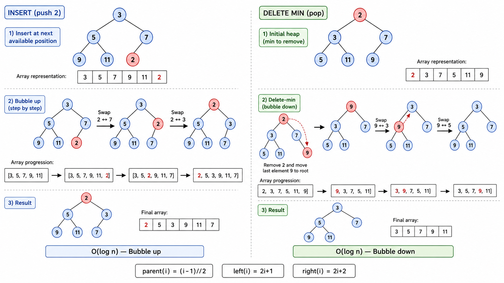
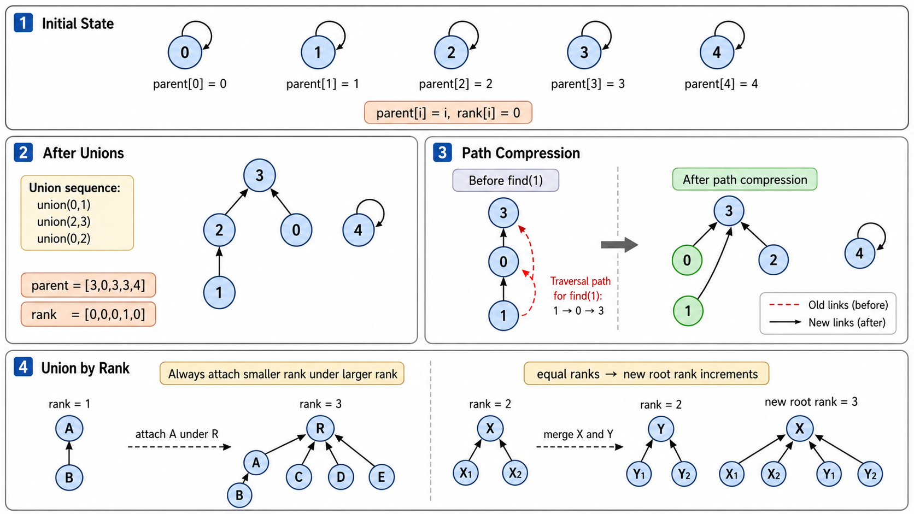
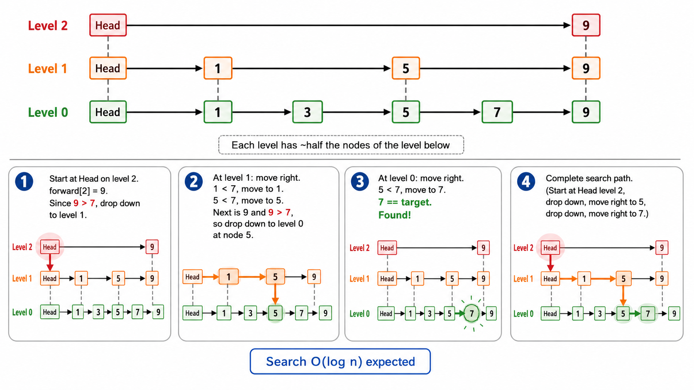

# 堆、并查集与跳跃表

> [!WARNING]
> 🧪 Beta公测版本提示：教程主体已完成，正在优化细节，欢迎大家提Issue反馈问题或建议。


## 1. 三种形态的数据结构

本章介绍三种结构迥异但都极为重要的数据结构：
- **二叉堆**：用数组表示的完全二叉树，是优先队列和堆排序的基础
- **并查集**：用森林表示集合的划分，近乎 $O(1)$ 的合并与查询
- **跳跃表**：用概率平衡的多层链表，实现 $O(\log n)$ 的查找/插入/删除

---

## 2. 二叉堆（Binary Heap）

### 2.1 堆的定义与性质

二叉堆是一个**完全二叉树**，且满足**堆序性质**：
- **最小堆**：每个节点 $\leq$ 其所有后代 → 根是最小值
- **最大堆**：每个节点 $\geq$ 其所有后代 → 根是最大值

**数组表示法**是堆之所以高效的关键。对于索引 $i$ 的节点（根节点索引为 0）：

```
父节点索引:   (i - 1) // 2
左子节点索引: 2 * i + 1
右子节点索引: 2 * i + 2

示例堆: [1, 3, 5, 7, 9, 6, 8]
树形:        1
           /   \
          3     5
         / \   / \
        7   9 6   8
```

使用数组的好处：无需存储指针（节省空间），缓存友好（连续内存），父子访问 $O(1)$。

### 2.2 核心操作

**插入（push）**：
1. 将新元素放在数组末尾（完全二叉树的最后位置）
2. **上浮**（sift-up / bubble-up）：若新元素比父节点小，与父节点交换。重复直到满足堆序
3. 时间复杂度 $O(\log n)$

**删除堆顶（pop）**：
1. 取出根节点（最小值）
2. 将数组末尾元素移到根位置
3. **下沉**（sift-down / bubble-down）：若根比子节点大，与较小的子节点交换。重复直到满足堆序
4. 时间复杂度 $O(\log n)$

**建堆（heapify）**：
从最后一个非叶节点（索引 $\lfloor n/2 \rfloor - 1$）开始，对每个节点做下沉操作。虽然每个下沉是 $O(\log n)$，但：

$$
\sum_{h=0}^{\lfloor \log n \rfloor} \lceil \frac{n}{2^{h+1}} \rceil \cdot O(h) = O(n)
$$

建堆的总复杂度是 $O(n)$，而非 $O(n \log n)$。

### 2.3 堆排序

堆排序利用最大堆实现原地排序：

1. **建堆**：将输入数组构建为最大堆 → $O(n)$
2. **排序**：反复将堆顶（最大值）与末尾交换，堆大小减 1，然后对新的堆顶做下沉 → $n$ 次 $O(\log n)$
3. 总时间复杂度 $O(n \log n)$，空间复杂度 $O(1)$（原地排序）

与归并排序相比，堆排序不需要额外空间；与快速排序相比，堆排序没有最坏情况退化问题。但实践中，堆排序的常数因子较大，且缓存局部性不如快排。



---

## 3. 并查集（Disjoint Set Union）

### 3.1 问题场景

给定 $n$ 个独立元素，需要支持两种操作：
- **Union(x, y)**：将包含 $x$ 和 $y$ 的两个集合合并
- **Find(x)**：查找 $x$ 所属集合的代表元

实际应用：判断图中两个节点是否连通、Kruskal 最小生成树算法、社交网络中的好友圈子。

### 3.2 基本实现：森林表示

每个集合用一棵树表示，树的根节点是集合的代表元：

```
初始状态（每个元素独立成一个集合）:
  0  1  2  3  4  (parent[i] = i)

Union(0, 1):  parent[0] = 1
  1 ← 0    2    3    4

Union(2, 3):  parent[2] = 3
  1 ← 0    3 ← 2    4

Union(1, 3):  parent[1] = 3
        3
      /   \
     1     2
    /
   0
```

基本操作的复杂度取决于**树的高度**。如果不做优化，树可能退化成链 → $O(n)$。

### 3.3 优化一：路径压缩（Path Compression）

在 `Find(x)` 的过程中，将沿途所有节点直接指向根：

```python
def find(x):
    if parent[x] != x:
        parent[x] = find(parent[x])  # 递归查找根，同时路径压缩
    return parent[x]
```

经过路径压缩后，树变得非常扁平，后续查找几乎是 $O(1)$。

### 3.4 优化二：按秩合并（Union by Rank / Size）

总是将**较小的树**合并到**较大的树**上，防止树变得过深：

```python
def union(x, y):
    rx, ry = find(x), find(y)
    if rx == ry: return
    if rank[rx] < rank[ry]:
        parent[rx] = ry
    elif rank[rx] > rank[ry]:
        parent[ry] = rx
    else:
        parent[ry] = rx
        rank[rx] += 1
```

### 3.5 近乎常数的复杂度

同时使用以上两种优化后，并查集的均摊复杂度为 $O(\alpha(n))$，其中 $\alpha(n)$ 是**阿克曼函数的逆函数**——这个函数增长得极慢，对于任何实际可能的 $n$，$\alpha(n) \leq 4$。因此在实际中，并查集的操作几乎就是 $O(1)$。

### 3.6 经典应用

- **Kruskal 最小生成树**：判断加入一条边是否会形成环（两端点是否已在同一集合）
- **连通分量**：遍历图的所有边，Union 连接的点，最后统计不同的根的数量
- **环检测**：对于无向图，当一条边的两端点已经在同一集合中时，说明形成了环



---

## 4. 跳跃表（Skip List）

### 4.1 动机：让链表支持二分查找

链表查找是 $O(n)$，因为它只能一个个元素地遍历。跳跃表的想法是：**在普通链表上添加多层"快速通道"**，上层跳得远，下层走得细。

```
Level 2:  1 ─────────→ 9
Level 1:  1 ───→ 5 ───→ 9
Level 0:  1 → 3 → 5 → 7 → 9
```

- 上层节点少（跳得远），下层节点多（覆盖全）
- 查找时从最上层开始，利用上层快速定位大致范围，再逐层下钻

### 4.2 结构

跳跃表由多层有序链表组成。第 0 层包含所有元素。第 $k+1$ 层以一定概率（通常 $p = 0.5$）包含第 $k$ 层中的元素。层数 $h \approx \log_{1/p} n$。

节点结构：

```python
class SkipNode:
    value: int
    forward: list[SkipNode | None]  # forward[i] = 第 i 层的前向指针
```

### 4.3 查找

从最高层开始，在每个层级：
- 只要 forward 指针指向的节点值小于目标，就沿 forward 前进
- 当无法前进了，下降一层继续
- 到达第 0 层后，检查当前节点是否等于目标

```
查找 7:
Level 2: 1.fwd[2]=9 > 7 → 不前进，下降
Level 1: 1.fwd[1]=5 < 7 → 前进到 5
         5.fwd[1]=9 > 7 → 下降
Level 0: 5.fwd[0]=7 = 7 → 找到！
```

时间复杂度 $O(\log n)$ 期望。

### 4.4 插入与删除

**插入**：
1. 查找插入位置，记录每层的"前驱节点"
2. 随机生成新节点的层数（几何分布：50%概率为 1 层，25%为 2 层，12.5%为 3 层...）
3. 在每层插入新节点（修改前驱的 forward 指针）

**删除**：
1. 查找待删除节点，记录每层的前驱节点
2. 在各层中，让前驱跳过待删除节点

跳跃表的平均层高和总空间复杂度均为 $O(n)$（每层期望有 $n \cdot p^k$ 个节点，总期望为 $\frac{n}{1-p}$）。

### 4.5 与平衡树的比较

| 维度 | 跳跃表 | 平衡树（AVL/红黑树） |
|------|--------|---------------------|
| 实现复杂度 | 较简单 | 较复杂（旋转操作） |
| 查找 | $O(\log n)$ 期望 | $O(\log n)$ 确定 |
| 范围查询 | 自然支持（第 0 层就是有序链表） | 需要额外遍历 |
| 并发 | 容易实现无锁版本 | 需要复杂的锁策略 |
| 内存 | 指针开销更大 | 紧凑 |

跳跃表在 Redis（有序集合）、LevelDB（MemTable）等工业系统中被广泛使用。



---

## 5. 三种结构的应用对比

| 结构 | 查找 | 插入 | 删除 | 最大特点 | 典型应用 |
|------|------|------|------|----------|----------|
| 二叉堆 | $O(n)$ | $O(\log n)$ | $O(\log n)$ | $O(1)$ 取极值 | 优先队列、堆排序 |
| 并查集 | $\approx O(1)$ | $O(\alpha(n))$ | - | 近乎常数时间 | 连通性、MST |
| 跳跃表 | $O(\log n)$ | $O(\log n)$ | $O(\log n)$ | 概率平衡、易实现 | Redis ZSet、LevelDB |

---

## 本章总结

1. **二叉堆**：完全二叉树 + 堆序性质 = 数组表示的优先队列。建堆 $O(n)$，堆排序 $O(n \log n)$ 且原地
2. **并查集**：森林 + 路径压缩 + 按秩合并 = 近乎 $O(1)$ 的集合操作。Kruskal 算法的核心组件
3. **跳跃表**：概率平衡的多层链表，以简单的实现换来了 $O(\log n)$ 期望性能，是 Redis 等系统的基石

---

## 📥 Code

| File | View | Download |
|------|------|----------|
| demo.py | [Open](./code-demo) | <a href="/notebook/code/algorithms/basics/heap-unionfind/demo.py" target="_blank" download>Download</a> |
| exercise.py | [Open](./code-exercise) | <a href="/notebook/code/algorithms/basics/heap-unionfind/exercise.py" target="_blank" download>Download</a> |

## 参考

1. Cormen, T. H., et al. (2009). Introduction to Algorithms (3rd ed.). MIT Press. 第 6、19、21 章
2. Pugh, W. (1990). Skip Lists: A Probabilistic Alternative to Balanced Trees. CACM.
3. Tarjan, R. E. (1975). Efficiency of a Good But Not Linear Set Union Algorithm. JACM.

---

> **上一章**：[树与二叉树](/algorithms/basics/tree/)
> **下一章**：[图论基础](/algorithms/graph/basics/)
