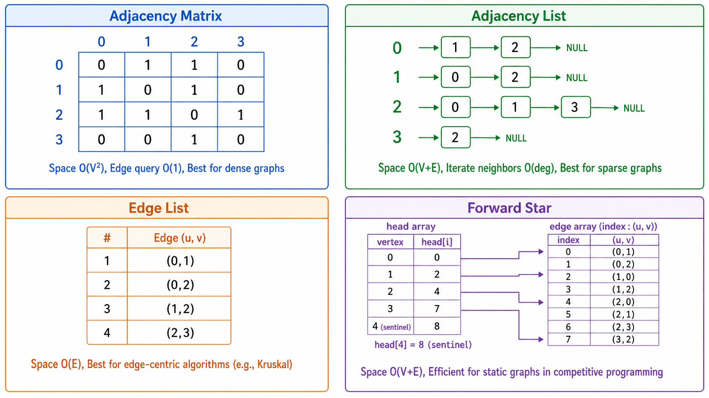
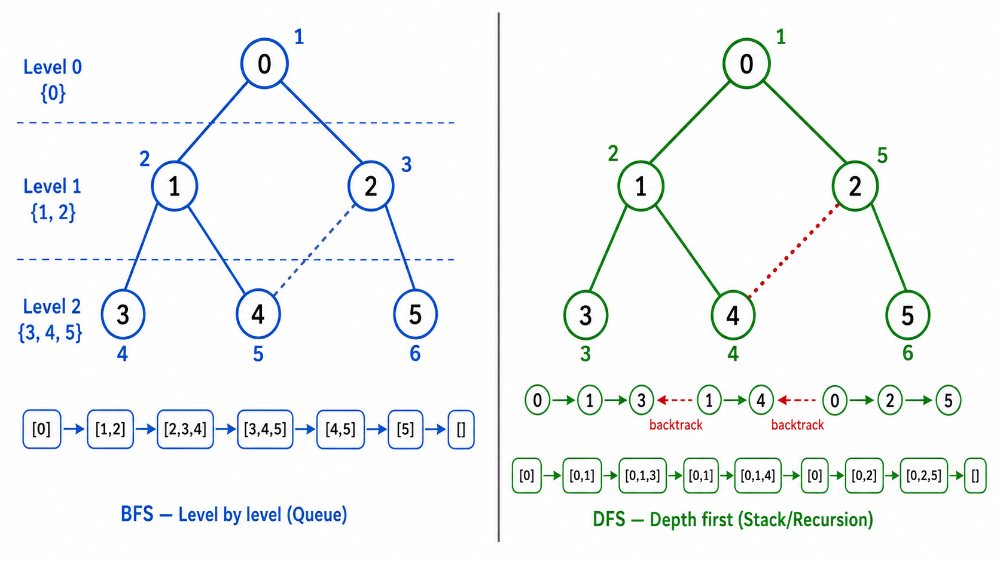
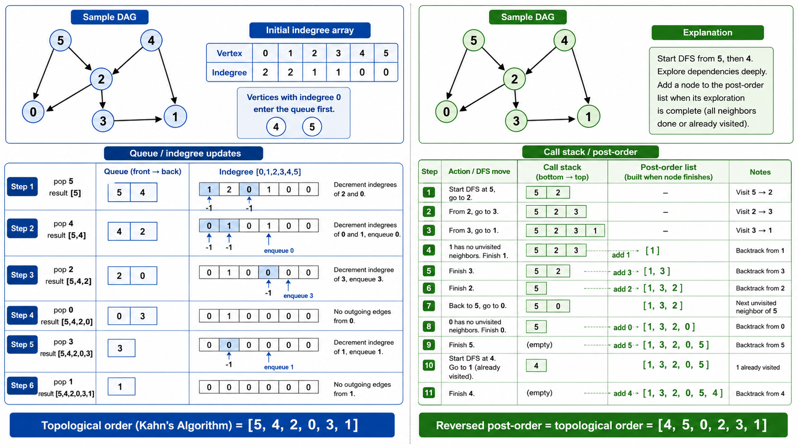

# 图论基础

> [!WARNING]
> 🧪 Beta公测版本提示：教程主体已完成，正在优化细节，欢迎大家提Issue反馈问题或建议。


## 1. 图：从树到网络的飞跃

树是层次结构，但现实中有太多关系不是层次的——社交网络、交通网络、互联网链接、任务依赖关系...这些都需要**图（Graph）**来描述。

图由**顶点（Vertices）**和**边（Edges）**组成：$G = (V, E)$。

```
无向图:
  0 —— 1
  |    |
  2 —— 3

有向图:
  0 → 1
  ↓   ↓
  2 ← 3
```

---

## 2. 图的分类与术语

| 术语 | 定义 |
|------|------|
| 无向图 (Undirected) | 边没有方向，$(u,v)$ 和 $(v,u)$ 是同一条边 |
| 有向图 (Directed / Digraph) | 边有方向，$(u,v)$ 表示从 $u$ 到 $v$ |
| 加权图 (Weighted) | 每条边有权重（距离、代价等） |
| 连通图 (Connected) | 任意两顶点之间存在路径 |
| 连通分量 (Connected Component) | 极大连通子图 |
| 强连通分量 (SCC) | 有向图中任意两顶点互相可达的最大子图 |
| 度 (Degree) | 与顶点相连的边数（有向图分出度和入度） |
| 路径 (Path) | 顶点序列 $v_0, v_1, ..., v_k$，每对相邻顶点间有边 |
| 环 (Cycle) | 首尾相同的路径（$v_0 = v_k$） |
| 树 | 连通无环的无向图 |
| DAG | 有向无环图（Directed Acyclic Graph） |

---

## 3. 图的表示方法

### 3.1 邻接矩阵（Adjacency Matrix）

一个 $|V| \times |V|$ 的矩阵 $A$，其中 $A[i][j] = 1$（或权重值）若存在边 $(i, j)$。

$$
A = \begin{bmatrix}
0 & 1 & 0 & 1 \\
1 & 0 & 1 & 0 \\
0 & 1 & 0 & 1 \\
1 & 0 & 1 & 0
\end{bmatrix}
$$

- 判断边是否存在：$O(1)$
- 遍历所有邻居：$O(|V|)$
- 空间：$O(|V|^2)$，适合**稠密图**（$|E| \approx |V|^2$）
- 对于稀疏图（$|E| \ll |V|^2$），空间浪费严重

### 3.2 邻接表（Adjacency List）

这是最常用的表示法。每个顶点维护一个邻居列表。

```python
graph = {
    0: [1, 2],
    1: [0, 2, 3],
    2: [0, 1, 3],
    3: [1, 2]
}
```

- 判断边是否存在：$O(\deg(v))$（可以优化为 $O(1)$ 如果邻接表用哈希集）
- 遍历所有邻居：$O(\deg(v))$（即与该顶点相邻的边数）
- 空间：$O(|V| + |E|)$，适合**稀疏图**
- 这是算法竞赛和工业实践中最常用的表示

### 3.3 边列表（Edge List）

简单地将所有边存储为列表：

```python
edges = [(0, 1), (0, 2), (1, 2), (1, 3), (2, 3)]
```

- 空间：$O(|E|)$，最紧凑
- 适合 Kruskal 等以边为中心的算法
- 不适合需要快速访问邻居的场景

### 3.4 前向星（Forward Star）

将边按起点排序后存储，适合静态的稀疏图处理。在竞赛编程中常用。



---

## 4. 广度优先搜索（BFS）

### 4.1 算法

BFS 从起点开始，逐层向外扩展。使用**队列**：

```python
def bfs(graph, start):
    visited = {start}
    queue = deque([start])
    while queue:
        v = queue.popleft()
        for neighbor in graph[v]:
            if neighbor not in visited:
                visited.add(neighbor)
                queue.append(neighbor)
```

### 4.2 性质

- **按层遍历**：先访问距离起点为 1 的节点，再访问距离为 2 的，以此类推
- **无权图最短路径**：在无权图（每条边权重为 1）中，BFS 找到的路径就是最短路径
- **时间复杂度**：$O(|V| + |E|)$（每个顶点入队一次，每条边检查一次）

### 4.3 应用

- 社交网络中的"几度人脉"
- 迷宫最短路径
- 判断图的二分性
- Web 爬虫的页面抓取

---

## 5. 深度优先搜索（DFS）

### 5.1 算法

DFS 沿一条路走到底，回溯后再换路。使用**递归**或**栈**：

```python
def dfs(graph, v, visited):
    visited.add(v)
    for neighbor in graph[v]:
        if neighbor not in visited:
            dfs(graph, neighbor, visited)
```

### 5.2 DFS 树与边的分类

在一次 DFS 遍历中，根据遍历顺序可以将边分为四类：

| 类型 | 定义 | 有向图中 |
|------|------|----------|
| 树边 (Tree Edge) | DFS 遍历时实际走过的边 | 指向未访问节点 |
| 回边 (Back Edge) | 指向祖先节点的边 | **检测到环** |
| 前向边 (Forward Edge) | 指向后代节点的非树边 | 跳过 |
| 交叉边 (Cross Edge) | 指向不同子树节点的边 | 在拓扑排序中 |

### 5.3 应用

- **环检测**：DFS 中遇到回边即说明存在环
- **拓扑排序**：在 DAG 上，DFS 完成时间逆序即为拓扑序
- **连通分量**：DFS 从每个未访问节点出发，可以找出所有连通分量
- **二分图检测**：交替染色，若相邻节点同色则不是二分图



---

## 6. 拓扑排序

### 6.1 问题

给定一个有向无环图（DAG），找一种顶点的线性排序，使得对每条有向边 $(u, v)$，$u$ 在排序中出现在 $v$ 之前。

```
DAG:  A → B → D
      ↓   ↓
      C → E

拓扑序可能为: A, B, C, D, E 或 A, C, B, E, D
```

### 6.2 算法一：Kahn 算法（BFS 版）

1. 计算所有顶点的入度
2. 将所有入度为 0 的顶点入队
3. 当队列非空时：出队一个顶点加入结果，将其所有后继的入度减 1，若后继入度变为 0 则入队
4. 若结果中包含所有顶点，则排序成功；否则图中存在环

时间复杂度 $O(|V| + |E|)$。

### 6.3 算法二：DFS 版

1. 对图进行 DFS
2. 当一个顶点的所有邻居都探索完毕后（后序），将该顶点加入结果
3. 最终结果的反向即为拓扑序

两种方法等价，但 Kahn 算法更容易发现图中是否存在环。

### 6.4 应用

- 编译器的依赖解析（A 依赖 B → B 必须先编译）
- 任务调度（A 必须在 B 之前完成）
- 课程选修顺序（先修课必须在前）

---

## 7. 二分图检测

**二分图（Bipartite Graph）**：顶点可以分成两个集合 $U$ 和 $V$，使得每条边都连接 $U$ 中的一个顶点和 $V$ 中的一个顶点（没有 $U$ 内部或 $V$ 内部的边）。

**检测算法**：对图进行 BFS/DFS 染色 —— 将一个顶点染为颜色 0，其所有邻居染为颜色 1，邻居的邻居染回颜色 0...若发现相邻顶点同色，则不是二分图。

**定理**：一个图是二分图 $\iff$ 图中不含奇环（长度为奇数的环）。

---

## 8. 强连通分量（SCC）直觉

在**有向图**中，一个**强连通分量**是图中的极大子集，其中任意两个顶点可以互相到达。

**Kosaraju 算法**的思想（两步 DFS）：
1. 对原图做 DFS，按完成时间降序排列顶点
2. 将图的所有边反向，按第 1 步得到的顺序做第二次 DFS
3. 第二次 DFS 得到的每棵树就是一个 SCC

**Tarjan 算法**只用一次 DFS，通过维护 `dfn`（发现时间）和 `low`（能追溯到的最早祖先）数组来识别 SCC。



---

## 9. 图的连通性总结

| 问题 | 算法 | 时间复杂度 |
|------|------|-----------|
| 无向图连通分量 | DFS/BFS | $O(V+E)$ |
| 有向图强连通分量 | Kosaraju / Tarjan | $O(V+E)$ |
| 环检测（无向图） | DFS 检测回边 | $O(V+E)$ |
| 环检测（有向图） | DFS 三色标记 | $O(V+E)$ |
| 拓扑排序 | Kahn / DFS | $O(V+E)$ |
| 二分图检测 | BFS/DFS 染色 | $O(V+E)$ |
| 桥和割点 | Tarjan 算法 | $O(V+E)$ |

---

## 本章总结

图是最灵活的数据结构之一——任何具有"关系"的系统都可以建模为图：

1. **四种表示法**：邻接矩阵（稠密）、邻接表（稀疏，最通用）、边列表（以边为中心）、前向星（静态）
2. **BFS**：层序扩展，无加权图的最短路径，使用队列实现
3. **DFS**：深度优先，通过回边检测环，后序遍历产生拓扑序
4. **拓扑排序**：Kahn（BFS + 入度）和 DFS 两种方法，是 DAG 的基础算法
5. **连通性**：从无向图的连通分量到有向图的强连通分量，DFS 贯穿始终

---

## 📥 Code

| File | View | Download |
|------|------|----------|
| demo.py | [Open](./code-demo) | <a href="/notebook/code/algorithms/graph/basics/demo.py" target="_blank" download>Download</a> |
| exercise.py | [Open](./code-exercise) | <a href="/notebook/code/algorithms/graph/basics/exercise.py" target="_blank" download>Download</a> |

## 参考

1. Cormen, T. H., et al. (2009). Introduction to Algorithms (3rd ed.). MIT Press. 第 22 章
2. Tarjan, R. E. (1972). Depth-first search and linear graph algorithms. SIAM Journal on Computing.

---

> **上一章**：[堆、并查集与跳跃表](/algorithms/basics/heap-unionfind/)
> **下一章**：[最短路径](/algorithms/graph/shortest-path/)
