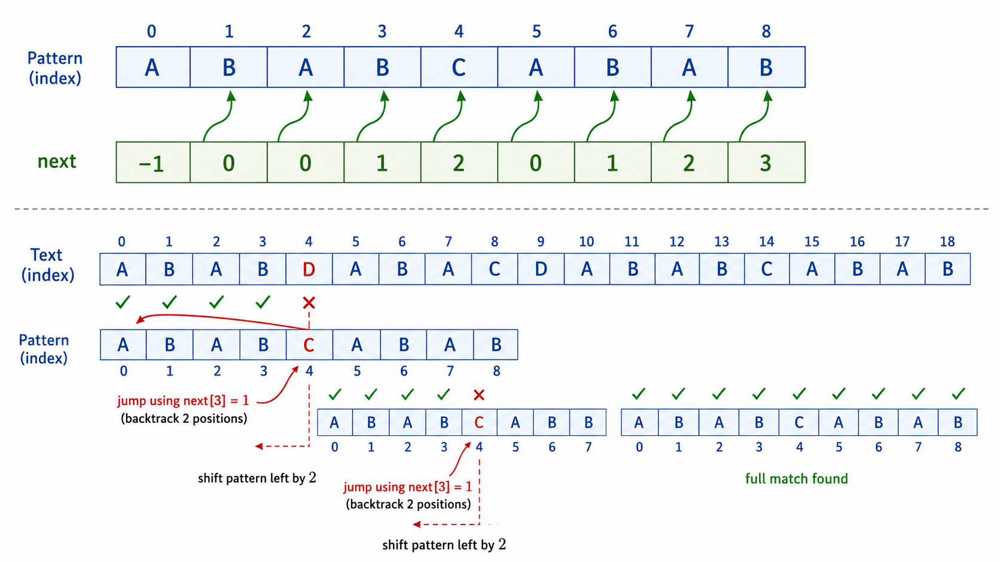

# algo13 字符串算法

> [!WARNING]
> 🧪 Beta公测版本提示：教程主体已完成，正在优化细节，欢迎大家提Issue反馈问题或建议。


> 从暴力匹配到 KMP、Trie、AC 自动机、Manacher、后缀数组——字符串处理的核心技术与数据结构

---

## 一、字符串匹配基础

### 1.1 问题定义

给定文本串 $T$（长度 $n$）和模式串 $P$（长度 $m$），找出 $P$ 在 $T$ 中的所有出现位置。

### 1.2 暴力匹配（Brute Force）

对 $T$ 的每个可能起始位置 $i$，比较 $T[i..i+m-1]$ 与 $P$ 是否完全匹配。时间复杂度 $O(nm)$。

```
T = "ABABCABAB"
P = "ABAB"
比较位置 0: ABAB vs ABAB ✓ → 匹配位置 0
比较位置 1: BABC vs ABAB ✗
...
比较位置 5: ABAB vs ABAB ✓ → 匹配位置 5
```

---

## 二、KMP 算法

### 2.1 核心思想

KMP（Knuth-Morris-Pratt）利用**已经匹配的部分信息**来避免回溯。当匹配失败时，不是回到下一个起始位置，而是利用已匹配前缀的信息直接"跳跃"。

**关键数据结构：`next` 数组（或 `failure function` / `pi` 数组）**

$next[i]$ = 模式串 $P[0..i]$ 中，最长相等前后缀的长度（不包含自身）。

```
模式串 P = "ABABCABAB"
索引:  0 1 2 3 4 5 6 7 8
P:     A B A B C A B A B
next: -1 0 0 1 2 0 1 2 3

例如 next[3] = 1: "ABAB" 的最长相等前后缀是 "A"（前缀A=后缀A, 但完整的前缀AB≠后缀AB）
next[8] = 3: "ABABCABAB" 的最长相等前后缀是 "ABAB"
```

### 2.2 next 数组的计算

next 数组本身也是通过类似 KMP 的自匹配过程（模式串对自身匹配）来计算的。复杂度 $O(m)$。

```python
def compute_next(pattern):
    m = len(pattern)
    next_arr = [-1] * m
    k = -1  # k 表示当前匹配了的前缀的末尾索引
    for q in range(1, m):
        while k >= 0 and pattern[k + 1] != pattern[q]:
            k = next_arr[k]  # 回退
        if pattern[k + 1] == pattern[q]:
            k += 1
        next_arr[q] = k
    return next_arr
```

### 2.3 KMP 匹配过程

```python
def kmp_search(text, pattern):
    n, m = len(text), len(pattern)
    if m == 0: return [0]
    next_arr = compute_next(pattern)
    matches = []
    k = -1  # 已匹配的模式串长度 - 1
    for i in range(n):
        while k >= 0 and pattern[k + 1] != text[i]:
            k = next_arr[k]  # 关键：利用 next 跳过不必要的比较
        if pattern[k + 1] == text[i]:
            k += 1
        if k == m - 1:  # 完全匹配
            matches.append(i - m + 1)
            k = next_arr[k]  # 继续寻找下一个匹配
    return matches
```

**总复杂度**：$O(n + m)$。文本串指针 $i$ 从不回溯，模式串指针 $k$ 的移动总次数受限于 next 数组。



---

## 三、Trie（前缀树/字典树）

### 3.1 基本操作

Trie 是一种多叉树，每个节点代表一个前缀，节点的出边代表下一个字符。

| 操作 | 描述 | 复杂度 |
|------|------|--------|
| `insert(word)` | 沿字符边走，不存在则创建节点 | $O(|word|)$ |
| `search(word)` | 检查是否完整单词 | $O(|word|)$ |
| `starts_with(prefix)` | 检查是否有以 prefix 为前缀的单词 | $O(|prefix|)$ |

### 3.2 Trie 的结构

```
插入 "cat", "car", "dog", "door" 后:

          root
        /   |   \
       c    d    ...
      /      \
     a        o
    / \      / \
   t*  r*   g*  o
                  \
                   r*
(* = 单词结束标记)
```

### 3.3 应用场景

- **自动补全（Auto-complete）**：输入前缀，返回所有以该前缀开头的单词
- **拼写检查**：快速验证单词是否在字典中
- **IP 路由最长前缀匹配**
- **异或最大值**：将数字按位插入 Trie，查询时尽量走相反的位

---

## 四、AC 自动机（Aho-Corasick）

### 4.1 核心思想

AC 自动机 = Trie + KMP 的失败指针。用于在一个文本串中同时匹配多个模式串。

**构建三个步骤**：
1. 将所有模式串插入 Trie
2. 构建失败指针（failure links）——BFS 遍历
3. 在文本串上走自动机，每当走到一个节点，沿着 failure 链收集所有匹配

### 4.2 失败指针

失败指针 `fail[u]` 指向 Trie 中节点 $u$ 所代表字符串的**最长真后缀**对应的节点。

BFS 构建规则：
- 根节点的直系子节点的 fail 指向根
- 对于节点 $u$ 的子节点 $v$（对应字符 $c$），沿着 $fail[u]$ 链寻找第一个也有字符 $c$ 出边的节点，$fail[v]$ 指向那个 $c$ 子节点

**复杂度**：构建 $O(\sum |P_i|)$，匹配 $O(n + \text{匹配数})$。

---

## 五、Manacher 算法

### 5.1 最长回文子串

Manacher 提出了一种 $O(n)$ 算法求字符串的最长回文子串，核心技巧包括：

1. **插入分隔符**：在每个字符间插入 `#`，统一处理奇偶长度
2. **回文半径数组**：`R[i]` 表示以 $i$ 为中心的最大回文半径
3. **利用对称性**：维护当前最右回文边界，对于其内部的中心点，利用回文的镜像关系减少计算

```
原串: "babad"
扩展: "#b#a#b#a#d#"
各中心回文半径: [0,1,0,3,0,3,0,1,0,1,0]
最长回文子串: "bab" (或 "aba"), 长度 3
```

**复杂度**：$O(n)$，因为内层 while 循环的总执行次数受限于回文半径的扩张次数。

---

## 六、后缀数组与 LCP

### 6.1 后缀数组

**后缀数组（Suffix Array）** 是字符串所有后缀按字典序排序后的起始位置数组。

```
S = "banana"
后缀:
0: banana
1: anana
2: nana
3: ana
4: na
5: a

排序后:
5: a, 3: ana, 1: anana, 0: banana, 4: na, 2: nana
SA = [5, 3, 1, 0, 4, 2]
```

**倍增法（Doubling）**：通过 $k$ 轮排序（每轮按前 $2^k$ 个字符排序），时间复杂度 $O(n \log n)$。

### 6.2 LCP 数组

**LCP（Longest Common Prefix）数组**：$LCP[i]$ = 后缀数组中第 $i$ 个和第 $i+1$ 个后缀的最长公共前缀长度。

Kasai 算法可在 $O(n)$ 内由后缀数组计算出 LCP 数组。LCP 数组是很多后缀数组应用的基础（如最长重复子串、不同子串数量）。

---

## 七、滚动哈希（Rabin-Karp）

### 7.1 多项式哈希

将字符串视为一个以 $B$ 为基的 $N$ 进制数，对一个大质数 $M$ 取模：

$$
\text{hash}(S) = (S[0] \cdot B^{n-1} + S[1] \cdot B^{n-2} + \dots + S[n-1]) \bmod M
$$

常用参数：$B = 131$ 或 $13331$，$M = 10^9 + 7$ 或 $2^{64}$（自然溢出）。

### 7.2 滚动哈希

通过前缀哈希可以 $O(1)$ 计算任意子串的哈希值：

$$
\text{hash}(S[l..r]) = (\text{prefix}[r+1] - \text{prefix}[l] \cdot B^{r-l+1}) \bmod M
$$

这为 $O(1)$ 的子串相等比较提供了可能（概率正确，冲突率极低）。

### 7.3 Rabin-Karp 字符串匹配

用滚动哈希在 $O(n+m)$ 时间内完成单模式串（或多模式串）匹配。可与 KMP 互补——Rabin-Karp 更适合处理多模式串的情况。

---

## 本章总结

| 算法 | 用途 | 复杂度 |
|------|------|--------|
| 暴力匹配 | 单模式匹配 | $O(nm)$ |
| KMP | 单模式匹配（不回退） | $O(n + m)$ |
| Trie | 多字符串集合的前缀操作 | 插入/查询 $O(\|S\|)$ |
| AC 自动机 | 多模式匹配 | 构建 $O(\sum\|P_i\|)$，匹配 $O(n)$ |
| Manacher | 最长回文子串 | $O(n)$ |
| 后缀数组 | 后缀排序、子串问题 | $O(n \log n)$（倍增法） |
| 滚动哈希 | $O(1)$ 子串比较 | 预处理 $O(n)$，查询 $O(1)$ |
| Rabin-Karp | 字符串匹配（哈希版） | $O(n + m)$ |

> 字符串算法是算法竞赛中出镜率最高的类别之一。KMP 的"失败函数"思想（利用已处理信息避免重复计算）是整个领域的核心 intuition——Trie 中的失败指针、Manacher 中的镜像扩展、后缀数组的倍增，都体现了"用空间换时间，用已计算信息加速未计算部分"的哲学。

---

## 📥 Code

| File | View | Download |
|------|------|----------|
| demo.py | [Open](./code-demo) | <a href="/notebook/code/algorithms/topics/string/demo.py" target="_blank" download>Download</a> |
| exercise.py | [Open](./code-exercise) | <a href="/notebook/code/algorithms/topics/string/exercise.py" target="_blank" download>Download</a> |

## 参考

1. Knuth, D. E., Morris, J. H., & Pratt, V. R. (1977). Fast Pattern Matching in Strings. *SIAM Journal on Computing*, 6(2), 323-350. [[doi:10.1137/0206024](https://doi.org/10.1137/0206024)]
2. Aho, A. V. & Corasick, M. J. (1975). Efficient string matching: an aid to bibliographic search. *Communications of the ACM*, 18(6), 333-340.
3. Manacher, G. (1975). A New Linear-Time "On-Line" Algorithm for Finding the Smallest Initial Palindrome of a String. *Journal of the ACM*, 22(3), 346-351.
4. Karp, R. M. & Rabin, M. O. (1987). Efficient randomized pattern-matching algorithms. *IBM Journal of Research and Development*, 31(2), 249-260.
