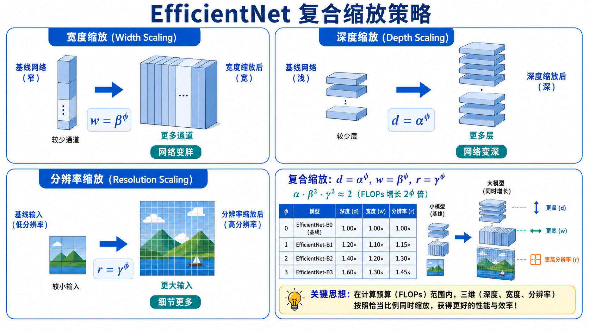

# s11 经典架构演进：从 LeNet 到 ViT

> [!WARNING]
> 🧪 Beta公测版本提示：教程主体已完成，正在优化细节，欢迎大家提Issue反馈问题或建议。

> 卷积神经网络架构 20 年进化史 —— 从 CNN 到 Transformer，每个里程碑解决了什么问题

---

## 一、LeNet-5 (1998)：原型与范式

Yann LeCun 在 1998 年提出的 LeNet-5 是第一个成功的卷积神经网络。它在 MNIST 手写数字识别上取得了商业级的效果，被美国银行用于支票数字识别。

### 架构：Conv → Pool → Conv → Pool → FC → FC

LeNet-5 建立了 CNN 的基本范式，至今仍在使用：

1. **交替模式**：卷积提取特征 + 池化降维，交替堆叠多次
2. **卷积末接全连接**：最后几层用全连接层做分类决策
3. **Tanh 激活函数**：当时的标配（ReLU 还未流行）

### LeNet-5 确立的核心原则

- 浅层提取局部特征（边缘、角点），深层组合成全局特征
- 池化提供平移不变性和降维
- 全连接层做最终的高层语义推理

LeNet-5 虽然简单（约 6 万参数），但它验证了**梯度下降 + 反向传播可以端到端地训练多层 CNN**，为后续所有工作奠定了基础。

---

## 二、AlexNet (2012)：ImageNet 引爆时刻

2012 年，Alex Krizhevsky 等人的 AlexNet 在 ImageNet 竞赛中将 top-5 错误率从 26% 降到 15.3%，一举夺冠。这个结果是深度学习革命的起点。

### 关键创新

| 创新 | 作用 |
|------|------|
| **ReLU 激活** | 替代 tanh/sigmoid，解决深层网络的梯度消失问题，训练速度快 6 倍 |
| **Dropout** | 训练时随机丢弃 50% 神经元，强力防止过拟合 |
| **数据增强** | 随机裁剪、水平翻转、颜色抖动，增加有效训练数据量 |
| **GPU 训练** | 首次在双 GPU 上并行训练大规模 CNN，开创 GPU 深度学习时代 |
| **局部响应归一化** | 相邻通道竞争机制（后被 BatchNorm 取代） |

### 架构特点

- 5 个卷积层 + 3 个全连接层（约 6000 万参数）
- 第一层使用 $11 \times 11$ 的大卷积核 + stride=4
- 两个 GPU 各负责一半通道

AlexNet 证明了三个关键命题：(1) 深度网络可以大规模训练，(2) 更大的数据和更深的网络带来更好的性能，(3) GPU 是训练深度学习模型的必要条件。

---

## 三、VGG (2014)：简单即美

牛津大学 Visual Geometry Group 提出的 VGGNet 传达了一个极其简洁的理念：**全部使用 3x3 卷积**。

### 设计哲学：用深度替代复杂度

两个 $3 \times 3$ 卷积堆叠，感受野等于一个 $5 \times 5$ 卷积；三个 $3 \times 3$ 卷积堆叠，感受野等于一个 $7 \times 7$ 卷积。但是：

- $5 \times 5$ 卷积参数：$5^2 = 25$（不含通道数因子）
- 两个 $3 \times 3$ 卷积参数：$2 \times 3^2 = 18$

参数更少，非线性更多（两个 ReLU vs 一个 ReLU），网络更深。这是对"小而深的卷积核"优于"大而浅的卷积核"的有力论证。

### VGG-16 和 VGG-19

VGG 的最常用变体是 VGG-16（13 个卷积 + 3 个全连接）和 VGG-19。它们的参数量主要堆积在最后三个全连接层（约 1.2 亿参数），这也是 VGG 的主要缺点——**全连接层占据了绝大多数参数但贡献有限**。

> VGG 的教训：一味加深可以提升精度，但参数和计算量会暴涨。后续工作开始思考：如何在增加深度的同时控制参数？

---

## 四、GoogLeNet / Inception (2014)：多尺度并行

Google 的 GoogLeNet（Inception v1）在 2014 年与 VGG 同年出现，走了一条完全不同的路：**在同一层使用多种大小的卷积核并行处理，然后拼接结果**。

### Inception 模块

一个 Inception 模块包含 4 条并行路径：

1. $1 \times 1$ 卷积 —— 捕捉精细局部特征
2. $1 \times 1$ → $3 \times 3$ 卷积 —— 中等感受野
3. $1 \times 1$ → $5 \times 5$ 卷积 —— 大感受野
4. $3 \times 3$ 最大池化 → $1 \times 1$ 卷积 —— 池化特征

所有路径的输出沿**通道维度拼接**（concatenation），形成多尺度的特征表示。

### 1x1 卷积的降维魔法

在每个 $3 \times 3$ 和 $5 \times 5$ 卷积之前插入 $1 \times 1$ 卷积，将通道数从 256 降到 64。这就叫 **bottleneck**（瓶颈层）：

- 没有 bottleneck：$3 \times 3$ conv 在 256→256 通道上：$9 \times 256 \times 256 \approx 59 万$ 次乘法
- 有 bottleneck：先 $1 \times 1$ 降维到 64，再做 $3 \times 3$：$256 \times 64 + 9 \times 64 \times 256 \approx 16 万$ 次乘法

节省了 **73% 的计算量**，而表达能力几乎不损失。

> GoogLeNet 约 500 万参数（不到 AlexNet 的 1/12），却更深更准，展示了"结构设计"对效率的巨大影响。

---

## 五、ResNet (2015)：残差连接的革命

如果 VGG 证明了"更深更好"，那么一个自然的问题是：为什么不能无限加深？答曰：**网络退化**（degradation）——层数加深后，训练误差不降反升。这不是过拟合（测试误差也会上升），而是**优化困难**。

### 残差学习

ResNet 的核心思想是残差学习：与其让 $F(x)$ 直接学习目标映射 $H(x)$，不如让它学习残差 $F(x) = H(x) - x$，然后通过 $H(x) = F(x) + x$ 得到输出。

**Residual Block**：

$$
y = \mathcal{F}(x, \{W_i\}) + x
$$

其中 $\mathcal{F}$ 是两个卷积层（通常是 $3 \times 3$ Conv → BN → ReLU → $3 \times 3$ Conv → BN），$x$ 是**恒等跳跃连接**（identity skip connection）。

### 为什么残差连接有效？

从反向传播的角度看：设 $y = x + F(x)$，则

$$
\frac{\partial \mathcal{L}}{\partial x} = \frac{\partial \mathcal{L}}{\partial y} \cdot \frac{\partial y}{\partial x} = \frac{\partial \mathcal{L}}{\partial y} \cdot \left(1 + \frac{\partial F}{\partial x}\right)
$$

注意那个 **"+1"** —— 即使 $\frac{\partial F}{\partial x}$ 很小（梯度衰减），梯度也不会完全消失。这就是**梯度高速公路**（gradient highway）：恒等连接为梯度提供了一条无损通道，确保深层网络中的早期层也能收到有效梯度。

### ResNet 变体

- **ResNet-18/34**：BasicBlock（两个 $3 \times 3$ Conv + skip）
- **ResNet-50/101/152**：Bottleneck Block（$1 \times 1$ → $3 \times 3$ → $1 \times 1$ + skip），大幅降低计算量

ResNet-152 在 2015 年将 ImageNet top-5 错误率降到 3.57%，**首次超过人类水平**。

---

## 六、ResNet 之后：大道至简，各显神通

### ResNeXt (2017)：分组卷积 + 残差

在 ResNet 的 bottleneck 架构中引入 **grouped convolution**（分组卷积），用多分支的"基数"（cardinality）替代深度和宽度作为新的扩展维度。ResNeXt-101 以相近的参数量超越了 ResNet-200。

### DenseNet (2017)：极致连接

每一层的输出都连接到后面**所有**的层（在通道维度拼接），而非只加给下一层。公式：

$$
x_l = H_l([x_0, x_1, ..., x_{l-1}])
$$

这种密集连接实现了极深层的梯度流动和特征复用，但内存消耗较大。

### SENet (2018)：通道注意力

**Squeeze-and-Excitation**：在每个 residual block 中插入一个轻量级的通道注意力模块——全局平均池化 → FC → ReLU → FC → Sigmoid，学习一个通道权重向量，对特征图的不同通道进行加权。SENet 以极小的额外开销（~1% 参数增量）带来了可观的精度提升，获得了 ImageNet 2017 冠军。

---

## 七、EfficientNet (2019)：复合缩放

之前的网络通常**只在一个维度上扩展**——ResNet 加深，Wide ResNet 加宽，或者增加输入分辨率。EfficientNet 的核心洞察是：这三个维度应该**协同缩放**。

给定计算预算增加 $\phi$ 倍，EfficientNet 使用一个复合系数：

$$
d = \alpha^\phi, \quad w = \beta^\phi, \quad r = \gamma^\phi
$$

其中 $d$ 是深度倍数，$w$ 是宽度倍数，$r$ 是分辨率倍数，约束条件为 $\alpha \cdot \beta^2 \cdot \gamma^2 \approx 2$（保证 FLOPs 增长 $2^\phi$ 倍）。

通过神经架构搜索（NAS）找到基础模型 EfficientNet-B0，然后用复合缩放生成 B1-B7，实现了当时最优的精度-效率 trade-off。

---

## 八、ConvNeXt (2022)：Transformer 反哺 CNN

ConvNeXt 是一个有趣的"回旋"：它从 ResNet-50 出发，逐步引入 Swin Transformer 的设计元素——更大的卷积核（$7 \times 7$）、更少的激活函数、LayerNorm 替代 BatchNorm、GELU 替代 ReLU、分离的下采样层——最终得到一个"现代化"的纯 CNN，性能接近甚至超越了同期的 Vision Transformer。

这说明了：好的网络设计原则是通用的，不限于某一类架构。CNN 和 Transformer 之间的界限正在模糊。

---

## 九、本节小结

| 架构 | 年份 | 核心创新 | 参数量 |
|------|------|---------|--------|
| LeNet-5 | 1998 | CNN 原型：Conv→Pool→FC | ~6 万 |
| AlexNet | 2012 | ReLU、Dropout、GPU 训练 | ~6000 万 |
| VGG-16 | 2014 | 全 3×3 卷积，极简设计 | ~1.38 亿 |
| GoogLeNet | 2014 | Inception 多尺度 + 1×1 bottleneck | ~500 万 |
| ResNet-50 | 2015 | 残差连接解决退化问题 | ~2550 万 |
| DenseNet | 2017 | 密集连接：每层连所有后续层 | ~800 万 |
| SENet | 2018 | 通道注意力：Squeeze-and-Excitation | ~2800 万 |
| EfficientNet | 2019 | 复合缩放：深度×宽度×分辨率 | ~530 万(B0) |
| ConvNeXt | 2022 | Transformer 设计反哺 CNN | ~2800 万 |

---

## 7. ViT：当 Transformer 遇见图像

2020 年之前，卷积几乎是处理图像的唯一选择。人们普遍认为卷积的**局部连接**和**平移不变性**是图像理解不可或缺的归纳偏置（inductive bias）。Google 的 Vision Transformer（ViT）打破了这个假设。

### 7.1 核心思想：图像 = 一序列 Patch

ViT 的洞见极其简单：**把图像切成固定大小的 patch，每个 patch 当作 NLP 中的一个"词"，扔进标准 Transformer 编码器**。

具体流程：

1. **Patch Embedding**：将 $H \times W \times C$ 的图像切成 $N = HW/P^2$ 个 $P \times P \times C$ 的 patch。每个 patch 展平后用线性层映射到 $D$ 维向量
2. **Position Embedding**：加上可学习的位置编码（1D，因为图像已变成序列）
3. **CLS Token**：在序列开头拼接一个可学习的 `[CLS]` token（类似 BERT），它的最终输出用于分类
4. **Transformer Encoder**：标准的多层 Transformer（与 NLP 完全相同——多头自注意力 + MLP + 残差）
5. **MLP Head**：取 `[CLS]` token 的输出，通过一个 MLP 输出分类结果

$$
\begin{aligned}
\mathbf{z}_0 &= [\mathbf{x}_{\text{cls}};\; \mathbf{x}_p^1\mathbf{E};\; \mathbf{x}_p^2\mathbf{E};\; \dots;\; \mathbf{x}_p^N\mathbf{E}] + \mathbf{E}_{\text{pos}} \\
\mathbf{z}'_l &= \text{MSA}(\text{LN}(\mathbf{z}_{l-1})) + \mathbf{z}_{l-1} \\
\mathbf{z}_l &= \text{MLP}(\text{LN}(\mathbf{z}'_l)) + \mathbf{z}'_l \\
\mathbf{y} &= \text{LN}(\mathbf{z}_L^0)
\end{aligned}
$$

### 7.2 ViT vs CNN：归纳偏置的权衡

| | CNN | ViT |
|------|-----|-----|
| **局部性** | 内置（卷积核只看到局部） | 需要从数据中学习 |
| **平移不变性** | 内置（权重共享） | 需要从数据中学习 |
| **全局关系** | 需要堆叠多层才获得大感受野 | 第一层就能看到全局（自注意力） |
| **数据需求** | 少量数据也能工作 | 需要大量数据（或 ImageNet-21K 预训练） |
| **计算复杂度** | $O(k^2 \cdot C_{in} \cdot C_{out} \cdot HW)$ | $O(N^2 \cdot D)$，$N$ 为 patch 数 |

**关键发现**：CNN 的归纳偏置（局部性、平移不变性）在小数据集上是优势，但在**海量数据**下反而成为限制——限制了模型学习更灵活模式的能力。ViT 用更多的数据换来了更强的表达能力。

### 7.3 ViT 的进化

| 模型 | 年份 | 关键创新 |
|------|------|----------|
| ViT | 2020 | 纯 Transformer 做图像分类，需要大规模预训练 |
| DeiT | 2020 | 知识蒸馏训练 ViT，只用 ImageNet-1K 即可 |
| Swin Transformer | 2021 | 引入窗口注意力和层级结构，适配检测/分割 |
| PVT | 2021 | 金字塔结构 ViT，多尺度特征图 |
| MAE | 2021 | 掩码自编码器——像 BERT 一样随机 mask patch 然后重建 |
| DINO/DINOv2 | 2023 | 自监督 ViT，特征质量超越监督学习 |

### 7.4 为什么 ViT 重要

ViT 的意义不仅是又一个 SOTA 模型。它证明了一件事：**Transformer 是一个通用计算原语**——处理文本（GPT）、处理图像（ViT）、处理蛋白质（AlphaFold），底层用的都是同一个 self-attention 机制。这为 s22 中的多模态模型（CLIP、LLaVA）铺平了道路。

> 下一节 [s12 目标检测](/applied/cv/object-detection/) 将介绍如何在这些 backbone 上加一个"检测头"，让网络不仅知道"图像里是什么"，还能回答"物体在哪里"。之后的 [s12b Vision Transformer](/applied/cv/vit/) 将展示 Transformer 如何颠覆 CV。

## 📥 Code

| File | View | Download |
|------|------|----------|
| demo.py | [Open](./code-demo) | <a href="/notebook/code/applied/cv/architectures/demo.py" target="_blank" download>Download</a> |
| exercise.py | [Open](./code-exercise) | <a href="/notebook/code/applied/cv/architectures/exercise.py" target="_blank" download>Download</a> |

## 参考

1. Krizhevsky, A., Sutskever, I., & Hinton, G. E. (2012). ImageNet Classification with Deep Convolutional Neural Networks. *NeurIPS 2012*. (AlexNet) [[doi:10.1145/3065386](https://papers.nips.cc/paper/2012/hash/c399862d3b9d6b76c8436e924a68c45b-Abstract.html)]
2. Simonyan, K. & Zisserman, A. (2015). Very Deep Convolutional Networks for Large-Scale Image Recognition. *ICLR 2015*. (VGG) [[arXiv:1409.1556](https://arxiv.org/abs/1409.1556)]
3. Szegedy, C., et al. (2015). Going Deeper with Convolutions. *CVPR 2015*. (GoogLeNet/Inception) [[arXiv:1409.4842](https://arxiv.org/abs/1409.4842)]
4. He, K., Zhang, X., Ren, S., & Sun, J. (2016). Deep Residual Learning for Image Recognition. *CVPR 2016*. (ResNet) [[arXiv:1512.03385](https://arxiv.org/abs/1512.03385)]
5. Xie, S., et al. (2017). Aggregated Residual Transformations for Deep Neural Networks. *CVPR 2017*. (ResNeXt) [[arXiv:1611.05431](https://arxiv.org/abs/1611.05431)]
6. Huang, G., Liu, Z., van der Maaten, L., & Weinberger, K. Q. (2017). Densely Connected Convolutional Networks. *CVPR 2017*. (DenseNet) [[arXiv:1608.06993](https://arxiv.org/abs/1608.06993)]
7. Hu, J., Shen, L., & Sun, G. (2018). Squeeze-and-Excitation Networks. *CVPR 2018*. (SENet) [[arXiv:1709.01507](https://arxiv.org/abs/1709.01507)]
8. Tan, M. & Le, Q. V. (2019). EfficientNet: Rethinking Model Scaling for Convolutional Neural Networks. *ICML 2019*. [[arXiv:1905.11946](https://arxiv.org/abs/1905.11946)]
9. Liu, Z., et al. (2022). A ConvNet for the 2020s. *CVPR 2022*. (ConvNeXt) [[arXiv:2201.03545](https://arxiv.org/abs/2201.03545)]
10. Dosovitskiy, A., et al. (2020). An Image is Worth 16x16 Words: Transformers for Image Recognition at Scale. *ICLR 2021*. (ViT) [[arXiv:2010.11929](https://arxiv.org/abs/2010.11929)]

