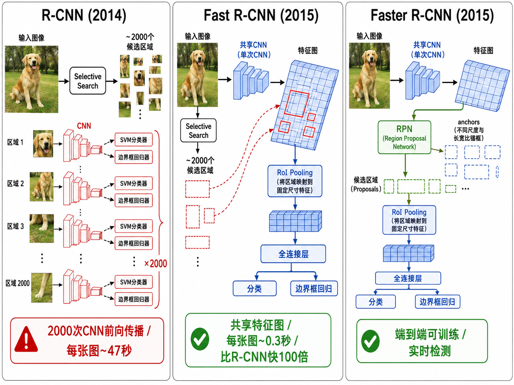
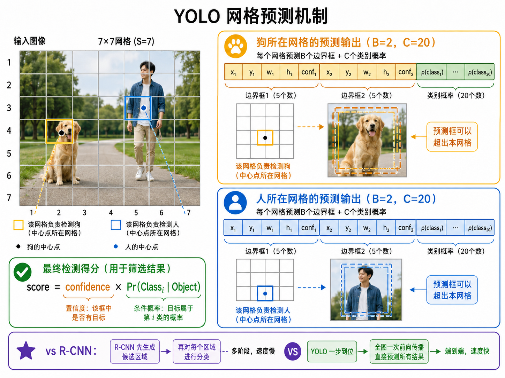
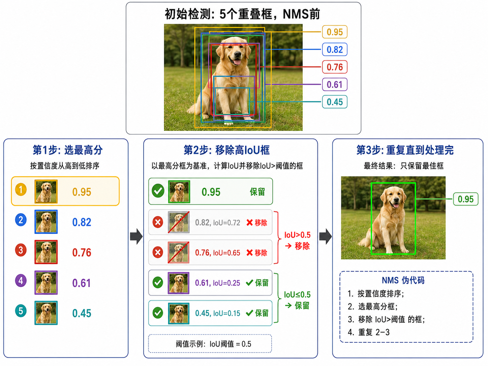

# s12 目标检测：从 R-CNN 到 YOLO

> [!WARNING]
> 🧪 Beta公测版本提示：教程主体已完成，正在优化细节，欢迎大家提Issue反馈问题或建议。

> 让计算机回答"图像里有什么，在哪里"——目标检测技术的演进。分类 backbone 见 [架构演进](/applied/cv/architectures/)；卷积零件见 [CNN](/applied/cv/cnn/)。本章把框从「相对锚框的四个数」推到 IoU、NMS 和 mAP。

正文先给流程和公式；锚框编码、IoU 面积、NMS 的排序删除，点开逐步推导。建议先手算一个 $2\times 2$ 的 IoU，再看 YOLO 的网格张量形状。

---

## 一、分类、检测、分割

在计算机视觉中，理解图片有三个递进的层次：

| 任务 | 问题 | 输出 |
|------|------|------|
| **图像分类** | 图里是什么？ | 一个类别标签 "cat" |
| **目标检测** | 有什么，在哪里？ | 多个类别 + 每个的 bounding box |
| **语义分割** | 每个像素是什么？ | 逐像素的类别标签 |
| **实例分割** | 每个像素属于哪个物体？ | 逐像素的实例标签（区分同类的不同个体） |

目标检测是承上启下的核心任务：它的输出既包含**语义信息**（类别），也包含**空间信息**（位置），是整个视觉理解链条中的关键一环。

---

## 二、R-CNN 家族：两阶段检测器

### 2.1 R-CNN (2014)：朴素的暴力

R-CNN 的思路非常直接：

1. **Selective Search** 在图像中生成约 2000 个候选区域（region proposals）
2. 每个候选区域缩放到固定大小（227×227），送入 CNN 提取特征
3. 用 SVM 对每个区域的特征向量进行分类
4. 用线性回归调整边界框位置（bounding box regression）

问题很明显：**2000 次 CNN 前向传播**，一张图需要几十秒。CNN 的绝大部分计算被浪费在大量重叠的候选区域上。

### 2.2 Fast R-CNN (2015)：共享特征图

关键改进：整张图只跑一次 CNN，得到一张**特征图**。然后对每个候选区域，在特征图上做一个 **RoI Pooling** 操作，提取固定大小的特征向量。

这样，2000 个候选区域共享同一张特征图的 CNN 计算，速度提升了两个数量级。分类器也从 SVM 替换为端到端的 Softmax。

### 2.3 Faster R-CNN (2015)：学会生成候选框

Faster R-CNN 的革命性在于：它把候选区域生成也**整合进了神经网络**。新增了一个**区域提议网络（RPN, Region Proposal Network）**，直接在特征图上预测候选区域。

RPN 的工作方式：
- 在特征图的每个空间位置放置 k 个**锚框（Anchor Boxes）**——预设的不同尺度和长宽比的框
- 对每个锚框，RPN 输出：(1) 是否包含物体的分数，(2) 框的位置修正量
- 选取得分最高的 N 个提议框，送入后续的 RoI Pooling 和分类

至此，目标检测完全端到端可训练。

> **图解说明**：R-CNN 对每个候选框各跑一遍 CNN；Fast 共享一张特征图再 RoI Pool；Faster 连候选框也由 RPN 从同一张图里长出来。

---

## 三、锚框（Anchor Boxes）

锚框是目标检测中的重要概念。它们是为每个特征图位置预设的一组参考框，覆盖不同的**尺度**和**长宽比**（aspect ratio）。

例如，Faster R-CNN 通常在每个位置设置 9 个锚框：3 种尺度 × 3 种长宽比（0.5, 1.0, 2.0）。网络不直接预测边界框的绝对坐标，而是预测**相对于锚框的偏移量**：

$$
t_x = \frac{x - x_a}{w_a}, \quad t_y = \frac{y - y_a}{h_a}, \quad t_w = \log\frac{w}{w_a}, \quad t_h = \log\frac{h}{h_a}
$$

这种相对编码的好处是：预测值在 0 附近，分布更集中，更容易学习。

::: details 逐步推导：锚框偏移 $t_x,t_y,t_w,t_h$ 怎样还原成像素框（点击展开）

锚框中心 $(x_a,y_a)$、宽高 $(w_a,h_a)$。网络输出四个无量纲数 $t$。反解：

$$
x=t_x w_a+x_a,\quad y=t_y h_a+y_a,\quad
w=w_a e^{t_w},\quad h=h_a e^{t_h}.
$$

$t_x$ 是「中心相对锚框宽度挪了几份」；$t_w$ 用对数是因为宽必须为正，加法网络容易输出负数，指数保证 $w>0$。

**数字例。** 锚框 $x_a=100,y_a=80,w_a=40,h_a=40$，预测 $t=(0.1,-0.2,\ln 1.5,0)$：

- $x=0.1\times 40+100=104$
- $y=-0.2\times 40+80=72$
- $w=40\times 1.5=60$，$h=40$

训练时把 GT 框编成 $t^*$，对 $t$ 做 Smooth L1。匹配规则通常：与某个 GT 的 IoU 最大且 $>0.7$ 的锚为正，IoU $<0.3$ 为负，中间的忽略——正负极度不平衡，所以 RPN 要采样。

:::

---

## 四、YOLO：一步到位

R-CNN 系列是**两阶段检测器**：先生成候选区域，再分类和精修。YOLO（You Only Look Once）开创了**单阶段检测器**：一次前向传播，直接输出所有检测结果。

### 4.1 YOLO 的工作原理

1. 将输入图像划分为 $S \times S$ 的网格（如 $7 \times 7$）
2. 每个网格预测 $B$ 个边界框（通常 2 个），每个框有 5 个值：$(x, y, w, h, \text{confidence})$
3. 同时预测 $C$ 个类别的概率
4. **预测的框由"中心点落在哪个网格"的网格负责**

输出张量的形状为 $S \times S \times (B \times 5 + C)$。例如 YOLOv1：$7 \times 7 \times 30$（B=2, C=20）。

### 4.2 YOLO 的输出格式

对于每个网格的每个预测框：

- $(x, y)$：边界框中心**相对于网格单元左上角的偏移**（归一化到 [0, 1]）
- $(w, h)$：边界框宽高**相对于整张图的归一化值**（归一化到 [0, 1]）
- $\text{confidence} = \Pr(\text{Object}) \times \text{IoU}_{\text{pred}}^{\text{truth}}$：框内包含物体的置信度

对于每个网格：$C$ 个类别的条件概率 $\Pr(\text{Class}_i \mid \text{Object})$。

最终检测得分：

$$
\text{score} = \text{confidence} \times \Pr(\text{Class}_i \mid \text{Object})
$$

> **图解说明**：图被切成 $S\times S$ 格；物体中心落进哪一格，那一格负责出框。每个格多个框，是为了同一格里可能挤两个不同形状的物体。

---

## 五、IoU（交并比）

**交并比 Intersection over Union (IoU)** 是衡量两个边界框重叠程度的指标。

设 $A$ 和 $B$ 是两个边界框，则：

$$
\text{IoU}(A, B) = \frac{\text{area}(A \cap B)}{\text{area}(A \cup B)}
$$

IoU 取值在 $[0, 1]$ 之间，0 表示完全不重叠，1 表示完全重合。在目标检测中：

- **训练时**：IoU > 0.5 通常认为框包含了目标（正样本）
- **评估时**：IoU 用于判断检测是否正确（匹配 ground truth）
- **后处理时**：IoU 用于非极大值抑制（NMS）

> **图示勘误**：原图把框外空白也画入蓝色“并集”，且示例图形与数值不一致，暂不展示。可核对的例子：$A=[0,0,2,2]$、$B=[1,1,3,3]$（格式为 $x_1,y_1,x_2,y_2$），两框面积均为 4，交集面积为 1，并集面积为 $4+4-1=7$，因此 $\mathrm{IoU}=1/7\approx0.143$。

> **图解说明**：交集是重叠矩形的面积，并集是两面积之和减交集。IoU=0 完全错开，=1 完全重合。

::: details 逐步推导：轴对齐框的 IoU 怎么算面积（点击展开）

轴对齐框用 $(x_1,y_1,x_2,y_2)$ 表示左上、右下。交集：

$$
\begin{aligned}
x_L&=\max(A_{x1},B_{x1}),&
x_R&=\min(A_{x2},B_{x2}),\\
y_T&=\max(A_{y1},B_{y1}),&
y_B&=\min(A_{y2},B_{y2}).
\end{aligned}
$$

宽 $w=\max(0,x_R-x_L)$，高同理。没有重叠时 $w$ 或 $h$ 为 0，交集面积 0。并集 $=A_{\text{area}}+B_{\text{area}}-\text{交集}$。IoU=交集/并集。

**数字例。** $A=[0,0,2,2]$，$B=[1,1,3,3]$。交集 $[1,1,2,2]$ 面积 $1$，各面积 $4$，并集 $7$，IoU $=1/7$。不要用「中心距离」代替 IoU：两个细长框可以中心很近但几乎不重叠。

:::

## 六、NMS（非极大值抑制）

同一个物体可能被多个重叠的边界框检测到。NMS 的作用是**去除冗余框，保留最佳的那个**。

**NMS 算法步骤**：

1. 将所有检测框按置信度从高到低排序
2. 取出置信度最高的框，加入"保留列表"
3. 计算该框与其余所有框的 IoU
4. 移除所有 IoU > 阈值（如 0.5）的框——它们被认为是同一物体的重复检测
5. 重复步骤 2-4，直到没有剩余框

> NMS 看似简单，但它对检测最终效果影响极大。IoU 阈值的选择是一个重要的超参数：太小会漏掉真正靠近的不同物体（如拥挤人群中的人），太大会保留太多冗余框。

> **图解说明**：同一物体上叠着一堆框。先留下置信度最高的，再按 IoU 把「几乎是同一个框」的删掉，对剩下的重复。

::: details 逐步说明：NMS 为什么按置信度排序而不是按面积（点击展开）

面积大的框不一定更对——背景上的大框 IoU 也可能碰巧罩住小物体。置信度才是模型认为「这里有物体」的分数。算法是贪心：每次锁定当前最高分，删除与它过重叠的。贪心不保证全局最优（三个框两两重叠时可能删错），但 $O(n\log n)$ 排序加一遍扫描，实时检测够用。

Soft-NMS 不直接删，而是按 IoU 压低分数，拥挤场景漏检更少。DETR 用匈牙利匹配一次配对 N 个查询与 GT，从模型结构上不再需要 NMS——这是后话。

**手算。** 三个框分数 $0.9,0.8,0.3$，前两个 IoU=0.7，与第三个都 $<0.2$，阈值 0.5：留下 0.9，删掉 0.8，再留下 0.3。若 0.3 其实是旁边另一个人，这个结果是对的；若 0.8 才是更准的框，NMS 会留下次优——所以还要看定位损失把高分框拉准。

:::

## 七、评估指标：mAP（平均精度均值）

目标检测的评估比分类复杂得多，因为它需要同时衡量**类别检测的准确性**和**框定位的精度**。

### 7.1 Precision-Recall 曲线

对于一个类别，按置信度阈值变化绘制 Precision-Recall 曲线。在某个 IoU 阈值下（如 0.5），计算：

- **True Positive (TP)**：IoU > 阈值，且类别正确
- **False Positive (FP)**：类别错误或 IoU < 阈值
- **False Negative (FN)**：漏检的 ground truth

### 7.2 mAP 的计算

**Average Precision (AP)**：PR 曲线下的面积（11 点插值或积分）。

**mean Average Precision (mAP)**：所有类别的 AP 取平均。

常用的 mAP 变体：
- **mAP@0.5**：IoU 阈值为 0.5 的 mAP（较宽松）
- **mAP@0.5:0.95**：IoU 阈值从 0.5 到 0.95 步长 0.05 的 mAP 均值（COCO 标准，更严格）

---

## 八、现代检测器

### YOLOv8 (2023)

YOLO 系列经历了多次迭代（v1→v3→v5→v8），YOLOv8 代表了最新的单阶段检测技术进步：
- 无锚框（anchor-free）设计，直接预测框中心到边界的距离
- 新的 C2f 模块（改进的特征提取）
- 解耦头（decoupled head）：分类和回归用不同的分支
- 多尺度训练和推理

### DETR (2020)：Transformer 进入检测

DETR (DEtection TRansformer) 将目标检测转化为了一个**集合预测问题**：
- 使用 CNN backbone 提取特征
- 加上位置编码，送入 Transformer encoder-decoder
- Decoder 一次性输出 N 个预测（包括类别和框），每个预测对应于一个"查询向量"
- 使用匈牙利算法进行二分图匹配，建立预测与 ground truth 的一一对应

DETR 消除了 NMS、锚框等手工设计的组件，是端到端检测的极致体现。缺点是训练收敛慢（需要数百个 epoch）。

---

## 九、本节小结

| 概念 | 一句话 |
|------|--------|
| 目标检测 | 同时回答"是什么"和"在哪里" |
| R-CNN | 候选区域 → CNN 逐一分类（慢，2000 次前向） |
| Fast R-CNN | 共享特征图 + RoI Pooling（快 100 倍） |
| Faster R-CNN | RPN 学会生成候选区域（完全端到端） |
| Anchor Box | 预设参考框，网络预测相对偏移 |
| YOLO | 单阶段，S×S 网格直接输出所有检测结果 |
| IoU | 衡量两个框重叠程度：交集 / 并集 |
| NMS | 去除冗余框：保留置信度最高的，移除高 IoU 的 |
| mAP | 多类别平均精度：PR 曲线下面积的平均值 |

> 下一节 [s12b Vision Transformer](/applied/cv/vit/) 将展示 Transformer 如何颠覆计算机视觉——用自注意力替代卷积，开创图像理解的新范式。图像/视频生成已并入世界模型 [路径一](/world-models/video/overview/)（GAN → VAE → 扩散）。

## 📥 Code

| File | View | Download |
|------|------|----------|
| demo.py | [Open](./code-demo) | <a href="/notebook/code/applied/cv/object-detection/demo.py" target="_blank" download>Download</a> |
| exercise.py | [Open](./code-exercise) | <a href="/notebook/code/applied/cv/object-detection/exercise.py" target="_blank" download>Download</a> |

## 参考

1. Girshick, R., Donahue, J., Darrell, T., & Malik, J. (2014). Rich Feature Hierarchies for Accurate Object Detection and Semantic Segmentation. *CVPR 2014*. (R-CNN) [[arXiv:1311.2524](https://arxiv.org/abs/1311.2524)]
2. Girshick, R. (2015). Fast R-CNN. *ICCV 2015*. [[arXiv:1504.08083](https://arxiv.org/abs/1504.08083)]
3. Ren, S., He, K., Girshick, R., & Sun, J. (2015). Faster R-CNN: Towards Real-Time Object Detection with Region Proposal Networks. *NeurIPS 2015*. [[arXiv:1506.01497](https://arxiv.org/abs/1506.01497)]
4. Redmon, J., Divvala, S., Girshick, R., & Farhadi, A. (2016). You Only Look Once: Unified, Real-Time Object Detection. *CVPR 2016*. (YOLO) [[arXiv:1506.02640](https://arxiv.org/abs/1506.02640)]
5. Carion, N., et al. (2020). End-to-End Object Detection with Transformers. *ECCV 2020*. (DETR) [[arXiv:2005.12872](https://arxiv.org/abs/2005.12872)]

