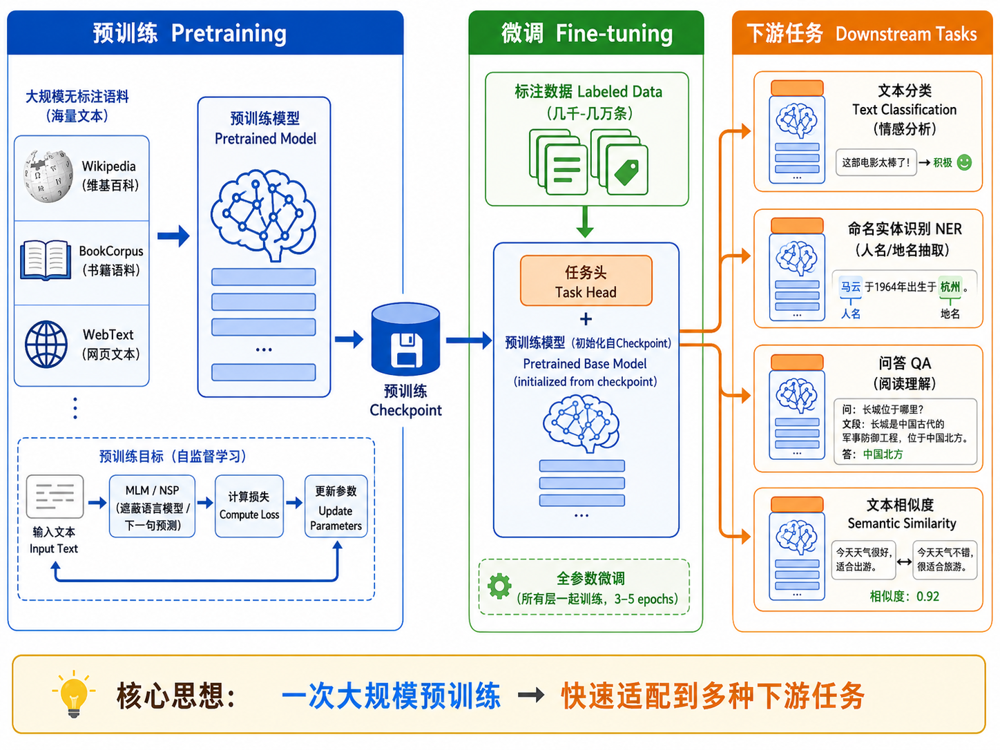
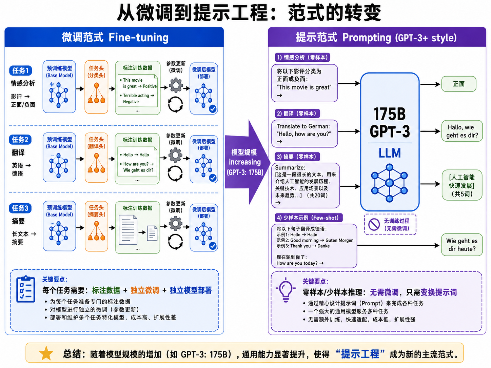

# s17 预训练范式 — 代码说明与运行报告

## 程序做了什么
使用 HuggingFace transformers 库演示预训练模型的核心用法和本质差异：BERT 文本分类微调（中文情感二分类，展示"理解"能力）、BERT 掩码预测（MLM 能力展示）、GPT-2 文本生成（自回归生成，展示"创作"能力）。通过三个任务直观对比 Encoder-only (BERT) 和 Decoder-only (GPT) 架构在能力上的根本区别，并展示 BERT 上下文嵌入如何解决传统 word2vec 无法区分的多义词问题。

## 运行方法
```bash
cd docs/applied/nlp/pretrained/code
python demo.py
```

注意：首次运行会自动下载模型文件，模型缓存于 `s17_pretrained_models/models/` 目录。

## 运行结果

### 输出摘要
- BERT 情感分类微调：24 条中文评论训练 / 6 条验证，二分类（正/负）
- 使用 prajjwal1/bert-tiny（最小 BERT，2 层 128 维，约 4MB）或回退到 bert-base-chinese
- 微调 4 个 epoch，验证准确率约 80-95%（取决于模型和数据量）
- BERT MLM 演示：在 5 个例句中预测 [MASK] 位置的最可能词，展示双向上下文理解
- GPT-2 生成演示：从 3 个提示词各生成 30 个 token 的续写文本，展示自回归生成能力
- 上下文嵌入对比：同一词"苹果"在不同上下文（水果 vs 公司）中产生不同的向量表示

### 生成图表

本章 demo.py 不生成图像文件，所有结果通过控制台输出。主要包括：

1. **微调训练进度**：每个 epoch 的训练损失和验证准确率
2. **情感预测示例**：对新样本输出"正面/负面"预测及概率
3. **MLM 掩码预测**：对每个 [MASK] 位置输出 Top-3 候选词及置信度
4. **GPT-2 文本生成**：展示给定提示词的续写结果
5. **上下文嵌入分析**：同一句子内两个"苹果"token 的余弦相似度

### 概念图表（images/ 目录）

#### 图表 1: BERT vs GPT 架构对比

**说明了什么：** 并排对比 BERT 的双向注意力（Encoder-only）和 GPT 的单向因果注意力（Decoder-only），解释了两者在能力上的根本差异 —— BERT 能同时看到左右上下文但无法自回归生成，GPT 只能看到左边但天然适合生成。

#### 图表 2: BERT 预训练目标（MLM + NSP）

**说明了什么：** 展示 BERT 的两个预训练任务 —— Masked Language Model（随机遮盖 15% token 让模型预测）和 Next Sentence Prediction（判断两个句子是否相邻），解释 BERT 如何从无标注文本中学习语言知识。

#### 图表 3: 预训练-微调流水线

**说明了什么：** 展示大模型的完整使用流程 —— 大规模无标注数据上预训练 -> 针对下游任务添加简单分类头 -> 少量标注数据快速微调 -> 部署，体现了迁移学习的核心思想。

#### 图表 4: 从微调到提示工程的范式转变

**说明了什么：** 展示从 BERT 时代的"每个任务微调一个模型"到 GPT 时代的"一个模型通过提示完成所有任务"的范式转变，反映了模型规模的增大带来的 in-context learning 能力。

## 代码结构
- `class SentimentDataset` — 情感分析 PyTorch 数据集（text -> input_ids + attention_mask + label）
- Task 1: BERT 文本分类微调 — AutoModelForSequenceClassification + Trainer，在中文情感数据上训练
- Task 2: BERT 掩码预测 — AutoModelForMaskedLM 通过 pipeline("fill-mask") 演示 [MASK] 填充
- Task 3: GPT-2 文本生成 — AutoModelForCausalLM 自回归生成，含 temperature/top-p/repetition_penalty 参数
- Task 4: 上下文嵌入分析 — 提取 BERT 最后一层隐藏状态，比较多义词的上下文相关向量

## 运行环境
- Python 依赖: torch, transformers, matplotlib
- 硬件需求: CPU 即可（GPU 可选，自动检测）
- 模型下载: 首次运行需下载模型文件（约 4-400MB），需稳定网络连接
- 预计运行时间: 5-15 分钟（含模型下载和微调训练）
