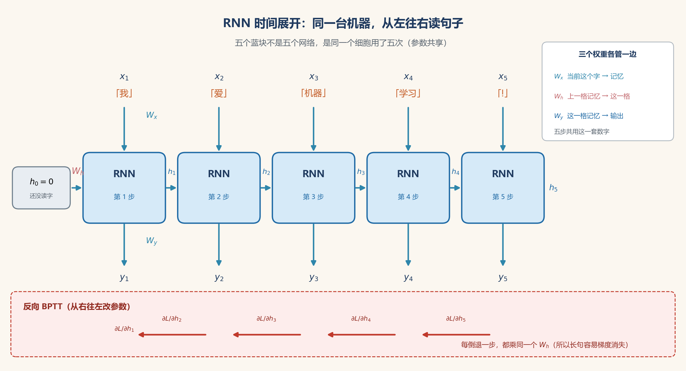
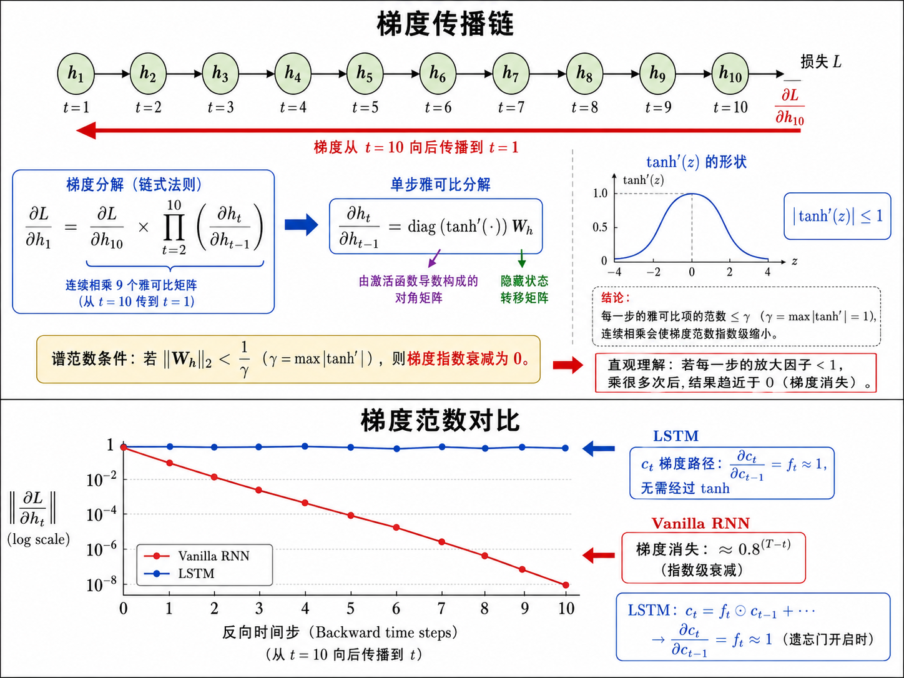
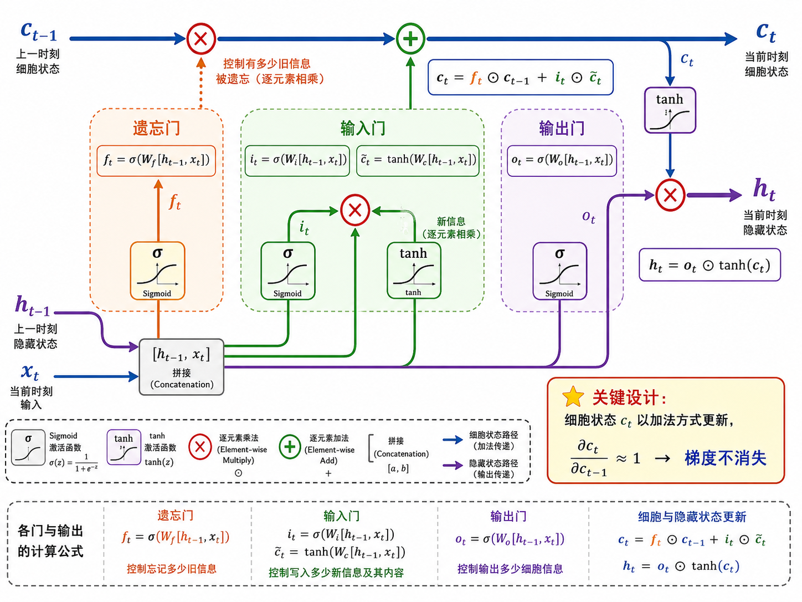
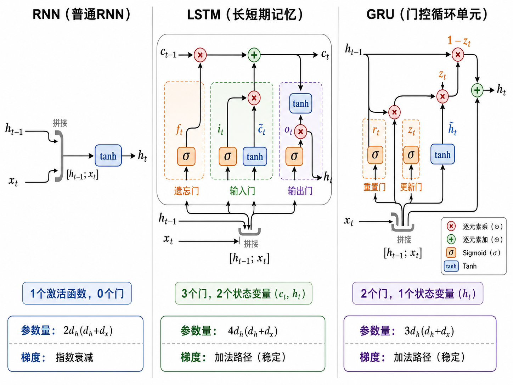

# s15 序列模型：RNN → LSTM → GRU

> [!WARNING]
> 🧪 Beta公测版本提示：教程主体已完成，正在优化细节，欢迎大家提Issue反馈问题或建议。


> 文本是有顺序的——"我爱你"和"你爱我"是两回事。序列模型专门处理这种时序数据。词向量从哪来见 [文本表示](/applied/nlp/text-representation/)；抛弃循环、改用全体互看见 [Transformer](/applied/nlp/transformer/)。本章把 RNN 的连乘梯度账算清楚，再看 LSTM 那条加法公路为什么能让句首主语活到句末。

---

## 一、为什么序列需要专门的模型？

传统的全连接网络（MLP）和卷积网络（CNN）在处理序列数据时有根本性的局限：

**MLP 的问题**：
- 输入维度固定——无法处理变长序列
- 每个输入位置独立处理——"我/爱/你"三个词分别进入三层神经元，没有时序关联
- 参数与位置绑定——第 1 个词的权重只能学第 1 个位置的特征

**CNN 的问题**：
- 卷积核有固定感受野——只能看到局部上下文
- 虽然可以通过堆叠层增大感受野，但长距离依赖仍然难以建模
- 不是为序列专门设计的，缺乏显式的时序记忆机制

**序列模型的核心需求**：
1. 变长输入处理能力
2. 参数**跨时间步共享**（同一套参数处理不同位置）
3. 显式的**记忆机制**，能捕捉长距离依赖
4. 输入顺序敏感

循环神经网络（RNN）通过一个优雅的循环结构同时满足了以上所有需求。

---

## 二、RNN：循环的魔力

### 2.1 一个 cell 是什么

外面看到的「五个蓝块」不是五套网络，是**同一台小机器用了五次**。这台小机器叫 **cell（细胞）**：每次只吃**当前这一个字**和**上一格留下的记忆**，吐出**这一格的新记忆**（以及可选的输出）。

$$
\text{RNNCell}:\quad (x_t,\, h_{t-1}) \;\mapsto\; h_t
$$

PyTorch 里 `nn.RNNCell` 就是这一格；`nn.RNN` 是把这一格在整段序列上自动循环。后面 LSTM / GRU 同理：`LSTMCell` / `GRUCell` 走一步，`LSTM` / `GRU` 走整段。世界模型里的 [RSSM](/world-models/abstract/rssm/) 之所以用 `GRUCell` 而不是 `GRU`，就是每一步还要插先验 / 后验，必须自己控循环。

### 2.2 核心公式

RNN 细胞内部只有**一本账**——隐藏状态 $h$。没有「先决定留多少、再决定写多少」，每一步都是整包搅匀：

$$
h_t = \tanh(W_h h_{t-1} + W_x x_t + b)
$$

- $h_t \in \mathbb{R}^{d_h}$：时间步 $t$ 的**隐藏状态**（hidden state），是网络此刻的全部记忆
- $h_{t-1}$：上一格记忆——已经揉进了 $x_1,\ldots,x_{t-1}$
- $x_t \in \mathbb{R}^{d_x}$：当前这个字 / 这一帧
- $W_h \in \mathbb{R}^{d_h \times d_h}$：记忆到记忆的权重（**循环连接**，五个蓝块共用这一套）
- $W_x \in \mathbb{R}^{d_h \times d_x}$：当前输入写进记忆的权重
- $\tanh$：把每一维压到 $(-1,1)$，防止数值炸掉

> **核心直觉**：$h_t$ 是「刚才记住的」和「现在读到的」线性混合，再挤过 $\tanh$。像人读书：每读一个词，旧印象和这个词搅在一起，变成新印象。代价是：**旧印象没有原路可走，必须整包过矩阵和非线性。**

demo 里对应 `MyRNNCell`：`h = tanh(W_ih(x) + W_hh(h_prev))`。完整实现见 [code-demo](./code-demo)，文件在仓库 `docs/applied/nlp/sequence-models/code/demo.py`。

### 2.3 时间展开（Unrolling）

同一个细胞（同一套 $W_h, W_x$）在不同时间步被反复调用。把时间拉开，它看起来像很深的全连接网——每一层一个时间步，但所有层**共享参数**：

```
x_1 → [RNN] → h_1 → [RNN] → h_2 → [RNN] → h_3 → ... → h_T
         ↑共享W_h,Wx↑      ↑共享W_h,Wx↑
```

序列多长都是这一套数，模型体积不随句长增长。这就是「能处理变长输入」的来源。



> **怎么读这张图**：五个蓝块是**同一个**细胞用了五次。从上往下：字 $x_t$ 经 $W_x$ 进记忆；从左往右：上一格记忆经 $W_h$ 传到这一格；再往下：记忆经 $W_y$ 变成输出 $y_t$。底栏红箭头是训练时从右往左回传。图中“每步只乘 $W_h$”是省略写法：前向局部雅可比为 $J_t=\mathrm{diag}(1-h_t^2)W_h$，列向量形式的反传乘 $J_t^\top$；激活导数不能忽略，长程梯度可能消失也可能爆炸。

### 2.4 BPTT：梯度为什么是「乘法」在时间里走 {#bptt}

训练时要把最后的损失 $L$ 告诉很早的 $h_1$，好改那一套共享的 $W_h$。这叫 **BPTT**（Backpropagation Through Time，沿时间反向传播）。算法和普通反向传播是同一套链式法则，只是这条链沿着时间排开。

$W_h$ 的梯度要**累加**每一步的贡献（因为每一步都用了它）：

$$
\frac{\partial L}{\partial W_h} = \sum_{t=1}^{T} \frac{\partial L_t}{\partial W_h}
$$

要让第 $T$ 步的损失碰到第 $1$ 步的记忆，必须把相邻两格的影响**连乘**起来：

$$
\frac{\partial L}{\partial h_1}
=
\frac{\partial L}{\partial h_T}
\cdot
\frac{\partial h_T}{\partial h_{T-1}}
\cdot
\frac{\partial h_{T-1}}{\partial h_{T-2}}
\cdots
\frac{\partial h_2}{\partial h_1}
=
\frac{\partial L}{\partial h_T}
\prod_{t=2}^{T}
\frac{\partial h_t}{\partial h_{t-1}}
$$

RNN 的前向是 $h_t=\tanh(z_t)$、$z_t=W_h h_{t-1}+W_x x_t$，所以**相邻两步之间**那一项就是

$$
\frac{\partial h_t}{\partial h_{t-1}}
=
\mathrm{diag}\bigl(\tanh'(z_t)\bigr)\, W_h
$$

「信息以乘法的方式在时间中传播」说的不是输入里写了个乘号，而是：

> **旧记忆对更晚记忆的影响，等于一串「$\tanh'$ 再乘 $W_h$」连乘。** 前向每走一步，旧信息被矩阵打一次折、再被 $\tanh$ 挤一次；反传要原路回去，折扣就连乘。

$|\tanh'(z)|\le 1$，多数位置远小于 $1$。$W_h$ 的谱范数也常常 $<1$。于是每倒退一步大约再乘一个小于 $1$ 的因子 $\gamma$。打个折扣账：

| 倒退步数 | 若每步 $\gamma=0.8$ | 直觉 |
|----------|---------------------|------|
| $1$ | $0.8$ | 上一字还在 |
| $10$ | $0.8^{9}\approx 0.13$ | 已经淡了 |
| $20$ | $0.8^{19}\approx 0.014$ | 几乎没了 |
| $50$ | $0.8^{49}\sim 10^{-5}$ | 句首梯度到不了句末 |

这就是**梯度消失**：不是公式写错了，是这条乘法链太长。若每次 $\gamma>1$，连乘则会**梯度爆炸**。长句、长轨迹里，RNN 学不会「第一句的主语管最后那个动词」，根子在这里。

::: details 逐步推导：从 $h_t=\tanh(W_h h_{t-1}+\cdots)$ 到连乘 $\mathrm{diag}(\tanh')W_h$（点击展开）

$h_t=\tanh(z_t)$，$z_t=W_h h_{t-1}+W_x x_t$。对向量值 $\tanh$ 逐元素，雅可比是对角阵 $\mathrm{diag}(\tanh'(z_t))$，再右乘 $W_h$（因为 $z$ 对 $h_{t-1}$ 线性）。于是

$$
\frac{\partial h_t}{\partial h_{t-1}}=\mathrm{diag}(1-\tanh^2(z_t))\,W_h.
$$

$\tanh'\le 1$，等号只在 $0$ 处。$T$ 步连乘后，若每步谱半径 $\gamma<1$，范数以 $\gamma^{T}$ 掉。这和 [导数](/math/derivative/) 的链式法则是同一句话，只是链沿着时间排了 $T$ 节，而且每节共用同一个 $W_h$。

LSTM 把「对 $h$ 的连乘」改成「对 $c$ 的连乘 $f_t$」。若遗忘门接近 1，连乘不衰减，梯度可以沿细胞状态走很远。门是 sigmoid 出来的，可以学习「这一维先别忘」。

:::



> **怎么读这张图**：上半是链式法则拆成「每步一个雅可比」；下半对数坐标里，普通 RNN 的 $\|\partial L/\partial h_t\|$ 往回走直线往下掉，LSTM 的细胞状态几乎走平。

---

## 三、LSTM：另开一条加法公路，再装三个门 {#lstm-cell}

LSTM（Long Short-Term Memory，Hochreiter & Schmidhuber, 1997）**没有改 BPTT 这套算法**，改的是细胞**前向**怎么走：不要让长期记忆每一步都过 $W_h$ 和 $\tanh$。

### 3.1 一个 cell 上，RNN 和 LSTM 差在哪

| | RNN cell | LSTM cell |
|--|----------|-----------|
| 保管的状态 | 只有 $h_t$ | **两本账**：$c_t$（长期笔记）和 $h_t$（这一步对外输出） |
| 一步接口 | $(x_t,h_{t-1})\to h_t$ | $(x_t,h_{t-1},c_{t-1})\to(h_t,c_t)$ |
| 旧记忆怎么变成新的 | 整包：$h_t=\tanh(W_h h_{t-1}+W_x x_t)$ | 公路上**加**：$c_t=f_t\odot c_{t-1}+i_t\odot\tilde{c}_t$ |
| 有没有开关 | 无 | 三个门 $f,i,o$，每个都是 $0\sim 1$ 的旋钮 |
| 反传时相邻两步乘什么 | $\mathrm{diag}(\tanh')W_h$ | 在 $c$ 上主要是遗忘门 $f_t$ |

> **图示勘误**：原图将 $f\to i\to\tilde c\to o$ 画成串联流水线，容易误读，暂不展示。实际上 $f_t,i_t,o_t$ 和候选值 $\tilde c_t$ 分别从同一份 $[h_{t-1},x_t]$ 计算，三个门使用 sigmoid，候选值使用 tanh；再按 $c_t=f_t\odot c_{t-1}+i_t\odot\tilde c_t$、$h_t=o_t\odot\tanh(c_t)$ 组合。

> **核心区别**：RNN 将旧状态与输入做仿射变换再过 tanh；LSTM 为细胞状态提供加法更新通路。沿细胞状态的直接通路，局部导数是 $f_t$；完整反传还包含门和隐藏状态的其他依赖，不能据此保证梯度永不消失。

### 3.2 「乘法传播」对应哪条公式，门要解决什么

上一节 [2.4 BPTT](#bptt) 里，RNN 相邻两步乘的是 $\mathrm{diag}(\tanh')W_h$。有用的主语和没用的语气词都挤在同一个 $h$ 里，每一步还被 $\tanh$ 再压一遍。我们需要的是：

1. 一条**可以几乎原样往前加**的笔记 $c_t$（不要每步搅匀）
2. 一组**学出来的 0～1 开关**，决定这条笔记「擦掉哪几维、写入哪几维、对外露出哪几维」

门不是 discrete 的 0/1 电闸，是 sigmoid 拧出来的**连续旋钮**，这样才能对 $W_f$ 求导。

### 3.3 细胞状态 $c_t$ 怎样引进来

先不管门，只看 LSTM 最狠的那一行——给记忆另开一本账，默认用**加法**更新：

$$
c_t = f_t \odot c_{t-1} + i_t \odot \tilde{c}_t
$$

- $c_{t-1}$：上一格的长期笔记（可以一路从句首抬过来）
- $f_t$：遗忘门，**逐维**决定旧笔记留几成（$\odot$ 是逐元素乘，每个记忆槽位自己的开关）
- $\tilde{c}_t$：根据当前字新写的候选内容
- $i_t$：输入门，决定新内容写进笔记几成

当某一维 $f_t=1$、$i_t=0$ 时，这一维就是 $c_t=c_{t-1}$：**原样拷贝，不过 $\tanh$，也不乘 $W_h$。** 这就是「信息高速公路」。有东西要记时再把 $i_t$ 拧开，把 $\tilde{c}_t$ **加**上去——加，而不是整包替换。

### 3.4 三个门是怎样从 $[h_{t-1},x_t]$ 拧出来的

门不看 $c$ 本身（经典 LSTM 如此），只看「上一刻对外说了什么」和「现在读到什么」：把 $h_{t-1}$ 和 $x_t$ **拼接**成一根长向量，各乘一套权重，再过 sigmoid / $\tanh$。

**遗忘门** — 旧笔记留几成：

$$
f_t = \sigma(W_f \cdot [h_{t-1}, x_t] + b_f)
$$

**输入门** — 新内容写几成：

$$
i_t = \sigma(W_i \cdot [h_{t-1}, x_t] + b_i)
$$

**候选细胞状态** — 新内容本身（仍用 $\tanh$ 压到 $(-1,1)$）：

$$
\tilde{c}_t = \tanh(W_c \cdot [h_{t-1}, x_t] + b_c)
$$

**输出门** — 笔记对外露几成（$c$ 是内部账本，$h$ 才是这一步给下一层、给下一步门看的）：

$$
o_t = \sigma(W_o \cdot [h_{t-1}, x_t] + b_o)
$$

$$
h_t = o_t \odot \tanh(c_t)
$$

$\sigma$ 把值挤到 $(0,1)$，所以叫「门」：$0$ 关、$1$ 开、中间半开。四个线性层在代码里常合成一次大矩阵乘，再 `chunk` 成四段（见 `MyLSTMCell`）。

读「我爱机器学习！」时可以这么想象（一维开关的卡通版）：

1. 读到「我」：输入门打开，主语写进 $c$ 的某一维
2. 读中间修饰：「爱」「机器」「学习」——遗忘门接近 $1$，主语那一维几乎原样加下去
3. 读到「！」：也许拧小某些句法槽；输出门决定这一步的 $h$ 要不要强调句末语气

### 3.5 三门公式总表



> **怎么读这张图**：从左进 $c_{t-1}$、$h_{t-1}$、$x_t$。橙色遗忘门乘在公路上；绿色输入门和新候选 $\tilde{c}$ 相乘后**加**进公路；紫色输出门从 $c_t$ 滤出 $h_t$。黄框那行 $c_t=f\odot c_{t-1}+i\odot\tilde{c}$ 就是加法路径。

demo 里对应的三行就是整章的核心：

```python
c = f * c_prev + i * c_tilde   # 公路：留旧 + 写新
o = torch.sigmoid(o_gate)
h = o * torch.tanh(c)          # 对外只露一页笔记
```

### 3.6 门的直觉

| 门 | 作用 | 直觉 |
|----|------|------|
| 遗忘门 $f_t$ | $f_t \approx 0$：这一维旧笔记清掉 | 「读到句号，清空前文句法槽」 |
| 输入门 $i_t$ | $i_t \approx 1$：把 $\tilde{c}_t$ 写入 | 「遇到主语，记下谁在做事」 |
| 输出门 $o_t$ | 从 $c_t$ 滤出 $h_t$ | 「答题时只抄笔记里此刻用得上的几行」 |

> LSTM 像一个有条理的学生做笔记：遗忘门决定擦掉哪几行，输入门决定写下新知识点，输出门决定举手发言时念哪几行。笔记本本身是 $c$，发言内容是 $h$。

### 3.7 为什么这样梯度就不易消失

对公路本身、在某一维上求导（$f_t$ 暂时看成对 $c_{t-1}$ 常数——门由 $h,x$ 算出来，不直接含 $c$）：

$$
\frac{\partial c_t}{\partial c_{t-1}} = f_t
$$

若遗忘门学会 $f_t\approx 1$（「这段主语还得留着」），这一步梯度是 **$\times 1$**，不是 $\times\bigl(\mathrm{diag}(\tanh')W_h\bigr)$。从 $c_T$ 走回 $c_1$：

$$
\frac{\partial c_T}{\partial c_1}
=
f_T \odot f_{T-1} \odot \cdots \odot f_2
\approx
1 \odot 1 \odot \cdots
$$

长期内容可以几乎**原样走回**句首。这是加法公路，不是每步搅匀。

两点不要推过头：

- 门自己的权重 $W_f,W_i,W_o$ 仍然要经过 sigmoid / $\tanh$ 反传，那些旁路还是有非线性。LSTM 减轻的是**长期内容 $c$ 这条主干**。
- $f_t$ 若长期接近 $0$，这一维照样断。模型要学会「该留的时候把遗忘门拧到 $1$」——这也是为什么常把遗忘门偏置初始化成正数，训练初期先倾向于「多记住」。

一句话：**RNN 的 cell 把记忆整包乘进下一步；LSTM 的 cell 把记忆放在 $c$ 里按元素加，三个门只是学出来的 0～1 开关。** 反传仍是 BPTT，变的是这条链上每一步乘的是 $W_h\tanh'$ 还是 $f_t$。

### 3.8 常见疑问

**门是离散的开/关吗？** 不是。$\sigma$ 输出落在 $(0,1)$ 开区间，训练中是连续旋钮。说「打开 / 关掉」只是把靠近 $1$ / 靠近 $0$ 说成开关。

**LSTM 改了反向传播算法吗？** 没有。还是 BPTT。改的是前向递推：多了一条 $c$ 的加法通路，雅可比从 $\mathrm{diag}(\tanh')W_h$ 变成（主干上）$f_t$。

**为什么还要 $h$，不直接把 $c$ 当输出？** $c$ 是内部笔记本，量级可以慢慢攒；对外给下一层、给下一步的门看时，先 $\tanh$ 压一压再被 $o_t$ 筛选，避免把还没整理的长期笔记整本泄露出去。下一步的三个门吃的是 $h_{t-1}$ 和 $x_t$，不直接吃 $c_{t-1}$（经典 LSTM）。

**五个蓝块和 cell 是什么关系？** 蓝块 = 同一细胞的五次调用。RNN / LSTM 的差别全部发生在**一块内部**；展开方式、共享参数、BPTT 的「沿时间连乘」框架是一样的。

---

## 四、GRU：LSTM 的精简版

Cho et al. (2014) 提出 GRU（Gated Recurrent Unit），把 LSTM 的三个门收成两个，并且**不再单独保管** $c_t$：长期记忆和对外输出共用一本 $h$。主干仍然是**加法插值**（所以梯度通路和 LSTM 同类），不是 RNN 那种整包 $\tanh$。

**重置门**（reset gate）— 控制忽略多少历史信息：

$$
r_t = \sigma(W_r \cdot [h_{t-1}, x_t])
$$

**更新门**（update gate）— 控制保留多少旧状态 vs 写入多少新状态：

$$
z_t = \sigma(W_z \cdot [h_{t-1}, x_t])
$$

**候选隐藏状态**— 用重置门过滤后的历史 + 当前输入：

$$
\tilde{h}_t = \tanh(W_h \cdot [r_t \odot h_{t-1}, x_t])
$$

**最终隐藏状态**— 更新门做线性插值：

$$
h_t = (1 - z_t) \odot h_{t-1} + z_t \odot \tilde{h}_t
$$

GRU 的核心直觉是 $z_t$（更新门）同时做了 LSTM 遗忘门和输入门的工作。当 $z_t \approx 0$ 时，$h_t \approx h_{t-1}$（保留全部历史）；当 $z_t \approx 1$ 时，$h_t \approx \tilde{h}_t$（完全更新为新状态）。

---

## 五、RNN vs LSTM vs GRU 对比

| 特性 | RNN | LSTM | GRU |
|------|-----|------|-----|
| 门数量 | 0 | 3 | 2 |
| 状态变量 | $h_t$ | $h_t$, $c_t$ | $h_t$ |
| 梯度传播 | 指数衰减 | 加法路径（稳定） | 加法路径（稳定） |
| 参数量 | $2d_h(d_h+d_x)$ | $4d_h(d_h+d_x)$ | $3d_h(d_h+d_x)$ |
| 训练速度 | 快 | 慢 | 中等 |
| 长序列表现 | 差 | 最好 | 好 |
| 典型场景 | 简单时序预测 | 机器翻译、复杂序列 | 当 LSTM 太大时替代 |



---

## 六、双向 RNN

标准 RNN/LSTM/GRU 只能从左到右处理序列——$t$ 时刻的隐藏状态只包含 $t$ 之前的信息。但在很多 NLP 任务中，$t$ 时刻的输出需要**同时**利用左右两侧的上下文。

双向 RNN（Bidirectional RNN）同时运行两个独立的循环网络：

- **前向** RNN：从左到右处理，$\overrightarrow{h_t} = \text{RNN}(x_t, \overrightarrow{h_{t-1}})$
- **后向** RNN：从右到左处理，$\overleftarrow{h_t} = \text{RNN}(x_t, \overleftarrow{h_{t+1}})$
- **拼接输出**：$h_t = [\overrightarrow{h_t}; \overleftarrow{h_t}]$

双向 RNN 在序列标注（NER、词性标注）和文本分类中极其有效。但无法用于自回归生成（因为你无法看到"未来"的词）。

---

## 七、RNN vs Transformer：时代的交替

2017 年 Transformer 出现后，RNN 系模型在 NLP 中的主导地位逐渐被取代。但这并不意味着 RNN 不再重要：

| 场景 | 选择 |
|------|------|
| 长序列（>2048 tokens）且追求最优效果 | Transformer（全局自注意力） |
| 流式/实时处理、逐时间步推理 | RNN/LSTM（自然支持） |
| 计算资源受限 | GRU（参数少、推理快） |
| 时间序列预测（金融、传感器） | LSTM（仍广泛使用） |
| 学习 RNN 原理、BPTT、门控机制 | 必须掌握（本章重点） |

> **学习价值**：RNN→LSTM→GRU→Transformer 这条技术演进路线的每一步都解决了一个明确的问题。只有理解了每一步"为什么"，才能真正理解 Transformer 的注意力机制"好在哪里"。

---

## 八、本节小结

| 概念 | 一句话总结 |
|------|-----------|
| cell | 一步映射；RNN 是 $(x,h)\to h$，LSTM 是 $(x,h,c)\to(h,c)$ |
| RNN | 同一套参数在时间上循环；记忆整包过 $W_h$ 和 $\tanh$ |
| 乘法传播 | $\partial h_t/\partial h_{t-1}=\mathrm{diag}(\tanh')W_h$，连乘导致梯度消失 |
| BPTT | 仍是链式法则，沿展开后的时间往回传；LSTM 没改这套算法 |
| 细胞状态 $c_t$ | 加法公路 $c_t=f\odot c_{t-1}+i\odot\tilde{c}$，$\partial c_t/\partial c_{t-1}=f_t$ |
| 遗忘 / 输入 / 输出门 | 三个 sigmoid 旋钮：留旧、写新、对外露哪几维 |
| GRU | LSTM 精简版：合并 $c$ 和 $h$，双门，仍是加法插值 |
| 双向 RNN | 前向+后向处理，适合标注任务 |
| Transformer | s16 主题，注意力取代循环连接 |

> 下一节 [s16 Attention 与 Transformer](/applied/nlp/transformer/) 将讨论：序列模型的 seq2seq 架构遇到什么瓶颈，注意力机制如何优雅地解决它，并最终催生了取代 RNN 的全新范式。

## 📥 Code

| File | View | Download |
|------|------|----------|
| demo.py | [Open](./code-demo) | <a href="/notebook/code/applied/nlp/sequence-models/demo.py" target="_blank" download>Download</a> |
| exercise.py | [Open](./code-exercise) | <a href="/notebook/code/applied/nlp/sequence-models/exercise.py" target="_blank" download>Download</a> |

## 参考

1. Hochreiter, S. & Schmidhuber, J. (1997). Long Short-Term Memory. *Neural Computation*. (LSTM) [[doi:10.1162/neco.1997.9.8.1735](https://doi.org/10.1162/neco.1997.9.8.1735)]
2. Cho, K., et al. (2014). Learning Phrase Representations using RNN Encoder-Decoder for Statistical Machine Translation. *EMNLP 2014*. (GRU) [[arXiv:1406.1078](https://arxiv.org/abs/1406.1078)]
3. Sutskever, I., Vinyals, O., & Le, Q. V. (2014). Sequence to Sequence Learning with Neural Networks. *NeurIPS 2014*. (Seq2Seq) [[arXiv:1409.3215](https://arxiv.org/abs/1409.3215)]

