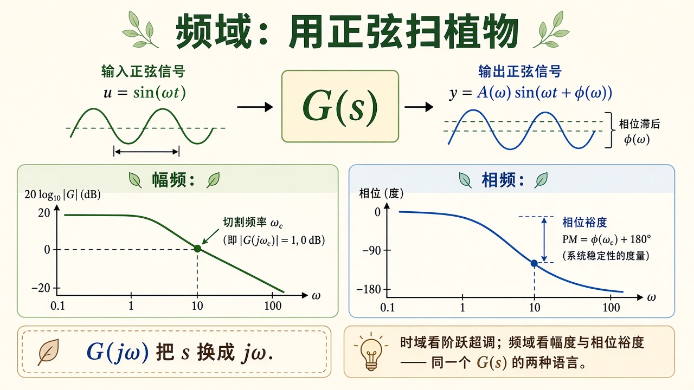
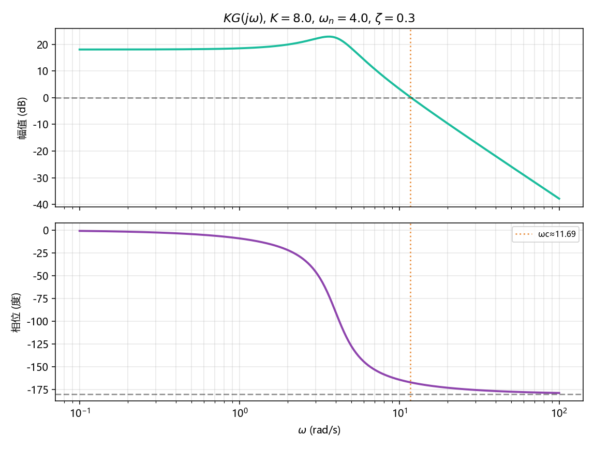

# 频域：用正弦扫植物

> [!WARNING]
> 🧪 Beta公测版本提示：教程主体已完成，正在优化细节，欢迎大家提Issue反馈问题或建议。

> 时域看阶跃超调；频域把 $s$ 换成 $j\omega$，看植物对每个频率的正弦放大多少、落后多少相。**相位裕度**回答「增益再大一点会不会晃到不稳定」。根轨迹用 $K$ 搬极点，Bode 用 $\omega$ 读裕度，说的是同一条回路。二阶 $G(s)$ 见 [传递函数](/control/classical/transfer/)。

---

## 一、$G(j\omega)$ 是复数增益

稳态时，输入 $\sin(\omega t)$，输出仍是同频正弦，只是幅度变成 $|G(j\omega)|$，相位加上 $\arg G(j\omega)$。幅频习惯画

$$
L(\omega)=20\log_{10}|G(j\omega)|\quad(\mathrm{dB}),
$$

相频画角度。对数横轴让十年频程等宽。

> **图解说明**：上半正弦进、放大并落后相的正弦出；下半幅频过 0 dB 的频率叫穿越频率 $\omega_c$，该处相位距离 $-180^\circ$ 还剩多少就是相位裕度。

相位裕度（直觉）：

$$
\mathrm{PM}=\arg G(j\omega_c)+180^\circ,\quad |G(j\omega_c)|=1.
$$

PM 太小，阶跃会晃；PM 为负，已经不稳定。精确定义还要约定开环还是闭环传递函数；demo 画开环 $KG(j\omega)$，并标出 $|KG|=1$ 附近的相位。

---

## 二、代码在做什么

植物是 $K\cdot G(s)$，$G(s)=\omega_n^2/(s^2+2\zeta\omega_n s+\omega_n^2)$，$K=8$，$\omega_n=4$，$\zeta=0.3$。直流增益大于 $1$，幅频才会穿过 0 dB。对 `logspace` 上的 $\omega$ 直接代入 $s=j\omega$（Python 里 `1j`），算模和辐角。左图 dB，右图相位（度），虚线标穿越频率。

低频增益约 $18\,\mathrm{dB}$（$K=8$）；过了 $\omega_n$ 以约 $-40\,\mathrm{dB/dec}$ 往下掉。相位从 $0^\circ$ 掉到 $-180^\circ$。穿越频率附近的相位裕度会打在图上。

---

## 三、小结

| 概念 | 一句话 |
|------|--------|
| $G(j\omega)$ | 正弦稳态的复数增益 |
| 幅频 dB | $20\log_{10}\|G\|$ |
| $\omega_c$ | $\|G\|=1$ 的穿越频率 |
| PM | 距离 $-180^\circ$ 还剩多少相 |
| 下游 | 现代控制改用 $A,B$ 矩阵；频域仍常用来验裕度 |

> 经典控制到此收束。下一分组 [状态空间](/control/modern/state-space/)，或回去调 [PID](/control/classical/pid/)。

## 📥 Code

| File | View | Download |
|------|------|----------|
| demo.py | [Open](./code-demo) | <a href="/notebook/code/control/classical/frequency/demo.py" target="_blank" download>Download</a> |
| exercise.py | [Open](./code-exercise) | <a href="/notebook/code/control/classical/frequency/exercise.py" target="_blank" download>Download</a> |

## 参考

1. Bode, *Network Analysis and Feedback Amplifier Design*
2. Ogata, *Modern Control Engineering*
