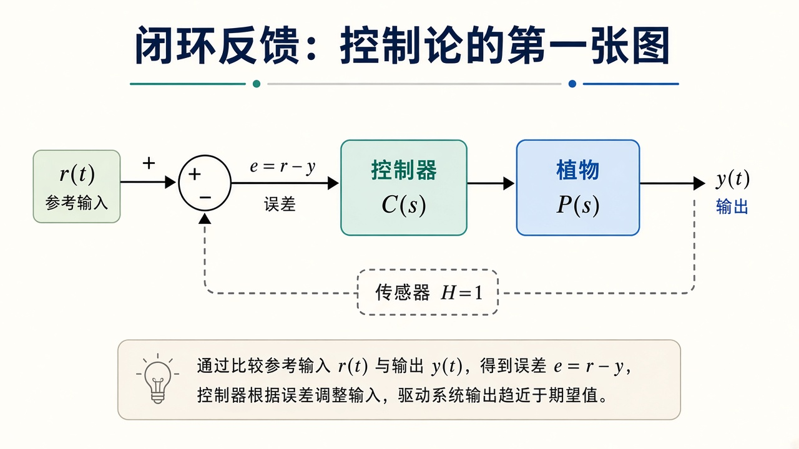
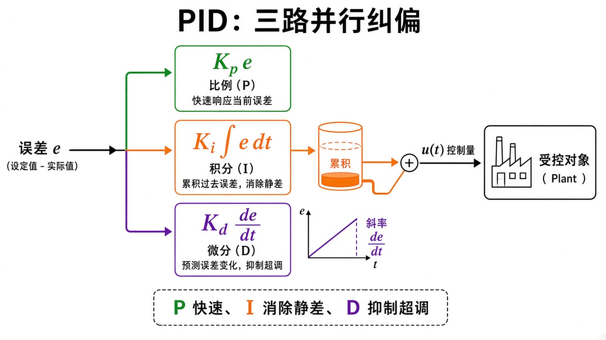
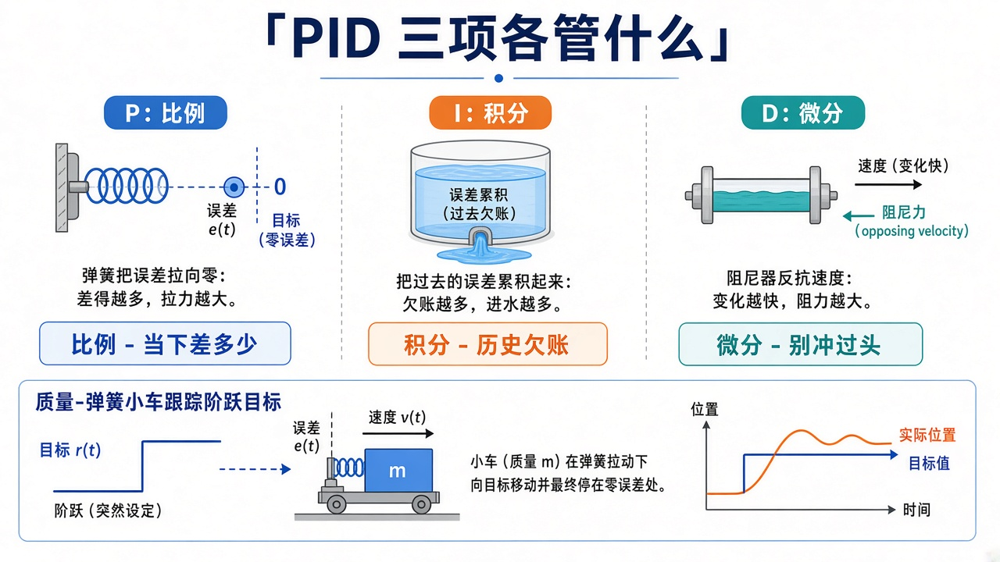
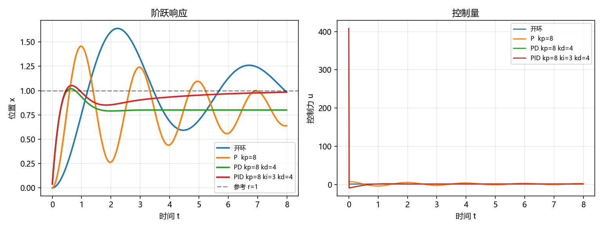

# PID 控制：误差怎么变成力

> [!WARNING]
> 🧪 Beta公测版本提示：教程主体已完成，正在优化细节，欢迎大家提Issue反馈问题或建议。

> 要把质量-弹簧-阻尼拉到目标位置，不能只「给一个稳态力」就指望它乖乖停住。本章只讲：**闭环反馈是什么、PID 三项各管什么、阶跃响应里超调与静差从哪来**。状态空间见 [状态空间](/control/modern/state-space/)，LQR 见 [LQR](/control/modern/lqr/)。本篇属于 [经典控制](/control/classical/)。

---

## 一、闭环：控制论的第一张图

开环是「算好输入，闭眼执行」。植物（plant）稍有模型误差、外力或初值，输出就会漂。闭环把输出 $y$ 送回来，和参考 $r$ 相减得到误差

$$
e = r - y,
$$

控制器 $C$ 只看 $e$，再决定作用到植物 $P$ 上的 $u$。单位反馈时传感器 $H=1$。

> **图解说明**：左端参考 $r(t)$ 与反馈 $y$ 在求和点相减得到 $e$；控制器 $C(s)$ 出 $u$，植物 $P(s)$ 出 $y$；虚线把 $y$ 送回。比较 $r$ 与 $y$，用误差驱动系统趋近期望。

传递函数写法 $C(s)$、$P(s)$ 是拉普拉斯域的习惯；demo 不走频域，直接在时间里用欧拉积分植物、用差分实现 PID。思想相同：**信息沿回路走一圈，误差才有机会被消掉**。

机器人关节伺服、[ROS 2](/ros2/overview/) 里的跟踪、[世界模型](/world-models/intro/) 里「预测再纠偏」，都是这张图的变体。

---

## 二、植物：质量-弹簧-阻尼

demo 的植物是二阶系统

$$
m\ddot x + c\dot x + k x = u.
$$

$u$ 是力，$x$ 是位置。弹簧要把质量拉回 $0$，所以要停在 $x=r\neq 0$，稳态必须有 $u_{\mathrm{ss}}=k r$ 抵弹簧。开环若突然加上这个力，暂态全靠 $m,c,k$ 自己振荡衰减——没有反馈，无法按你的意愿改超调。

改写成

$$
\ddot x = \frac{u - c\dot x - kx}{m}
$$

即可逐步积分。经典控制常在频域画 Bode；这里用时域阶跃，是为了让「P / PD / PID 差在哪」一眼看得见。

---

## 三、PID：三路并行纠偏

$$
u(t) = K_p e + K_i\int e\,\mathrm{d}t + K_d\frac{\mathrm{d}e}{\mathrm{d}t}.
$$

> **图解说明**：误差 $e$ 分成三路：绿路比例 $K_p e$ 快；橙路积分累积过去误差，消静差；紫路微分看斜率，抑制超调。三路相加得 $u$，送进受控对象。

<video controls muted loop playsinline preload="metadata" style="width:100%;max-width:960px;border-radius:8px;background:#f7fafc;margin:0.6rem 0;">
  <source src="./images/pid_anim.mp4" type="video/mp4">
</video>

> **动画说明**：同一质量-弹簧。纯 P 到不了 $r=1$；PD 超调变小仍可能留差；PID 把残差积掉。参数与 demo 相同。

| 项 | 数学 | 直觉 | 典型副作用 |
|----|------|------|------------|
| P | $K_p e$ | 现在差多少就推多猛 | 单靠 P，有弹簧/扰动时常留静差 |
| I | $K_i\int e$ | 差得越久推得越狠 | 消静差；太大易振荡、积分饱和 |
| D | $K_d\dot e$ | 误差正在变大就提前刹 | 抑超调；对测量噪声敏感 |

调参不是定理：先 P 到能跟、再 D 压超调、最后 I 啃掉静差。同一组 $(m,c,k)$ 上，开环 / 纯 P / PD / PID 的阶跃会排出四种病症。

> **图解说明**：P 像弹簧看当下误差；I 像水箱积欠账；D 像阻尼器看变化快慢。底下是质量-弹簧小车追阶跃。

::: details 逐步推导：为什么纯 P 对带弹簧的植物会留静差（点击展开）

稳态时 $\ddot x=\dot x=0$，植物变成 $k x_{\mathrm{ss}}=u_{\mathrm{ss}}$。纯 P：$u=K_p(r-x)$。代入

$$
k x_{\mathrm{ss}}=K_p(r-x_{\mathrm{ss}})\Rightarrow x_{\mathrm{ss}}=\frac{K_p}{K_p+k}r.
$$

只要 $k\neq 0$（有弹簧要把你拉回 $0$），$x_{\mathrm{ss}}$ 永远略小于 $r$。$K_p$ 再大也只是逼近，不能等于——除非 $K_p=\infty$，那会把噪声和不稳定一起放大。

积分项：稳态若仍有 $e\neq 0$，积分会一直涨，$u$ 一直加，直到 $e=0$ 才停。此时 $u_{\mathrm{ss}}=k r$ 正好由积分「记住」。这就是 I 消静差。

微分项不改变稳态（$\dot e=0$），只在暂态里提前刹车。离散实现常用

$$
u_k=K_p e_k+K_i\sum_{i\le k} e_i\Delta t+K_d\frac{e_k-e_{k-1}}{\Delta t}.
$$

对 $e$ 差分会放大测量噪声，所以真机常对 $y$ 低通再微分，或对 $-y$ 微分（参考 $r$ 阶跃时 $\dot r$ 是脉冲，不要让 D 去追它）。

demo 参数 $m=1,c=0.4,k=2,r=1$，与动画一致。

:::

---

## 四、代码在做什么

`demo.py` 用半隐式欧拉积分上述植物，对比四条轨迹：开环（$u=kr$）、P、PD、PID。左图位置 $x(t)$，右图控制力 $u(t)$；终端打印超调与末端静差。

你会看到：开环靠植物自己晃到 $r$；纯 P 往往上不去或留静差；PD 超调变小；加上 I 之后静差被积掉。植物参数 $m=1,\;c=0.4,\;k=2$，参考 $r=1$。

---

## 五、小结

| 概念 | 一句话 |
|------|--------|
| 闭环 | 用 $e=r-y$ 驱动 $u$，而不是开环猜输入 |
| 植物 | 本章是 $m\ddot x+c\dot x+kx=u$ |
| P / I / D | 快响应 / 消静差 / 抑超调 |
| 阶跃 | 突然改 $r$，看超调、调节时间、静差 |
| 下游 | 伺服、飞行器、工艺回路；下一章进状态空间 |

> 下一章可走 [根轨迹](/control/classical/root-locus/) 或直接进 [状态空间](/control/modern/state-space/)。机械臂几何见 [运动学](/robotics/kinematics/)。

## 📥 Code

| File | View | Download |
|------|------|----------|
| demo.py | [Open](./code-demo) | <a href="/notebook/code/control/classical/pid/demo.py" target="_blank" download>Download</a> |
| exercise.py | [Open](./code-exercise) | <a href="/notebook/code/control/classical/pid/exercise.py" target="_blank" download>Download</a> |

## 参考

1. Åström & Murray, *Feedback Systems*（反馈直觉极清楚）
2. Ogata, *Modern Control Engineering*（PID 与二阶系统阶跃）
