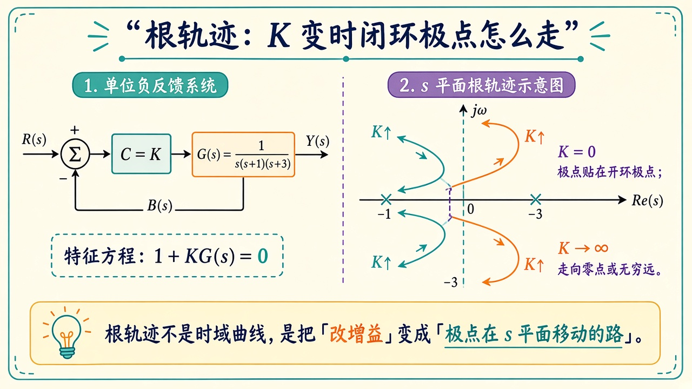
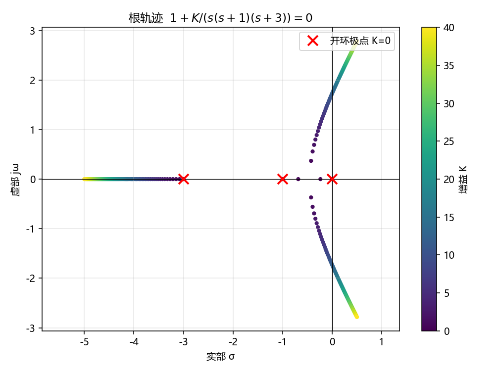

# 根轨迹：增益变了，极点往哪走

> [!WARNING]
> 🧪 Beta公测版本提示：教程主体已完成，正在优化细节，欢迎大家提Issue反馈问题或建议。

> 比例控制器 $C(s)=K$ 接在植物 $G(s)$ 前面、单位反馈时，闭环极点满足 $1+KG(s)=0$。**根轨迹**就是把 $K$ 从 $0$ 扫到很大，在 $s$ 平面画出这些根的路。它不是时域曲线。时域直觉见 [传递函数](/control/classical/transfer/)；频域裕度见 [Bode](/control/classical/frequency/)。

---

## 一、特征方程

demo 用教科书常客

$$
G(s)=\frac{1}{s(s+1)(s+3)},\qquad 1+KG(s)=0,
$$

展开成

$$
s^3+4s^2+3s+K=0.
$$

$K=0$ 时根就是开环极点 $0,-1,-3$。$K$ 增大，根离开这些点；有的沿实轴对撞后变成共轭复根，再进入右半平面——那就是「增益太大系统会晃到不稳定」。

> **图解说明**：左是 $K$ 套在 $G(s)$ 上的单位反馈；右是 $s$ 平面上 $K\uparrow$ 时极点离开开环极点（叉号）的轨迹。虚轴是稳定边界。

<video controls muted loop playsinline preload="metadata" style="width:100%;max-width:960px;border-radius:8px;background:#f7fafc;margin:0.6rem 0;">
  <source src="./images/locus_walk.mp4" type="video/mp4">
</video>

> **动画说明**：三条根随 $K$ 从 0 走到 40。还在左半平面时稳定；有根贴上或越过虚轴就开始振荡发散。

规则（本课够用的几条）：分支数 = 极点数；起点是开环极点；终点是开环零点或无穷远。完整 Evans 规则（渐近线夹角、出射角）可查 Ogata，demo 用 `np.roots` 硬算多项式，不背规则。

---

## 二、代码在做什么

`demo.py` 对一串 $K$ 求三次多项式的三个根，把实部、虚部撒在 $s$ 平面上，颜色表示 $K$ 大小。终端打印几个代表 $K$ 的根，以及「最大仍全在左半平面」的 $K$ 粗略值。

你会看到一条沿负实轴，另外两条在某个 $K$ 之后离开实轴、虚部变大，再穿过虚轴。穿过虚轴之后闭环会振荡发散。

---

## 三、小结

| 概念 | 一句话 |
|------|--------|
| $1+KG=0$ | 比例闭环的特征方程 |
| 根轨迹 | $K$ 变时闭环极点的几何轨迹 |
| 虚轴 | 稳定边界；跨过去就发散 |
| 下游 | [频域](/control/classical/frequency/) 用 Bode 看同一件事 |

> 下一章 [频域分析](/control/classical/frequency/)。现代侧把「搬极点」写成配置 $K$ 矩阵，见 [状态空间](/control/modern/state-space/)。

## 📥 Code

| File | View | Download |
|------|------|----------|
| demo.py | [Open](./code-demo) | <a href="/notebook/code/control/classical/root-locus/demo.py" target="_blank" download>Download</a> |
| exercise.py | [Open](./code-exercise) | <a href="/notebook/code/control/classical/root-locus/exercise.py" target="_blank" download>Download</a> |

## 参考

1. Evans, root-locus 方法
2. Ogata, *Modern Control Engineering*
