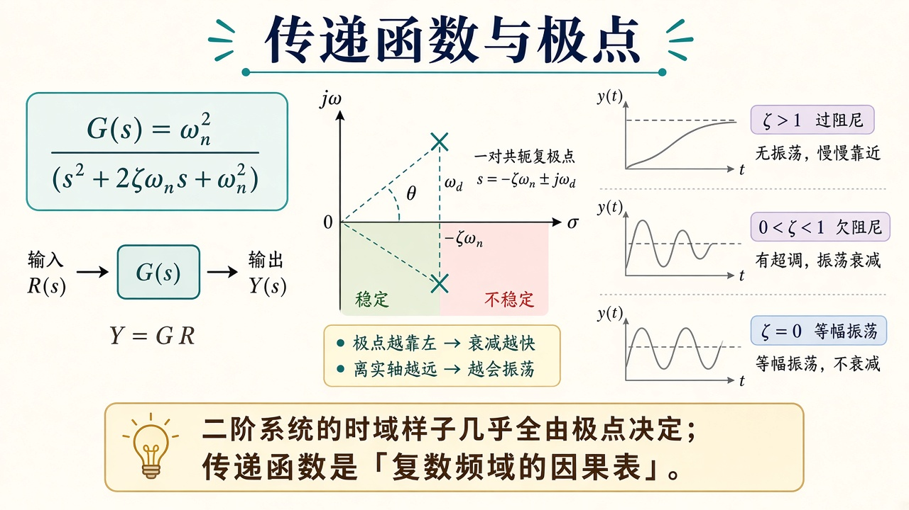
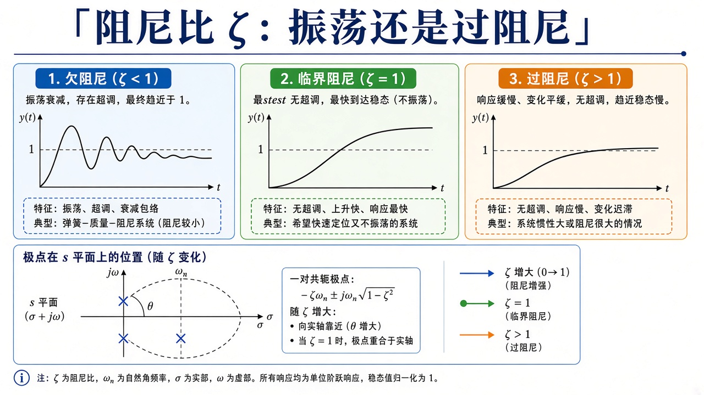
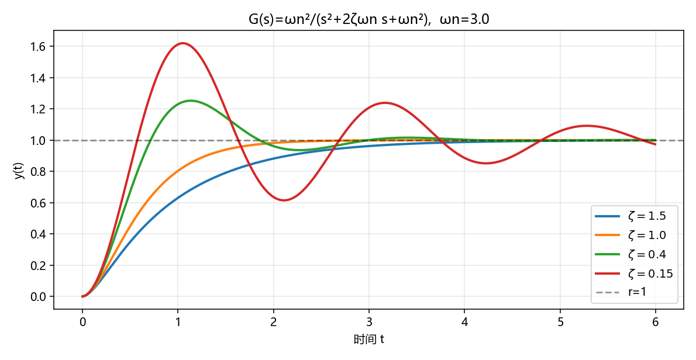

# 传递函数：极点怎样决定阶跃

> [!WARNING]
> 🧪 Beta公测版本提示：教程主体已完成，正在优化细节，欢迎大家提Issue反馈问题或建议。

> 拉普拉斯把微分方程变成代数：$Y(s)=G(s)U(s)$。你不必在本章做围道积分；只要记住 **$G(s)$ 的极点 = 特征根**，二阶阻尼 $\zeta$ 几乎写尽时域样子。PID 是在回路里塞一个具体的 $C(s)$，见 [PID](/control/classical/pid/)；增益扫极点见 [根轨迹](/control/classical/root-locus/)。

---

## 一、$G(s)$ 是一张因果表

线性时不变植物可以用传递函数

$$
G(s)=\frac{Y(s)}{U(s)}
$$

描述（零初始）。$s$ 是复数频率。分母的根叫**极点**，分子的根叫**零点**。左半平面极点 → 自由响应衰减；右半平面 → 发散；虚轴 → 等幅振荡（边际）。

标准二阶：

$$
G(s)=\frac{\omega_n^2}{s^2+2\zeta\omega_n s+\omega_n^2}.
$$

单位阶跃 $R(s)=1/s$ 时，输出形状几乎只由 $\zeta$ 决定。

> **图解说明**：左是 $Y=GR$；中是 $s$ 平面，左半稳定、右半不稳定，复极点的辐角与 $\zeta$ 有关；右是过阻尼 / 欠阻尼 / 无阻尼三种阶跃素描。

<video controls muted loop playsinline preload="metadata" style="width:100%;max-width:960px;border-radius:8px;background:#f7fafc;margin:0.6rem 0;">
  <source src="./images/zeta_anim.mp4" type="video/mp4">
</video>

> **动画说明**：$\omega_n=3$ 固定，只改 $\zeta$。过阻尼不晃；欠阻尼越来越晃。虚线是 $r=1$。

> **图解说明**：$\omega_n$ 固定时，$\zeta>1$ 不晃，$\zeta=1$ 刚好不超调，$\zeta<1$ 振荡衰减。$s$ 平面上极点随 $\zeta$ 张开。

::: details 逐步推导：标准二阶的极点怎样写成 $\zeta,\omega_n$（点击展开）

特征方程 $s^2+2\zeta\omega_n s+\omega_n^2=0$，求根公式：

$$
s=-\zeta\omega_n\pm\omega_n\sqrt{\zeta^2-1}.
$$

- $\zeta>1$：两个负实根，过阻尼。
- $\zeta=1$：重根 $-\omega_n$。
- $0\le\zeta<1$：共轭复根 $-\zeta\omega_n\pm j\omega_n\sqrt{1-\zeta^2}$。实部决定包络 $e^{-\zeta\omega_n t}$，虚部是振荡频率。$\zeta$ 越小，极点越靠近虚轴，晃得越久。

单位阶跃 $U=1/s$，$Y=G/s$。反演不必手算：demo 直接积

$$
\ddot y+2\zeta\omega_n\dot y+\omega_n^2 y=\omega_n^2 r.
$$

超调近似 $\sigma\approx\exp(-\zeta\pi/\sqrt{1-\zeta^2})$ 来自复极点的冲激响应包络在第一个峰的取值。$\zeta=0$ 时指数不衰减，等幅振荡。

:::

---

## 二、阻尼比对照表

| $\zeta$ | 名字 | 阶跃 |
|---------|------|------|
| $>1$ | 过阻尼 | 不超调，较慢 |
| $=1$ | 临界 | 刚好不振荡的最快无超调 |
| $(0,1)$ | 欠阻尼 | 超调后衰减振荡 |
| $=0$ | 无阻尼 | 等幅振荡 |
| $<0$ | 负阻尼 | 发散（极点在右半平面） |

超调量（欠阻尼）有近似

$$
\sigma \approx \exp\Big(-\frac{\zeta\pi}{\sqrt{1-\zeta^2}}\Big).
$$

demo 不套这公式，直接积分 ODE，再量 $\max y - r$。

---

## 三、代码在做什么

`demo.py` 固定 $\omega_n=3$，扫描 $\zeta\in\{1.5,1.0,0.4,0.15\}$，欧拉积分标准二阶，画阶跃并打印超调。图里没有拉普拉斯反演：传递函数只用来提醒「我们积的就是 $G(s)$ 对应的微分方程」。

$\zeta=1.5$ 最肉；$\zeta=1$ 贴着临界；$\zeta=0.4$ 有一截超调；$\zeta=0.15$ 晃好几下才停。

---

## 四、小结

| 概念 | 一句话 |
|------|--------|
| $G(s)$ | 零初始下 $Y=GU$ |
| 极点 | 分母的根，决定稳不稳、晃不晃 |
| $\zeta$ | 二阶阻尼比，时域「性格」 |
| 下游 | [PID](/control/classical/pid/) 把 $C(s)$ 接进回路 |

> 下一章 [PID](/control/classical/pid/) 或跳到 [根轨迹](/control/classical/root-locus/)。

## 📥 Code

| File | View | Download |
|------|------|----------|
| demo.py | [Open](./code-demo) | <a href="/notebook/code/control/classical/transfer/demo.py" target="_blank" download>Download</a> |
| exercise.py | [Open](./code-exercise) | <a href="/notebook/code/control/classical/transfer/exercise.py" target="_blank" download>Download</a> |

## 参考

1. Ogata, *Modern Control Engineering*（二阶阶跃与 $\zeta$）
2. 上一章 [控制论导论](/control/overview/)
