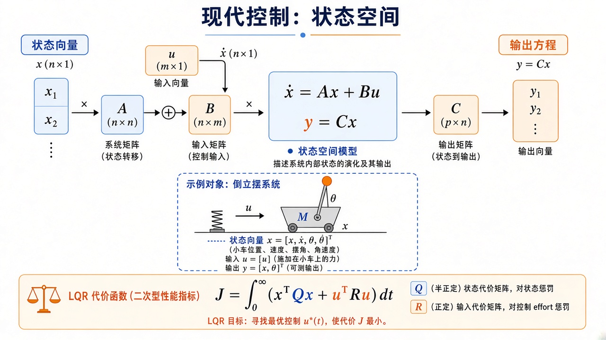

# 现代控制：状态这门语言

> [!WARNING]
> 🧪 Beta公测版本提示：教程主体已完成，正在优化细节，欢迎大家提Issue反馈问题或建议。

> 植物一复杂，一个误差标量不够用。现代控制把内部量收进向量 $x$，写成 $\dot x=Ax+Bu$，再用增益表 $u=-Kx$。LQR 用 $Q,R$ 自动给 $K$；测不全时用卡尔曼估 $\hat x$；非线性时用能量函数 $V$ 代替「把极点放到左半平面」。PID 时域直觉见 [经典控制](/control/classical/)。

> **图解说明**：上半是 $\dot x=Ax+Bu$、$y=Cx$；中段倒立摆说明状态可以比输出长；下段 $Q$ 罚偏离、$R$ 罚用力。四章分别把这张图拆开讲。

| 章 | 在问什么 |
|----|----------|
| **[状态空间](/control/modern/state-space/)** | $A,B,C$；能控性；极点配置 $u=-Kx$ |
| **[LQR 与最优控制](/control/modern/lqr/)** | 二次代价、Riccati、双积分器上的最优增益 |
| **[观测器与卡尔曼](/control/modern/kalman/)** | 只测得到一部分状态时：预测再修正 |
| **[非线性与李雅普诺夫](/control/modern/nonlinear/)** | 能量碗 $V$，$\dot V\le 0$ 不必线性化 |

线性高斯时，常先滤波再套 LQR（分离原理的直觉）。机械臂要把 $x$ 接到关节角，见 [运动学](/robotics/kinematics/) 与 [动力学](/robotics/dynamics/)。
