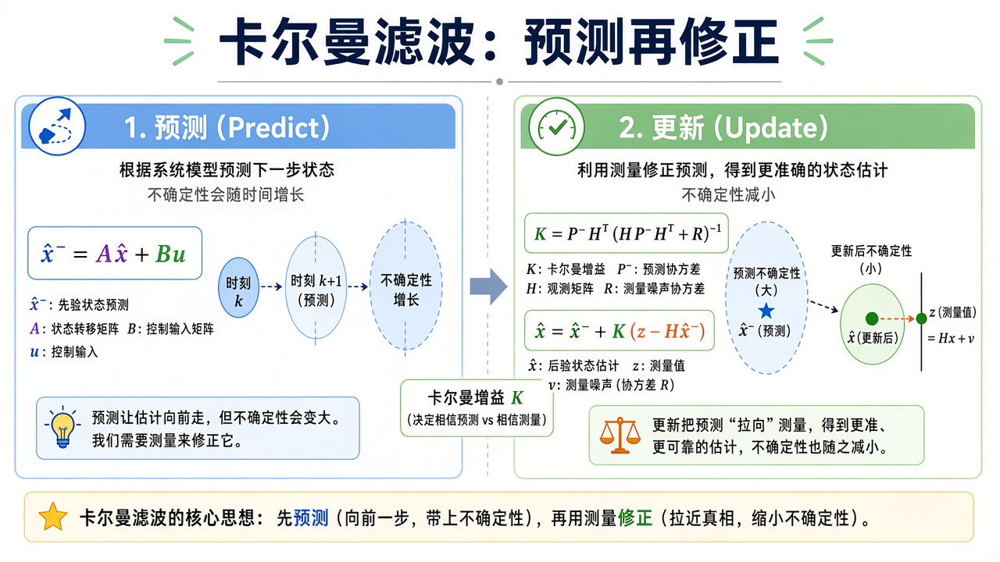
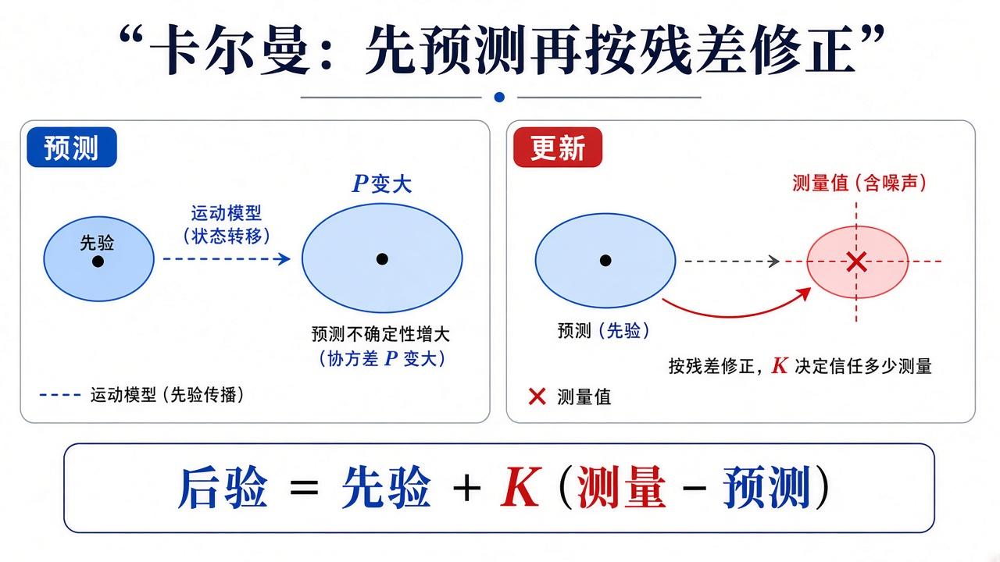
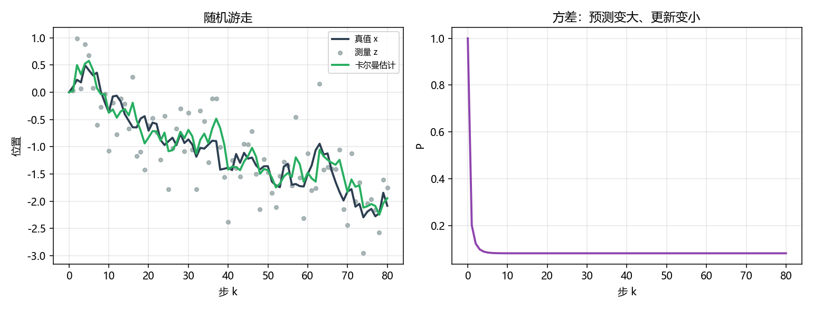

# 卡尔曼：先预测，再被测量拉一把

> [!WARNING]
> 🧪 Beta公测版本提示：教程主体已完成，正在优化细节，欢迎大家提Issue反馈问题或建议。

> [状态空间](/control/modern/state-space/) 的 $u=-Kx$ 假定你手里有 $x$。传感器往往只给一部分，还带噪。卡尔曼滤波器在线性高斯时给出「均方误差最小」的 $\hat x$：模型走一步（不确定变大），测量来了再收缩。LQR 章把滤波和最优增益串在双积分器上，见 [LQR](/control/modern/lqr/)；本章把滤波器本身缩成一维随机游走，只盯预测 / 更新两步。

---

## 一、预测再修正

一维随机游走（位置自己加一点过程噪声，没有控制）：

$$
x_{k+1}=x_k+w_k,\qquad z_k=x_k+v_k.
$$

$w\sim\mathcal{N}(0,Q)$，$v\sim\mathcal{N}(0,R)$。滤波器状态是均值 $\hat x$ 和方差 $P$：

1. **预测** $\hat x^-=\hat x$，$P^-=P+Q$（模型走一步，云变大）；
2. **增益** $K_g=P^-/(P^-+R)$；
3. **更新** $\hat x=\hat x^-+K_g(z-\hat x^-)$，$P=(1-K_g)P^-$。

$R$ 大（测量很吵）→ $K_g$ 小，更信模型；$Q$ 大（模型不可靠）→ $K_g$ 大，更信测量。

> **图解说明**：蓝框按模型走一步，椭圆变大；绿框用新息 $z-H\hat x^-$ 把估计拉向测量，椭圆变小。$K_g$ 决定信模型还是信测量。二维矩阵形式与此相同，只是除法换成 $(HPH^\top+R)^{-1}$。

<video controls muted loop playsinline preload="metadata" style="width:100%;max-width:960px;border-radius:8px;background:#f7fafc;margin:0.6rem 0;">
  <source src="./images/kf_anim.mp4" type="video/mp4">
</video>

> **动画说明**：一维随机游走。黑线真值，橙点最新测量，绿线滤波。竖条 $\pm 2\sqrt{P}$：预测撑开、更新捏紧。

> **图解说明**：左：预测让不确定云变大。右：测量到来，用增益 $K$ 把估计拉向观测并捏紧方差。

::: details 逐步推导：一维卡尔曼增益 $K=P^-/(P^-+R)$ 从哪来（点击展开）

预测后，先验是 $\hat x^-\sim$（均值），方差 $P^-$。测量 $z=x+v$，$v$ 方差 $R$，与过程独立。后验均值取先验与测量的**线性**组合 $\hat x=(1-K)\hat x^-+K z$，选 $K$ 使后验方差最小。

误差 $\tilde x=(1-K)(\hat x^--x)+K v$（把 $z=x+v$ 代入）。方差（独立交叉项为 0）：

$$
P=(1-K)^2 P^- + K^2 R.
$$

对 $K$ 求导并令为零：$-2(1-K)P^-+2KR=0$，故

$$
K=\frac{P^-}{P^-+R}.
$$

再代回方差得到 $P=(1-K)P^-$。这就是「越信测量（$R$ 小）$K$ 越接近 $1$；越信模型（$P^-$ 小）$K$ 越接近 $0$」。多维时除法换成 $(HPH^\top+R)^{-1}$，思想不变。

:::

这和 [世界模型](/world-models/intro/) 里「先验动力学 + 用观测纠正隐状态」是同一句人话；RSSM 在非线性、非高斯时改用神经网络。量子侧把「测完如何更新信念」换成另一套语言，见 [量子信息](/quantum/overview/)。

---

## 二、代码在做什么

`demo.py` 抽一条带噪观测，同时跑卡尔曼。左图真值 / 测量 / $\hat x$；右图方差 $P_k$（预测时变大、更新后变小的锯齿）。终端打印 RMSE：只用测量 vs 用滤波。

测量点云很散；滤波曲线贴着真值，比「直接把 $z$ 当估计」更稳。$P$ 的锯齿就是那句「预测放大不确定，测量再收缩」。

---

## 三、小结

| 概念 | 一句话 |
|------|--------|
| 预测 | 模型走一步，$P$ 变大 |
| 更新 | 用 $z$ 拉 $\hat x$，$P$ 变小 |
| $K_g$ | 信模型还是信测量 |
| 分离 | 线性高斯时可先滤波再套 LQR |
| 下游 | [LQR](/control/modern/lqr/) 的双积分器例子；RSSM 是非线性亲戚 |

> 下一章 [非线性与李雅普诺夫](/control/modern/nonlinear/)。已经要上机械臂，见 [运动学](/robotics/kinematics/)。

## 📥 Code

| File | View | Download |
|------|------|----------|
| demo.py | [Open](./code-demo) | <a href="/notebook/code/control/modern/kalman/demo.py" target="_blank" download>Download</a> |
| exercise.py | [Open](./code-exercise) | <a href="/notebook/code/control/modern/kalman/exercise.py" target="_blank" download>Download</a> |

## 参考

1. Kalman, “A New Approach to Linear Filtering and Prediction Problems” (1960)
2. Åström & Murray, *Feedback Systems*（观测器一章）
