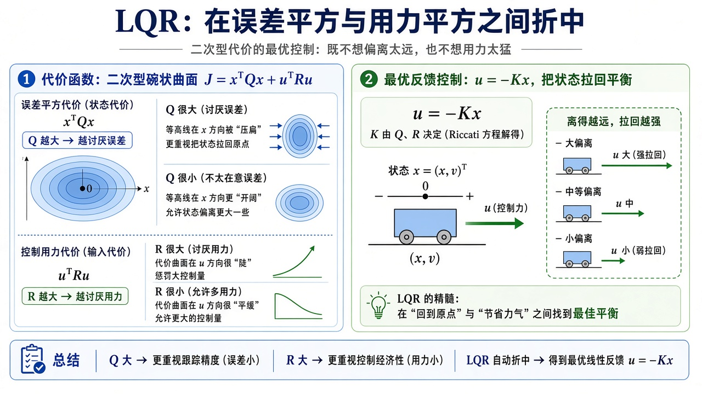
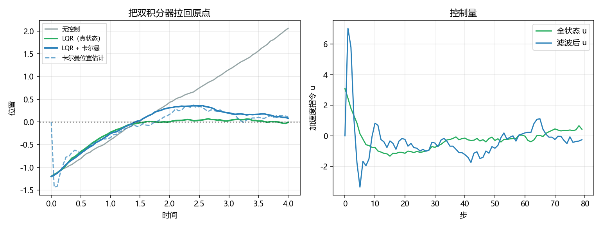

# LQR：状态反馈怎么一次给完增益

> [!WARNING]
> 🧪 Beta公测版本提示：教程主体已完成，正在优化细节，欢迎大家提Issue反馈问题或建议。

> [PID](/control/classical/pid/) 看的是一个误差标量。[状态空间](/control/modern/state-space/) 已经把植物写成 $\dot x=Ax+Bu$。本章只讲：**LQR 怎样用 $Q,R$ 一次给出 $u=-Kx$**。demo 仍把卡尔曼串在同一条双积分器上（只测带噪位置），因为分离原理要同时看见「增益」和「估计」；滤波器本身见 [卡尔曼](/control/modern/kalman/)。倒立摆是图解里的直觉对象。

---

## 一、状态空间

线性时不变植物：

$$
\dot x = Ax + Bu,\qquad y = Cx.
$$

- $x$：$n$ 维内部状态（倒立摆常取 $[p,\dot p,\theta,\dot\theta]^\top$）；
- $u$：控制；
- $y$：能测到的量，往往比 $x$ 短——比如只测位置，速度得估。

> **图解说明**：上半是 $\dot x=Ax+Bu$、$y=Cx$ 的方块；中段用倒立摆说明「状态可以比输出更长」；下段天平是 LQR：$Q$ 罚状态偏离，$R$ 罚控制能量。

<video controls muted loop playsinline preload="metadata" style="width:100%;max-width:960px;border-radius:8px;background:#f7fafc;margin:0.6rem 0;">
  <source src="./images/lqr_cart.mp4" type="video/mp4">
</video>

> **动画说明**：双积分器小车 $\ddot x=u$。左：$u=0$ 带着初速飞走；右：$u=-Kx$ 拉回原点。$Q,R$ 与 demo 相同。

离散时间（demo 用这个，因为电脑按步走）把 $A,B$ 换成一步转移：

$$
x_{k+1} = A x_k + B u_k.
$$

双积分器 $\ddot x=u$ 在步长 $\Delta t$ 下的精确离散是

$$
A=\begin{pmatrix}1&\Delta t\\ 0&1\end{pmatrix},\quad
B=\begin{pmatrix}\tfrac12\Delta t^2\\ \Delta t\end{pmatrix}.
$$

无控制时位置匀速漂走——这就是「为什么需要反馈」的最小例子。机械臂要把这套接到关节，见 [运动学](/robotics/kinematics/) 与 [动力学](/robotics/dynamics/)。

---

## 二、LQR：一次求出增益

无限时域二次代价（连续写法便于记；实现是离散 Riccati）

$$
J=\int_0^\infty \big(x^\top Q x + u^\top R u\big)\,\mathrm{d}t.
$$

最优反馈在线性植物上是 **$u=-Kx$**。$K$ 来自代数 Riccati 的解 $P$：离散情形

$$
K=(R+B^\top P B)^{-1} B^\top P A.
$$

$Q$ 大 → 更在乎把 $x$ 按回去；$R$ 大 → 更吝啬 $u$。没有积分项，也没有人手调 $K_p$：折中被两块权重矩阵写死。前提是 **你得有 $x$**（或一个够好的 $\hat x$）。

> **图解说明**：代价 $x^\top Qx+u^\top Ru$。$Q$ 大讨厌偏差，$R$ 大讨厌用力。最优仍是线性反馈 $u=-Kx$。

::: details 逐步推导：双积分器离散 $A,B$ 以及「为什么最优是线性反馈」（点击展开）

连续 $\ddot p=u$，状态 $x=(p,v)$，$\dot p=v$，$\dot v=u$。在一步 $\Delta t$ 内若 $u$ 恒定，精确积分：

$$
v^+=v+u\Delta t,\qquad p^+=p+v\Delta t+\tfrac12 u\Delta t^2.
$$

写成 $x^+=Ax+Bu$ 就是正文的 $A,B$。无控制时 $A$ 把位置加上 $v\Delta t$，小车匀速飞走。

无限时域二次 $J=\sum_k(x_k^\top Q x_k+u_k^\top R u_k)$。动态规划：设从 $k$ 起的最优代价是 $x^\top P x$（二次型，待定 $P$）。最后一步对 $u$ 求导，得到线性 $u=-Kx$，且 $P$ 满足离散代数 Riccati。直觉：植物线性、代价二次，最优策略必须对 $x$ 线性——没有「远处才用力」的开关，增益处处相同。

$Q=\mathrm{diag}(q_p,q_v)$ 加大 $q_p$ 会让 $K$ 更猛地拉位置；加大 $R$ 则 $K$ 变小，响应变肉。demo 与动画用同一组 $Q,R$。

:::

---

## 三、卡尔曼：预测再修正

传感器只给 $z=Hx+v$。双积分器上 $H=[1,\;0]$：只测位置。速度藏在状态里，要用滤波器估。

> **图解说明**：蓝框按模型走一步，$\hat x^-=A\hat x+Bu$，协方差变大；绿框用新息 $z-H\hat x^-$ 和卡尔曼增益 $K_g$ 把估计拉向测量，椭圆变小。$K_g$ 决定信模型还是信测量。

循环是：

1. **预测** $\hat x\leftarrow A\hat x+Bu$，$P\leftarrow APA^\top+Q_n$；
2. **更新** $K_g=PH^\top(HPH^\top+R_n)^{-1}$，再用残差修正 $\hat x$ 与 $P$。

这和 [世界模型](/world-models/intro/) 里「先验动力学 + 用观测纠正隐状态」是同一句人话；RSSM / 卡尔曼只是线性高斯时有闭式。量子侧把「测完如何更新信念」换成另一套语言，见 [量子信息](/quantum/overview/)。

---

## 四、代码在做什么

`demo.py` 三条轨迹同一套离散双积分器：无控制、全状态 LQR（直接用真 $x$）、以及「控制律看 $\hat x$，卡尔曼只吃带噪位置」。左图位置，右图加速度指令；虚线是滤波器对位置的估计。

无控制会漂；全状态 LQR 最快按回原点；带滤波的 LQR 稍吵、稍慢，但不再需要测速度。增益 $K$ 由迭代离散 Riccati 算出，不调用外部控制工具箱。

---

## 五、小结

| 概念 | 一句话 |
|------|--------|
| 状态 $x$ | 预测下一步所需的内部向量 |
| LQR | 二次代价下的 $u=-Kx$；$Q$/$R$ 折中 |
| 卡尔曼 | 预测放大不确定，测量再收缩 |
| 分离原理（直觉） | 线性高斯时，可先滤波再套 LQR |
| 下游 | 机器人、飞行器；学出来的动力学见世界模型 |

> 几何与力矩接到手臂上：[运动学](/robotics/kinematics/)、[动力学](/robotics/dynamics/)。在想象里滚动未来：[世界模型导论](/world-models/intro/)。真机话题与坐标系习惯见 [ROS 2](/ros2/overview/)。

## 📥 Code

| File | View | Download |
|------|------|----------|
| demo.py | [Open](./code-demo) | <a href="/notebook/code/control/modern/lqr/demo.py" target="_blank" download>Download</a> |
| exercise.py | [Open](./code-exercise) | <a href="/notebook/code/control/modern/lqr/exercise.py" target="_blank" download>Download</a> |

## 参考

1. Kalman, “A New Approach to Linear Filtering and Prediction Problems” (1960)
2. Anderson & Moore, *Optimal Control*（LQR / Riccati）
3. [PID](/control/classical/pid/)（时域直觉）、[状态空间](/control/modern/state-space/)（$A,B$）
