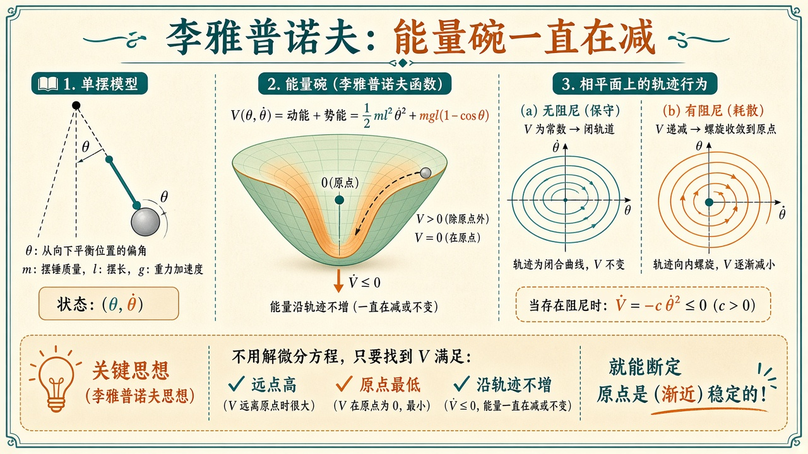
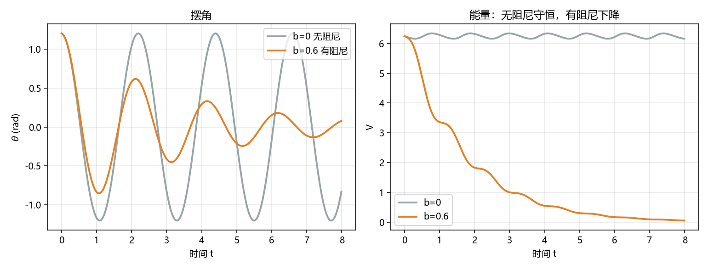

# 李雅普诺夫：不必线性化也能谈稳定

> [!WARNING]
> 🧪 Beta公测版本提示：教程主体已完成，正在优化细节，欢迎大家提Issue反馈问题或建议。

> 极点、Routh、Bode 都要求线性（或先在工作点线性化）。单摆 $\ddot\theta+(g/\ell)\sin\theta=0$ 不是线性的。李雅普诺夫的办法是找一个能量函数 $V$：**原点最低、沿轨迹不增加**，就能断定稳定，而不用把微分方程解出来。线性系统里「左半平面极点」是这件事的特例。状态方程见 [状态空间](/control/modern/state-space/)。

---

## 一、能量碗

单摆（向下为 $\theta=0$），带枢轴粘滞阻尼 $b>0$：

$$
m\ell^2\ddot\theta + b\dot\theta + mg\ell\sin\theta = 0.
$$

取

$$
V(\theta,\dot\theta)=\tfrac12 m(\ell\dot\theta)^2 + m g \ell(1-\cos\theta).
$$

第一项动能，第二项是把摆锤从最低点抬高 $\ell(1-\cos\theta)$ 的重力势能。$V\ge 0$，仅在 $(\theta,\dot\theta)=(0,0)$（模 $2\pi$）为 $0$。沿轨迹

$$
\dot V = -b\dot\theta^2 \le 0.
$$

无阻尼 $b=0$ 时 $\dot V=0$，能量守恒，相图是闭合轨道；有阻尼时 $V$ 严格下降（除非已经停住），轨迹螺旋进原点。

> **图解说明**：左是单摆；中是 $V$ 这只碗，轨迹只能往低处走；右是无阻尼闭轨 vs 有阻尼螺旋。不必把 $\theta(t)$ 写成公式。

这叫**李雅普诺夫稳定 / 渐近稳定**的充分条件（还要 $V$ 正定、径向无界等技术假设；本课用物理能量，条件自然满足）。倒立摆在上平衡点 $V$ 不是正定的——那里要另找 $V$，或先线性化再 [LQR](/control/modern/lqr/)。

demo 参数：$m=1$、$\ell=1$、$g=9.8$，初值 $\theta(0)=1.2\,\mathrm{rad}$、$\omega(0)=0$，对比 $b=0$ 与 $b=0.6$。

**保姆级数字例。** 初值动能为 $0$，势能

$$
V(1.2,0)=mg\ell\big(1-\cos 1.2\big)=9.8\times(1-0.3624)\approx 6.249.
$$

无阻尼时应几乎保持这个数（欧拉积分会有一点数值泄漏，末端 $V$ 可能略偏）。有阻尼 $b=0.6$ 时 $\dot V=-0.6\,\omega^2$，只要还在摆，$V$ 就往下漏，末端应明显小于 $6.25$，$\theta$ 衰减振荡靠近 $0$。

线性化对照：$\theta$ 小时 $\sin\theta\approx\theta$，方程变成

$$
\ddot\theta+\frac{b}{m\ell^2}\dot\theta+\frac{g}{\ell}\theta=0.
$$

$\omega_n=\sqrt{g/\ell}\approx 3.13$。$b=0.6$ 时 $\zeta=b/(2m\ell^2\omega_n)\approx 0.096$，欠阻尼——所以有阻尼的 $\theta(t)$ 仍会晃几下再收，不是过阻尼那种「爬回去」。李雅普诺夫不需要这条近似：$\sin\theta$ 保持原样，$V$ 照样下降。

**卡点。** $\dot V\le 0$ 给的是稳定（轨迹不跑远），**渐近**稳定还要「不能停在 $V$ 的等高线上空转」。无阻尼时 $\dot V=0$，你永远在某个闭轨上，不回到原点——李雅普诺夫稳定，但不是渐近稳定。有阻尼时唯一让 $\dot V=0$ 的是 $\omega=0$，再代回方程发现必须 $\sin\theta=0$，于是只有底平衡点（LaSalle）。另一个卡点：同一只 $V$ 在 $\theta=\pi$（倒立）是势能**最高点**，碗翻过来了，不能用来证明上平衡点稳定。

::: details 逐步推导：从动能 + 势能到 $\dot V=-b\dot\theta^2$（点击展开）

状态取 $(\theta,\omega)$，$\omega=\dot\theta$。动能 $\frac12 m(\ell\omega)^2$（线速度 $\ell\omega$），势能从最低点算起 $mg\ell(1-\cos\theta)$，相加即 $V$。显然 $V(\theta,\omega)\ge 0$，且 $V=0\Leftrightarrow\theta\in 2\pi\mathbb{Z},\ \omega=0$。

沿轨迹求导（链规则）：

$$
\dot V
= m\ell^2\omega\,\dot\omega + mg\ell\sin\theta\cdot\omega.
$$

运动方程解出角加速度：

$$
\dot\omega=-\frac{g}{\ell}\sin\theta-\frac{b}{m\ell^2}\omega
$$

（即把原方程除以 $m\ell^2$）。代入：

$$
\begin{aligned}
\dot V
&= m\ell^2\omega\Big(-\frac{g}{\ell}\sin\theta-\frac{b}{m\ell^2}\omega\Big)
+ mg\ell\omega\sin\theta\\
&= -mg\ell\omega\sin\theta - b\omega^2 + mg\ell\omega\sin\theta\\
&= -b\omega^2.
\end{aligned}
$$

重力那两项精确抵消——这就是「保守力不做净功，只有阻尼耗散」。$b=0$ 时 $\dot V=0$，能量是运动积分，相图是 $V=const$ 的闭曲线。$b>0$ 时 $\dot V\le 0$，等号只在 $\omega=0$；若轨迹停在 $\omega=0$ 但 $\sin\theta\neq 0$，角加速度不为 $0$，立刻又动起来。所以有阻尼时只能渐近到下平衡点。

demo 用欧拉：$\omega\leftarrow\omega+\Delta t\,\dot\omega$，$\theta\leftarrow\theta+\Delta t\,\omega$，$\Delta t=0.01$，积到 $t=8$。显式欧拉不是辛积分器，无阻尼轨道会有一点点能量漂移——终端「无阻尼末端 $V$」若略偏离 $6.25$，是数值而不是物理。

> **图解说明**：左是 $\theta(t)$，灰线无阻尼几乎等幅，橙线 $b=0.6$ 衰减。右是 $V(t)$：灰线接近水平，橙线单调下降。

:::

::: details 逐步推导：线性系统二次型 $V=x^\top Px$ 与 Lyapunov 方程（点击展开）

非线性定理是充分条件：找到一只碗就够了，找不到不代表不稳定。线性系统 $\dot x=Ax$ 碰巧有完整的充要刻画：渐近稳定 $\Leftrightarrow$ 全部极点在左半平面 $\Leftrightarrow$ 存在正定二次型 $V=x^\top P x$ 使 $\dot V$ 负定。

沿线性轨迹：

$$
\dot V=\dot x^\top Px+x^\top P\dot x=x^\top(A^\top P+PA)x.
$$

指定一只正定 $Q$（常用单位阵），解 **Lyapunov 方程**

$$
A^\top P+PA=-Q.
$$

若 $A$  Hurwitz（极点都在左半平面），则存在唯一正定 $P$，于是 $\dot V=-x^\top Qx<0$（$x\neq 0$）。这就是「左半平面极点」与「能量碗」的翻译。双积分器开环的 $A$ 不 Hurwitz，这方程没有正定解——对应「无控制时位置漂走」。配极点或 LQR 把 $A-BK$ 变成 Hurwitz 之后，二次 $V$ 就存在了。

单摆在 $\theta=0$ 线性化后的 $A$ 是 Hurwitz（有阻尼时），所以局部也能用二次 $V$。但线性化只保证**原点附近**；大角度时 $\sin\theta$ 与 $\theta$ 差得远，线性 $V$ 可能不再沿真轨迹下降。物理能量那只碗对大角度仍然有效——这就是何必线性化的理由。

倒立平衡 $\theta=\pi$：令 $\phi=\theta-\pi$，则 $\sin\theta=-\sin\phi$，线性化是 $\ddot\phi-(g/\ell)\phi=0$，极点一正一负，鞍点。原来的 $V$ 在 $\phi=0$ 是势能极大，不是极小，定理的前提（正定）直接失败。要稳定倒立摆，必须反馈；常用做法是线性化后 LQR，或另造一只包含「向上」的 $V$。

:::

---

## 二、代码在做什么

`demo.py` 积两组单摆：无阻尼 vs 有阻尼，同一初值。左图 $\theta(t)$，右图 $V(t)$。无阻尼 $V$ 几乎水平（欧拉会有一点数值泄漏）；有阻尼 $V$ 单调下降，$\theta$ 衰减振荡。

终端打印末端 $V$。阻尼那条应明显更小。相图不画了，以免和右图能量重复；你若改 `demo.py` 把 $(\theta,\dot\theta)$ 撒上去，闭轨 vs 螺旋会更直观。

---

## 三、小结

| 概念 | 一句话 |
|------|--------|
| $V$ | 能量碗：远点高、原点最低；初值约 $6.25$ |
| $\dot V\le 0$ | 沿轨迹不爬升 ⇒ 稳定 |
| $\dot V=-b\omega^2$ | 只有阻尼耗散；重力项抵消 |
| 线性特例 | 左半平面极点 ⇔ 存在二次 $V=x^\top Px$ |
| 下游 | 机器人非线性动力学见 [动力学](/robotics/dynamics/) |

> 现代控制四章到此。回到 [控制论导论](/control/overview/) 或接 [运动学](/robotics/kinematics/)。世界模型里的「想象滚动」是另一条不要求 $V$ 的规划路。

## 📥 Code

| File | View | Download |
|------|------|----------|
| demo.py | [Open](./code-demo) | <a href="/notebook/code/control/modern/nonlinear/demo.py" target="_blank" download>Download</a> |
| exercise.py | [Open](./code-exercise) | <a href="/notebook/code/control/modern/nonlinear/exercise.py" target="_blank" download>Download</a> |

## 参考

1. Khalil, *Nonlinear Systems*（李雅普诺夫定理）
2. Åström & Murray, *Feedback Systems*
