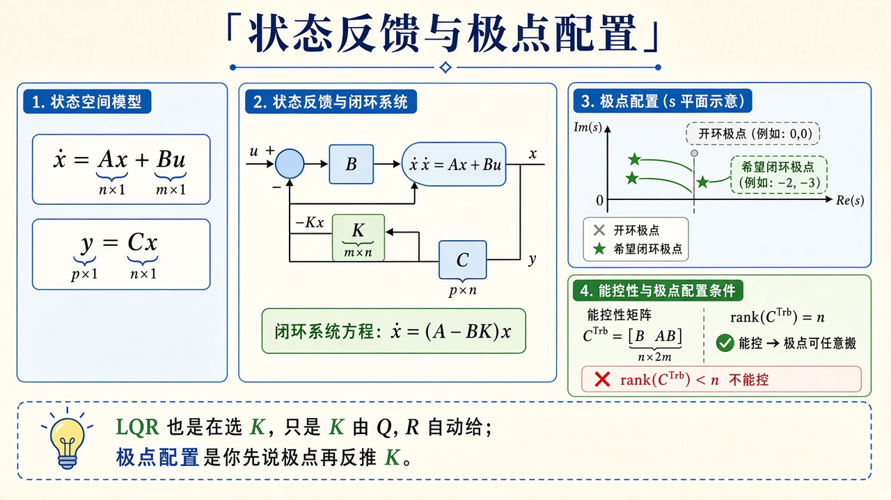
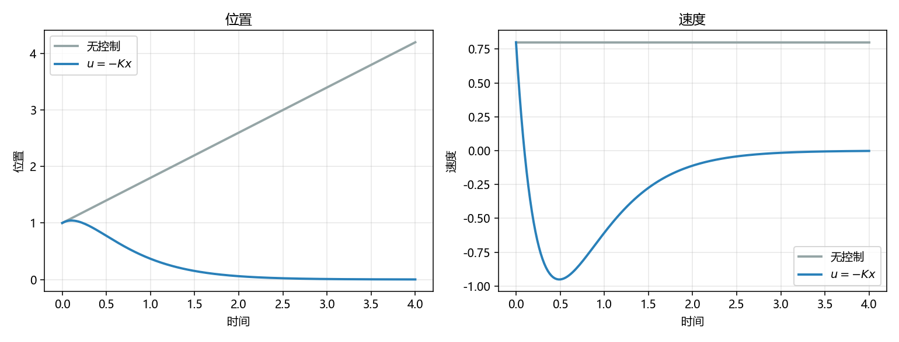

# 状态空间：植物怎样写成矩阵

> [!WARNING]
> 🧪 Beta公测版本提示：教程主体已完成，正在优化细节，欢迎大家提Issue反馈问题或建议。

> 经典控制把植物压成 $G(s)$。现代控制把内部量摊开成向量 $x$，写成 $\dot x=Ax+Bu$。**能控**时可以用 $u=-Kx$ 把闭环极点放到你指定的位置。LQR 是「让代价最小」的那种 $K$，见 [LQR](/control/modern/lqr/)；测不全 $x$ 时见 [卡尔曼](/control/modern/kalman/)。

---

## 一、状态方程

线性时不变：

$$
\dot x = Ax + Bu,\qquad y=Cx.
$$

$x$ 要长到「知道它就能预测下一步」——不是随便列几个传感器读数。双积分器 $\ddot p=u$（单位质量、无摩擦的牛顿第二定律）取 $x=[p,\dot p]^\top$：位置不够，还要速度，否则下一步的位置你猜不出。

$$
A=\begin{pmatrix}0&1\\0&0\end{pmatrix},\quad
B=\begin{pmatrix}0\\1\end{pmatrix}.
$$

读法：$A$ 的第一行说「位置的导数是速度」；第二行说「加速度与状态无关，只等 $u$」。无控制时 $\ddot p=0$，位置匀速漂。反馈 $u=-Kx$ 把系统变成 $\dot x=(A-BK)x$。

> **图解说明**：左是状态反馈回路；中是把开环极点（积分器堆在原点）搬到希望的闭环极点；右是能控性矩阵满秩才能任意搬。

能控性矩阵（单输入，$n=2$）

$$
\mathcal{C}=\begin{bmatrix}B & AB\end{bmatrix}.
$$

$\operatorname{rank}\mathcal{C}=n$ 才能任意配置极点。demo 的双积分器

$$
\mathcal{C}=\begin{bmatrix}0&1\\1&0\end{bmatrix},
$$

秩为 $2$（列是 $B$ 与 $AB$，不是单位阵，但满秩同样能控）。直观：$u$ 直接推加速度，加速度积分出速度，速度积分出位置——两个通道都能从输入够到，没有「怎么用力都动不了」的隐状态。

**保姆级数字例。** 初值 $x(0)=[1,\,0.8]^\top$。无控制时 $\dot p=0.8$ 恒定，$t=4$ 时位置应大约 $1+0.8\times 4=4.2$（欧拉会有一点点离散误差）。闭环把极点放在 $-2,-3$，两端都按指数 $e^{-2t}$、$e^{-3t}$ 收，到 $t=4$ 时 $e^{-8}$ 已经 $\approx 3\times 10^{-4}$，位置、速度都应几乎回到原点。

**卡点。** 能控不是「传感器够不够」，那是能观。能控问的是：**输入的手能不能摸到每一个状态方向**。两台完全相同的质量并联、却共用一个力，差模方向往往不能控。另一个卡点：$u=-Kx$ 默认你量得到全部 $x$。量不到就要估计，那是卡尔曼的工作；硬把输出反馈当成状态反馈，极点不一定还能随便放。

::: details 逐步推导：双积分器怎样写成 $\dot x=Ax+Bu$，以及 $[B\ AB]$ 为何满秩（点击展开）

牛顿：$m\ddot p=u$，demo 取 $m=1$，即 $\ddot p=u$。引入 $x_1=p$、$x_2=\dot p$，则

$$
\dot x_1=x_2,\qquad \dot x_2=u.
$$

矩阵形式

$$
\begin{pmatrix}\dot x_1\\ \dot x_2\end{pmatrix}
=
\begin{pmatrix}0&1\\0&0\end{pmatrix}
\begin{pmatrix}x_1\\ x_2\end{pmatrix}
+
\begin{pmatrix}0\\1\end{pmatrix}u.
$$

这就是 $A$、$B$。开环特征值：$\det(sI-A)=s^2=0$，双重极点在原点——积分器堆叠，不渐近稳定，初速会让位置直线漂走。

能控性：$AB=A\begin{pmatrix}0\\1\end{pmatrix}=\begin{pmatrix}1\\0\end{pmatrix}$，于是

$$
\mathcal{C}=\begin{bmatrix}0&1\\1&0\end{bmatrix}.
$$

两列线性无关（已经是交换了的单位阵），$\det\mathcal{C}=-1\neq 0$，秩 $2$。PBH 检验说同样的话：对每个特征值 $\lambda$，矩阵 $[\lambda I-A\ \ B]$ 要行满秩。这里 $\lambda=0$，$[-A\ B]=\begin{bmatrix}0&-1&0\\0&0&1\end{bmatrix}$，行秩 $2$，没有藏起来的不能控模态。

若把 $B$ 改成 $[1,0]^\top$（力加在位置通道、不经加速度——物理上奇怪），则 $AB=0$，$\mathcal{C}$ 秩 $1$，速度方向摸不到，极点不能任意配。

一般 $n$ 维单输入：$\mathcal{C}=[B,AB,\ldots,A^{n-1}B]$。多输入把这些块横着拼。满秩是「存在某个 $K$ 把极点放到任意指定位置（共轭对称）」的充分必要条件。

:::

---

## 二、二阶 companion 的手算 $K$

$A-BK$ 在这个 $(A,B)$ 上是

$$
\begin{pmatrix}0&1\\-k_1&-k_2\end{pmatrix},
$$

特征多项式 $s^2+k_2 s+k_1$。希望极点 $-2,-3$ 则

$$
(s+2)(s+3)=s^2+5s+6 \implies K=[6,\;5].
$$

更高阶用 Ackermann 公式；本章不调用控制工具箱。

**保姆级读法。** $K=[k_1,k_2]$ 就是 $u=-k_1 p-k_2 \dot p$：第一项像弹簧（把位置拉回 $0$），第二项像阻尼。希望的特征多项式 $s^2+5s+6$ 规定弹簧系数 $6$、阻尼系数 $5$。对应 $\omega_n=\sqrt{6}\approx 2.45$，$\zeta=5/(2\sqrt{6})\approx 1.02$，几乎临界阻尼——所以闭环曲线几乎不晃，一截就按回原点。

**卡点。** 极点越往左（越大的 $|{\mathrm{Re}}|$），$K$ 越大，执行器越容易饱和，对模型误差也越敏感。「能放到 $-100,-101$」不等于应该放。LQR 用 $Q,R$ 问「状态误差和用力哪个贵」，往往比手填极点老实。另一个卡点：离散实现 $x\leftarrow x+\Delta t(Ax+Bu)$ 会把连续极点搬歪；demo $\Delta t=0.02$、极点 $-2,-3$ 时误差很小，终端打印的特征值应仍接近 $-2,-3$。

::: details 逐步推导：希望极点 $-2,-3$ 怎样得到 $K=[6,5]$（点击展开）

状态反馈 $u=-Kx=-k_1 x_1-k_2 x_2$。代入 $\dot x=Ax+Bu$：

$$
A-BK
=
\begin{pmatrix}0&1\\0&0\end{pmatrix}
-
\begin{pmatrix}0\\1\end{pmatrix}\begin{pmatrix}k_1&k_2\end{pmatrix}
=
\begin{pmatrix}0&1\\-k_1&-k_2\end{pmatrix}.
$$

特征多项式

$$
\det(sI-(A-BK))
=\det\begin{pmatrix}s&-1\\ k_1& s+k_2\end{pmatrix}
=s(s+k_2)+k_1
=s^2+k_2 s+k_1.
$$

希望闭环特征多项式 $(s+2)(s+3)=s^2+5s+6$。比较系数：$k_1=6$、$k_2=5$，即 $K=[6,5]$。这是 companion 形的便宜之处：最后一行正好是特征多项式系数（差个符号）。

一般二阶希望极点 $-\zeta\omega_n\pm j\omega_n\sqrt{1-\zeta^2}$ 时，$k_1=\omega_n^2$、$k_2=2\zeta\omega_n$，和导论里标准形同一套字母。本章选两个实极点，只是为了手算干净。

Ackermann（备查，不必在 demo 里实现）：指定希望特征多项式 $\alpha(s)$，则

$$
K=e_n^\top\mathcal{C}^{-1}\alpha(A),
$$

其中 $e_n$ 是最后一个单位向量。$n=2$ 时它还原成上面的系数匹配。

无控制 vs 闭环的欧拉积分同一初值、同一 $\Delta t=0.02$，积到 $T=4$。开环位置直线漂；闭环 $A-BK$ 的特征值应打印成接近 $-2,-3$。

> **图解说明**：灰线无控制，位置随初速 $0.8$ 漂走、速度保持。蓝线 $u=-Kx$，位置和速度一起按回 $0$。

:::

---

## 三、代码在做什么

`demo.py` 打印 $\mathcal{C}$ 的秩，用欧拉积分同一初值 $x=[1,0.8]^\top$：无控制 vs $u=-Kx$。左图位置，右图速度。开环匀速漂走；闭环极点在 $-2,-3$，把位置和速度一起按回原点。

开环位置直线漂；闭环把位置和速度一起按回去。终端打印 $A-BK$ 的特征值，应接近 $-2,-3$。

---

## 四、小结

| 概念 | 一句话 |
|------|--------|
| $x$ | 预测下一步所需的内部向量 |
| $A,B$ | 自由演化和「$u$ 往哪推」 |
| 能控 | $\operatorname{rank}[B,AB,\ldots]=n$；双积分器 $\mathcal{C}$ 秩 $2$ |
| $u=-Kx$ | 闭环矩阵 $A-BK$；希望 $-2,-3$ 则 $K=[6,5]$ |
| 下游 | [LQR](/control/modern/lqr/) 用 $Q,R$ 代替「先指定极点」 |

> 下一章 [LQR](/control/modern/lqr/)。经典侧对照 [根轨迹](/control/classical/root-locus/)：那边扫一个标量 $K$，这边一次给出向量 $K$。

## 📥 Code

| File | View | Download |
|------|------|----------|
| demo.py | [Open](./code-demo) | <a href="/notebook/code/control/modern/state-space/demo.py" target="_blank" download>Download</a> |
| exercise.py | [Open](./code-exercise) | <a href="/notebook/code/control/modern/state-space/exercise.py" target="_blank" download>Download</a> |

## 参考

1. Chen, *Linear System Theory and Design*（能控 / 极点配置）
2. 上一章分组首页 [现代控制](/control/modern/)
