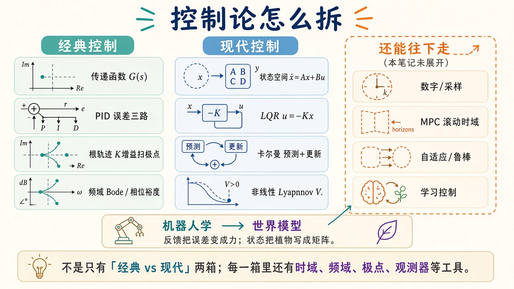
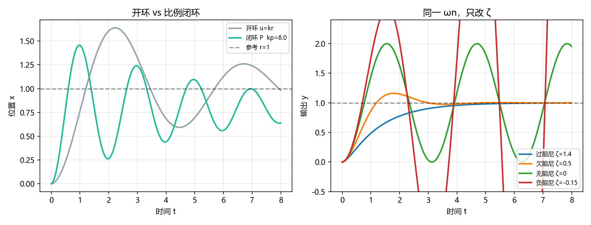

# 控制论导论：先把回路画出来

> [!WARNING]
> 🧪 Beta公测版本提示：教程主体已完成，正在优化细节，欢迎大家提Issue反馈问题或建议。

> 控制论要解决的不是「算一个最优动作」，而是：**系统会自己漂，你必须用测量把漂拉回来**。本章只建立三件事：开环为什么不够、闭环误差从哪来、极点在左半平面还是右半平面如何决定阶跃长什么样。PID 细节见 [PID](/control/classical/pid/)；把植物写成矩阵见 [状态空间](/control/modern/state-space/)。

---

## 一、开环猜输入，闭环看误差

开环是「模型说该用力 $u$，就一直用这个 $u$」。植物参数稍错、有外力、初值不对，输出就会漂，没有人告诉控制器「现在差多少」。

闭环把输出 $y$ 送回来，和参考 $r$ 相减：

$$
e = r - y.
$$

控制器只看 $e$，再决定作用到植物上的 $u$。单位反馈时传感器 $H=1$。

> **图解说明**：左端参考 $r(t)$ 与反馈 $y$ 相减得 $e$；控制器 $C$ 出 $u$，植物 $P$ 出 $y$；虚线把 $y$ 送回。比较 $r$ 与 $y$，用误差驱动系统趋近期望。

机器人关节伺服、[ROS 2](/ros2/overview/) 里的跟踪、[世界模型](/world-models/intro/) 里「预测再纠偏」，都是这张图的变体。

---

## 二、不是只有经典和现代两箱

侧栏把课拆开，避免两篇「什么都塞一点」的长文：

> **图解说明**：经典用 $G(s)$、PID、根轨迹、Bode；现代用 $x$、$K$、卡尔曼、$V$。数字控制、MPC、自适应本笔记先不展开——MPC 滚动时域和世界模型规划是亲戚。

| 分组 | 语言 | 入口 |
|------|------|------|
| [经典控制](/control/classical/) | 传递函数、误差标量 | 从 [传递函数](/control/classical/transfer/) 或 [PID](/control/classical/pid/) |
| [现代控制](/control/modern/) | 状态向量、矩阵增益 | 从 [状态空间](/control/modern/state-space/) |

几何接到手臂上，见 [机器人学](/robotics/)。

---

## 三、极点决定「晃不晃、收不收」

线性系统的自由响应由特征根（极点）决定。二阶标准形

$$
\ddot y + 2\zeta\omega_n\dot y + \omega_n^2 y = \omega_n^2 r
$$

里，$\zeta$ 是阻尼比：$\zeta>1$ 过阻尼（不晃）、$0<\zeta<1$ 欠阻尼（超调再收）、$\zeta=0$ 等幅振荡、$\zeta<0$ 发散。demo 用同一 $\omega_n$，只改 $\zeta$，把四条阶跃画在一张图上。

闭环比例反馈相当于把极点往左推（或推过头变成振荡）——这就是后面根轨迹要画的那条路。

---

## 四、代码在做什么

`demo.py` 两张图：左是质量-弹簧在「开环给稳态力」与「比例闭环」下的位置；右是二阶系统四个 $\zeta$ 的单位阶跃。没有拉普拉斯工具箱，积分都是欧拉。

开环靠植物自己晃到目标；闭环 $u=K_p e$ 把静差缩小（本例植物有弹簧，单靠 P 往往仍留一点差，这正是后面要加 I 的原因）。右图从过阻尼到负阻尼，曲线从「爬楼梯」变成「爆炸」。

---

## 五、小结

| 概念 | 一句话 |
|------|--------|
| 开环 | 不看 $y$，输入预先算死 |
| 闭环 | $e=r-y$ 驱动 $u$ |
| 极点 / $\zeta$ | 决定衰减还是振荡 |
| 下游 | 经典四章 + 现代四章 |

> 下一章建议 [传递函数与时域响应](/control/classical/transfer/)。已经熟悉阶跃的读者可直接进 [PID](/control/classical/pid/)。

## 📥 Code

| File | View | Download |
|------|------|----------|
| demo.py | [Open](./code-demo) | <a href="/notebook/code/control/overview/demo.py" target="_blank" download>Download</a> |
| exercise.py | [Open](./code-exercise) | <a href="/notebook/code/control/overview/exercise.py" target="_blank" download>Download</a> |

## 参考

1. Åström & Murray, *Feedback Systems*
2. Wiener, *Cybernetics*（「控制论」这个词的来源，不必从这里读公式）
