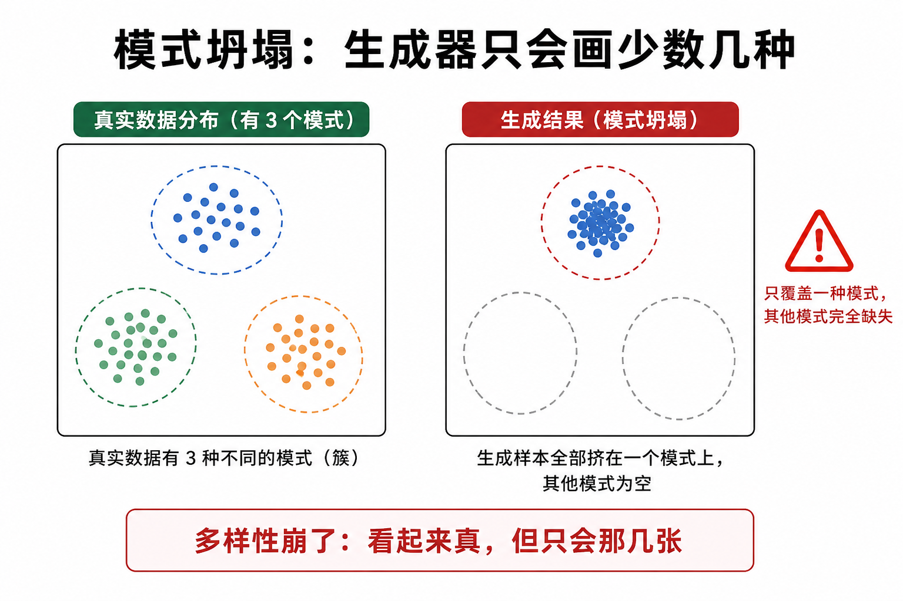

# s13 图像生成：GAN、VAE 与扩散模型

> [!WARNING]
> 🧪 Beta公测版本提示：教程主体已完成，正在优化细节，欢迎大家提Issue反馈问题或建议。

> 让神经网络"创造"图像 —— 三种生成范式的原理与对比

---

## 一、生成模型的目标

图像生成的核心是**学习数据分布 $p(x)$**。给定训练样本 $\{x_1, x_2, ..., x_N\}$（如 MNIST 手写数字），生成模型的目标是学会一个新的分布 $p_\theta(x)$，使得 $p_\theta(x) \approx p_{\text{data}}(x)$。

一旦学好了 $p_\theta(x)$，我们就可以从中**采样**：每次从 $p_\theta(x)$ 中抽取一个样本，就得到一张新的、逼真的图像。

三种主流方法以完全不同的方式逼近 $p(x)$：

| 方法 | 建模方式 | 采样方式 |
|------|---------|---------|
| GAN | 隐式（不写显式 $p(x)$） | $z\sim p_z$ → 生成器 $G(z)$ |
| VAE | 显式下界（最大化 ELBO） | $z\sim p(z)$（先验）→ 解码器；训练时用后验 $q(z\mid x)$ |
| Diffusion | 显式（最小化去噪误差） | 从纯噪声逐步去噪恢复图像 |

> GAN / VAE 是本章重点加厚的两条经典路线；扩散与 Stable Diffusion 接在后面，作为「第三范式 + 工程集大成」。ELBO 里的 KL 与 [信息论精简](/math/information/) 同一套语言。

---

## 二、GAN：生成对抗网络 (2014)

### 2.1 核心思想：两个网络互相抬杠

GAN **不写**显式密度 $p_\theta(x)$。它训练一对对手：

| 角色 | 输入 | 输出 | 目标 |
|------|------|------|------|
| **生成器 $G$** | 噪声 $z\sim p_z$（常为高斯） | 假图 $G(z)$ | 让 $D$ 认不出假 |
| **判别器 $D$** | 真图或假图 | $D(\cdot)\in(0,1)$ | 真图靠近 1，假图靠近 0 |

直觉：造假钞的人 vs 验钞员。验钞员越强，造假的人越得进步；造假的人进步了，验钞员又得再练眼。二者交替变强，最后假钞可以乱真。

> **图解说明**：噪声进 $G$ 成假图；$D$ 同时看真图与假图。箭头方向相反：一个想骗过，一个想拆穿。

### 2.2 数学：Minimax 目标

$$
\min_G \max_D V(D, G)
=
\mathbb{E}_{x \sim p_{\mathrm{data}}}[\log D(x)]
+
\mathbb{E}_{z \sim p_z}[\log(1 - D(G(z)))]
$$

拆开看：

- 第一项：真图上 $D$ 要大 → $\log D(x)$ 大；
- 第二项：假图上 $D$ 要小 → $D(G(z))\to 0$ 时 $\log(1-D)$ 大；
- **$G$ 的立场相反**：希望 $D(G(z))\to 1$，从而压小第二项。

实践中常把生成器损失改成最大化 $\log D(G(z))$（非饱和损失），避免早期 $D$ 太强时 $\log(1-D)$ 梯度几乎为零。

理论均衡：若容量足够且训练到达纳什均衡，则 $G_\# p_z = p_{\mathrm{data}}$，且对任意 $x$ 有 $D^*(x)=\tfrac12$——验钞员只好瞎猜。

### 2.3 交替训练（实现时真正在做的事）

不能同时对 $G,D$ 乱更新。标准循环是：

1. **固定 $G$，更新 $D$ 若干步**（先练眼）：真假样本上的二元交叉熵；
2. **固定 $D$，更新 $G$ 一步**（再练手）：只回传「如何让 $D(G(z))$ 变大」；
3. 重复。

> **图解说明**：A 步只动判别器，B 步只动生成器。二者必须节奏匹配——$D$ 永远碾压或永远太弱，都会训崩。

超参直觉：$D$ 更新太狠 → $G$ 梯度消失；$G$ 更新太狠、$D$ 跟不上 → 假图「糊弄」过去但质量差。学习率、更新次数比（如 $D:G=1:1$ 或 $5:1$）都是调参旋钮。

### 2.4 三大典型失败

1. **模式坍塌（Mode Collapse）**  
   真实数据有多种「样子」（多个 mode）。$G$ 发现只画其中一种就能骗过当前的 $D$，于是不管 $z$ 怎么变，输出都挤在少数模式上——**锐利但不多样**。

> **图解说明**：左边真实分布有多个簇；右边生成样本全堆在一个簇。观感可以「很像真的」，统计覆盖却塌了。

2. **梯度消失**  
   $D$ 过强时 $D(G(z))\approx 0$，原始 $\log(1-D)$ 对 $G$ 几乎没坡——$G$ 学不动。非饱和损失 / WGAN 等变体正是冲着这个问题来的。

3. **振荡不收敛**  
   $G$ 与 $D$ 互相追逐，损失来回抖，没有「越训越好」的单调曲线。看样张比只看 loss 数字更重要。

### 2.5 和后文的接口

- 工程变体：DCGAN、WGAN-GP、StyleGAN… 改网络与距离，不改「对抗」骨架；
- 与扩散相比：GAN 一次前向就出图，快；但训练难、易塌模式；
- 本章 `demo.py` 在 MNIST（或合成数据回退）上训一个小 GAN，观察样张与训练曲线。

---

## 三、VAE：变分自编码器 (2013/14)

### 3.1 从「压缩」到「能采样的压缩」

普通自编码器（AE）：$x \xrightarrow{\mathrm{enc}} z \xrightarrow{\mathrm{dec}} \hat x$，只优化重构，**潜空间常有空洞**——在两个编码点之间插值，解码结果可能完全不像真实图像。

VAE 多要求一件事：每个 $x$ 对应的不是一个点 $z$，而是一个分布 $q_\phi(z\mid x)$，并且整体要靠近简单先验 $p(z)=\mathcal{N}(0,I)$。这样从先验直接采样 $z\sim p(z)$ 再解码，才像「生成」。

> **图解说明**：左图 AE 潜空间不规则、有洞；右图 KL 把质量「按」进高斯球，插值路径不容易走到荒漠。这与 [信息论章](/math/information/) 的 KL、[世界模型 RSSM](/world-models/abstract/rssm/) 的先验/后验是同一语言。

### 3.2 潜变量生成模型与 ELBO

假设数据由潜变量生成：

$$
p(x)=\int p_\theta(x\mid z)\,p(z)\,dz
$$

这个积分一般算不出。引入编码器近似后验 $q_\phi(z\mid x)$，可以证明对数似然有变分下界（**ELBO**）：

$$
\log p_\theta(x)
\ge
\underbrace{\mathbb{E}_{q_\phi(z\mid x)}[\log p_\theta(x\mid z)]}_{\text{重构项：解码要像原图}}
-
\underbrace{D_{\mathrm{KL}}\big(q_\phi(z\mid x)\,\|\,p(z)\big)}_{\text{正则项：后验别离开先验太远}}
$$

训练最大化 ELBO（或最小化其相反数）：

$$
\mathcal{L}_{\mathrm{VAE}}
=
-\mathbb{E}_{q}[\log p_\theta(x\mid z)]
+
D_{\mathrm{KL}}(q_\phi(z\mid x)\|p(z))
$$

- **Encoder $q_\phi$**：输出 $(\mu(x),\sigma(x))$（对角高斯最常见）；
- **Decoder $p_\theta$**：从 $z$ 还原 $\hat x$（像素上常用伯努利/高斯似然，实现里常写成 MSE 或 BCE）。

> **图解说明**：编码出 $\mu,\sigma$ → 重参数得到 $z$ → 解码重构；同时 KL 把 $q(z\mid x)$ 拉向标准正态。

### 3.3 重参数化：让「采样」能反传

若写 `z = Normal(μ, σ).sample()`，采样节点切断梯度，encoder 收不到 decoder 的重构信号。

重参数化把随机性挪到与参数无关的噪声 $\varepsilon$：

$$
z = \mu(x) + \sigma(x)\odot\varepsilon,
\quad
\varepsilon\sim\mathcal{N}(0,I)
$$

对 $\mu,\sigma$ 可微；$\varepsilon$ 每步重新抽。这是 VAE 能端到端训练的关键工程点，也是后面许多「随机节点 + 反传」技巧的原型。

### 3.4 $\beta$-VAE 与模糊问题

- **模糊**：逐像素重构损失会奖励「平均脸」——多种合理解被平均，边缘发糊。GAN 不走像素似然，往往更锐，但潜空间不如 VAE 规整。
- **$\beta$-VAE**：把 KL 前乘系数 $\beta$。$\beta>1$ 更强调解耦/规整的潜空间，常以重构变差为代价；$\beta<1$ 更贴数据、正则更松。Dreamer 里提到的 KL balancing / free bits，和「别让 KL 项把表示掐死」是同一家族的忧虑。

### 3.5 采样与插值

- **生成**：$\varepsilon\sim\mathcal{N}(0,I)$（或直接 $z\sim p(z)$）→ decoder；
- **插值**：取两张图的 $\mu_1,\mu_2$，在其间线性插值再解码，观察语义是否平滑过渡——这是检验潜空间是否「填实」的常用体检。

本章 demo 会画出 VAE 重构、随机采样与二维潜空间（若用 2D latent）可视化，便于和 GAN 样张对比。

---

## 四、扩散模型 (2020+)

### 4.1 核心思想：渐进去噪

扩散模型的灵感来源于非平衡热力学。它包含两个过程：

**前向过程（Forward Process）$q$**：向图像逐步添加高斯噪声，经过 $T$ 步后变成纯噪声。

$$
q(x_t | x_{t-1}) = \mathcal{N}(x_t; \sqrt{1 - \beta_t} x_{t-1}, \beta_t \mathbf{I})
$$

其中 $\beta_t$ 是噪声调度（noise schedule），通常从 $\beta_1 \approx 10^{-4}$ 线性增长到 $\beta_T \approx 0.02$。

**反向过程（Reverse Process）$p_\theta$**：学习一个去噪网络 $\epsilon_\theta$，从纯噪声 $x_T$ 开始，逐步去除噪声，恢复出清晰的图像。

$$
p_\theta(x_{t-1} | x_t) = \mathcal{N}(x_{t-1}; \mu_\theta(x_t, t), \Sigma_\theta(x_t, t))
$$

### 4.2 DDPM 的训练目标

Denoising Diffusion Probabilistic Models (DDPM) 的核心发现是：反向过程的训练可以简化为一个**噪声预测任务**：

$$
\mathcal{L}_{\text{simple}} = \mathbb{E}_{t, x_0, \epsilon} \left[ \|\epsilon - \epsilon_\theta(\sqrt{\bar{\alpha}_t} x_0 + \sqrt{1 - \bar{\alpha}_t} \epsilon, t)\|^2 \right]
$$

翻译成通俗语言：
1. 从训练集中取一张图像 $x_0$
2. 随机选一个时间步 $t$
3. 按照前向过程的公式给 $x_0$ 加噪声，得到 $x_t = \sqrt{\bar{\alpha}_t} x_0 + \sqrt{1 - \bar{\alpha}_t} \epsilon$
4. 训练网络 $\epsilon_\theta$ 从 $x_t$ 中预测出所加的噪声 $\epsilon$
5. 这就是一个简单的回归任务！

### 4.3 采样（推理）

训练完成后，生成图像的过程是从纯噪声出发，一步步反向去噪：

1. $x_T \sim \mathcal{N}(0, \mathbf{I})$（纯噪声）
2. For $t = T, T-1, ..., 1$:
   - $x_{t-1} = \frac{1}{\sqrt{\alpha_t}}(x_t - \frac{1 - \alpha_t}{\sqrt{1 - \bar{\alpha}_t}} \epsilon_\theta(x_t, t)) + \sigma_t z$
3. 输出 $x_0$（生成的图像）

这个过程通常需要数百甚至上千步，这也是扩散模型生成速度慢的原因。

---

## 五、Stable Diffusion (2022)

Stable Diffusion 将扩散模型从三个维度做了关键改进：

1. **潜空间扩散（Latent Diffusion）**：先用 **VAE**（第三节那一套：编码器压到潜变量、解码器还原）把图像压到低维潜空间，再在潜空间里跑扩散。算力大约降一个数量级——**VAE 不是被淘汰，而是被嵌进了流水线**。
2. **文本条件（Text Conditioning）**：将文本 prompt 通过 CLIP 文本编码器转为嵌入向量，通过交叉注意力（Cross-Attention）注入到去噪 U-Net 中。这使得生成过程可以受文本控制。
3. **Classifier-Free Guidance**：同时训练条件模型和无条件模型，在推理时通过 $ \hat{\epsilon}_\theta(x_t, c) = \epsilon_\theta(x_t, \varnothing) + w \cdot (\epsilon_\theta(x_t, c) - \epsilon_\theta(x_t, \varnothing)) $ 增强文本控制力度。

---

## 六、三种方法的对比

| 特性 | GAN | VAE | Diffusion |
|------|-----|-----|-----------|
| **生成质量** | 高（锐利） | 较低（模糊） | 极高（锐利+多样） |
| **多样性** | 低（模式坍塌） | 高（覆盖整个分布） | 高（覆盖整个分布） |
| **训练稳定性** | 极不稳定 | 稳定 | 稳定 |
| **采样速度** | 快（一次前向） | 快（一次前向） | 慢（数百步→数十步） |
| **潜空间** | 无显式潜空间 | 有结构的潜空间 | 固定维度的噪声空间 |
| **理论基础** | 博弈论/极小极大 | 变分推断/ELBO | 随机微分方程/得分匹配 |

三种方法各有千秋：
- **GAN** 适合需要高速推理且对锐度要求高的场景（如实时视频特效）。
- **VAE** 适合需要平滑潜空间和结构化的场景（如潜在空间插值、属性编辑）。
- **Diffusion** 是当前生成质量的标杆（Stable Diffusion, DALL-E 3, Midjourney），但推理速度仍然是瓶颈。

---

## 七、本节小结

| 概念 | 一句话 |
|------|--------|
| GAN | 生成器与判别器对抗，$\min_G \max_D V(D,G)$；隐式建模 $p(x)$ |
| 交替训练 | 先更新 $D$ 再更新 $G$；节奏失衡会梯度消失或假赢 |
| 非饱和损失 | 实践中 $G$ 最大化 $\log D(G(z))$，避免早期无梯度 |
| 模式坍塌 | $G$ 只覆盖少数模式：锐利但不多样 |
| VAE | 编码器→分布→重参数→解码器；最大化 ELBO |
| ELBO | 重构项 − KL$(q(z\mid x)\|p(z))$；似然的可算下界 |
| 重参数化 | $z=\mu+\sigma\odot\varepsilon$，让采样可反传 |
| $\beta$-VAE | KL 前乘 $\beta$，在「规整潜空间」与「贴数据」之间权衡 |
| 扩散前向 / 反向 | 加噪 $q(x_t\mid x_{t-1})$ / 学去噪网络恢复 $x_0$ |
| DDPM 训练 | 预测所加噪声 $\epsilon$，回归任务 |
| Stable Diffusion | **VAE 潜空间**里做扩散 + 文本交叉注意力 |
| 采样速度 | GAN/VAE 单次前向快；Diffusion 迭代慢 |

> 至此，我们完成了从图像分类（s10/s11）到目标检测（s12）再到图像生成（s13）的完整旅程。这三个方向构成了计算机视觉的核心支柱：**识别、定位、创造**。

## 📥 Code

| File | View | Download |
|------|------|----------|
| demo.py | [Open](./code-demo) | <a href="/notebook/code/cv/generation/demo.py" target="_blank" download>Download</a> |
| exercise.py | [Open](./code-exercise) | <a href="/notebook/code/cv/generation/exercise.py" target="_blank" download>Download</a> |

## 参考

1. Goodfellow, I. J., et al. (2014). Generative Adversarial Nets. *NeurIPS 2014*. (GAN) [[arXiv:1406.2661](https://arxiv.org/abs/1406.2661)]
2. Kingma, D. P. & Welling, M. (2014). Auto-Encoding Variational Bayes. *ICLR 2014*. (VAE) [[arXiv:1312.6114](https://arxiv.org/abs/1312.6114)]
3. Higgins, I., et al. (2017). $\beta$-VAE: Learning Basic Visual Concepts with a Constrained Variational Framework. *ICLR 2017*.
4. Ho, J., Jain, A., & Abbeel, P. (2020). Denoising Diffusion Probabilistic Models. *NeurIPS 2020*. (DDPM) [[arXiv:2006.11239](https://arxiv.org/abs/2006.11239)]
5. Rombach, R., et al. (2022). High-Resolution Image Synthesis with Latent Diffusion Models. *CVPR 2022*. (Stable Diffusion) [[arXiv:2112.10752](https://arxiv.org/abs/2112.10752)]

