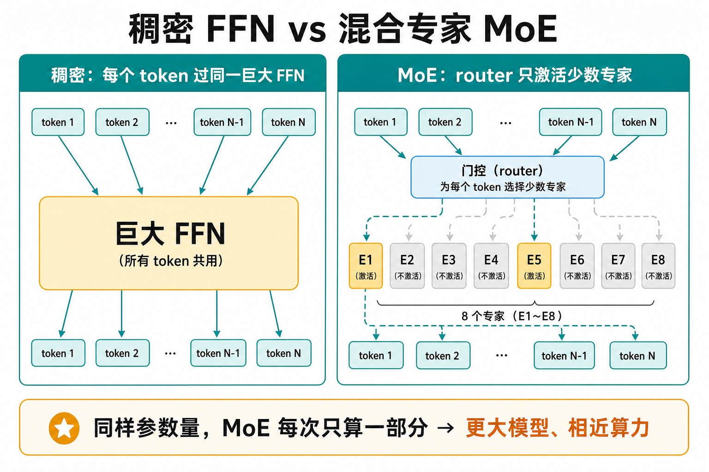
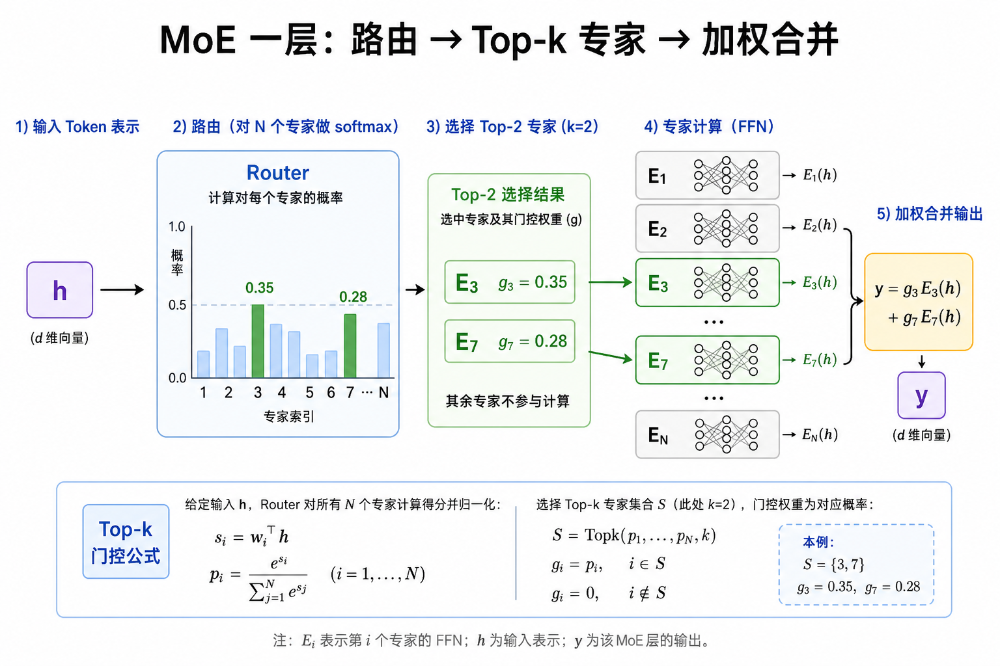
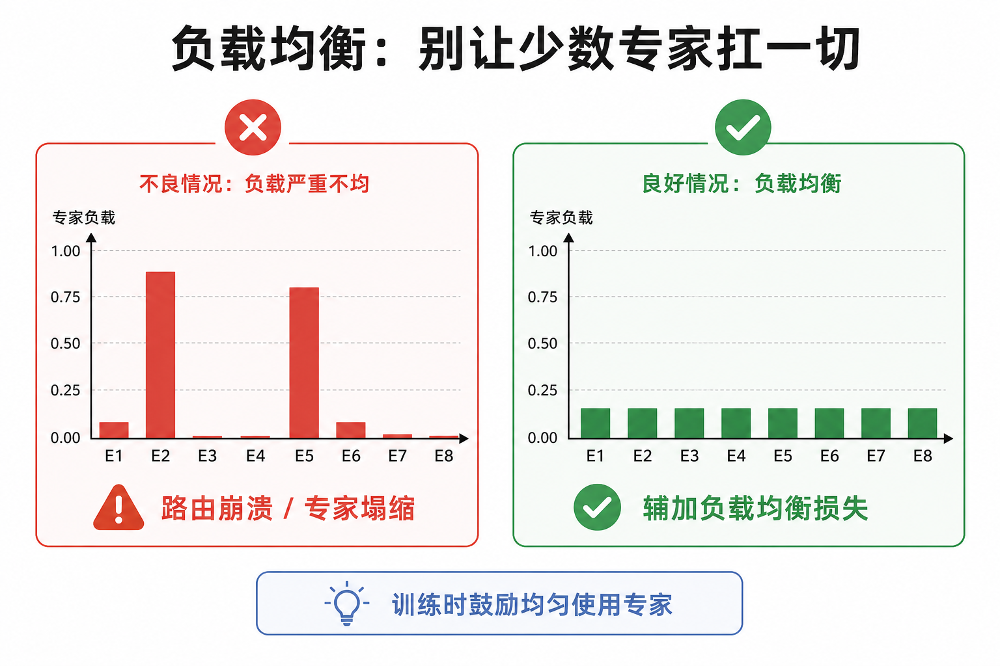
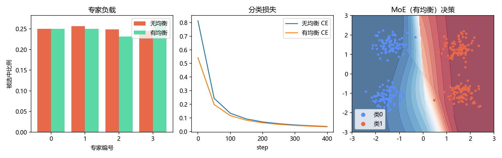

# 混合专家 MoE：用路由把算力花在刀刃上

> [!WARNING]
> 🧪 Beta公测版本提示：教程主体已完成，正在优化细节，欢迎大家提Issue反馈问题或建议。

> Transformer 里最贵的一块往往是 **FFN（前馈层）**。参数继续堆大，算力跟不上——**Mixture of Experts（MoE，混合专家）** 的思路是：总参数可以很多，但**每个 token 只激活少数几个专家**，用稀疏计算换「更大模型、相近 FLOPs」。Mixtral、DeepSeek-MoE、Switch Transformer 都走这条路。

---

## 一、为什么需要 MoE？

稠密模型里，每个 token 都过同一套巨大 FFN：

$$
\mathrm{FFN}(h)=W_2\,\sigma(W_1 h+b_1)+b_2
$$

参数量与每次前向的计算量基本绑定。MoE 把「一个大 FFN」换成「$N$ 个小专家 + 一个路由器」：

- **总参数** ≈ $N$ 个专家之和（可以很大）；
- **每次计算** ≈ 只跑 Top-$k$ 个专家（$k\ll N$，常取 1 或 2）。

> **图解说明**：左边每个 token 都挤进同一个大 FFN；右边先过路由器，只点亮少数专家。这是「稀疏激活」的核心画面。

直觉类比：医院不必每个病人都看遍所有科室——分诊台（路由器）把人送到最相关的两三个科室（专家）。

---

## 二、一层 MoE 怎么算？

记输入隐状态为 $h\in\mathbb{R}^{d}$（可以是某个 token 的表示）。

### 2.1 专家

第 $i$ 个专家 $E_i$ 通常就是一个小 FFN（结构与稠密 FFN 同类，宽度可以更小）。

### 2.2 路由器（门控）

路由器是一层线性 + Softmax，输出在 $N$ 个专家上的概率：

$$
g(h)=\mathrm{Softmax}(W_r h)\in\mathbb{R}^{N}
$$

### 2.3 Top-$k$ 稀疏门控

只保留最大的 $k$ 个门控值，其余置零并重新归一化（实现细节因论文而异）：

$$
\mathcal{T}_k(h)=\mathrm{Top\text{-}k}\big(g(h)\big),\qquad
y=\sum_{i\in\mathcal{T}_k(h)} \tilde g_i(h)\,E_i(h)
$$

其中 $\tilde g_i$ 是 Top-$k$ 后的门控权重。$k=1$ 时每个 token 只进一个专家（Switch Transformer 风格）；$k=2$ 在 Mixtral 等模型里很常见。

> **图解说明**：token 先得到各专家概率，只唤醒 Top-2，再按门控权重合并输出。未选中的专家本步不算，省下算力。

在 Transformer Block 里，MoE 通常**替换原来的 FFN 子层**，注意力子层仍稠密共享。

---

## 三、训练难点：路由崩溃与负载均衡

若放任不管，路由器很容易学会「永远把 token 扔给两三个看起来还行的专家」——其余专家饿死，等于白占参数。这叫 **routing collapse / 专家塌缩**。

常见对策是加 **负载均衡损失（load-balancing loss）**，鼓励：

1. 各专家被选中的频率接近均匀；
2. 路由器给出的平均概率也不要长期偏某一两个。

Switch Transformer 一类写法（离散化表述）大致是：对一个 batch，令 $f_i$ 为专家 $i$ 被选中的比例，$P_i$ 为路由器分给专家 $i$ 的平均概率，则

$$
\mathcal{L}_{\mathrm{aux}} = \alpha\, N \sum_{i=1}^{N} f_i P_i
$$

$f$ 与 $P$ 都均匀时该项较小；若集中在少数专家上则变大。$\alpha$ 是 auxiliary 权重。

> **图解说明**：左图负载严重倾斜是病态；右图通过辅助损失把流量摊开，专家才真正「各有所长」。

其它工程手段还包括：专家容量（capacity）上限、token 丢弃/溢出、对路由 logits 加噪声（训练期）等——本章玩具不实现全部，但读论文时会反复遇到。

---

## 四、和稠密模型怎么比？

| 维度 | 稠密 Transformer | MoE Transformer |
|------|------------------|-----------------|
| 参数量 | 与 FLOPs 大致同涨 | 参数可远大于每步 FLOPs |
| 每步算力 | 全部 FFN | 约 $k/N$ 的专家计算 |
| 实现 | 简单、硬件友好 | 需要路由、负载、分布式专家并行 |
| 训练稳定性 | 相对成熟 | 需防塌缩、调 $\alpha$ 与容量 |
| 代表 | Llama、GPT-3 稠密版 | Switch、Mixtral、DeepSeek-MoE |

注意：MoE **不是免费午餐**。通信（专家并行）、负载不均导致的气泡时间、以及「看起来 100B 参数但激活只有十几 B」的评测口径，都要单独理解。

---

## 五、发展脉络（够用版）

1. **经典 MoE（Jacobs et al., 1991）**：多个专家网络 + 门控，偏浅层集成思想。
2. **Sparsely-Gated MoE（Shazeer et al., 2017）**：引入稀疏门控，推向超大模型。
3. **GShard / Switch Transformer**：把 MoE 嵌进 Transformer，简化 Top-1，强调缩放定律。
4. **Mixtral 8×7B**：每层 8 专家、Top-2，开源后大幅普及「稀疏大模型」叙事。
5. **DeepSeek-MoE 等**：细粒度专家、共享专家（shared experts）等变体，进一步抠效率与专业化。

读到「共享专家」时记住一句：一部分容量永远对所有 token 开启（学通用变换），其余稀疏专家学特化变换。

---

## 六、代码在做什么

`demo.py` 用 NumPy 搭一个最小 MoE：

- 合成 2D 多模态数据（几个簇）；
- 路由器 Softmax + Top-2；
- 多个线性专家；
- 同时画出**路由直方图**（看有没有塌缩）和**决策边界**。

它不是 Switch/Mixtral 的复现，但能让你亲手看到：路由如何分配、均衡损失如何改变专家使用率。

> 运行 `code/demo.py` 后生成。

---

## 七、小结

| 概念 | 一句话 |
|------|--------|
| MoE | 多专家 + 路由器；每步只激活 Top-$k$ |
| 稀疏激活 | 总参数大，单次 FLOPs 近似稠密小模型 |
| 路由器 | 通常线性 + Softmax，决定专家权重 |
| 负载均衡 | 防止路由崩溃的辅助损失 / 容量约束 |
| 在 Transformer 中 | 常替换 FFN 子层 |

> 上一站是优化器细节 [Adam](/dl/adam/)；若你关心大模型语境，可对照 [Transformer](/nlp/transformer/) 的 FFN 位置，以及 [大语言模型](/nlp/llm/) 里的缩放叙事。

## 📥 Code

| File | View | Download |
|------|------|----------|
| demo.py | [Open](./code-demo) | <a href="/notebook/code/dl/moe/demo.py" target="_blank" download>Download</a> |
| exercise.py | [Open](./code-exercise) | <a href="/notebook/code/dl/moe/exercise.py" target="_blank" download>Download</a> |

## 参考

1. Jacobs, R. A., et al. (1991). Adaptive Mixtures of Local Experts. *Neural Computation*.
2. Shazeer, N., et al. (2017). Outrageously Large Neural Networks: The Sparsely-Gated Mixture-of-Experts Layer. [[arXiv:1701.06538](https://arxiv.org/abs/1701.06538)]
3. Fedus, W., Zoph, B., & Shazeer, N. (2022). Switch Transformers: Scaling to Trillion Parameter Models. *JMLR*. [[arXiv:2101.03961](https://arxiv.org/abs/2101.03961)]
4. Jiang, A. Q., et al. (2024). Mixtral of Experts. [[arXiv:2401.04088](https://arxiv.org/abs/2401.04088)]
5. Dai, D., et al. (2024). DeepSeekMoE: Towards Ultimate Expert Specialization. [[arXiv:2401.06066](https://arxiv.org/abs/2401.06066)]
