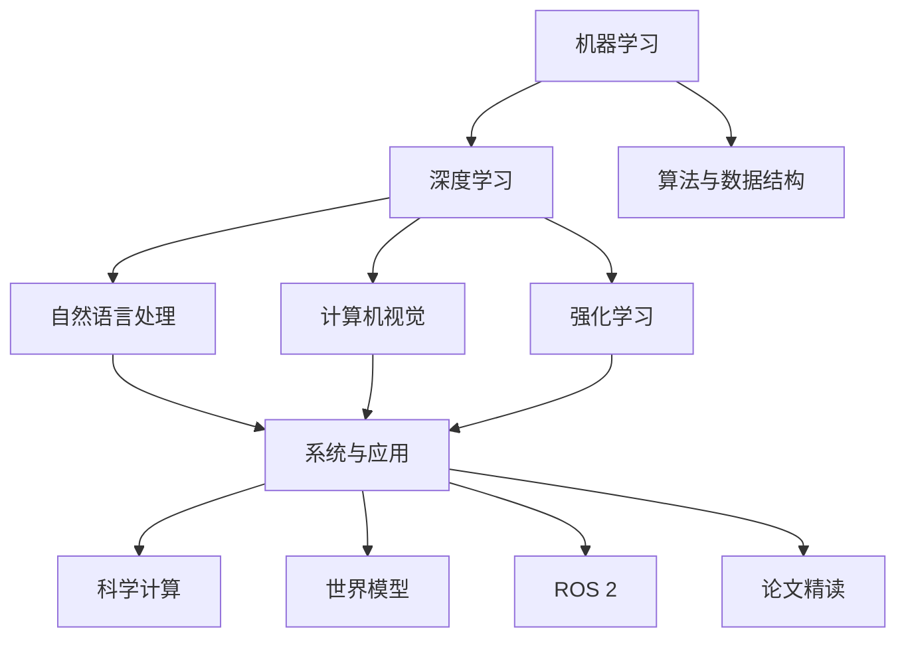

## 📖 学习路线图

各领域的具体章节以左侧边栏为准（由 `docs/` 文件夹自动扫描，加一章不必改这张图）。



## 🧭 学习路径推荐

不同背景的学习者，建议的学习顺序不同：

| 路径 | 适用人群 | 推荐顺序 |
|------|---------|----------|
| 🔵 **系统学习** | AI 零基础，建立完整知识体系 | 阶段一 → 二 → 三 → 四/五/六/七，按序推进 |
| 🟡 **LLM 重度用户** | 日常用 ChatGPT/Claude，想懂原理 | s01 → s14-s18(NLP) → s21(RLHF) → s22-s23(多模态/RAG) → s25(安全) |
| 🟢 **ML 工程师** | 已会深度学习，补经典 ML 理论 | 阶段二（ml01-ml05 必修）→ 番外一（集成树/聚类/降维）→ 附录算法 |
| 🟠 **开发转 AI** | 有编程基础，缺 ML 理论和 DL 实战 | 阶段一速览 → ml01/04/05 → 阶段三~七全量 |
| 🔵 **其他行业转行** | 非 CS/数学背景，目标上手+面试 | s01-s04 直觉→ml01/04/05→s05-s09 入门→s10/s16/s18 项目→s23/s25 加分 |
| 🟣 **面试冲刺** | 已学过，快速复习高频考点 | s02-s04 → ml04(SVM) → ml05(树) → s06-s09 → s16 → s18 → s21 → s25 |
| 🔴 **算法竞赛** | 只关注算法与数据结构 | 直接看附录 algo01 → algo16，其余章节按需查阅 |
| 🟤 **科研向 / AI4S** | 做科学计算、生物、芯片等交叉 | 阶段三~五 → 进阶一（as01–as08） |
| ⬛ **世界模型** | 关注具身智能 / 生成式模拟 | 阶段六 → 进阶二（wm01–wm08） |
| 🟠 **ROS 2 / 机器人** | 要在 Ubuntu 上跑 Humble | 侧栏 **ROS 2**（`docs/ros2/`，工作区 `workspaces/ros2-humble/`） |

> 💡 **番外一**在阶段二之后默认折叠；**进阶一 / 进阶二**在阶段七之后默认折叠；**番外二**为论文精读占位。详细路径说明见 [README](https://github.com/DeconBear/notebook#%E5%AD%A6%E4%B9%A0%E8%B7%AF%E5%BE%84%E6%8E%A8%E8%8D%90)。

## 🚀 快速开始

```bash
# 1. 克隆仓库
git clone https://github.com/DeconBear/notebook.git
cd notebook

# 2. 安装 Python 依赖
pip install -r requirements.txt

# 3. 运行任意章节的代码
cd docs/ml/foundations/ai-overview/code
python demo.py

# 4. 启动文档站点（可选）
npm install
npm run dev
```

## 📂 每章结构

```
docs/<领域>/.../<slug>/
├── index.md               # 图解正文（核心阅读材料）
├── code-demo.md           # demo.py 保姆级逐段讲解
├── code-exercise.md       # exercise.py 练习指南
├── code/
│   ├── demo.py            # 完整教学代码（中文注释）
│   └── exercise.py        # 动手练习（含 TODO）
└── images/                # 手绘图解
```

加一章：在对应领域下新建文件夹，或运行 `npm run new-chapter -- ml/foundations my-topic --title "标题" --order 25`。删一章：删掉该文件夹。

ROS 2 课是 Markdown 笔记（无 `demo.py`），可运行代码在仓库根的 `workspaces/ros2-humble/src/`。

## 🙏 致谢

受以下优秀项目启发：

- [learn-claude-code](https://github.com/shareAI-lab/learn-claude-code) — 仓库结构理念
- [3Blue1Brown](https://www.3blue1brown.com/) — 先直觉后公式的教学哲学
- [Distill.pub](https://distill.pub/) — 图解学术文章先驱
- [Andrej Karpathy](https://github.com/karpathy) — 从零实现的教学思路
