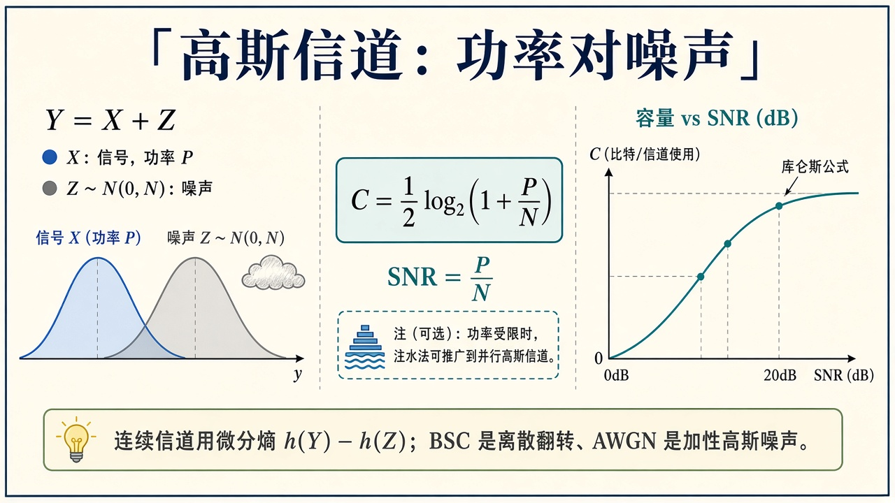
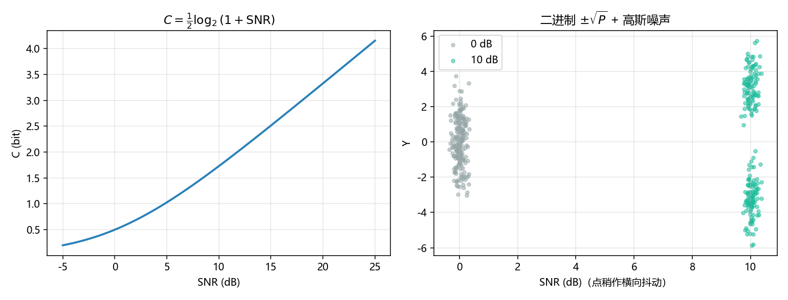

# 高斯信道：功率对噪声

> [!WARNING]
> 🧪 Beta公测版本提示：教程主体已完成，正在优化细节，欢迎大家提Issue反馈问题或建议。

> [BSC](/information/shannon/) 是离散翻转。真实链路常常是 **加性白高斯噪声**：$Y=X+Z$，$Z\sim\mathcal{N}(0,N)$，发送功率受限 $\mathbb{E}[X^2]\le P$。香农公式（每实数维、每用一次）

$$
C=\frac12\log_2\bigl(1+\tfrac{P}{N}\bigr)=\frac12\log_2(1+\mathrm{SNR}).
$$

输入高斯时达到容量。纠错码仍要满足 $R<C$，只是噪声模型换了；短码例子见 [Hamming](/information/channel-coding/)。

需要从微分熵差或 dB 换算推一遍时，点开「逐步推导」。

---

## 一、微分熵差

连续变量用微分熵 $h$。高斯噪声下 $h(Y\mid X)=h(Z)$ 与 $X$ 无关。功率约束下 $Y$ 的微分熵在 $X$ 高斯时最大，于是 $I(X;Y)=h(Y)-h(Z)$ 得到上面的 $C$。不必在本章推完微分熵的变分——记住「容量随 SNR 对数涨」即可。

**保姆级：功率受限是关键。** 若 $X$ 可以任意大，你只要把信号喊得比噪声响，错误率想多低有多低，容量会是无穷——那不真实。电池、法规、功放都限制 $\mathbb{E}[X^2]\le P$。噪声方差 $N$ 固定时，唯一的旋钮是信噪比 $\mathrm{SNR}=P/N$。翻倍功率，容量只加 $\tfrac12\log_2$ 的一点：高 SNR 时大约每 3 dB 半个 bit（每实数维）。这就是为什么 4G/5G 要靠带宽和多天线堆维数，而不是只把功放开到爆。

> **图解说明**：左是 $Y=X+Z$ 两个高斯；中是 $C=\tfrac12\log_2(1+\mathrm{SNR})$；右是容量随 SNR(dB) 上升。BSC 用 $h_2(p)$，这里用功率比。

$\mathrm{SNR}_{\mathrm{dB}}=10\log_{10}(P/N)$。0 dB 时 $C=0.5$ bit；20 dB 时约 $3.3$ bit。

::: details 逐步推导：从「高斯最大微分熵」到 $C=\tfrac12\log_2(1+\mathrm{SNR})$，以及 0 / 10 / 20 dB 的数（点击展开）

一维高斯 $\mathcal{N}(0,\sigma^2)$ 的微分熵（nat）是 $\tfrac12\ln(2\pi e\sigma^2)$。在方差固定时，高斯是最大微分熵分布。

$Y=X+Z$，$Z\sim\mathcal{N}(0,N)$ 与 $X$ 独立。则 $h(Y\mid X)=h(Z)=\tfrac12\ln(2\pi e N)$。功率约束 $\mathbb{E}[X^2]\le P$ 推出 $\mathbb{E}[Y^2]\le P+N$。于是 $h(Y)\le \tfrac12\ln(2\pi e(P+N))$，等号当 $Y$ 高斯，即 $X$ 高斯。互信息

$$
I(X;Y)=h(Y)-h(Y\mid X)\le \tfrac12\ln\bigl(1+\tfrac{P}{N}\bigr)\ \mathrm{nat}.
$$

换成 bit：除以 $\ln 2$，即 $\tfrac12\log_2(1+\mathrm{SNR})$。这就是容量。

dB：$ \mathrm{SNR}_{\mathrm{lin}}=10^{\mathrm{dB}/10}$。demo 固定 $N=1$，用 $P$ 调 SNR，打印：

| SNR | 线性 $P/N$ | $C=\tfrac12\log_2(1+\mathrm{SNR})$ |
|-----|-------------|--------------------------------------|
| $0\,\mathrm{dB}$ | $1$ | $\tfrac12\log_2 2=0.5$ bit |
| $10\,\mathrm{dB}$ | $10$ | $\tfrac12\log_2 11\approx 1.730$ bit |
| $20\,\mathrm{dB}$ | $100$ | $\tfrac12\log_2 101\approx 3.329$ bit |

右图散点不是容量实现：输入只是二进制 $\pm\sqrt{P}$（BPSK），达不到高斯输入的 $C$，但能看见 0 dB 两团糊在一起、10 dB 分开。真正逼近容量要用整形（高斯形状的星座）加好码。

:::

---

## 二、代码在做什么

`demo.py` 左图画 $C(\mathrm{SNR})$；右图在 0 dB 与 10 dB 下各撒 $\pm\sqrt{P}$ 二进制输入加噪声的散点（不是容量实现，只让「云有多糊」看得见）。终端打印两三个 SNR 的容量。种子 `42`，每档 200 个点，噪声标准差 $\sqrt{N}=1$。

二进制输入达不到公式里的 $C$（公式假定高斯输入），但散点仍能看出 SNR 高时两团分开。

---

## 三、小结

| 概念 | 一句话 |
|------|--------|
| AWGN | $Y=X+Z$，功率 $\le P$ |
| SNR | $P/N$；dB 是 $10\log_{10}$ |
| $C$ | $\tfrac12\log_2(1+\mathrm{SNR})$ |
| 下游 | 允许失真换更低速率：[率失真](/information/rate-distortion/) |

> 下一章 [率失真](/information/rate-distortion/)。量子侧噪声模型换掉，见 [量子信息](/quantum/overview/)。

## 📥 Code

| File | View | Download |
|------|------|----------|
| demo.py | [Open](./code-demo) | <a href="/notebook/code/information/awgn/demo.py" target="_blank" download>Download</a> |
| exercise.py | [Open](./code-exercise) | <a href="/notebook/code/information/awgn/exercise.py" target="_blank" download>Download</a> |

## 参考

1. Cover & Thomas, 高斯信道一章
2. Shannon (1948) 第 IV 部分
