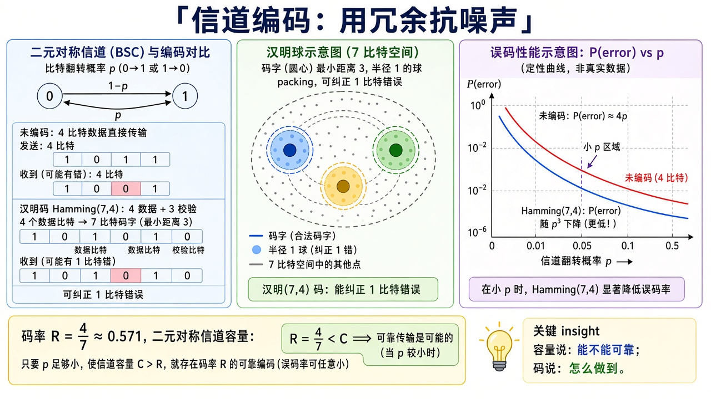
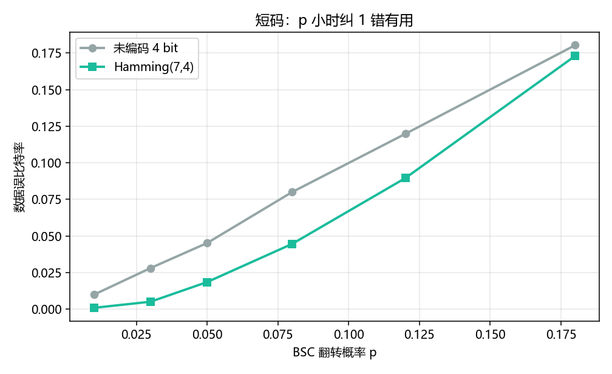

# 信道编码：冗余怎样换可靠性

> [!WARNING]
> 🧪 Beta公测版本提示：教程主体已完成，正在优化细节，欢迎大家提Issue反馈问题或建议。

> [香农](/information/shannon/) 说：码率 $R<C$ 时存在编码使误差随码长趋于 $0$。本章用最短的非平凡纠错码 **Hamming(7,4)** 看这句话的「怎么做」：4 个数据比特加 3 个校验，能纠正 **1 个**翻转。BSC 交叉概率 $p$ 小时，译码后的误比特率明显低于不编码的 4 比特。高斯噪声见 [AWGN](/information/awgn/)。

---

## 一、码率与球

7 位码字、16 个合法中心（$2^4$），最小距离 $3$，半径 $1$ 的汉明球互不相交，所以能纠正单个错误。码率

$$
R=\frac{4}{7}\approx 0.571.
$$

$p$ 很小的 BSC 容量 $C=1-h_2(p)$ 大于 $4/7$ 时，香农保证「存在更好的长码」；Hamming 只是手算得动的短码，不是容量逼近码。

> **图解说明**：左是 4 比特加 3 校验；中是半径 1 的球；右是未编码 vs Hamming 的误比特示意。校验子（syndrome）指出哪一位翻转。

---

## 二、位置 1,2,4 放校验

1-index 位置：校验在 $1,2,4$，数据在 $3,5,6,7$。每个校验覆盖二进制下对应比特为 1 的位置。收到后重算三个校验，合成 $1$–$7$ 的错误位置；为 $0$ 则无错。

---

## 三、代码在做什么

`demo.py` 在一串 $p$ 上各抽 4000 个随机 4 比特组：一条不编码直接过 BSC，一条 Hamming 编码再译。纵轴是数据比特的误比特率（BER）。$p\to 0$ 时 Hamming 接近 $0$ 更快；$p$ 太大（球重叠）纠错帮倒忙。

终端打印 $p=0.05$ 时两套 BER。不要把短码的 BER 曲线当成信道编码定理的证明——定理要码长 $\to\infty$。

---

## 四、小结

| 概念 | 一句话 |
|------|--------|
| 码率 $R$ | 数据位 / 发送位 |
| Hamming(7,4) | 纠 1 错，检 2 错（本章只用纠 1） |
| 校验子 | 三个校验合成错误位置 |
| $R<C$ | 可靠通信的前提，短码只是例子 |
| 下游 | [高斯信道](/information/awgn/) |

> 下一章 [高斯信道](/information/awgn/)。

## 📥 Code

| File | View | Download |
|------|------|----------|
| demo.py | [Open](./code-demo) | <a href="/notebook/code/information/channel-coding/demo.py" target="_blank" download>Download</a> |
| exercise.py | [Open](./code-exercise) | <a href="/notebook/code/information/channel-coding/exercise.py" target="_blank" download>Download</a> |

## 参考

1. MacKay, *ITILA*（Hamming 码）
2. Cover & Thomas, 信道编码定理
