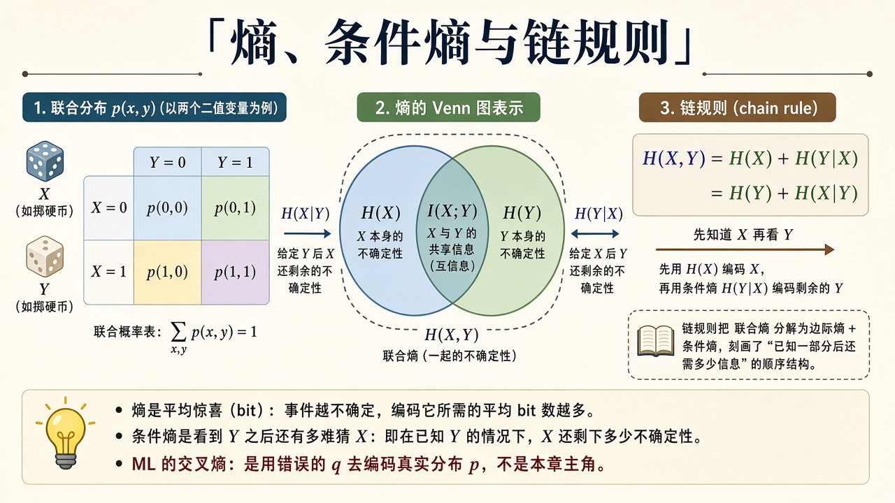
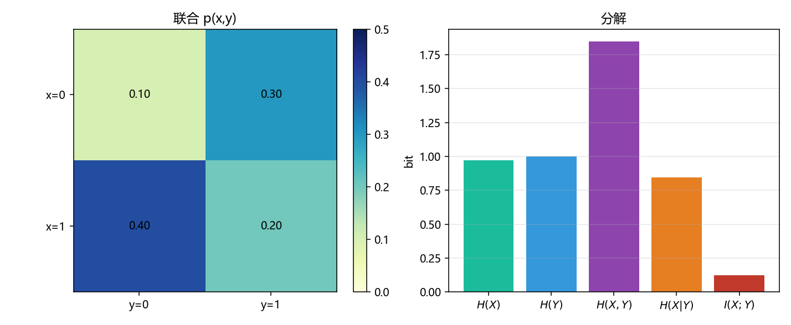

# 熵与条件熵：看见 $Y$ 之后，$X$ 还剩多少不确定

> [!WARNING]
> 🧪 Beta公测版本提示：教程主体已完成，正在优化细节，欢迎大家提Issue反馈问题或建议。

> [导论](/information/overview/) 把熵说成平均惊喜。本章补上**两个变量**：联合熵 $H(X,Y)$、条件熵 $H(X\mid Y)$、链规则。互信息 $I(X;Y)=H(X)-H(X\mid Y)$ 在 [香农章](/information/shannon/) 拿去写容量；交叉熵 / KL 仍在 [信息论精简](/math/information/)。

---

## 一、一张联合表

离散 $X,Y$ 的全部信息在联合 $p(x,y)$ 里。边缘 $p(x)=\sum_y p(x,y)$。熵

$$
H(X)=-\sum_x p(x)\log_2 p(x),\qquad
H(X,Y)=-\sum_{x,y}p(x,y)\log_2 p(x,y).
$$

条件熵是「先看见 $Y$，再猜 $X$」的平均剩余不确定：

$$
H(X\mid Y)=\sum_y p(y)\,H(X\mid Y=y)=H(X,Y)-H(Y).
$$

> **图解说明**：左是 $2\times 2$ 联合表；中是 Venn：$H(X)$、$H(Y)$ 重叠为 $I(X;Y)$，月牙是条件熵，并集是联合熵；右是链规则 $H(X,Y)=H(X)+H(Y\mid X)$。

---

## 二、链规则与互信息

$$
H(X,Y)=H(X)+H(Y\mid X)=H(Y)+H(X\mid Y).
$$

互信息是重叠：

$$
I(X;Y)=H(X)-H(X\mid Y)=H(Y)-H(Y\mid X)=H(X)+H(Y)-H(X,Y).
$$

独立时 $H(X,Y)=H(X)+H(Y)$，$I=0$。一方是另一方的函数时，条件熵为 $0$，互信息等于被决定那一侧的熵。

---

## 三、代码在做什么

demo 用一张 $2\times 2$ 联合表：

$$
p(x,y)=\begin{pmatrix}0.10&0.30\\0.40&0.20\end{pmatrix}
\quad(x\text{ 行},\; y\text{ 列}).
$$

算出 $H(X),H(Y),H(X,Y),H(X\mid Y),I(X;Y)$，并核对链规则。左图热力图是联合，右图柱是五个量。

$I$ 应严格为正（这张表不独立）；$H(X\mid Y)$ 应小于 $H(X)$——看见 $Y$ 对猜 $X$ 有帮助。

---

## 四、小结

| 概念 | 一句话 |
|------|--------|
| $H(X,Y)$ | 一对变量的平均惊喜 |
| $H(X\mid Y)$ | 看见 $Y$ 之后还剩多少 |
| 链规则 | 联合 = 边缘 + 条件 |
| $I(X;Y)$ | 重叠；容量章的主角 |
| 下游 | [香农](/information/shannon/) 用 $I$ 写 $C$ |

> 下一章 [香农信息论](/information/shannon/)。

## 📥 Code

| File | View | Download |
|------|------|----------|
| demo.py | [Open](./code-demo) | <a href="/notebook/code/information/entropy/demo.py" target="_blank" download>Download</a> |
| exercise.py | [Open](./code-exercise) | <a href="/notebook/code/information/entropy/exercise.py" target="_blank" download>Download</a> |

## 参考

1. Cover & Thomas, 第 2 章
2. MacKay, *ITILA*
