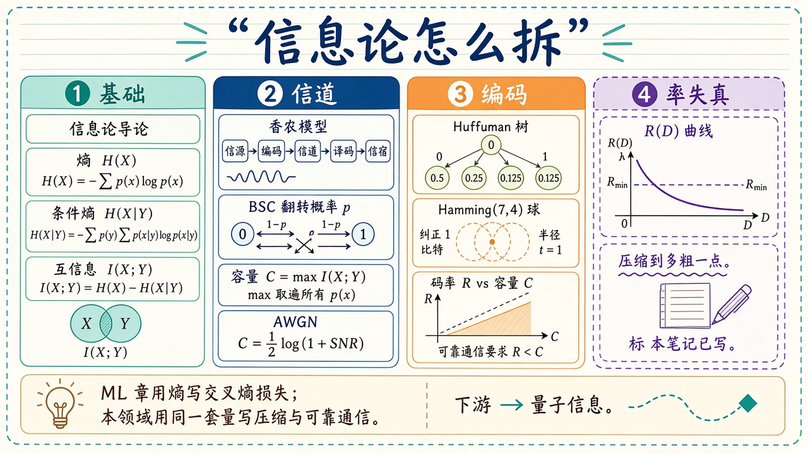

# 信息论：不确定性能不能被量化、压缩、穿过噪声

> [!WARNING]
> 🧪 Beta公测版本提示：教程主体已完成，正在优化细节，欢迎大家提Issue反馈问题或建议。

> 侧栏 **信息论** 不再只有香农一章。机器学习用的交叉熵 / KL 仍在 [信息论精简](/math/information/)；**本领域是通信问题**：熵是平均惊喜，互信息是看见 $Y$ 之后 $X$ 的不确定性减少了多少（剩余不确定性是条件熵），容量是可靠通信的速率上界。例如，若 $X,Y$ 是独立公平比特，则 $H(X\mid Y)=1$、$I(X;Y)=0$；若 $Y=X$，则 $H(X\mid Y)=0$、$I(X;Y)=1$。一个量记“还剩多少”，另一个记“减少多少”。点分组标题进本页。下游把比特换成量子比特，见 [量子信息](/quantum/overview/)。

> **图解说明**：基础（熵、条件熵、互信息）→ 信道（BSC、容量、AWGN）→ 编码（Huffman、Hamming）→ 率失真。ML 精简章用同一套量写损失，不要和本领域的编码定理混读。

| 入口 | 在问什么 |
|------|----------|
| **[信息论导论](/information/overview/)** | bit 是什么；本领域与 ML 精简章怎么分 |
| **[熵与条件熵](/information/entropy/)** | $H(X)$、$H(X\mid Y)$、链规则 |
| **[香农信息论](/information/shannon/)** | 通信模型、互信息、BSC 容量 |
| **[信源编码](/information/source-coding/)** | Huffman；平均码长 $\ge$ 熵 |
| **[信道编码](/information/channel-coding/)** | Hamming(7,4) 对 BSC |
| **[高斯信道](/information/awgn/)** | $C=\tfrac12\log_2(1+\mathrm{SNR})$ |
| **[率失真](/information/rate-distortion/)** | 允许失真 $D$ 时最少要多少比特 |
