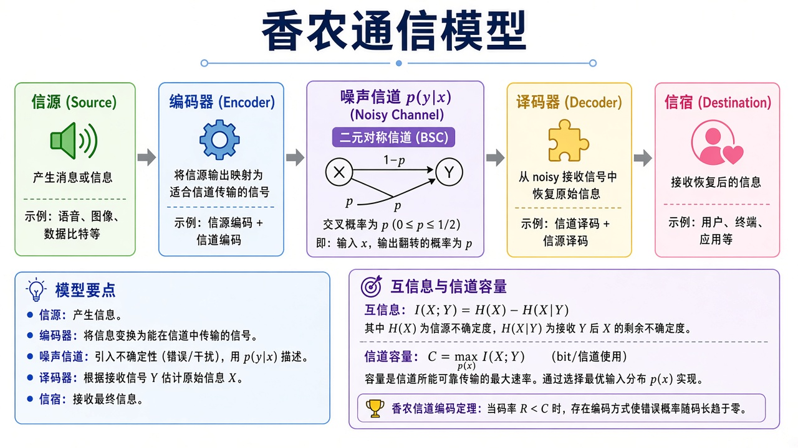
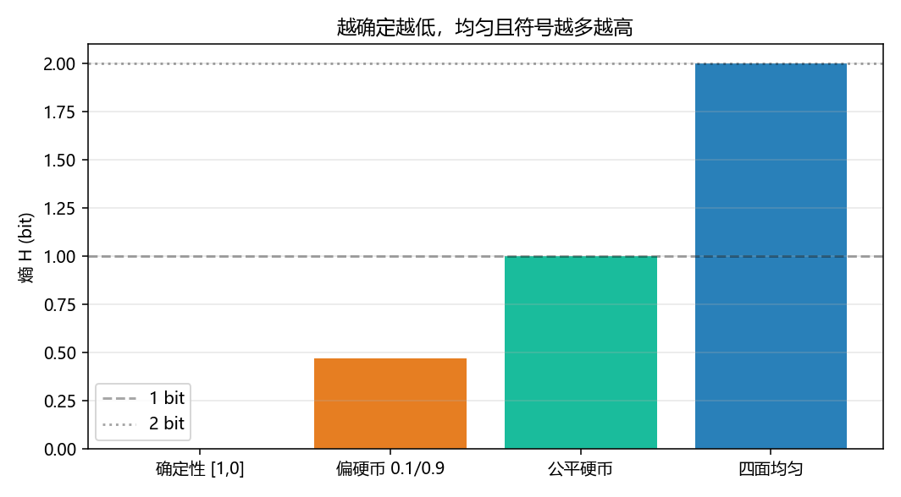

# 信息论导论：先分清两套用法

> [!WARNING]
> 🧪 Beta公测版本提示：教程主体已完成，正在优化细节，欢迎大家提Issue反馈问题或建议。

> 笔记本里已有 [信息论精简](/math/information/)：那是给机器学习的——交叉熵损失、KL 正则、VAE / RSSM。**本领域问的是通信**：一条消息能压多短、穿过噪声还能不能可靠恢复。同一套 $H$、$I$，目的不同。读完导论按侧栏往下：熵 → 香农容量 → 信源 / 信道编码 → 高斯信道 → 率失真。量子侧把比特换成量子比特，见 [量子信息](/quantum/overview/)。

---

## 一、bit 是不确定度的单位

公平硬币一次试验，两种结果等可能，需要 $1$ bit 来命名结果。偏硬币更好猜，熵小于 $1$。对数用 $\log_2$ 时单位是 **bit**；用 $\ln$ 时是 **nat**。差一个常数 $\ln 2$：

$$
H_{\mathrm{bit}}=\frac{H_{\mathrm{nat}}}{\ln 2}.
$$

本领域默认 bit。分类损失那章常用 nat（`np.log`），不要混。

---

## 二、七章怎么排

> **图解说明**：左列熵与互信息；中列信道与容量；右列 Huffman / Hamming；虚线率失真是「主动丢信息换压缩率」。底栏接到量子信息。

| 章 | 在问什么 |
|----|----------|
| 本页 | 两套用法、bit / nat |
| [熵与条件熵](/information/entropy/) | 联合、条件、链规则 |
| [香农信息论](/information/shannon/) | $I(X;Y)$ 与 BSC 容量 |
| [信源编码](/information/source-coding/) | 无噪压缩，码长 $\ge H$ |
| [信道编码](/information/channel-coding/) | 有噪时加冗余 |
| [高斯信道](/information/awgn/) | 连续加性噪声 |
| [率失真](/information/rate-distortion/) | 允许错一点能少传多少 |

香农通信模型五段（信源 → 编码 → 信道 → 译码 → 信宿）在容量章展开：

---

## 三、代码在做什么

`demo.py` 比较四种分布的熵（bit）：确定性、偏伯努利、公平硬币、四面均匀骰。公平硬币应正好 $1$；四面骰应正好 $2$。终端同时打印 $1\,\mathrm{nat}$ 等于多少 bit。

越确定熵越低；均匀且符号越多熵越高。这就是后面 Huffman「频繁符号短码」的理由。

---

## 四、小结

| 概念 | 一句话 |
|------|--------|
| bit / nat | $\log_2$ vs $\ln$；差 $\ln 2$ |
| ML 精简章 | 交叉熵 / KL 当损失 |
| 本领域 | 压缩与可靠通信 |
| 下游 | 量子信息把比特换成量子比特 |

> 下一章 [熵与条件熵](/information/entropy/)。

## 📥 Code

| File | View | Download |
|------|------|----------|
| demo.py | [Open](./code-demo) | <a href="/notebook/code/information/overview/demo.py" target="_blank" download>Download</a> |
| exercise.py | [Open](./code-exercise) | <a href="/notebook/code/information/overview/exercise.py" target="_blank" download>Download</a> |

## 参考

1. Shannon, “A Mathematical Theory of Communication” (1948)
2. Cover & Thomas, *Elements of Information Theory*
