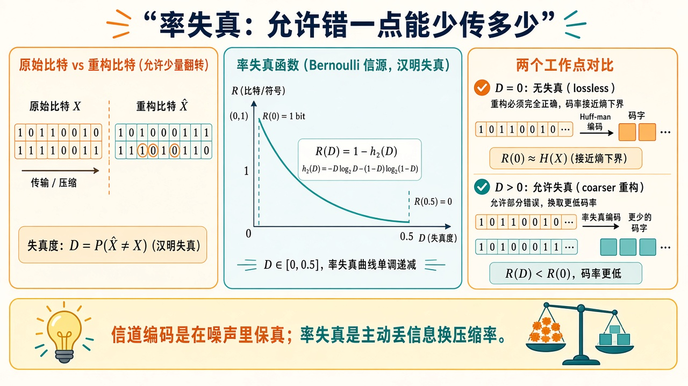
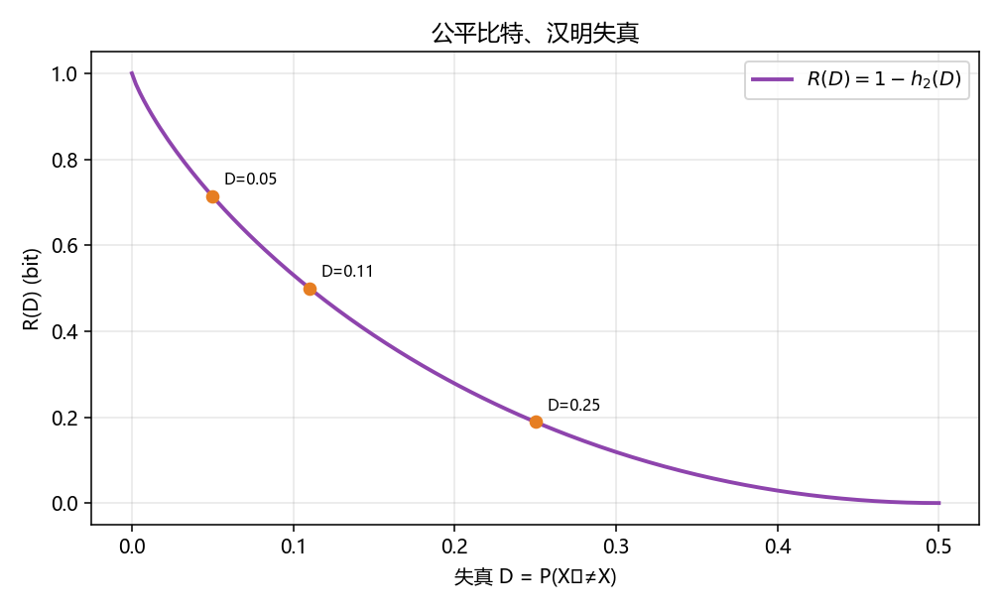

# 率失真：允许错一点，能少传多少

> [!WARNING]
> 🧪 Beta公测版本提示：教程主体已完成，正在优化细节，欢迎大家提Issue反馈问题或建议。

> [Huffman](/information/source-coding/) 是**无损**：$L\ge H$。若允许重构 $\hat X$ 与 $X$ 差一点，速率还可以再低。率失真函数 $R(D)$ 是失真不超过 $D$ 时的最小互信息（也是最小速率）。最简例子：公平比特、汉明失真 $D=P(\hat X\neq X)$，当 $D\le 1/2$ 时

$$
R(D)=1-h_2(D).
$$

$D=0$ 必须 1 bit（无损）；$D=1/2$ 可以什么都不传（瞎猜也是一半对）。这和 BSC 容量 $C=1-h_2(p)$ **公式长得一样**，对偶：那边 $p$ 是信道噪声，这边 $D$ 是你愿意制造的噪声。

需要把「为什么是 $1-h_2(D)$」展开时，点开「逐步推导」。

---

## 一、$R(D)$ 不是信道

信道编码：世界已经有噪声，你加冗余去对抗。率失真：你**主动**丢掉细节，换更短的描述。JPEG / 语音编码是这条线的工程后代。

**保姆级：失真是你选的公差。** 无损压缩把文件还原到一个比特都不差，下限是熵。照片却允许「看起来差不多」：亮度量化、高频丢掉，人眼不在乎的部分可以不传。$D$ 就是公差；$R(D)$ 问的是：公差这么松时，平均每个样本最少还要多少 bit。公差给到瞎猜的程度（公平比特上 $D=1/2$），$R=0$——发真空，收端抛硬币。

> **图解说明**：横轴失真 $D$，纵轴最少速率。无损在左上角 $R(0)=H$；右端 $D$ 大到无信息时 $R=0$。

::: details 逐步推导：二元汉明 $R(D)=1-h_2(D)$，以及和 BSC 容量为何同一公式（点击展开）

定义：$X$ 公平比特，$d(x,\hat x)=\mathbf{1}\{x\neq\hat x\}$，$D=\mathbb{E}[d]$。率失真

$$
R(D)=\min_{p(\hat x\mid x):\,\mathbb{E}[d]\le D} I(X;\hat X).
$$

最优测试信道可以取成：以概率 $D$ 翻转 $X$ 得到 $\hat X$（当 $D\le 1/2$）。这正是一条交叉概率为 $D$ 的 BSC，只是现在 $X$ 是「信源」，$\hat X$ 是「重构」。公平输入时

$$
I(X;\hat X)=1-h_2(D).
$$

下界可以直接推出来。令错误比特 $E=X\oplus\hat X$，实际错误概率为 $d=P(E=1)\le D$。已知 $\hat X$ 时，$X$ 与 $E$ 一一对应，因此

$
H(X\mid\hat X)=H(E\mid\hat X)\le H(E)=h_2(d)\le h_2(D),
$

最后一步用到 $0\le d\le D\le1/2$，在这个区间 $h_2$ 单调增加。于是 $I(X;\hat X)=1-H(X\mid\hat X)\ge1-h_2(D)$，而上述 BSC 测试信道恰好取等号。故 $R(D)=1-h_2(D)$。

当 $D\ge1/2$ 时，恒输出 $\hat X=0$ 已有平均失真 $1/2$，且不携带任何关于 $X$ 的信息，所以 $R(D)=0$。这也是为什么不能把 $1-h_2(D)$ 的公式继续画到 $D>1/2$：允许的失真变大，最少码率不可能反而上升。

和 [香农章](/information/shannon/) 的 $C_{\mathrm{BSC}}(p)=1-h_2(p)$ 比：同一个 $1-h_2(\cdot)$。读法相反——

- 容量：噪声 $p$ **已经存在**，你还能可靠传 $C(p)$；
- 率失真：你**自愿**制造差错 $D$，于是最少传 $R(D)$。

demo 在曲线上标 $D=0.05,0.11,0.25$。$D=0.11$ 与容量章的 $p=0.11$ 是同一工作点：$R(0.11)=C_{\mathrm{BSC}}(0.11)\approx 0.500$ bit。终端还打印 $D=0$（$R=1$）、$D=0.25$（$R\approx 0.189$）、$D=0.5$（$R=0$）。

「按概率 $D$ 随机翻转当作重构」只是让 $D$ 有操作定义，不是最优编码器的实现；最优编码器要像向量量化那样对长块一起描述。对方差为 $\sigma^2$ 的无记忆高斯信源、均方失真，才有 $R(D)=\tfrac12\log_2(\sigma^2/D)$（$0<D<\sigma^2$，$D\ge\sigma^2$ 时为 $0$）。JPEG 通过变换、量化与熵编码实现有损压缩，不能直接把它等同于这一高斯信源公式。共同思想是：公差换比特。

:::

---

## 二、代码在做什么

`demo.py` 直接计算并画出 $R(D)=1-h_2(D)$，在曲线上标 $D=0.05,0.11,0.25$。脚本没有采样随机翻转、估计经验失真或实现最优编码器；种子 `42` 在本脚本中未用于抽样。

$D=0.11$ 的标记点提醒：和 BSC 容量曲线是同一函数，读法相反。

---

## 三、小结

| 概念 | 一句话 |
|------|--------|
| $R(D)$ | 失真 $\le D$ 的最小速率 |
| 二元汉明 | $R(D)=1-h_2(D)$（$D\le 1/2$） |
| 无损 | $D=0\Rightarrow R=H$ |
| 对偶 | 与 BSC 容量同一公式 |
| 下游 | [量子信息](/quantum/overview/)；ML 损失见 [精简章](/math/information/) |

> 信息论七章到此。回到 [导论](/information/overview/) 或进 [量子信息](/quantum/overview/)。

## 📥 Code

| File | View | Download |
|------|------|----------|
| demo.py | [Open](./code-demo) | <a href="/notebook/code/information/rate-distortion/demo.py" target="_blank" download>Download</a> |
| exercise.py | [Open](./code-exercise) | <a href="/notebook/code/information/rate-distortion/exercise.py" target="_blank" download>Download</a> |

## 参考

1. Cover & Thomas, Rate Distortion Theory
2. Shannon, “Coding theorems for a discrete source with a fidelity criterion”
