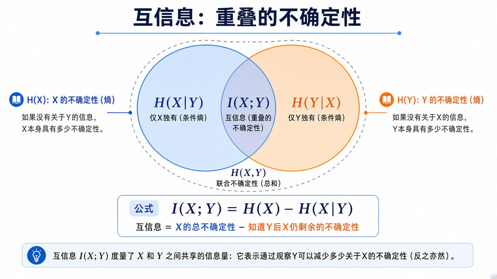
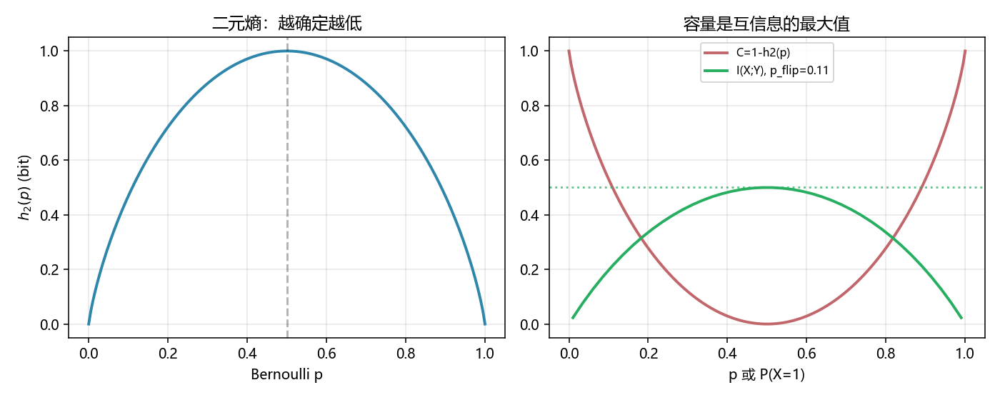

# 香农信息论：信道里能可靠传多少比特

> [!WARNING]
> 🧪 Beta公测版本提示：教程主体已完成，正在优化细节，欢迎大家提Issue反馈问题或建议。

> 笔记本里已有一章 [信息论精简](/math/information/)：那是给机器学习的——熵、交叉熵、KL。上一章 [熵与条件熵](/information/entropy/) 已经有 $H(X\mid Y)$。**本章是香农原来的通信问题**：信源 → 编码 → 噪声信道 → 译码 → 信宿；互信息 $I(X;Y)$ 与容量 $C=\max I(X;Y)$；二元对称信道（BSC）上 $C=1-h_2(p)$。无噪压缩见 [信源编码](/information/source-coding/)；有噪加冗余见 [信道编码](/information/channel-coding/)。读完再进 [量子信息](/quantum/overview/)，把比特换成量子比特。

两章不要混：精简章几乎不谈编码定理；本章几乎不谈反向 KL 或 ELBO。需要从 BSC 的条件熵推到容量公式时，点开「逐步推导」。

---

## 一、香农通信模型

一条消息要经过会出错的管道。模型拆成五块：信源产生符号；编码器变成适合信道的信号；信道用条件分布 $p(y\mid x)$ 掺噪声；译码器从 $Y$ 恢复 $X$；信宿接收。

> **图解说明**：绿到粉五段。中间紫块画的是 BSC：比特以概率 $p$ 翻转、以 $1-p$ 原样通过。右下：互信息 $I(X;Y)=H(X)-H(X\mid Y)$；容量是对输入分布取最大；码率 $R<C$ 时存在编码使误差随码长趋于 $0$（信道编码定理）。

BSC 是最小非平凡信道：输入输出都是 $\{0,1\}$，对称翻转。交叉概率 $p=0$ 时容量 $1$ bit/次；$p=1/2$ 时输出与输入独立，容量 $0$。

**保姆级：容量不是「调制速率」。** Wi-Fi 广告里的 Gbps 是符号率乘调制阶数，没有扣掉噪声。香农容量是：**在这种噪声下，你还想让差错概率任意小，平均每个信道使用最多能扛多少信息比特**。超过它，码再聪明也不行；低于它，码够长就行（存在性；构造是下一章 Hamming 以及现代 LDPC / Polar 的事）。

---

## 二、二元熵

公平硬币最难猜；确定性硬币熵为 $0$。伯努利参数 $p$ 的熵（bit，用 $\log_2$）

$$
h_2(p)=-p\log_2 p-(1-p)\log_2(1-p),
$$

在 $p=1/2$ 取到 $1$，在 $0$ 与 $1$ 两端为 $0$。这就是精简章里 $H(p)$ 的二元特例；本章要用它写信道容量，而不是写交叉熵损失。

demo 左图就是这条鼓起来的曲线。终端核对 $h_2(0.5)=1$。

---

## 三、互信息与容量

$$
I(X;Y)=H(Y)-H(Y\mid X)=H(X)-H(X\mid Y).
$$

直觉：看见 $Y$ 之后，$X$ 的不确定度掉了多少。Venn 图上是两圈重叠。

> **图解说明**：左圈 $H(X)$、右圈 $H(Y)$、重叠 $I(X;Y)$、独有部分是条件熵；全部并起来是联合熵 $H(X,Y)$。

对 BSC，$H(Y\mid X)=h_2(p)$（噪声与输入独立）。于是

$$
I(X;Y)=h_2(P(Y=1))-h_2(p).
$$

当输入公平 $P(X=1)=1/2$ 时 $Y$ 也公平，$I=1-h_2(p)$。可以证明这就是最大值，故

$$
C_{\mathrm{BSC}}(p)=1-h_2(p).
$$

容量不是「传得快就能快」，而是**可靠通信的速率上界**。超过它，无论码多聪明，误差都不能任意小。

量子侧会把 $I(X;Y)$ 换成 Holevo 量等，但「噪声信道有一个不可逾越的速率」这句话仍在；见 [量子信息](/quantum/overview/)。

::: details 逐步推导：BSC 上 $I(X;Y)=H(Y)-h_2(p)$，以及公平输入达到容量（点击展开）

BSC：$Y=X\oplus Z$，$Z\sim\mathrm{Bern}(p)$ 与 $X$ 独立。固定 $X=x$，输出就是「以 $p$ 翻转」，所以 $H(Y\mid X=x)=h_2(p)$，对 $x$ 平均仍是 $h_2(p)$。因此

$$
I(X;Y)=H(Y)-H(Y\mid X)=H(Y)-h_2(p).
$$

$Y$ 仍是伯努利，参数

$$
P(Y=1)=P(X=1)(1-p)+P(X=0)p.
$$

记 $q=P(X=1)$，则 $P(Y=1)=q(1-p)+(1-q)p$。二元熵 $h_2$ 在 $1/2$ 最大、值为 $1$，所以 $H(Y)\le 1$，等号当 $P(Y=1)=1/2$。对对称 BSC，取 $q=1/2$ 即可让 $Y$ 公平，于是 $I=1-h_2(p)$。任何偏置都会让 $H(Y)<1$，互信息更小。故最大值就是容量。

demo 取翻转 $p=0.11$（接近早期深空码工作点量级）：

$$
h_2(0.11)\approx 0.4999,\qquad C\approx 0.5001\ \mathrm{bit/use}.
$$

右图绿线扫描 $q=P(X=1)$，拱形最高点应贴着水平虚线 $C$。$p=0$ 时 $C=1$；$p=1/2$ 时 $h_2=1$、$C=0$——输出是公平噪声，与输入无关。

:::

::: details 逐步推导：信道编码定理在说什么（典型集直觉，不是完整证明）（点击展开）

把信道独立使用 $n$ 次。大约有 $2^{nH(Y)}$ 种「看起来合理」的输出序列，每种输入大约对应 $2^{nH(Y\mid X)}$ 种输出云。可分辨的输入云个数大约是

$$
\frac{2^{nH(Y)}}{2^{nH(Y\mid X)}}=2^{nI(X;Y)}\le 2^{nC}.
$$

你若只挑选 $M=2^{nR}$ 个码字且 $R<C$，可以把云摆得几乎不重叠，译码「最近云」的差错随 $n\to\infty$ 趋于 $0$。$R>C$ 时云必然叠，差错有下界。这就是信道编码定理的存在性；Hamming(7,4) 是 $n=7$ 的手工码，不是这个极限。BSC 上把 $I$ 最大化就得到上一则里的 $C=1-h_2(p)$。短码怎么做见 [Hamming](/information/channel-coding/)。

:::

---

## 四、代码在做什么

`demo.py` 画 $h_2(p)$ 全曲线，以及 $C(p)=1-h_2(p)$；并在固定翻转 $p=0.11$ 下扫描输入偏置 $P(X=1)$，画出 $I(X;Y)$，水平虚线是容量。终端打印 $h_2(0.5)=1$ 与该 BSC 的 $C$。

$p=0.11$ 接近早期深空码的工作点量级：容量明显小于 $1$，但远大于 $0$——值得编码，也必须编码。

---

## 五、小结

| 概念 | 一句话 |
|------|--------|
| 通信模型 | 信源 / 编码 / 信道 / 译码 / 信宿 |
| $h_2(p)$ | 一比特伯努利的不确定度 |
| $I(X;Y)$ | 观测 $Y$ 减少了多少对 $X$ 的不确定 |
| 容量 $C$ | $\max_{p(x)} I(X;Y)$；BSC 为 $1-h_2(p)$ |
| 与 ML 章 | 精简章用同一熵写损失；本章用它写信道 |

> 机器学习里的交叉熵 / KL 请走 [信息论精简](/math/information/)。下一章 [信源编码](/information/source-coding/) 把 $H$ 变成码长；连续噪声见 [高斯信道](/information/awgn/)。量子信道与纠缠请走 [量子信息全景](/quantum/overview/)。

## 📥 Code

| File | View | Download |
|------|------|----------|
| demo.py | [Open](./code-demo) | <a href="/notebook/code/information/shannon/demo.py" target="_blank" download>Download</a> |
| exercise.py | [Open](./code-exercise) | <a href="/notebook/code/information/shannon/exercise.py" target="_blank" download>Download</a> |

## 参考

1. Shannon, “A Mathematical Theory of Communication” (1948)
2. Cover & Thomas, *Elements of Information Theory*
3. MacKay, *Information Theory, Inference, and Learning Algorithms*
