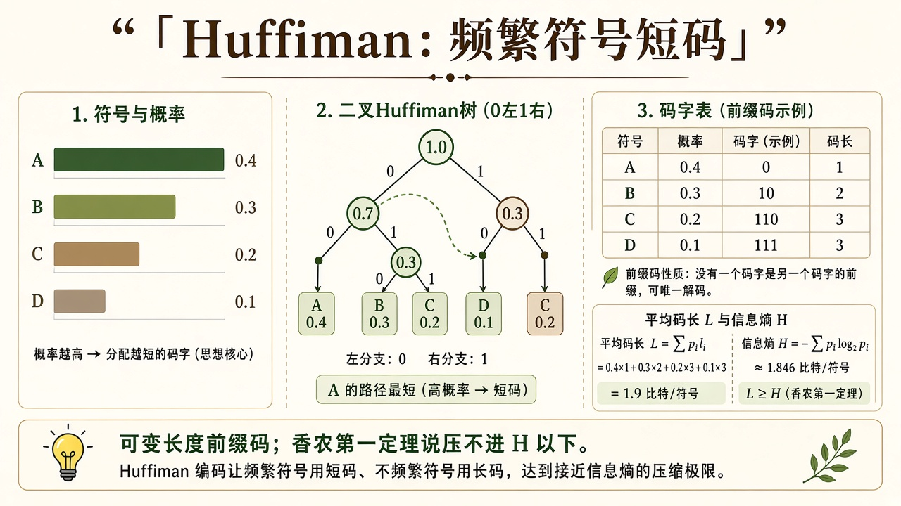
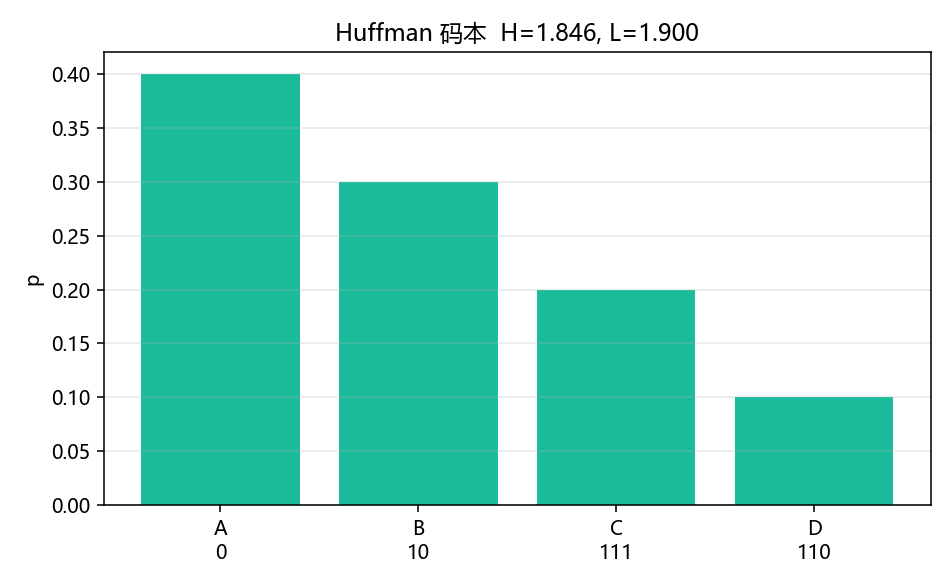

# 信源编码：频繁符号为什么要短码

> [!WARNING]
> 🧪 Beta公测版本提示：教程主体已完成，正在优化细节，欢迎大家提Issue反馈问题或建议。

> 无噪声时，压缩的极限是熵：平均码长 $L\ge H$。Huffman 是一种前缀码，把概率大的符号放在短分支上。容量与噪声留给 [香农](/information/shannon/) 和 [信道编码](/information/channel-coding/)；允许主动失真见 [率失真](/information/rate-distortion/)。

正文先讲前缀与 Kraft；需要把 $L\ge H$ 或四人字母表的合并顺序展开时，点开「逐步推导」。

---

## 一、前缀码与 Kraft

前缀码：没有任何码字是另一个码字的前缀，才能即时解码（不必等结束符）。平均长度

$$
L=\sum_i p_i \ell_i \ge H(p),
$$

当 $p_i=2^{-\ell_i}$ 时可以精确取等号；一般独立同分布信源按 $n$ 个符号分组编码时，每符号平均码长 $L_n/n\to H$。

**保姆级：为什么「前缀」这么重要。** 电文是 0/1 连在一起写的，没有逗号。若 `A=0`、`B=01`，看见 `0` 你不知道是已经结束的 A，还是 B 的开头。若任何码字都不是别的码字的前缀（`A=0`、`B=10`、`C=110`、`D=111`），译码器可以贪心往下吃：走到叶子就输出一个符号。这叫即时可解。

> **图解说明**：概率大的叶子离根近；平均码长 $L$ 贴在熵 $H$ 上方。这是可变长度，不是固定 $\log_2|\mathcal{X}|$。

::: details 逐步推导：Kraft 不等式怎样逼出 $L\ge H$（点击展开）

对进制 $2$ 的前缀码，码长 $\ell_i$ 必须满足 Kraft

$$
\sum_i 2^{-\ell_i}\le 1.
$$

直觉：把无穷二叉树的节点看成区间，前缀码的叶子区间不相交，总长度不能超过 $1$。

熵与码长的差可以写成 KL。令 $q_i=2^{-\ell_i}/Z$（$Z=\sum 2^{-\ell_j}\le 1$）。则

$$
L-H=\sum_i p_i \ell_i +\sum_i p_i\log_2 p_i
=\sum_i p_i\log_2\frac{p_i}{2^{-\ell_i}}
=D_{\mathrm{KL}}(p\|q)+\log_2\frac{1}{Z}\ge 0,
$$

这里必须使用归一化的 $q_i=2^{-\ell_i}/Z$，因为 $2^{-\ell_i}$ 的总和可能小于 $1$，不能直接把它当作 KL 的第二个概率分布。逐项展开：

$
D_{\mathrm{KL}}(p\|q)
=\sum_i p_i\log_2 p_i+\sum_i p_i\ell_i+\log_2 Z
=L-H+\log_2 Z.
$

移项才得到 $L-H=D_{\mathrm{KL}}(p\|q)-\log_2 Z\ge0$，因为 KL $\ge0$ 且 $Z\le1$。例如两个等概率符号分别编码为 `00`、`01`，则 $L=2$、$H=1$、$Z=1/2$、$q=(1/2,1/2)$；KL 为 $0$，全部 $1$ bit 冗余来自码树未用满的 $-\log_2 Z$。等号需要 $Z=1$ 且 $p_i=2^{-\ell_i}$——概率恰好是二进倒数。一般信源做不到，所以单符号 Huffman 只能保证 $H\le L<H+1$；把符号捆成 $n$ 元组再编码，$L/n\to H$（香农第一定理）。

固定长度编码每个符号 $\lceil\log_2 m\rceil$ bit，四人字母表要 $2$ bit，比下面 Huffman 的 $L\approx 1.9$ 更浪费——因为它不肯给频繁符号让路。

:::

---

## 二、Huffman 怎么长树

反复把当前最轻的两棵子树合并，左 $0$ 右 $1$。四人字母表 $\{A,B,C,D\}$ 概率 $0.4,0.3,0.2,0.1$ 是教材常客。得到的 $L$ 应满足 $H\le L<H+1$。

::: details 逐步推导：对 $\{0.4,0.3,0.2,0.1\}$ Huffman 怎样长出码本（点击展开）

与 `demo.py` 的堆实现一致（先弹出更轻的，左标 `0`、右标 `1`）：

1. 最轻两片叶子 $D=0.1$ 与 $C=0.2$ 合并成 $0.3$。暂定 $D\to 0$、$C\to 1$（相对这个新节点）。
2. 现在袋里是 $A=0.4$、$B=0.3$、$(CD)=0.3$。再合并 $B$ 与 $(CD)$ 得 $0.6$：$B\to 0$，$(CD)\to 1$。
3. 最后 $A=0.4$ 与 $0.6$ 合并：$A\to 0$，另一侧 $\to 1$。

从根往叶子读：

| 符号 | 码 | 长度 |
|------|----|------|
| A | `0` | 1 |
| B | `10` | 2 |
| D | `110` | 3 |
| C | `111` | 3 |

（左/右 $0/1$ 若对调，码字会整体翻转，长度不变。）平均码长

$$
L=0.4\cdot 1+0.3\cdot 2+0.2\cdot 3+0.1\cdot 3=1.9.
$$

熵

$$
H=-0.4\log_2 0.4-0.3\log_2 0.3-0.2\log_2 0.2-0.1\log_2 0.1\approx 1.8464\ \mathrm{bit}.
$$

故 $L-H\approx 0.0536$，落在 $[0,1)$ 里。$A$ 最短、$D$ 与 $C$ 最长，对应图上「概率 vs 码长」的反比关系。

:::

---

## 三、代码在做什么

`demo.py` 用堆实现 Huffman，打印码本、$H$、$L$，并画各符号的概率柱，横轴标出符号与码字。没有画二叉树图形（示意图在上面），只验证不等式。

$A$ 最短，$D$ 最长。$L-H$ 是这张短表上「没分成长块」留下的冗余。

---

## 四、小结

| 概念 | 一句话 |
|------|--------|
| 前缀码 | 码字互不为前缀，可即时解 |
| $L\ge H$ | 压不进熵以下（无失真） |
| Huffman | 贪心合并最轻两棵树 |
| 下游 | 有噪改走 [信道编码](/information/channel-coding/) |

> 下一章 [信道编码](/information/channel-coding/)。

## 📥 Code

| File | View | Download |
|------|------|----------|
| demo.py | [Open](./code-demo) | <a href="/notebook/code/information/source-coding/demo.py" target="_blank" download>Download</a> |
| exercise.py | [Open](./code-exercise) | <a href="/notebook/code/information/source-coding/exercise.py" target="_blank" download>Download</a> |

## 参考

1. Cover & Thomas, 第 5 章（Huffman）
2. MacKay, *ITILA*
