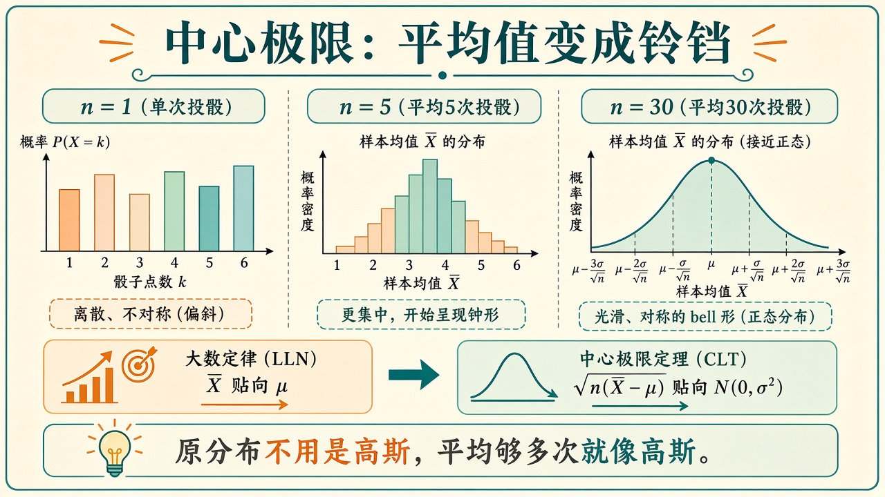
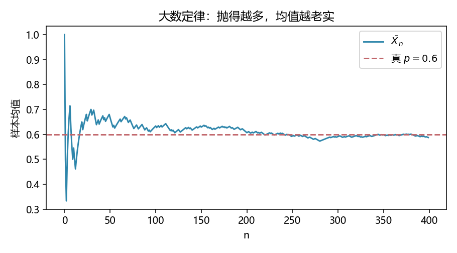
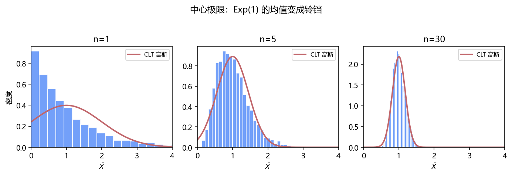

# 大数定律与中心极限：平均会老实，而且长成铃铛

> [!WARNING]
> 🧪 Beta公测版本提示：教程主体已完成，正在优化细节，欢迎大家提Issue反馈问题或建议。

> [估计](/math/estimation/) 说 $\hat\theta$ 是随机变量。本章回答两个「然后呢」：**大数定律（LLN）**——$n$ 大时 $\bar X$ 贴向 $\mathbb{E}X$；**中心极限定理（CLT）**——贴的方式是 $\sqrt{n}(\bar X-\mu)$ 长成高斯，即使原来的 $X$ 根本不是高斯。这是「用训练集平均代替真实风险」、以及误差条画成 $\pm 1.96\sigma/\sqrt{n}$ 的许可证。前置：[常见分布](/math/distributions/)。

---

## 一、大数定律

$X_i$ i.i.d.，$\mathbb{E}|X_1|<\infty$，则

$$
\bar X_n=\frac1n\sum_{i=1}^n X_i \ \to\ \mu=\mathbb{E}X_1
$$

（依概率；还有几乎处处的强形式，这里不展开）。抛币 $p=0.6$，运行均值会从乱抖收成一条贴着 $0.6$ 的线——demo 左图。

机器学习里把损失的期望换成样本平均，靠的就是 LLN。它**不**保证分布是高斯，只保证中心找对。

---

## 二、中心极限

设 $\mathrm{Var}(X_1)=\sigma^2<\infty$，则

$$
\sqrt{n}\,(\bar X_n-\mu)\ \xrightarrow{d}\ \mathcal{N}(0,\sigma^2),
$$

或等价地 $\bar X_n$ 大约是 $\mathcal{N}(\mu,\sigma^2/n)$。原分布可以是指数（右偏、只活在正半轴）：$n=1$ 时直方图还是折线，$n=5$ 开始鼓包，$n=30$ 已经像铃铛。



> **图解说明**：三档样本量。LLN 是「中心贴过去」；CLT 是「贴的误差长成高斯」。底栏：原分布不必是高斯。

标准化样本均值

$$
Z_n=\frac{\sqrt{n}\,(\bar X_n-\mu)}{\sigma}
$$

在练习里手写。置信区间 $\bar X\pm 1.96\,\sigma/\sqrt{n}$ 就是在假装 $Z_n\approx\mathcal{N}(0,1)$。

---

## 三、代码在做什么

`clt_lln.png`：一条运行均值。`clt_hist.png`：指数样本均值的三档直方图，叠一条理论高斯。C++ 用最小 LCG 抽 $\mathrm{Exp}(1)$，印 $n=30$ 时 $\mathrm{Var}(\bar X)$ 是否接近 $1/30$。





```bash
cd docs/math/clt/code
python demo.py
g++ -std=c++17 demo.cpp -o clt_demo
```

---

## 四、小结

| 概念 | 一句话 |
|------|--------|
| LLN | $\bar X\to\mu$，中心找对 |
| CLT | $\sqrt{n}(\bar X-\mu)$ 变高斯 |
| $\sigma/\sqrt{n}$ | 均值比单点更稳，稳 $\sqrt{n}$ 倍 |
| 下游 | 误差条、SGD 噪声、[蒙特卡洛](/ml/advanced/monte-carlo/) |

> 下一章 [优化与梯度](/math/optimization/)：把「平均损失」写成 $L(\theta)$，参数怎么下山。

## 📥 Code

| File | View | Download |
|------|------|----------|
| demo.py | [Open](./code-demo) | <a href="/notebook/code/math/clt/demo.py" target="_blank" download>Download</a> |
| clt.hpp | — | <a href="/notebook/code/math/clt/clt.hpp" target="_blank" download>Download</a> |
| demo.cpp | — | <a href="/notebook/code/math/clt/demo.cpp" target="_blank" download>Download</a> |
| exercise.py | [Open](./code-exercise) | <a href="/notebook/code/math/clt/exercise.py" target="_blank" download>Download</a> |

## 参考

1. Durrett, *Probability: Theory and Examples*（定理表述）
2. Blitzstein & Hwang, *Introduction to Probability*（例题向）
