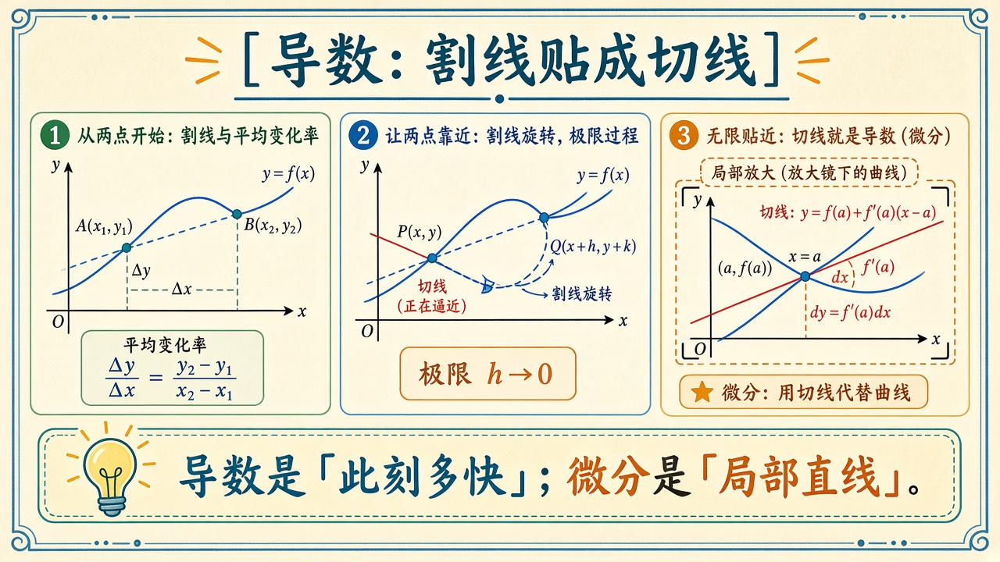
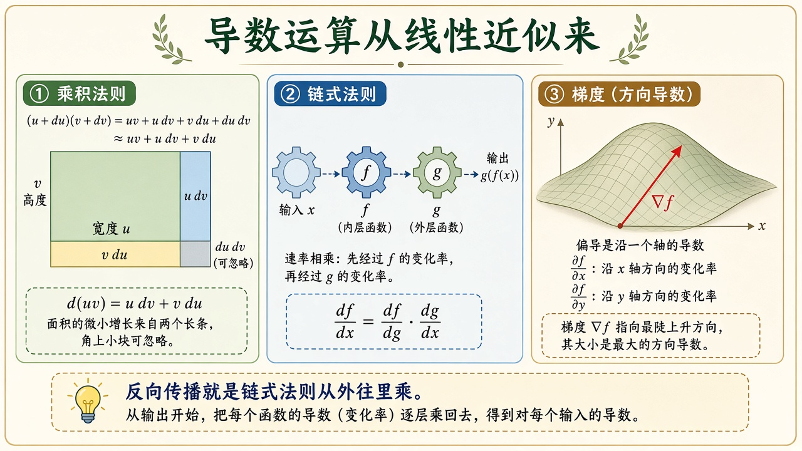
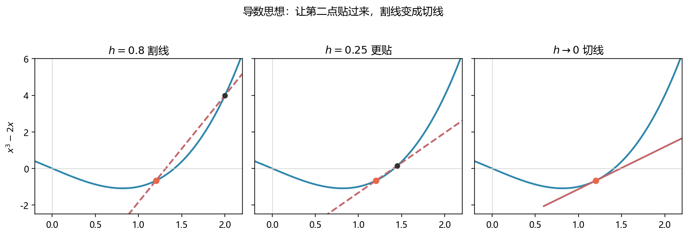
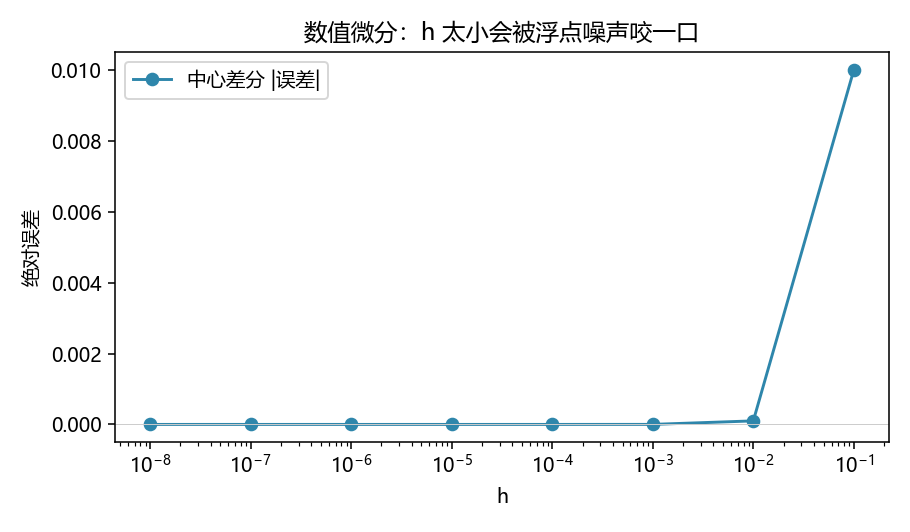

# 导数与微分：变化有多快，局部能不能当成直线

> [!WARNING]
> 🧪 Beta公测版本提示：教程主体已完成，正在优化细节，欢迎大家提Issue反馈问题或建议。

> 微积分不是一堆求导表。它只讲一件事：**光滑的弯曲，在足够小的窗口里看起来像直线。** 这条直线的斜率叫**导数**；用这条直线代替曲线去算「再走一小步会变多少」，叫**微分**。积分是下一章的累加。领域地图：[数学基础](/math/)。后面的 [线性代数](/math/linear-algebra/) 处理的是「已经是直线」的变换；[优化](/math/optimization/) 里的梯度，就是本章思想抬到多变量。

---

## 一、函数是一台机器，导数问「此刻转多快」

函数 $f$ 把输入 $x$ 变成输出 $f(x)$。平均变化率只比较两个时刻：

$$
\frac{f(a+h)-f(a)}{h}
$$

几何上是连接 $(a,f(a))$ 与 $(a+h,f(a+h))$ 的**割线**斜率。$h$ 是时间步、是窗口宽度。窗口很大时，割线只是个粗略平均——就像用「这一小时走了 60 公里」说你此刻的车速。

把 $h$ 缩小，割线会转动。若曲线在 $a$ 附近足够光滑，割线会贴上一根唯一的**切线**。这根切线的斜率就是导数：

$$
f'(a)=\lim_{h\to 0}\frac{f(a+h)-f(a)}{h}.
$$

不必先啃 $\varepsilon$-$\delta$。极限在这里的日常含义是：**窗口小到再小，斜率不再改主意。** 改主意的地方叫不可导（尖角、折点）——对 AI 里常见的 $\mathrm{ReLU}$，尖角处我们约定一个侧导数继续算，思想不变。



> **图解说明**：左是宽窗口的平均变化率；中是两点靠近；右是切线，旁边的小三角形就是微分 $dy=f'(a)\,dx$。底栏：导数是速度，微分是局部直线。

<video controls muted loop playsinline preload="metadata" style="width:100%;max-width:960px;border-radius:8px;background:#f7fafc;margin:0.6rem 0;">
  <source src="./images/secant_anim.mp4" type="video/mp4">
</video>

> **动画说明**：$f(x)=x^3-2x$，锚点 $x=1.2$。$h$ 从 0.85 收到 0.04，割线斜率贴近切线 $f'(1.2)$。

$f(x)=x^3-2x$ 在 $x=2$ 处，$f'(2)=10$。demo 里三张图用 $h=0.8$、$0.25$、切线把这个贴合过程画出来。

---

## 二、微分：认真对待「局部直线」

导数是一个**数**（斜率）。微分是一次**线性替换**：

$$
f(a+\Delta x)\;\approx\; f(a)+f'(a)\,\Delta x.
$$

右边是切线。$\Delta x$ 写成 $dx$ 时，人们把 $df=f'(x)\,dx$ 叫做微分。思想是：

> **弯曲的世界里，每走一小步，只用乘一次斜率。**

这比「背求导公式」更根本。后面几乎所有运算法则，都可以从「两条直线怎么合成」推出来，而不是从极限式里硬算。

- **和**：两台机器并排，斜率相加。
- **乘积**：矩形的宽 $u$、高 $v$。两边各胀一截，面积多出来的是 $u\,dv+v\,du$；角上那一小块 $du\,dv$ 在「足够小」时扔掉——这就是乘积法则。
- **复合（链式法则）**：先 $x\mapsto g(x)$ 再 $g\mapsto f(g)$。第一台把 $dx$ 放大 $g'$ 倍，第二台再放大 $f'$ 倍，总放大倍数相乘：

$$
\frac{d}{dx}f(g(x))=f'(g(x))\,g'(x).
$$

神经网络的反向传播，就是这条链从输出往输入逆着乘。本章只要求看见「变化率相乘」；具体下山见 [优化与梯度](/math/optimization/)。



> **图解说明**：左：乘积是矩形的两边增量；中：复合是两台齿轮转速相乘；右：多变量时沿一个轴切一刀叫偏导，最陡的箭头叫梯度。

多元只记一句：固定其他变量、只动 $x_i$，就是偏导 $\partial f/\partial x_i$。所有偏导排成向量，叫梯度 $\nabla f$——方向是山坡最陡的上坡。训练走它的反方向。

---

## 三、C++ 怎么给「公式」求导

公式进了程序，有三条路。教学代码三条都写了，对照同一条 $f(x)=x^3-2x$、$x=2$（真值 $f=4,f'=10$）。

| 路 | 你在干什么 | 优点 | 坑 |
|----|------------|------|----|
| **多项式系数** | $x^3-2x$ 存成 `{0,-2,0,1}`，逐项 $x^k\mapsto k x^{k-1}$ | 精确（有理系数时） | 只覆盖多项式 |
| **对偶数（自动微分）** | 每个量带一对 $(v,d)$，四则运算按法则重载 | **写一遍公式，值和导数一起出来** | 要给初等函数写导数规则 |
| **中心差分** | $[f(x+h)-f(x-h)]/(2h)$，把 $f$ 当黑盒 | 不用解析式 | $h$ 太大不准、太小被浮点噪声咬 |

### 1. 多项式：符号的最小可用子集

$$
p(x)=\sum_{k=0}^n c_k x^k
\quad\Rightarrow\quad
p'(x)=\sum_{k=1}^n k\,c_k x^{k-1}.
$$

C++ 里就是循环：`q.c[i-1] = i * p.c[i]`。这不是完整的符号计算（不会化简 $\sin$），但把「公式 = 系数数组」说清楚了。积分章会对同一数组做 $x^k\mapsto x^{k+1}/(k+1)$。

### 2. 对偶数：把微分法则写进类型

引入 $x+\varepsilon$，$\varepsilon^2=0$（比任何还小的增量还小，平方扔掉——正是乘积法则里丢掉的那一小块）。于是

$$
f(x+\varepsilon)=f(x)+f'(x)\,\varepsilon.
$$

代码里用结构体 `Dual { double v, d; }`。自变量种子是 `{x, 1}`，常数是 `{c, 0}`。乘法必须写乘积法则，不能只乘 $v$：

```cpp
inline Dual operator*(Dual a, Dual b) {
    return Dual{a.v * b.v, a.v * b.d + a.d * b.v};
}
```

然后你照常写 `x*x*x - 2.0*x`，`f.v` 是值，`f.d` 是导数。`sin` / `exp` 只要按链式法则给 $d$ 乘上各自的导数即可。这就是正向自动微分；深度学习框架的反向模式是同一套思想换了记账方向。

可选 Eigen 在这里帮不上忙：这不是矩阵库的事。

### 3. 数值差分：不会公式也能摸斜率

中心差分比单侧 `(f(x+h)-f(x))/h` 准一阶。demo 的误差曲线会先下降再上升：$h$ 从 $10^{-1}$ 收到 $10^{-6}$ 附近最好，再小就开始被 `double` 的舍入支配。所以「公式微分」能解析就解析（多项式 / 对偶数），差分留给黑盒仿真。

```bash
cd docs/math/derivative/code
python demo.py
g++ -std=c++17 demo.cpp -o deriv_demo
```





C++ 还会印 `sin(x)exp(x)` 在 $0$ 处：值 $0$、导数 $1$（乘积法则：$\cos\cdot e+\sin\cdot e$）。

---

## 四、小结

| 概念 | 一句话 |
|------|--------|
| 平均变化率 | 割线；窗口里的平均速度 |
| 导数 $f'(a)$ | 窗口缩没时切线的斜率 |
| 微分 | 用切线代替曲线：$f(a)+f'(a)dx$ |
| 链式法则 | 复合机器的变化率相乘 |
| 对偶数 | 值与导数绑在一起走四则运算 |
| 下游 | [积分](/math/integral/)、[梯度下降](/math/optimization/)、反向传播 |

> 下一章 [积分与基本定理](/math/integral/)：把薄片叠回去，并看到「求导」和「累加」是一对逆运算。

## 📥 Code

| File | View | Download |
|------|------|----------|
| demo.py | [Open](./code-demo) | <a href="/notebook/code/math/derivative/demo.py" target="_blank" download>Download</a> |
| dual.hpp | — | <a href="/notebook/code/math/derivative/dual.hpp" target="_blank" download>Download</a> |
| demo.cpp | — | <a href="/notebook/code/math/derivative/demo.cpp" target="_blank" download>Download</a> |
| exercise.py | [Open](./code-exercise) | <a href="/notebook/code/math/derivative/exercise.py" target="_blank" download>Download</a> |

## 参考

1. Thompson, *Calculus Made Easy*（「加一点点」的微分叙事）
2. 3Blue1Brown, *Essence of calculus*
3. Griewank & Walther, *Evaluating Derivatives*（自动微分）
