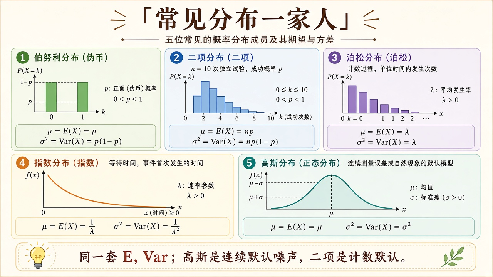
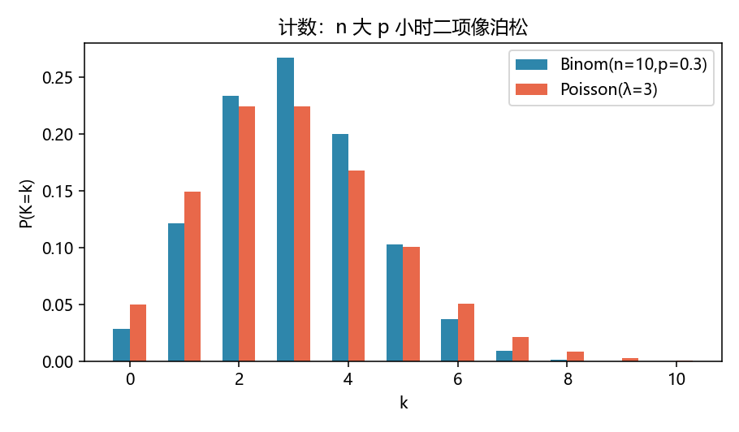
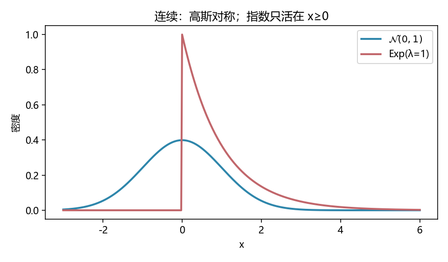

# 常见分布：计数、等待、噪声各用哪一张脸

> [!WARNING]
> 🧪 Beta公测版本提示：教程主体已完成，正在优化细节，欢迎大家提Issue反馈问题或建议。

> 上一章用贝叶斯更新信念，但似然 $P(\mathrm{data}\mid\theta)$ 必须先指定「数据长什么样」。本章只放五张最常用的脸：**伯努利 / 二项、泊松、指数、高斯**，并记住各自的期望与方差。前置：[概率与贝叶斯](/math/probability/)。怎么从样本反推参数，见下一章 [估计](/math/estimation/)。

---

## 一、同一套数字特征，不同的生成故事

| 分布 | 故事 | $\mathbb{E}$ | $\mathrm{Var}$ |
|------|------|--------------|----------------|
| Bernoulli$(p)$ | 一次抛币 | $p$ | $p(1-p)$ |
| Binomial$(n,p)$ | $n$ 次独立抛币的正面数 | $np$ | $np(1-p)$ |
| Poisson$(\lambda)$ | 稀有事件的计数 | $\lambda$ | $\lambda$ |
| Exp$(\lambda)$ | 等到下一事件的时间 | $1/\lambda$ | $1/\lambda^2$ |
| $\mathcal{N}(\mu,\sigma^2)$ | 大量微小误差叠加 | $\mu$ | $\sigma^2$ |

$n$ 大、$p$ 小、$np=\lambda$ 固定时，二项的 pmf 会贴向泊松——demo 里 $n=10,p=0.3,\lambda=3$ 已经能看出轮廓像。指数的无记忆：已经等了 $t$ 秒，再等 $s$ 秒的分布与从头等 $s$ 秒一样。高斯的「默认噪声」地位来自中心极限，详见 [CLT](/math/clt/)。



> **图解说明**：左三是离散计数，右二是连续密度。同一套 $\mathbb{E},\mathrm{Var}$；选哪一张脸取决于数据怎么生成，不是看哪条曲线好看。

---

## 二、密度公式（代码里就是这几行）

二项：

$$
P(K=k)=\binom{n}{k}p^k(1-p)^{n-k}.
$$

泊松（用对数累加避免 $k!$ 爆）：

$$
P(K=k)=e^{-\lambda}\frac{\lambda^k}{k!}.
$$

高斯与指数：

$$
\phi(x)=\frac{1}{\sqrt{2\pi}\sigma}\exp\Big(-\frac{(x-\mu)^2}{2\sigma^2}\Big),
\qquad
f(x)=\lambda e^{-\lambda x}\ (x\ge 0).
$$

C++ `dist.hpp` 与 Python `demo.py` 打印同一组探针：$\mathrm{Binom}(10,0.3)$ 的 $P(K=3)$、$\varphi(0)\approx 0.3989$。

---

## 三、代码在做什么

左：二项柱与泊松柱并排。右：标准正态铃铛对指数折线（指数在负半轴为 0）。





```bash
cd docs/math/distributions/code
python demo.py
g++ -std=c++17 demo.cpp -o dist_demo
```

---

## 四、小结

| 概念 | 一句话 |
|------|--------|
| 伯努利 / 二项 | 抛币与计数 |
| 泊松 | 稀有事件；均值=方差 |
| 指数 | 等待时间；无记忆 |
| 高斯 | 对称噪声；平方损失的亲戚 |
| 下游 | 似然、GLM、[估计](/math/estimation/) |

> 下一章 [数理统计与估计](/math/estimation/)：有了生成故事，怎么用数据猜 $p$、$\mu$、$\sigma^2$。

## 📥 Code

| File | View | Download |
|------|------|----------|
| demo.py | [Open](./code-demo) | <a href="/notebook/code/math/distributions/demo.py" target="_blank" download>Download</a> |
| dist.hpp | — | <a href="/notebook/code/math/distributions/dist.hpp" target="_blank" download>Download</a> |
| demo.cpp | — | <a href="/notebook/code/math/distributions/demo.cpp" target="_blank" download>Download</a> |
| exercise.py | [Open](./code-exercise) | <a href="/notebook/code/math/distributions/exercise.py" target="_blank" download>Download</a> |

## 参考

1. Blitzstein & Hwang, *Introduction to Probability*
2. Feller, *An Introduction to Probability Theory*（经典叙事）
