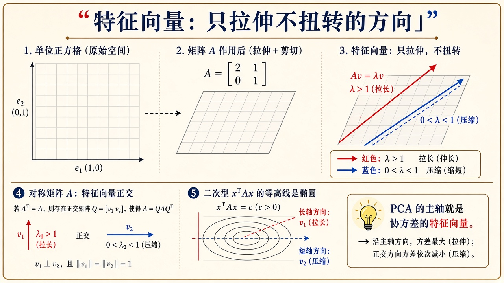
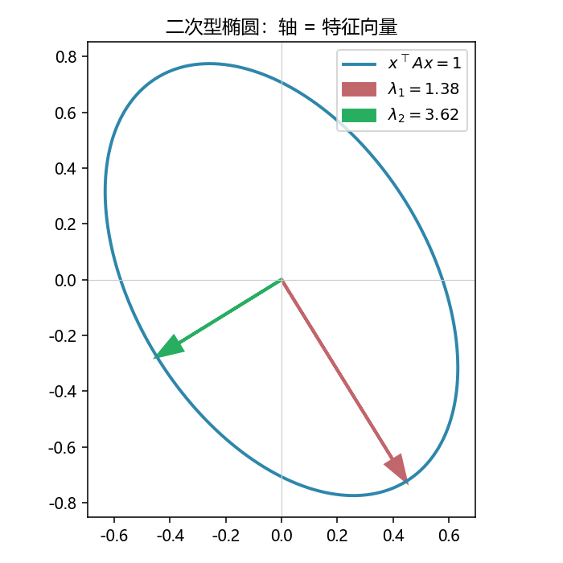
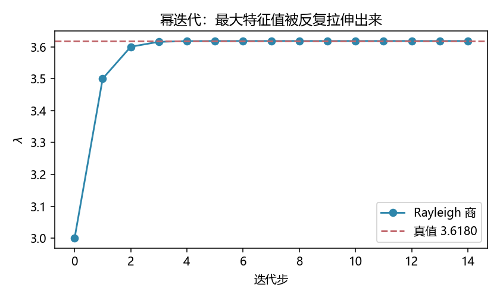

# 特征值与二次型：只拉伸、不扭转的方向

> [!WARNING]
> 🧪 Beta公测版本提示：教程主体已完成，正在优化细节，欢迎大家提Issue反馈问题或建议。

> $Av=\lambda v$ 说的是：存在一些方向，矩阵作用完**还躺在自己身上**，只是长度乘了 $\lambda$。对称矩阵上这组方向还两两正交——协方差、PCA、二次型椭圆，用的都是它。前置：[线性代数直觉](/math/linear-algebra/)、[方程组与秩](/math/systems/)。SVD 的几何仍在直觉章；本章把「特征」从黑话变成可算的迭代。

---

## 一、定义与 2×2 图像

$$
Av=\lambda v,\quad v\neq 0.
$$

$\lambda$ 是特征值，$v$ 是特征向量。旋转 $90^\circ$ 的矩阵**没有实特征向**（每个向量都被拧走了）；对称正定矩阵一定有一组正交实特征向，而且 $\lambda>0$。

对对称 $A$，二次型 $x^\top A x=1$ 是椭圆（正定）或双曲线（不定）。椭圆的轴就是特征向量，半轴长 $1/\sqrt{\lambda}$：$\lambda$ 大的方向「更硬」，椭圆更扁。



> **图解说明**：网格被 $A$ 捏成平行四边形；有两条边仍沿原直线，那就是特征向。底栏：PCA 主轴 $=$ 协方差的特征向。

对角化 $A=Q\Lambda Q^{-1}$。对称时 $Q$ 可取正交，$A=Q\Lambda Q^\top$，换到主轴上乘法变成逐分量乘 $\lambda_i$。

---

## 二、幂迭代：最大的那个自己会冒出来

任取一个不与最大特征向正交的 $v_0$，反复

$$
v_{k+1}=\frac{Av_k}{\|Av_k\|}.
$$

分量里 $\lambda_{\max}^k$ 增长最快，于是 $v_k$ 倒向对应特征向。Rayleigh 商 $v^\top Av$（$\|v\|=1$）给出 $\lambda$ 的估计。PageRank、幂法求主奇异值，都是这个想法。

对称 $2\times 2$ 的精确根：

$$
A=\begin{pmatrix}a&b\\ b&c\end{pmatrix},\quad
\lambda=\frac{a+c\pm\sqrt{(a-c)^2+4b^2}}{2}.
$$

`demo.py` 用 `np.linalg.eigh` 当真理，幂迭代画收敛曲线。C++ `power.hpp` 同一组 $A=\begin{pmatrix}3&1\\1&2\end{pmatrix}$，最大 $\lambda\approx 3.618$。

---

## 三、和 PCA 的关系（一句话）

中心化数据 $X$ 的协方差 $\frac1n X^\top X$ 是对称半正定的。它的最大特征向 $=$ SVD 里 $V$ 的第一列。直觉章用 SVD 画箭头；本章解释箭头为什么是「特征」。降维应用见 [降维与特征工程](/ml/advanced/dimensionality-reduction/)。

---

## 四、代码在做什么

左图：二次型椭圆 + 两条轴。右图：幂迭代的 Rayleigh 商贴向真 $\lambda_{\max}$。





```bash
cd docs/math/eigen/code
python demo.py
g++ -std=c++17 demo.cpp -o eigen_demo
```

---

## 五、小结

| 概念 | 一句话 |
|------|--------|
| $Av=\lambda v$ | 方向不变，只缩放 |
| 对称 $A$ | 实正交特征基；二次型是椭圆 |
| 幂迭代 | 反复乘 $A$，最大 $\lambda$ 胜出 |
| Rayleigh | $v^\top Av$ 估特征值 |
| 下游 | PCA、谱聚类、[量子态](/quantum/overview/)、稳定性 |

> 下一章 [概率与贝叶斯](/math/probability/)：箭头变成「带分布的信念」。

## 📥 Code

| File | View | Download |
|------|------|----------|
| demo.py | [Open](./code-demo) | <a href="/notebook/code/math/eigen/demo.py" target="_blank" download>Download</a> |
| power.hpp | — | <a href="/notebook/code/math/eigen/power.hpp" target="_blank" download>Download</a> |
| demo.cpp | — | <a href="/notebook/code/math/eigen/demo.cpp" target="_blank" download>Download</a> |
| exercise.py | [Open](./code-exercise) | <a href="/notebook/code/math/eigen/exercise.py" target="_blank" download>Download</a> |

## 参考

1. Strang, G. *Introduction to Linear Algebra*（特征与二次型）
2. 3Blue1Brown, *Eigenvalues*（配合几何动画）
