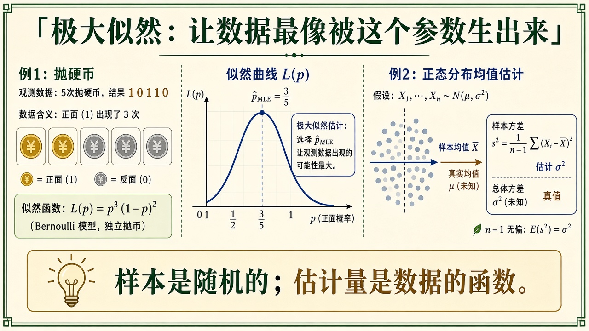
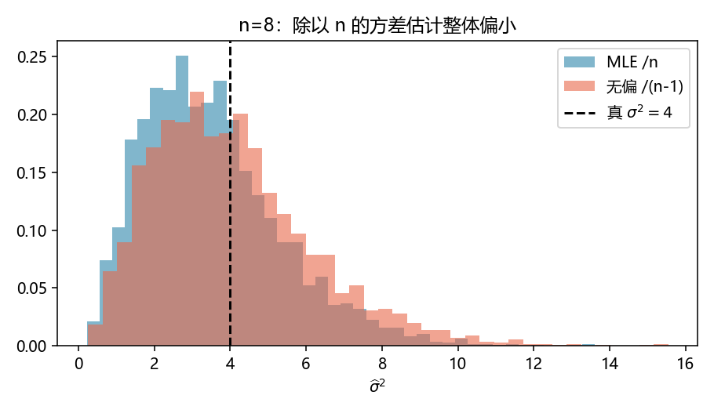
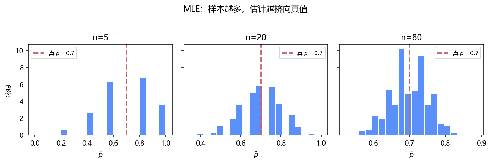

# 数理统计与估计：数据是随机的，估计量是数据的函数

> [!WARNING]
> 🧪 Beta公测版本提示：教程主体已完成，正在优化细节，欢迎大家提Issue反馈问题或建议。

> 概率论假定 $p$、$\mu$ 已知，问样本会长什么样。**数理统计反过来**：样本已经落在桌上，问参数大概是多少。本章只抓三件：**点估计、极大似然、偏差（除以 $n$ 还是 $n-1$）**。前置：[常见分布](/math/distributions/)。区间与「平均为何像高斯」见 [CLT](/math/clt/)。贝叶斯把参数也当成随机变量，仍在 [概率与贝叶斯](/math/probability/)。

---

## 一、样本与估计量

$X_1,\ldots,X_n$ i.i.d. 来自某个带参数 $\theta$ 的分布。**估计量** $\hat\theta=g(X_1,\ldots,X_n)$ 是样本的函数，所以它自己也是随机变量。同一组硬币，再抛一次，$\hat p$ 会变。

常见无脑但好用的选择：

- 样本均值 $\bar X=\frac1n\sum X_i$ 估期望；
- 样本方差 $s^2=\frac1{n-1}\sum(X_i-\bar X)^2$ 估方差。

**无偏**：$\mathbb{E}[\hat\theta]=\theta$。无偏说的是「重复实验，估计量的平均瞄得准」，**不**说「这一次就准」。除以 $n-1$ 就是为了让 $s^2$ 无偏——用 $\bar X$ 代替了未知的 $\mu$，少了一个自由度。



> **图解说明**：左是数据；中是似然山峰，$\hat p_{\mathrm{MLE}}$ 在山顶；右是高斯云里样本均值对准 $\mu$，并标出 $n-1$。底栏：估计量随数据抖。

**保姆级数字例。** demo 硬编码的十次抛币

$$
\{1,0,1,1,0,1,1,1,0,1\}
$$

七个正面，伯努利 MLE $\hat p=7/10=0.7$。C++ `mle.hpp` 印的就是这个数。它等于样本均值：对 $0/1$ 数据，$\bar X$ 就是正面比例。

同一颗硬币若真 $p=0.7$，把「抛 $n$ 次再算 $\hat p$」重复 $2000$ 遍，会得到一堆 $\hat p$。demo 左三张直方图：$n=5,20,80$。$n$ 越大，直方图越挤向 $0.7$——这是 LLN，还不是 CLT 的铃铛形状。

**卡点。** 「无偏」不是「最好」。MLE 方差估计除以 $n$，略偏小，但均方误差有时反而更小（偏差的平方被方差的下降抵掉）。工程上报告样本方差时习惯无偏 $n-1$；训练神经网络拟合高斯噪声时，实现里经常直接 `mean((x-mu)**2)`，那是 MLE。两套惯例并存，读代码先看分母。

---

## 二、极大似然

似然把参数当变量、数据当常数：

$$
L(\theta)=\prod_{i=1}^n f(x_i\mid\theta).
$$

$\hat\theta_{\mathrm{MLE}}=\arg\max_\theta L(\theta)$（通常对 $\log L$ 求导更稳：乘积变求和，避免下溢）。

- 伯努利：$L(p)=p^{k}(1-p)^{n-k}$，$k$ 次正面 $\Rightarrow \hat p=k/n=\bar X$。
- 高斯（$\mu,\sigma^2$ 都未知）：$\hat\mu=\bar X$，$\hat\sigma^2_{\mathrm{MLE}}=\frac1n\sum(X_i-\bar X)^2$。注意 **MLE 除以 $n$**，所以对 $\sigma^2$ **有偏**（略偏小）。无偏方差才除以 $n-1$。

平方误差损失对应高斯、固定 $\sigma$ 时的最大似然——这就是「最小二乘从哪来」的统计说法。分类的交叉熵是另一张脸的 MLE，见 [信息论精简](/math/information/)。

**保姆级数字例。** 高斯真值 $\mu=0$、$\sigma^2=4$，每次抽 $n=8$ 个点，重复 $4000$ 次：

| 估计 | 分母 | 理论期望 | demo 要对照的现象 |
|------|------|----------|-------------------|
| $\hat\sigma^2_{\mathrm{MLE}}$ | $n=8$ | $\frac{n-1}{n}\sigma^2=\frac78\cdot 4=3.5$ | 直方图整体在 $4$ 左侧 |
| $s^2$ 无偏 | $n-1=7$ | $4$ | 中心更正，略更散 |

$3.5$ 对 $4$ 相对偏差 $12.5\%$——$n=8$ 时已经能在图上看出「蓝堆偏左」。$n\to\infty$ 时 $(n-1)/n\to 1$，两种分母和解。

::: details 逐步推导：伯努利似然的山顶在 $k/n$（点击展开）

$n$ 次独立抛币，正面 $k$ 次（其余 $n-k$ 次反面）。似然

$$
L(p)=\binom{n}{k}p^k(1-p)^{n-k},\qquad p\in(0,1).
$$

对数（扔掉与 $p$ 无关的组合数）

$$
\ell(p)=k\log p+(n-k)\log(1-p).
$$

求导：

$$
\ell'(p)=\frac{k}{p}-\frac{n-k}{1-p}.
$$

令导数为 $0$：$k(1-p)=(n-k)p\Rightarrow k-kp=np-kp\Rightarrow k=np\Rightarrow\hat p=k/n$。

二阶导 $\ell''(p)=-k/p^2-(n-k)/(1-p)^2<0$，所以是极大。端点 $p=0$ 或 $1$：若 $0<k<n$，似然为 $0$，不会比内点更大。

代入 demo 的十次：$k=7$，$\hat p=0.7$。若改成先验 $\mathrm{Beta}(2,2)$ 再取后验均值，得到 $9/14\approx 0.643$（见 [概率与贝叶斯](/math/probability/)）——MAP / 后验均值把答案从 $0.7$ 往 $0.5$ 拽。MLE 等于「平坦先验下的 MAP」。

**为什么 $n$ 大时 $\hat p$ 变挤。** $\mathrm{Var}(\hat p)=\mathrm{Var}(\bar X)=p(1-p)/n$。真 $p=0.7$ 时 $p(1-p)=0.21$，于是

$$
n=5:\ \sigma_{\hat p}\approx 0.205,\qquad
n=20:\ \approx 0.102,\qquad
n=80:\ \approx 0.051.
$$

直方图的宽度大约按 $1/\sqrt{n}$ 收——与左三张图一致。形状要到更大的 $n$ 才像高斯，那是下一章 CLT。

:::

::: details 逐步推导：为什么除以 $n$ 的方差有偏、除以 $n-1$ 无偏（点击展开）

设 $X_i$ i.i.d.，$\mathbb{E}X_i=\mu$，$\mathrm{Var}(X_i)=\sigma^2$。样本均值 $\bar X$ 无偏，$\mathrm{Var}(\bar X)=\sigma^2/n$。离差平方和

$$
S=\sum_{i=1}^n(X_i-\bar X)^2.
$$

关键恒等式（把 $\mu$ 加进再减出）：

$$
X_i-\bar X=(X_i-\mu)-(\bar X-\mu),
$$

平方求和后交叉项抵消，得到

$$
S=\sum_i(X_i-\mu)^2-n(\bar X-\mu)^2.
$$

两边取期望：

$$
\mathbb{E}[S]=n\sigma^2-n\cdot\frac{\sigma^2}{n}=(n-1)\sigma^2.
$$

因此

$$
\mathbb{E}\Big[\frac{S}{n}\Big]=\frac{n-1}{n}\sigma^2<\sigma^2,
\qquad
\mathbb{E}\Big[\frac{S}{n-1}\Big]=\sigma^2.
$$

MLE 除以 $n$，期望是 $\frac{n-1}{n}\sigma^2$。demo 里 $n=8$、$\sigma^2=4$，理论 $\mathbb{E}[\hat\sigma^2_{\mathrm{MLE}}]=3.5$。直观：$\bar X$ 比真 $\mu$ 更「贴近」样本，用 $\bar X$ 算出来的平方和系统性地偏小，缺的那一截正好是 $\sigma^2$——所以要除以 $n-1$ 补回来。

高斯情形还可以从似然直接推 MLE。$\log L$ 对 $\mu$ 求导立刻给出 $\hat\mu=\bar X$；对 $\sigma^2$ 求导给出 $\hat\sigma^2=S/n$。无偏修正是事后乘 $n/(n-1)$，不是 MLE 自己的一阶条件。

概率章那个 $\{1,2,3,4,5\}$：若当作总体，$S=10$，$10/5=2$；若当作样本，$10/4=2.5$。同一公式，两种世界观。



> **图解说明**：$n=8$、真 $\sigma^2=4$。蓝色 MLE 堆的中心靠近 $3.5$；橙色无偏堆的中心靠近 $4$。黑虚线是真值。

:::

---

## 三、代码在做什么

左三张直方图：真 $p=0.7$，$\hat p$ 在 $n=5,20,80$ 时越挤越紧（还没到 CLT 的正规形状，那是下一章）。右：同一批 $n=8$ 的高斯样本，MLE 方差整体比真值 $4$ 偏左，无偏版本中心更正。




C++ `mle.hpp` 对硬编码的 10 次抛币印 $\hat p=0.7$，对 $\{1,2,3,4,5\}$ 印高斯 MLE（均值 $3$，方差 $2$）。

```bash
cd docs/math/estimation/code
python demo.py
g++ -std=c++17 demo.cpp -o est_demo
```

---

## 四、小结

| 概念 | 一句话 |
|------|--------|
| 估计量 | 数据的函数，本身随机 |
| 无偏 | 平均瞄得准；不保证单次准 |
| MLE | 让当前数据最像被 $\theta$ 生出来 |
| $n$ vs $n-1$ | MLE 方差偏小，期望是 $\frac{n-1}{n}\sigma^2$；样本方差无偏 |
| 下游 | 回归、EM、[CLT](/math/clt/) |

> 下一章 [大数定律与中心极限](/math/clt/)：为什么 $n$ 大时 $\hat\theta$ 会老实，以及为何误差条常画成高斯。

## 📥 Code

| File | View | Download |
|------|------|----------|
| demo.py | [Open](./code-demo) | <a href="/notebook/code/math/estimation/demo.py" target="_blank" download>Download</a> |
| mle.hpp | — | <a href="/notebook/code/math/estimation/mle.hpp" target="_blank" download>Download</a> |
| demo.cpp | — | <a href="/notebook/code/math/estimation/demo.cpp" target="_blank" download>Download</a> |
| exercise.py | [Open](./code-exercise) | <a href="/notebook/code/math/estimation/exercise.py" target="_blank" download>Download</a> |

## 参考

1. Casella & Berger, *Statistical Inference*
2. Wasserman, *All of Statistics*（短而全）
