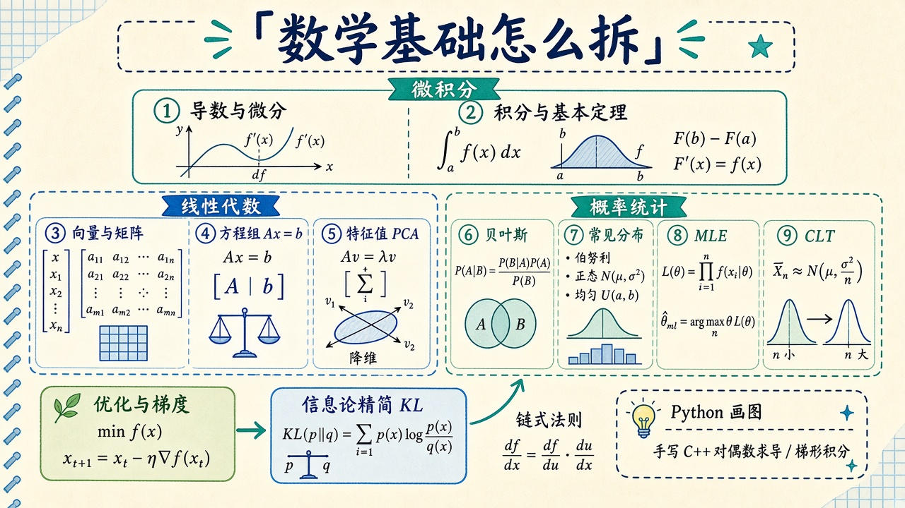

# 数学基础：先把变化、几何和不确定说清楚

> [!WARNING]
> 🧪 Beta公测版本提示：教程主体已完成，正在优化细节，欢迎大家提Issue反馈问题或建议。

> 侧栏 **数学基础** 不是两篇什么都塞的长文。**微积分**两章把「局部直线」和「薄片累加」讲透；**线性代数**三章把「箭头、方程组、主轴」拆开；**概率与数理统计**四章把「信念、分布、估计、平均为何像高斯」拆开；然后才是 [优化](/math/optimization/) 和给 ML 用的 [信息论精简](/math/information/)。点分组标题进本页。通信课（熵、容量、编码）在独立领域 **[信息论](/information/)**。

> **图解说明**：最上是微积分（导数 → 积分 / 基本定理）；左列线代；右列概率统计。链式法则接到优化。Python 出图；C++ 手写 header-only（对偶数求导、梯形积分），不要求安装 Eigen。

| 入口 | 在问什么 |
|------|----------|
| **[导数与微分](/math/derivative/)** | 切线、线性近似；C++ 对偶数 / 多项式求导 |
| **[积分与基本定理](/math/integral/)** | 累加、原函数；C++ 梯形 / 逐项积分 |
| **[线性代数直觉](/math/linear-algebra/)** | 向量、矩阵、$Ax$、SVD 几何 |
| **[线性方程组与秩](/math/systems/)** | 解有没有、有几个；列能不能拼出 $b$ |
| **[特征值与二次型](/math/eigen/)** | $Av=\lambda v$；幂迭代；椭圆主轴 |
| **[概率与贝叶斯](/math/probability/)** | 期望、条件概率、先验→后验 |
| **[常见分布](/math/distributions/)** | 二项 / 泊松 / 指数 / 高斯 |
| **[数理统计与估计](/math/estimation/)** | 样本、MLE、偏差与 $n-1$ |
| **[大数定律与中心极限](/math/clt/)** | $\bar X$ 贴向 $\mu$，再变成铃铛 |
| **[优化与梯度](/math/optimization/)** | 下山、学习率、链式法则 |
| **[信息论精简](/math/information/)** | 交叉熵与 KL（损失语言） |

C++ 演示与 [李群](/robotics/lie-groups/) 同一策略：章节 `code/*.hpp` 手写，`g++ -std=c++17 demo.cpp` 即可。正文里会对照写一段可选的 Eigen 写法，仓库**不**附带 Eigen 源码。
