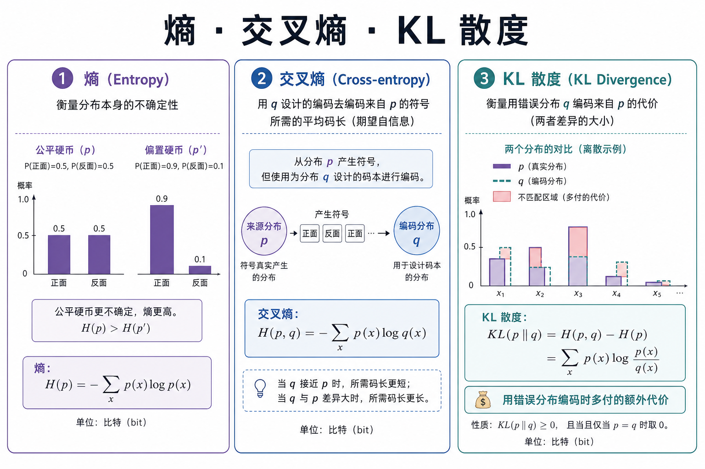
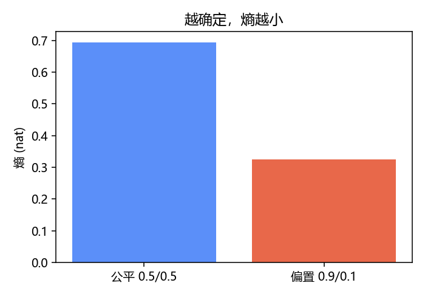
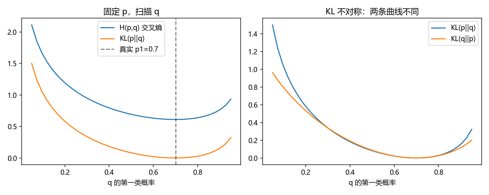

# 信息论精简：熵、交叉熵与 KL

> [!WARNING]
> 🧪 Beta公测版本提示：教程主体已完成，正在优化细节，欢迎大家提Issue反馈问题或建议。

> 分类损失、VAE/RSSM 的正则、Dreamer 的 KL balancing——背后都是同一套语言。本章只建立三个量：**熵**、**交叉熵**、**KL 散度**，并说明它们如何接到「最大似然」。

---

## 一、熵：平均惊喜有多大

离散分布 $p$ 的（香农）熵：

$$
H(p)=-\sum_x p(x)\log p(x).
$$

- 事件越不可能，$-\log p$ 越大（越「惊喜」）；
- 熵是按 $p$ 平均的惊喜；
- 均匀分布熵最大；确定性分布熵为 0。

公平硬币 $H=\log 2$；偏硬币更「好猜」，熵更小。

---

## 二、交叉熵：用错误码本编码

若真实数据来自 $p$，却用 $q$ 来编码（或用 $q$ 当模型）：

$$
H(p,q)=-\sum_x p(x)\log q(x).
$$

交叉熵 = 「平均码长」。分类里标签是 one-hot 的 $p$，网络输出是 $q$，**交叉熵损失**就是 $H(p,q)$。

对连续或大批数据，样本平均 $-\log q_\theta(y\mid x)$ 正是**负对数似然**——所以「最小化交叉熵 ≈ 最大似然」。

---

## 三、KL：多付的那一截

$$
D_{\mathrm{KL}}(p\|q)
=
\sum_x p(x)\log\frac{p(x)}{q(x)}
=
H(p,q)-H(p).
$$

直觉：

> 用 $q$ 编码真实来自 $p$ 的数据时，比用正确码本**多付的平均码长**。

性质（务必记住）：

1. $D_{\mathrm{KL}}(p\|q)\ge 0$，当且仅当 $p=q$ 时为 0；
2. **不对称**：$D_{\mathrm{KL}}(p\|q)\neq D_{\mathrm{KL}}(q\|p)$；
3. 不是距离（不满足三角不等式），但常被当「分布有多不像」用。

> **图解说明**：熵描写 $p$ 自身的不确定；交叉熵是用 $q$ 编码 $p$ 的代价；KL 是多出来的那截。

### 在世界模型里出现的样子

变分推断 / RSSM 常见项：

$$
D_{\mathrm{KL}}\big(q(z\mid o)\,\|\,p(z)\big)
\quad\text{或}\quad
D_{\mathrm{KL}}\big(q(z_t\mid\ldots)\,\|\,p(z_t\mid z_{t-1},a_{t-1})\big).
$$

- 强迫后验别离开先验太远（正则）；
- 或强迫先验去追后验（学动力学）。

Dreamer 的 **KL balancing / free bits**，就是在调整这两边的梯度谁更大，避免某一侧把表示掐死。细节见 [Dreamer](/world-models/abstract/dreamer/) 与 [RSSM](/world-models/abstract/rssm/)。

---

## 四、两个常用计算

**伯努利 / 二分类**（标签 $y\in\{0,1\}$，预测概率 $\hat y$）：

$$
\ell = -y\log\hat y-(1-y)\log(1-\hat y).
$$

**两个对角高斯**的 KL 有闭式（RSSM 常用）——实现时查公式即可，本章 demo 用离散分布把直觉算清楚。

---

## 五、代码在做什么

`demo.py`：

1. 计算公平/偏置硬币的熵；
2. 固定 $p$，扫描不同 $q$，画交叉熵与 $\mathrm{KL}(p\|q)$；
3. 展示 $\mathrm{KL}(p\|q)$ 与 $\mathrm{KL}(q\|p)$ 不对称。

---

## 六、小结

| 概念 | 一句话 |
|------|--------|
| 熵 $H(p)$ | $p$ 的平均不确定度 |
| 交叉熵 $H(p,q)$ | 用 $q$ 编码 $p$ 的平均代价 |
| KL $D_{\mathrm{KL}}(p\|q)$ | 交叉熵减去熵；非负、不对称 |
| 训练联系 | 交叉熵 ↓ ⇔ 似然 ↑ |
| 下游 | 分类、VAE、RSSM/Dreamer、蒸馏 |

> 数学基础四章到此收束。建议回到 [线性回归](/ml/foundations/linear-regression/) 或按兴趣进入 [机器学习](/ml/foundations/ai-overview/)。世界模型读者可直接带着 KL 直觉去看 [RSSM](/world-models/abstract/rssm/)。

## 📥 Code

| File | View | Download |
|------|------|----------|
| demo.py | [Open](./code-demo) | <a href="/notebook/code/math/information/demo.py" target="_blank" download>Download</a> |
| exercise.py | [Open](./code-exercise) | <a href="/notebook/code/math/information/exercise.py" target="_blank" download>Download</a> |

## 参考

1. Cover & Thomas, *Elements of Information Theory*（经典）
2. MacKay, *Information Theory, Inference, and Learning Algorithms*（免费电子书）
