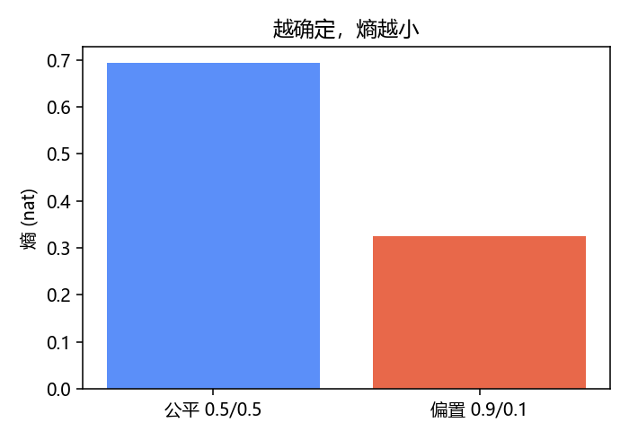
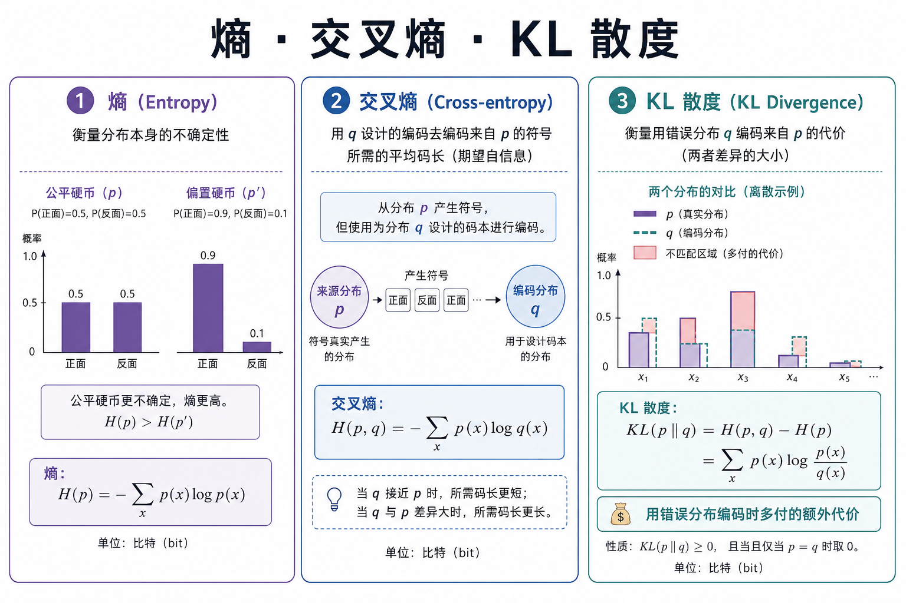
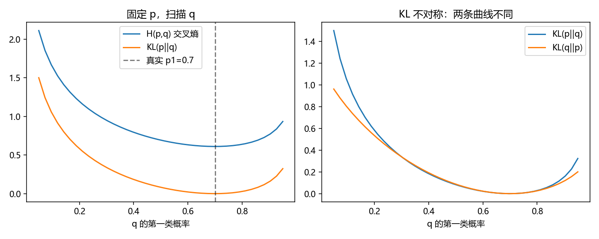

# 信息论精简：熵、交叉熵与 KL

> [!WARNING]
> 🧪 Beta公测版本提示：教程主体已完成，正在优化细节，欢迎大家提Issue反馈问题或建议。

> 分类损失、VAE/RSSM 的正则、Dreamer 的 KL balancing——背后都是同一套语言。本章只建立三个量：**熵**、**交叉熵**、**KL 散度**，并说明它们如何接到「最大似然」。**通信问题**（信道、容量、Huffman / Hamming、高斯信道、率失真）请跳到领域 **[信息论](/information/)**：从 [导论](/information/overview/) 进，容量章是 [香农](/information/shannon/)。量子信息的前置是香农容量，不是交叉熵损失。

---

## 一、熵：平均惊喜有多大

离散分布 $p$ 的（香农）熵：

$$
H(p)=-\sum_x p(x)\log p(x).
$$

- 事件越不可能，$-\log p$ 越大（越「惊喜」）；
- 熵是按 $p$ 平均的惊喜；
- 在固定有限的 $K$ 个可能取值上，均匀分布熵最大（$H\le\log K$）；确定性分布熵为 $0$。

对数底决定单位：$\log_2$ 得 **bit**；$\ln$（demo 用的 `np.log`）得 **nat**。公平硬币两种算法差一个常数 $\ln 2$：$H=\log_2 2=1\,\mathrm{bit}= \ln 2\approx 0.6931\,\mathrm{nat}$。偏硬币更「好猜」，熵更小。

**保姆级数字例（与 `demo.py` 同一组，单位 nat）。**

| 硬币 | $p$ | $H=-\sum p\ln p$ |
|------|-----|------------------|
| 公平 | $(0.5,0.5)$ | $\ln 2\approx 0.6931$ |
| 偏置 | $(0.9,0.1)$ | $-0.9\ln 0.9-0.1\ln 0.1\approx 0.3251$ |

偏置硬币大约只有公平硬币一半的不确定度：十次里九次你已经能猜对。$p\to(1,0)$ 时 $H\to 0$（约定 $0\ln 0=0$）。

**卡点。** 熵描述的是**分布**，不是某一个样本。抽到了稀有事件，你「这一次」很惊喜，但熵是惊喜的**平均**。另一个卡点：连续分布的微分熵 $h=-\int p\ln p$ 可以是负的，并且随坐标缩放而变——不要把「离散熵 $\ge 0$」照搬到连续。本章 demo 只用离散两点分布。

::: details 逐步推导：从「平均惊喜」到 $H=-\sum p\log p$，公平硬币为何是 $\ln 2$（点击展开）

要一条「惊喜」函数 $I(p)$，合理要求：

1. $p=1$（必然）时 $I=0$；
2. $p$ 越小 $I$ 越大；
3. 独立事件的联合惊喜可加：$I(pq)=I(p)+I(q)$。

可加性是对数的特征方程。再配 $I(1)=0$，得到 $I(p)=-\log p$（差一个正的底常数）。按真实频率 $p(x)$ 平均：

$$
H(p)=\mathbb{E}_{x\sim p}[-\log p(x)]=-\sum_x p(x)\log p(x).
$$

公平硬币两项相同：$-\frac12\ln\frac12-\frac12\ln\frac12=-\ln\frac12=\ln 2\approx 0.6931$。偏置 $(0.9,0.1)$：

$$
\ln 0.9\approx -0.10536,\quad\ln 0.1\approx -2.30259,
$$

$$
H=0.9\times 0.10536+0.1\times 2.30259\approx 0.0948+0.2303=0.3251.
$$

两点分布 $H(q)=-q\ln q-(1-q)\ln(1-q)$ 在 $q=1/2$ 最大，向两端单调下降——demo 条形图就是这两个点。

编码视角：$-\log_2 p(x)$ 是理想实数码长，平均为 $H_2(p)$ bit。实际二进制码长必须是整数；香农码取 $\lceil-\log_2 p(x)\rceil$，平均码长满足 $H_2(p)\le L<H_2(p)+1$（只计正概率符号）。对长数据块编码可使每个符号的额外代价趋于零。不能把实数理想码长当成总能精确实现的单符号码长。通信侧的展开见 [熵与编码](/information/entropy/)。

> **图解说明**：公平 $0.693\,\mathrm{nat}$，偏置 $0.325\,\mathrm{nat}$。越确定，熵越小。

:::

---

## 二、交叉熵：用错误码本编码

若真实数据来自 $p$，却用 $q$ 来编码（或用 $q$ 当模型）：

$$
H(p,q)=-\sum_x p(x)\log q(x).
$$

交叉熵 = 「平均码长」。分类里标签是 one-hot 的 $p$，网络输出是 $q$，**交叉熵损失**就是 $H(p,q)$。

对连续或大批数据，样本平均 $-\log q_\theta(y\mid x)$ 正是**负对数似然**——所以「最小化交叉熵 ≈ 最大似然」。

**保姆级数字例。** 固定 $p=(0.7,0.3)$（demo 扫描 $q$ 时用的真分布）。若模型也输出 $q=p$，则 $H(p,q)=H(p)\approx 0.6109$。若模型瞎猜 $q=(0.5,0.5)$：

$$
H(p,q)=-0.7\ln 0.5-0.3\ln 0.5=\ln 2\approx 0.6931
$$

——比用对码本多付 $0.08\,\mathrm{nat}$。若 $q$ 更偏，比如 $(0.9,0.1)$，交叉熵会再升到约 $0.76$。左图那条交叉熵曲线在 $q_1=0.7$ 处触底，触到的就是 $H(p)$。

**卡点。** $q$ 的某个分量若到 $0$，而 $p$ 那边不是 $0$，则 $-\log q\to+\infty$：这就是「对真实类别输出概率 $0$」会把损失打爆。实现里对 logit 做 softmax 再夹一个 $\varepsilon$，就是在防这个。

---

## 三、KL：多付的那一截

$$
D_{\mathrm{KL}}(p\|q)
=
\sum_x p(x)\log\frac{p(x)}{q(x)}
=
H(p,q)-H(p).
$$

直觉：

> 用 $q$ 编码真实来自 $p$ 的数据时，比用正确码本**多付的平均码长**。

性质（务必记住）：

1. $D_{\mathrm{KL}}(p\|q)\ge 0$，当且仅当 $p=q$ 时为 $0$；
2. **不对称**：$D_{\mathrm{KL}}(p\|q)\neq D_{\mathrm{KL}}(q\|p)$；
3. 不是距离（不满足三角不等式），但常被当「分布有多不像」用。

> **图解说明**：熵描写 $p$ 自身的不确定；交叉熵是用 $q$ 编码 $p$ 的代价；KL 是多出来的那截。

因为 $H(p)$ 不依赖模型参数，$\min_q H(p,q)$ 与 $\min_q D_{\mathrm{KL}}(p\|q)$ 是同一件事。训练交叉熵，就是在推 $q_\theta$ 去贴 $p$。

**保姆级数字例：不对称。** 仍取 $p=(0.7,0.3)$，$q=(0.9,0.1)$：

$$
\begin{aligned}
D_{\mathrm{KL}}(p\|q)
&=0.7\ln\frac{0.7}{0.9}+0.3\ln\frac{0.3}{0.1}
\approx 0.154,\\[4pt]
D_{\mathrm{KL}}(q\|p)
&=0.9\ln\frac{0.9}{0.7}+0.1\ln\frac{0.1}{0.3}
\approx 0.116.
\end{aligned}
$$

两个数不同。$p\|q$ 惩罚的是「$p$ 有质量而 $q$ 几乎没有」的地方（这里是第二类 $0.3$ vs $0.1$）；$q\|p$ 惩罚的方向反过来。VAE 里的 $\mathrm{KL}(q_\phi(z\mid x)\|p(z))$ 要求先验在后验有概率质量的地方也有支持：若 $q_\phi>0$ 而 $p=0$，散度会发散；它并不要求后验覆盖先验的全部支持。

### 在世界模型里出现的样子

变分推断 / RSSM 常见项：

$$
D_{\mathrm{KL}}\big(q(z\mid o)\,\|\,p(z)\big)
\quad\text{或}\quad
D_{\mathrm{KL}}\big(q(z_t\mid\ldots)\,\|\,p(z_t\mid z_{t-1},a_{t-1})\big).
$$

- 强迫后验别离开先验太远（正则）；
- 或强迫先验去追后验（学动力学）。

Dreamer 的 **KL balancing / free bits**，就是在调整这两边的梯度谁更大，避免某一侧把表示掐死。细节见 [Dreamer](/world-models/abstract/dreamer/) 与 [RSSM](/world-models/abstract/rssm/)。图像生成里的 [VAE](/world-models/video/vae/) 用的也是同一项：$\mathrm{KL}(q_\phi(z\mid x)\|p(z))$。

::: details 逐步推导：$\mathrm{KL}=H(p,q)-H(p)$ 以及为何 $\mathrm{KL}\ge 0$ 且不对称（点击展开）

把定义展开：

$$
\sum_x p\log\frac{p}{q}
=\sum_x p\log p-\sum_x p\log q
=-H(p)+H(p,q).
$$

这就是「交叉熵减去熵」。$p=q$ 时两项相等，KL 为 $0$。

**非负（Gibbs / Jensen）。** 先假设 $p(x)>0$ 时均有 $q(x)>0$；否则 KL 为正无穷，非负性显然成立。以下比值和期望只在 $p$ 的支持集上取。$-\log$ 是凸函数。令 $Y=q(X)/p(X)$，$X\sim p$：

$$
D_{\mathrm{KL}}(p\|q)
=\mathbb{E}_p\big[-\log(q/p)\big]
\ge -\log\mathbb{E}_p[q/p]
=-\log\sum_{x:p(x)>0}q(x)
\ge 0,
$$

最后一步用了 $\sum_{x:p(x)>0}q(x)\le 1$。要让最终 KL 等于 $0$，两步不等式都要取等号：

1. 严格凸函数 $-\log$ 的 Jensen 等号要求 $q(x)/p(x)=c$ 在 $p$ 的支持上为常数；
2. $-\log\sum_{p>0}q=0$ 还要求 $q$ 在该支持上的总质量是 $1$。

于是 $1=\sum_{p>0}q=c\sum_{p>0}p=c$，所以支持内 $q=p$，支持外两者都为 $0$。这才得到“KL 为零当且仅当 $p=q$”。仅说比值为常数还不够：例如 $p=(1,0)$、$q=(1/2,1/2)$，Jensen 取等号，但第二步严格，KL 仍为 $\ln2$。这叫 Gibbs 不等式。

**不对称没有神秘处。** 求和的权重是左边那个分布。$D_{\mathrm{KL}}(p\|q)$ 在 $p$ 有质量的点上检查 $q$ 够不够大；$D_{\mathrm{KL}}(q\|p)$ 在 $q$ 有质量的点上检查 $p$。demo 右图对同一串 $q_1\in[0.05,0.95]$ 同时画两条曲线，二者仅在 $q=p$ 时同时为 $0$，但也可能在正值处相交；例如 $p=(0.7,0.3)$、$q=(0.3,0.7)$。

**二分类交叉熵。** 标签 $y\in\{0,1\}$ 是 one-hot 的 $p$，预测 $\hat y=q(Y=1)$：

$$
H(p,q)=-y\log\hat y-(1-y)\log(1-\hat y).
$$

这就是网络里那行 `binary_cross_entropy`。多类则换成 $-\sum_k y_k\log\hat y_k$。对概率的导数为 $\partial\ell/\partial\hat y=-y/\hat y+(1-y)/(1-\hat y)$，自信但错误时确实会发散。但对 logit $z$，还要乘 $\sigma'(z)=\hat y(1-\hat y)$，得到 $\partial\ell/\partial z=\hat y-y\in[-1,1]$。不要把“概率梯度发散”误读成“logit 梯度也发散”。

两个对角高斯的 KL 有闭式（RSSM 常用）——实现时查公式即可，本章 demo 用离散分布把直觉算清楚。

> **图解说明**：左：固定 $p=(0.7,0.3)$，扫描 $q_1$。交叉熵在 $0.7$ 最低，KL 在同一点为 $0$。右：$\mathrm{KL}(p\|q)$ 与 $\mathrm{KL}(q\|p)$ 不是同一条曲线。

:::

---

## 四、两个常用计算

**伯努利 / 二分类**（标签 $y\in\{0,1\}$，预测概率 $\hat y$）：

$$
\ell = -y\log\hat y-(1-y)\log(1-\hat y).
$$

**两个对角高斯**。设 $q=\mathcal N(\mu_q,\operatorname{diag}\sigma_q^2)$、$p=\mathcal N(\mu_p,\operatorname{diag}\sigma_p^2)$，所有方差严格为正，则

$
D_{\rm KL}(q\|p)=\frac12\sum_j\left[
\log\frac{\sigma_{p,j}^2}{\sigma_{q,j}^2}
+\frac{\sigma_{q,j}^2+(\mu_{q,j}-\mu_{p,j})^2}{\sigma_{p,j}^2}-1
\right].
$

推导只用两个期望。展开 $\mathbb E_q[\log q(z)-\log p(z)]$，高斯密度中的 $\log(2\pi)$ 抵消；由于
$\mathbb E_q[(z_j-\mu_{q,j})^2]=\sigma_{q,j}^2$，
且把 $z_j-\mu_{p,j}=(z_j-\mu_{q,j})+(\mu_{q,j}-\mu_{p,j})$ 展开后交叉项期望为零，
$\mathbb E_q[(z_j-\mu_{p,j})^2]=\sigma_{q,j}^2+(\mu_{q,j}-\mu_{p,j})^2$，代入即可。

特别地，标准正态先验 $p=\mathcal N(0,I)$ 给出
$D_{\rm KL}(q\|p)=\tfrac12\sum_j(\mu_{q,j}^2+\sigma_{q,j}^2-1-\log\sigma_{q,j}^2)$。
若网络输出 $\mathrm{logvar}_j=\log\sigma_{q,j}^2$，对应代码是
$-\tfrac12\sum_j(1+\mathrm{logvar}_j-\mu_{q,j}^2-\exp(\mathrm{logvar}_j))$。
这里的求和是潜变量维度，批次是否取平均由损失约定决定；交换 $p,q$ 必须重新代入，不能只换符号。

---

## 五、代码在做什么

`demo.py`：

1. 计算公平/偏置硬币的熵（$0.6931$ nat vs $0.3251$ nat）；
2. 固定 $p=(0.7,0.3)$，扫描不同 $q$，画交叉熵与 $\mathrm{KL}(p\|q)$；
3. 展示 $\mathrm{KL}(p\|q)$ 与 $\mathrm{KL}(q\|p)$ 不对称。

---

## 六、小结

| 概念 | 一句话 |
|------|--------|
| 熵 $H(p)$ | $p$ 的平均不确定度；公平硬币 $\ln 2\,\mathrm{nat}$ |
| 交叉熵 $H(p,q)$ | 用 $q$ 编码 $p$ 的平均代价 |
| KL $D_{\mathrm{KL}}(p\|q)$ | 交叉熵减去熵；非负、不对称 |
| 训练联系 | 交叉熵 ↓ ⇔ 似然 ↑ |
| 下游 | 分类、VAE、RSSM/Dreamer、蒸馏；通信见 [信息论](/information/) |

> 数学基础到此收束（微积分两章、线代三章、概率统计四章、优化、本章）。建议回到 [线性回归](/ml/foundations/linear-regression/) 或按兴趣进入 [机器学习](/ml/foundations/ai-overview/)。世界模型读者可带着 KL 直觉去看 [RSSM](/world-models/abstract/rssm/)；生成模型读者可看 [VAE](/world-models/video/vae/) 与 [扩散](/world-models/video/diffusion/)。**压缩、信道、容量**请跳到 [信息论](/information/)。领域地图：[数学基础](/math/)。

## 📥 Code

| File | View | Download |
|------|------|----------|
| demo.py | [Open](./code-demo) | <a href="/notebook/code/math/information/demo.py" target="_blank" download>Download</a> |
| exercise.py | [Open](./code-exercise) | <a href="/notebook/code/math/information/exercise.py" target="_blank" download>Download</a> |

## 参考

1. Cover & Thomas, *Elements of Information Theory*（经典）
2. MacKay, *Information Theory, Inference, and Learning Algorithms*（免费电子书）

3. Kingma & Welling, [Auto-Encoding Variational Bayes，Appendix B](https://arxiv.org/html/1312.6114v11)：标准高斯先验下的解析 KL。
