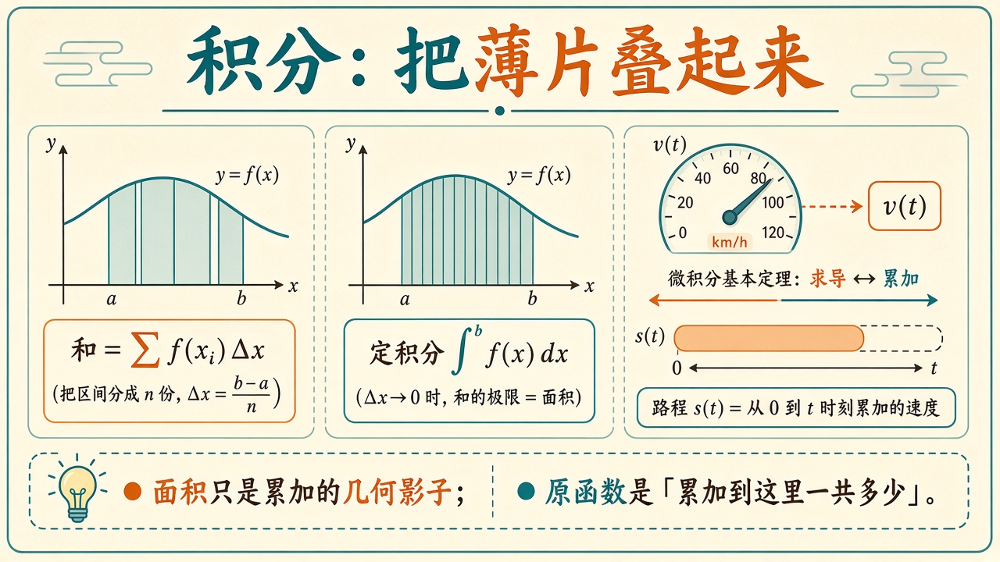
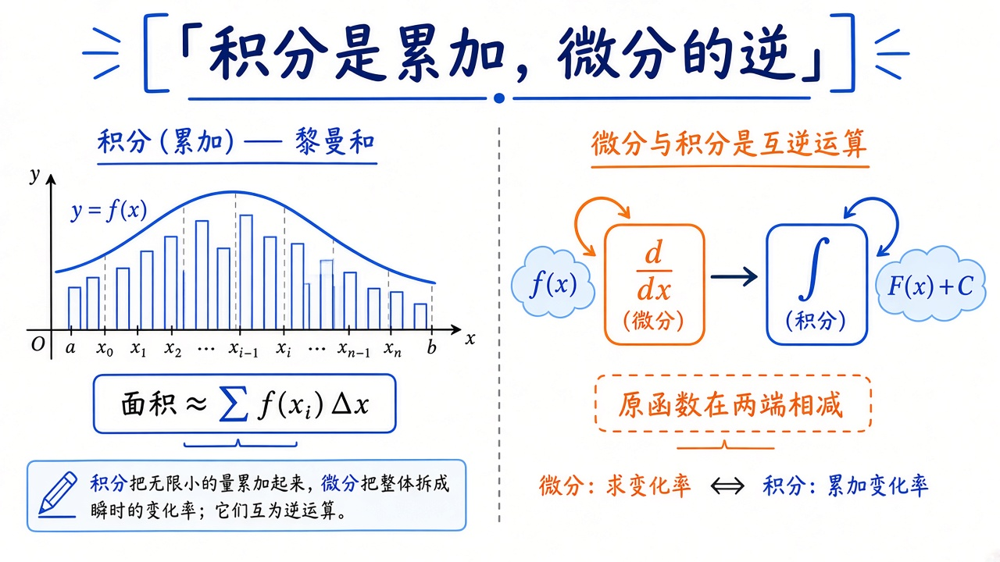
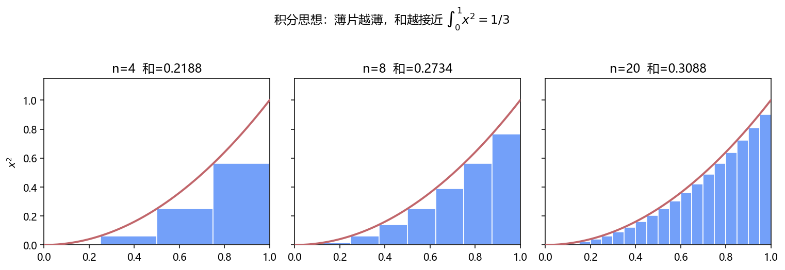
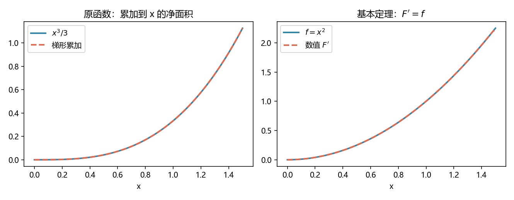

# 积分与基本定理：把薄片叠起来，求导的逆运算

> [!WARNING]
> 🧪 Beta公测版本提示：教程主体已完成，正在优化细节，欢迎大家提Issue反馈问题或建议。

> 导数问「此刻多快」。积分问另一句：**这些快慢加起来，一共走了多远？** 几何上像面积，本质上是**累加**。微积分基本定理说：累加出来的函数，再求导，会回到被加的那一层——速度积分成路程，路程对时间求导又变回速度。前置：[导数与微分](/math/derivative/)。

---

## 一、积分是累加，面积只是它的样子

把 $[a,b]$ 切成 $n$ 段，每段宽 $\Delta x$，第 $i$ 段上用一个高度 $f(x_i)$ 当「这段里差不多这么高」，于是

$$
\sum_{i} f(x_i)\,\Delta x.
$$

这是黎曼和。$\Delta x\to 0$ 时（在 $f$ 连续的前提下）和稳定下来，写成

$$
\int_a^b f(x)\,dx.
$$

$dx$ 还是上一章那个「一小步」；积分号是拉长的 S，表示 Sum。若 $f$ 是速度，$f(x_i)\Delta x$ 就是这一小段时间走的路，总和就是净位移。曲线下的面积，只是这套累加的几何投影：高×宽，再加起来。

$f$ 为负时「面积」算成负的——因为往回走。净变化可以正可以负；真正的几何面积要再取绝对值，那是另一道题。



> **图解说明**：左是粗柱子，中是细柱子贴向面积；右是速度表与路程条互为逆运算。底栏：原函数记住「累加到这里一共多少」。

demo 对 $x^2$ 在 $[0,1]$ 上画 $n=4,8,20$ 的左黎曼和，真值是 $1/3\approx 0.333$。柱子变瘦，和往 $1/3$ 靠。



> **图解说明**：左：黎曼柱子逼近面积。右：求导与积分是一对逆机器，基本定理说两端相减得到净变化。

::: details 逐步推导：黎曼和到 $\int_0^1 x^2\mathrm{d}x=1/3$，以及基本定理（点击展开）

左黎曼：$x_i=i/n$，$i=0,\ldots,n-1$，$\Delta x=1/n$，

$$
\sum_{i=0}^{n-1}\Bigl(\frac{i}{n}\Bigr)^2\frac1n=\frac{1}{n^3}\sum i^2=\frac{1}{n^3}\cdot\frac{(n-1)n(2n-1)}{6}\to\frac{1}{3}.
$$

（用了 $\sum_{i=1}^{m}i^2=m(m+1)(2m+1)/6$，这里 $m=n-1$，再令 $n\to\infty$。）

**基本定理直觉。** 令 $F(x)=\int_a^x f$。$F(x+h)-F(x)$ 是 $[x,x+h]$ 上新加的那一薄片，高度约 $f(x)$、宽 $h$，所以 $[F(x+h)-F(x)]/h\approx f(x)$。$h\to 0$ 即 $F'=f$。另一半：若 $G'=f$，则 $G$ 与 $F$ 只差常数，于是 $\int_a^b f=G(b)-G(a)$。速度积成路程、路程求导变回速度，是同一句话。

:::

---

## 二、原函数与微积分基本定理

不定积分问：谁的导数是 $f$？这样的 $F$ 叫 $f$ 的一个**原函数**（可以差一个常数 $C$，因为常数求导为零）。

微积分基本定理有两半，合成一句人话：

**（1）边走边累加，累加结果对终点求导，得到此刻的被积函数。**

$$
\frac{d}{dx}\int_a^x f(t)\,dt = f(x).
$$

**（2）净变化 = 原函数在两端的差**——不必真的去加一万个薄片：

$$
\int_a^b f(x)\,dx = F(b)-F(a),\quad F'=f.
$$

这就是为什么积分表有用：一旦认出 $F$，面积（净变化）变成两次求值。认不出 $F$ 时——多数工程公式如此——就退回数值累加（梯形、辛普森、高斯求积）。**符号积分比符号微分难得多**：微分有机械链式法则，积分没有「保证能找到初等原函数」的算法。C++ 课里我们只做两件能做的：多项式逐项积分，以及把 $f$ 当黑盒的梯形法则。

---

## 三、C++ 怎么给「公式」积分

| 路 | 做法 | 适用 |
|----|------|------|
| **多项式系数** | $c_k x^k \mapsto c_k x^{k+1}/(k+1)$，再 $F(b)-F(a)$ | 多项式，精确 |
| **梯形法则** | 把区间切成 $n$ 段，每段用梯形面积 | 任意可调用的 $f$ |
| **对偶数帮不上积分** | 对偶数一次走的是导数不是原函数 | 积分请用上面两条 |

### 1. 多项式逐项

$$
\int\bigl(\sum c_k x^k\bigr)dx
=\sum c_k\frac{x^{k+1}}{k+1}+C.
$$

`quad.hpp` 里 `poly_int` 令常数项 $C=0$，于是 $\int_0^1 x^2\,dx$ 就是 `poly_eval(P,1)-poly_eval(P,0)`，应印出 $1/3$。

### 2. 复合梯形

每段用左右高度的平均，等价于

$$
\int_a^b f
\approx
\frac{h}{2}\bigl(f(a)+f(b)\bigr)
+h\sum_{i=1}^{n-1} f(a+ih),
\quad h=\frac{b-a}{n}.
$$

对**直线**，梯形是精确的（练习里用 $2x+1$ 检查）。对 $x^2$，误差随 $n^2$ 下降：demo 里 $n=4,16,64$ 会看到误差掉两档。$n$ 再大，同样会碰到浮点累加噪声，但比数值微分那条「$h$ 太小就炸」的曲线温和。

辛普森把每两段用抛物线接，对光滑 $f$ 更准；思想仍是「用简单形状的面积代替真曲线」。本课梯形足够。

```bash
cd docs/math/integral/code
python demo.py
g++ -std=c++17 demo.cpp -o int_demo
```





右图用梯形做出 $F(x)=\int_0^x t^2 dt$，再对 $F$ 做数值求导，应贴回 $x^2$——这就是基本定理的实验版。

---

## 四、小结

| 概念 | 一句话 |
|------|--------|
| 黎曼和 | 高×宽再加；积分是它的极限 |
| 定积分 | 从 $a$ 到 $b$ 的净累加 |
| 原函数 $F$ | $F'=f$；可差常数 |
| 基本定理 | 累加再求导回到 $f$；$F(b)-F(a)$ 代替求和 |
| 梯形 | 黑盒 $f$ 的默认数值积分 |
| 下游 | 期望是「按密度积分」、[优化](/math/optimization/) 里的损失累加、物理里的功与通量 |

> 下一章 [线性代数直觉](/math/linear-algebra/)：切线那一招在多变量里变成矩阵 $A$；变化是线性的，不必再取极限。

## 📥 Code

| File | View | Download |
|------|------|----------|
| demo.py | [Open](./code-demo) | <a href="/notebook/code/math/integral/demo.py" target="_blank" download>Download</a> |
| quad.hpp | — | <a href="/notebook/code/math/integral/quad.hpp" target="_blank" download>Download</a> |
| demo.cpp | — | <a href="/notebook/code/math/integral/demo.cpp" target="_blank" download>Download</a> |
| exercise.py | [Open](./code-exercise) | <a href="/notebook/code/math/integral/exercise.py" target="_blank" download>Download</a> |

## 参考

1. Thompson, *Calculus Made Easy*
2. 3Blue1Brown, *Essence of calculus*（积分篇）
3. Atkinson, *An Introduction to Numerical Analysis*（梯形与误差）
