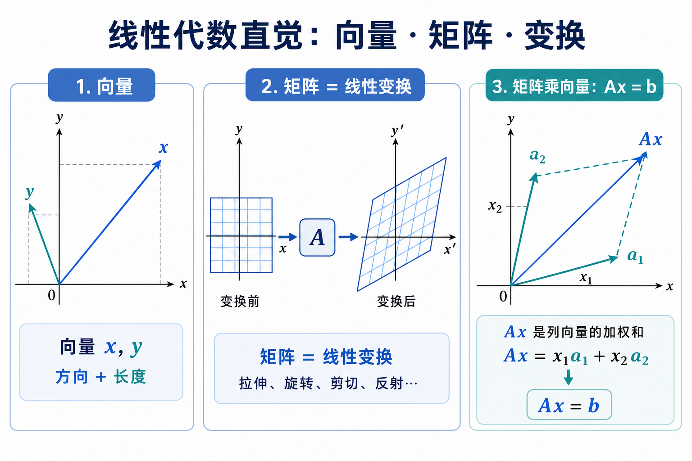
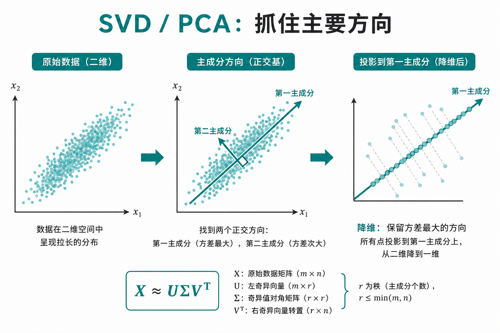
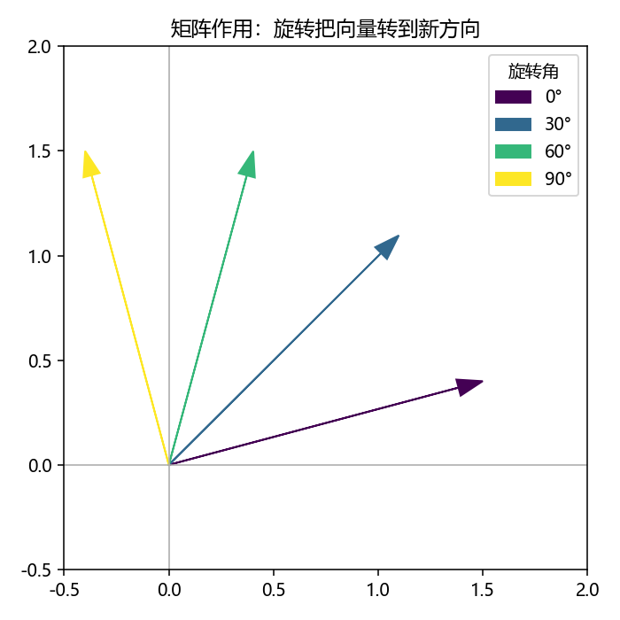
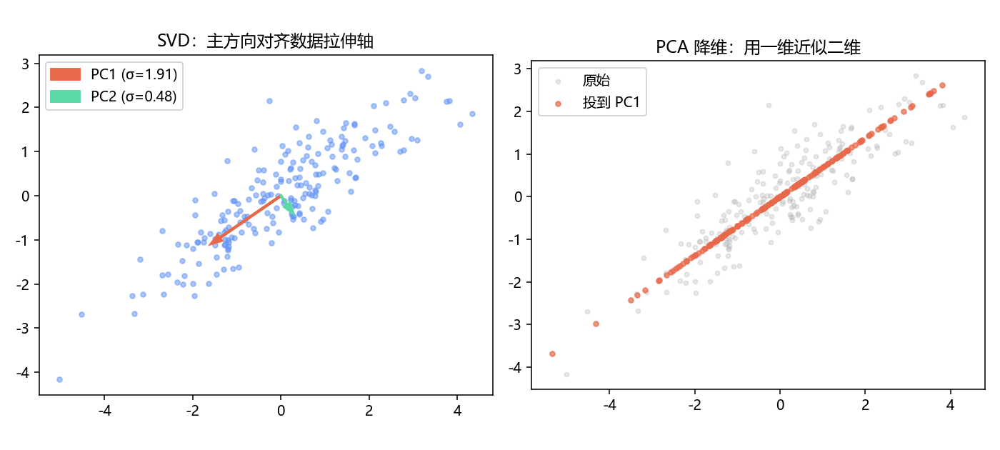

# 线性代数直觉：向量、矩阵与变换

> [!WARNING]
> 🧪 Beta公测版本提示：教程主体已完成，正在优化细节，欢迎大家提Issue反馈问题或建议。

> 本章不是大学线代课的压缩版，只建立 AI 里天天用到的三种直觉：**向量是带方向的量**、**矩阵是线性变换**、**SVD/PCA 抓住主要方向**。学完应能读懂线性回归、注意力里的 $QK^\top$、以及「把数据投到低维」在说什么。

---

## 一、向量：数组背后的几何

在代码里，向量往往是一维数组 `[x1, x2, ..., xd]`。几何上，它是从原点出发的一支箭：

- **长度（范数）** $\|x\|_2 = \sqrt{\sum_i x_i^2}$：能量、距离；
- **方向**：和别的向量夹角由内积决定：
  $$
  x^\top y = \|x\|\,\|y\|\cos\theta
  $$
- **内积大**：方向相近（余弦相似度的亲戚）。

深度学习里的「嵌入」「特征」本质上都是高维向量。你几乎总在问：谁和谁近？朝哪个方向更新？

---

## 二、矩阵：把空间捏一捏

矩阵 $A\in\mathbb{R}^{m\times n}$ 作用在向量 $x$ 上得到 $Ax$。最有用的读法：

> **矩阵 = 线性变换**：旋转、拉伸、投影、剪切……都可以写成 $A$。

另一种读法（和实现一致）：

$$
Ax = x_1 a_{:1} + x_2 a_{:2} + \cdots + x_n a_{:n}
$$

即 **$A$ 的各列的线性组合**，系数是 $x$ 的分量。

> **图解说明**：左是向量；中是网格被 $A$ 变换；右是「列的加权和」。三种视角描述同一件事。

常见特例：

| 对象 | 形状 | 在模型里 |
|------|------|----------|
| 权重矩阵 $W$ | $d_{\mathrm{out}}\times d_{\mathrm{in}}$ | 一层线性：$Wx+b$ |
| 数据矩阵 $X$ | $n\times d$ | 每行一个样本 |
| Gram / 核矩阵 | $n\times n$ | 样本两两相似度 |

矩阵乘法 $AB$ 是变换的复合：先做 $B$ 再做 $A$（注意顺序）。神经网络的「一层接一层」就是一串（非线性夹着的）矩阵乘法。

---

## 三、特征与 SVD：谁是「主要方向」

方阵特征分解 $A=Q\Lambda Q^{-1}$ 说的是：存在一组方向（特征向量），变换后只被缩放（特征值）。对称正定矩阵（协方差）上，这组方向正交且特别干净。

对一般的数据矩阵，更通用的是 **SVD**：

$$
X = U\Sigma V^\top
$$

- $V$ 的列：输入空间的正交主方向；
- $\Sigma$ 的对角：各方向上的「强度」（奇异值）；
- $U$：输出/样本侧的对应方向。

**PCA** 本质上是：对中心化数据做 SVD，留下最大的若干奇异值方向，把点投影上去——用更少的坐标保留最多方差。

> **图解说明**：椭圆状散点的长轴就是第一主成分；投到这条轴上，用一维近似二维结构。

世界模型与表示学习里，「低维潜变量 $z$」常常就是在做类似的事：丢掉与任务无关的方向，留下可预测、可控制的方向。

---

## 四、范数、条件数（知道就行）

- $\|x\|_2$：默认欧氏长度；损失里的 MSE 与之同源。
- $\|A\|_F$：把矩阵当成长向量的欧氏范数，常作权重正则。
- **条件数**大：输入小扰动 → 输出大变化，数值上「病态」。训练不稳定、矩阵求逆爆炸时，会碰到它的影子。

---

## 五、代码在做什么

`demo.py` 会：

1. 画一个 2D 向量，展示旋转矩阵如何把它转起来；
2. 生成椭圆状散点，用 SVD 画出前两个主方向并投影。

不引入额外黑盒叙事——你看到的箭头就是 $V$ 的列。

---

## 六、小结

| 概念 | 一句话 |
|------|--------|
| 向量 | 方向 + 长度；内积量相似度 |
| 矩阵 | 线性变换；列的线性组合 |
| $Ax$ | 把 $x$ 变到新位置 |
| SVD/PCA | 找方差/能量最大的正交方向并降维 |
| 下游 | 线性层、注意力、降维、潜空间、[量子态矢量](/quantum/overview/) |

> 下一章 [概率与贝叶斯](/math/probability/)：从「确定的箭头」走到「不确定的信念」。

## 📥 Code

| File | View | Download |
|------|------|----------|
| demo.py | [Open](./code-demo) | <a href="/notebook/code/math/linear-algebra/demo.py" target="_blank" download>Download</a> |
| exercise.py | [Open](./code-exercise) | <a href="/notebook/code/math/linear-algebra/exercise.py" target="_blank" download>Download</a> |

## 参考

1. Strang, G. *Introduction to Linear Algebra*（几何直觉极好）
2. 3Blue1Brown, *Essence of linear algebra*（强烈推荐配合看）
